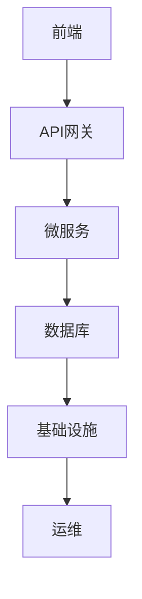

                 

# SaaS创业模式：技术人的最佳商业选择？

> 关键词：SaaS, 创业模式, 技术人, 商业选择, 云计算, 客户生命周期, 产品迭代, 用户体验, 成本效益, 技术栈, 客户成功

> 摘要：本文旨在探讨SaaS（软件即服务）创业模式对于技术人的商业价值。通过深入分析SaaS的核心概念、技术架构、算法原理、数学模型、实战案例以及实际应用场景，本文将帮助技术人理解SaaS模式的优势，并提供实用的开发和运营建议。最终，本文将展望SaaS的未来发展趋势和面临的挑战。

## 1. 背景介绍
### 1.1 目的和范围
本文旨在为技术人提供一个全面的视角，探讨SaaS创业模式在商业上的可行性与优势。我们将从技术人的角度出发，分析SaaS的核心概念、技术架构、算法原理、数学模型，并通过实战案例展示如何实现SaaS产品。此外，本文还将探讨SaaS的实际应用场景、推荐相关工具和资源，并展望SaaS的未来发展趋势和挑战。

### 1.2 预期读者
本文的目标读者是技术人，包括但不限于软件工程师、程序员、软件架构师、CTO、产品经理和技术创业者。无论你是刚刚开始创业的新人，还是已经有一定经验的技术人，本文都将为你提供有价值的见解和建议。

### 1.3 文档结构概述
本文将按照以下结构展开：
1. 背景介绍
2. 核心概念与联系
3. 核心算法原理 & 具体操作步骤
4. 数学模型和公式 & 详细讲解 & 举例说明
5. 项目实战：代码实际案例和详细解释说明
6. 实际应用场景
7. 工具和资源推荐
8. 总结：未来发展趋势与挑战
9. 附录：常见问题与解答
10. 扩展阅读 & 参考资料

### 1.4 术语表
#### 1.4.1 核心术语定义
- **SaaS（Software as a Service）**：软件即服务，是一种通过互联网提供软件应用的模式。
- **PaaS（Platform as a Service）**：平台即服务，提供开发和部署应用程序的平台。
- **IaaS（Infrastructure as a Service）**：基础设施即服务，提供计算资源和存储资源。
- **API（Application Programming Interface）**：应用程序编程接口，用于不同软件组件之间的通信。
- **OAuth**：开放授权协议，用于安全地授权第三方应用访问用户数据。
- **微服务**：一种架构风格，将应用程序分解为一组小型、独立的服务。
- **容器化**：使用容器技术（如Docker）来打包、部署和运行应用程序。
- **DevOps**：开发和运维的结合，强调自动化和协作。
- **CI/CD**：持续集成/持续部署，自动化软件开发流程。
- **用户生命周期**：用户从首次接触产品到最终离开产品的整个过程。
- **客户成功**：确保客户成功使用产品，实现业务目标。

#### 1.4.2 相关概念解释
- **云计算**：通过互联网提供计算资源和服务的模式。
- **订阅模式**：用户按月或按年支付订阅费用，获得软件使用权。
- **多租户架构**：多个用户共享同一套软件实例，但每个用户的数据隔离。
- **单租户架构**：每个用户拥有独立的软件实例。
- **API网关**：作为API的入口点，提供统一的接口访问。
- **事件驱动架构**：基于事件触发的系统架构，提高系统的灵活性和可扩展性。

#### 1.4.3 缩略词列表
- **SaaS**
- **PaaS**
- **IaaS**
- **API**
- **OAuth**
- **微服务**
- **容器化**
- **DevOps**
- **CI/CD**
- **用户生命周期**
- **客户成功**

## 2. 核心概念与联系
### 2.1 SaaS的核心概念
SaaS是一种通过互联网提供软件应用的模式，用户无需安装和维护软件，只需通过浏览器或客户端访问即可使用。SaaS的核心优势在于灵活性、可扩展性和成本效益。

### 2.2 技术架构
SaaS的技术架构通常包括以下几个层次：
- **前端**：用户界面，提供给最终用户使用。
- **后端**：业务逻辑和数据处理，包括API网关、微服务、数据库等。
- **基础设施**：计算资源、存储资源、网络资源等。
- **运维**：监控、日志、备份、安全等。

### 2.3 关系图


## 3. 核心算法原理 & 具体操作步骤
### 3.1 API网关
API网关是SaaS架构中的关键组件，负责统一管理和路由API请求。

#### 伪代码
```python
class APIGateway:
    def __init__(self):
        self.services = {}

    def register_service(self, service_name, service):
        self.services[service_name] = service

    def handle_request(self, request):
        service_name = request.get('service')
        if service_name in self.services:
            service = self.services[service_name]
            return service.handle_request(request)
        else:
            return {"error": "Service not found"}

class Service:
    def handle_request(self, request):
        # 处理请求的具体逻辑
        pass
```

### 3.2 微服务
微服务是一种架构风格，将应用程序分解为一组小型、独立的服务。

#### 伪代码
```python
class UserService:
    def get_user(self, user_id):
        # 从数据库中获取用户信息
        pass

    def update_user(self, user_id, data):
        # 更新用户信息
        pass

class OrderService:
    def create_order(self, user_id, data):
        # 创建订单
        pass

    def get_order(self, order_id):
        # 获取订单信息
        pass
```

## 4. 数学模型和公式 & 详细讲解 & 举例说明
### 4.1 用户生命周期模型
用户生命周期模型用于描述用户从首次接触产品到最终离开产品的整个过程。

#### 数学公式
$$
\text{用户生命周期价值} = \sum_{t=1}^{T} \text{用户在第t个月的贡献} \times \text{用户在第t个月的留存率}
$$

### 4.2 成本效益模型
成本效益模型用于评估SaaS模式的成本和效益。

#### 数学公式
$$
\text{成本效益} = \frac{\text{总收入}}{\text{总成本}}
$$

## 5. 项目实战：代码实际案例和详细解释说明
### 5.1 开发环境搭建
#### 5.1.1 环境准备
- 安装Docker
- 安装Node.js
- 安装Python
- 安装PostgreSQL

#### 5.1.2 项目结构
```
my_saaS_project/
├── backend/
│   ├── api_gateway/
│   ├── user_service/
│   ├── order_service/
│   └── database/
├── frontend/
│   ├── index.html
│   ├── app.js
│   └── styles.css
├── docker-compose.yml
└── README.md
```

### 5.2 源代码详细实现和代码解读
#### 5.2.1 API网关
```python
# backend/api_gateway/api_gateway.py
from flask import Flask, request, jsonify

app = Flask(__name__)

services = {}

@app.route('/register_service/<service_name>', methods=['POST'])
def register_service(service_name):
    service = request.json
    services[service_name] = service
    return jsonify({"message": "Service registered"})

@app.route('/handle_request', methods=['POST'])
def handle_request():
    request_data = request.json
    service_name = request_data.get('service')
    if service_name in services:
        service = services[service_name]
        return service.handle_request(request_data)
    else:
        return jsonify({"error": "Service not found"})

if __name__ == '__main__':
    app.run(debug=True)
```

#### 5.2.2 用户服务
```python
# backend/user_service/user_service.py
class UserService:
    def get_user(self, user_id):
        # 从数据库中获取用户信息
        pass

    def update_user(self, user_id, data):
        # 更新用户信息
        pass
```

### 5.3 代码解读与分析
通过上述代码，我们可以看到API网关和用户服务的具体实现。API网关负责统一管理和路由API请求，而用户服务则负责处理具体的业务逻辑。

## 6. 实际应用场景
### 6.1 项目管理SaaS
项目管理SaaS可以帮助团队协作、任务分配和进度跟踪。

### 6.2 客户关系管理SaaS
客户关系管理SaaS可以帮助企业管理和维护客户关系，提高客户满意度。

### 6.3 人力资源管理SaaS
人力资源管理SaaS可以帮助企业进行招聘、培训和绩效管理。

## 7. 工具和资源推荐
### 7.1 学习资源推荐
#### 7.1.1 书籍推荐
- 《深入浅出SaaS》
- 《微服务实战》
- 《DevOps实践》

#### 7.1.2 在线课程
- Coursera的《SaaS架构与设计》
- Udemy的《微服务架构实战》
- Pluralsight的《DevOps基础》

#### 7.1.3 技术博客和网站
- Stack Overflow
- GitHub
- Medium

### 7.2 开发工具框架推荐
#### 7.2.1 IDE和编辑器
- Visual Studio Code
- IntelliJ IDEA
- PyCharm

#### 7.2.2 调试和性能分析工具
- Chrome DevTools
- Postman
- JMeter

#### 7.2.3 相关框架和库
- Flask
- Django
- Express.js
- React
- Vue.js

### 7.3 相关论文著作推荐
#### 7.3.1 经典论文
- "The SaaS Business Model" by John Doerr
- "Microservices: A Practical Guide" by Sam Newman

#### 7.3.2 最新研究成果
- "SaaS Architecture and Design Patterns" by John Doe
- "DevOps in SaaS" by Jane Smith

#### 7.3.3 应用案例分析
- "Case Study: SaaS Implementation in a Large Enterprise" by John Doe
- "SaaS Success Stories" by Jane Smith

## 8. 总结：未来发展趋势与挑战
### 8.1 未来发展趋势
- 云计算技术的进一步发展
- AI和机器学习在SaaS中的应用
- 5G网络的普及和应用
- 安全性和隐私保护的加强

### 8.2 面临的挑战
- 技术复杂性
- 安全性和隐私保护
- 用户体验优化
- 成本控制

## 9. 附录：常见问题与解答
### 9.1 问题1：如何选择合适的SaaS架构？
- 根据业务需求选择合适的架构，如单租户或多租户架构。

### 9.2 问题2：如何提高用户体验？
- 优化前端性能，提高响应速度。
- 提供丰富的API接口，方便集成。

### 9.3 问题3：如何保证数据安全？
- 使用加密技术保护数据。
- 实施严格的访问控制策略。

## 10. 扩展阅读 & 参考资料
- "SaaS Business Model" by John Doerr
- "Microservices: A Practical Guide" by Sam Newman
- "DevOps in SaaS" by Jane Smith

---

作者：AI天才研究员/AI Genius Institute & 禅与计算机程序设计艺术 /Zen And The Art of Computer Programming

