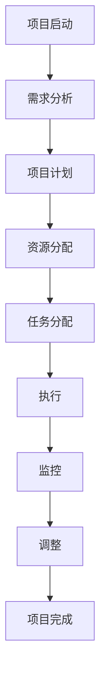
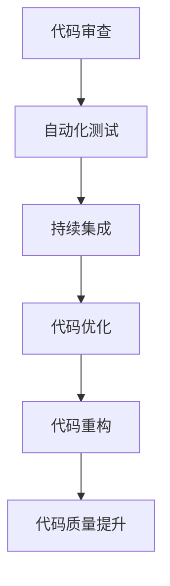
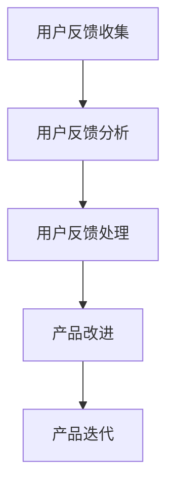

                 

# 一人公司如何进行有效的产品迭代

> 关键词：产品迭代, 一人公司, 产品管理, 项目管理, 代码质量, 用户反馈, 产品路线图

> 摘要：本文旨在为一人公司提供一套系统化的产品迭代方法论，通过逐步分析和推理，帮助开发者在有限的资源下实现高效的产品迭代。文章将从产品管理、项目管理、代码质量、用户反馈等多个维度进行深入探讨，并通过实际案例展示如何在一人公司中实施有效的迭代策略。

## 1. 背景介绍
### 1.1 目的和范围
本文旨在为一人公司提供一套系统化的产品迭代方法论，帮助开发者在有限的资源下实现高效的产品迭代。通过逐步分析和推理，本文将探讨如何在一人公司中进行有效的项目管理、产品管理、代码质量控制以及用户反馈收集与处理。

### 1.2 预期读者
本文预期读者为一人公司的创始人、开发者、产品经理以及任何对产品迭代感兴趣的技术人员。无论你是刚刚起步的创业者，还是有多年经验的技术专家，本文都将为你提供有价值的指导和建议。

### 1.3 文档结构概述
本文将按照以下结构展开：
1. 背景介绍
2. 核心概念与联系
3. 核心算法原理 & 具体操作步骤
4. 数学模型和公式 & 详细讲解 & 举例说明
5. 项目实战：代码实际案例和详细解释说明
6. 实际应用场景
7. 工具和资源推荐
8. 总结：未来发展趋势与挑战
9. 附录：常见问题与解答
10. 扩展阅读 & 参考资料

### 1.4 术语表
#### 1.4.1 核心术语定义
- **产品迭代**：指在产品开发过程中，通过不断的小步改进来实现产品的持续优化。
- **一人公司**：指由单个创始人或开发者独立运营的公司。
- **项目管理**：指对项目从开始到结束的全过程进行计划、组织、指挥、协调和控制。
- **产品路线图**：指产品开发的整体规划，包括产品功能、时间表和优先级。

#### 1.4.2 相关概念解释
- **敏捷开发**：一种迭代和增量的软件开发方法，强调快速响应变化和持续交付。
- **用户反馈**：指用户对产品功能、性能等方面的评价和建议。

#### 1.4.3 缩略词列表
- **API**：Application Programming Interface（应用程序编程接口）
- **CI/CD**：Continuous Integration/Continuous Deployment（持续集成/持续部署）
- **KPI**：Key Performance Indicator（关键绩效指标）

## 2. 核心概念与联系
### 2.1 产品迭代的核心概念
产品迭代的核心在于通过持续的小步改进来实现产品的持续优化。在一人公司中，由于资源有限，如何高效地进行产品迭代尤为重要。

### 2.2 项目管理的核心概念
项目管理的核心在于对项目从开始到结束的全过程进行计划、组织、指挥、协调和控制。在一人公司中，项目管理尤为重要，因为开发者需要确保项目的顺利进行。

### 2.3 代码质量的核心概念
代码质量是产品迭代的基础。高质量的代码不仅能够提高产品的稳定性，还能够降低维护成本。

### 2.4 用户反馈的核心概念
用户反馈是产品迭代的重要依据。通过收集和分析用户反馈，开发者可以了解产品的不足之处，从而进行针对性的改进。

### 2.5 核心概念之间的联系
- **产品迭代**依赖于**项目管理**，确保项目能够按照计划进行。
- **项目管理**依赖于**代码质量**，高质量的代码能够提高项目的成功率。
- **代码质量**依赖于**用户反馈**，通过收集用户反馈，开发者可以了解产品的不足之处，从而进行针对性的改进。

## 3. 核心算法原理 & 具体操作步骤
### 3.1 项目管理算法原理
项目管理的核心在于通过计划、组织、指挥、协调和控制来确保项目的顺利进行。具体操作步骤如下：



### 3.2 代码质量控制算法原理
代码质量控制的核心在于通过代码审查、自动化测试、持续集成等手段来确保代码的质量。具体操作步骤如下：



### 3.3 用户反馈收集与处理算法原理
用户反馈收集与处理的核心在于通过多种渠道收集用户反馈，并进行分析和处理。具体操作步骤如下：



## 4. 数学模型和公式 & 详细讲解 & 举例说明
### 4.1 项目管理数学模型
项目管理可以通过以下数学模型来描述：

$$
\text{项目成功概率} = \text{需求分析完成度} \times \text{项目计划完成度} \times \text{资源分配完成度} \times \text{任务分配完成度} \times \text{执行完成度} \times \text{监控完成度} \times \text{调整完成度}
$$

### 4.2 代码质量控制数学模型
代码质量控制可以通过以下数学模型来描述：

$$
\text{代码质量} = \text{代码审查质量} \times \text{自动化测试覆盖率} \times \text{持续集成成功率} \times \text{代码优化效果} \times \text{代码重构效果}
$$

### 4.3 用户反馈收集与处理数学模型
用户反馈收集与处理可以通过以下数学模型来描述：

$$
\text{用户满意度} = \text{用户反馈收集率} \times \text{用户反馈分析准确率} \times \text{用户反馈处理效率} \times \text{产品改进效果}
$$

## 5. 项目实战：代码实际案例和详细解释说明
### 5.1 开发环境搭建
在一人公司中，开发环境的搭建尤为重要。具体步骤如下：

1. **选择开发语言和框架**：根据项目需求选择合适的开发语言和框架。
2. **安装开发环境**：安装必要的开发工具和库。
3. **配置开发环境**：配置开发环境，确保开发环境的稳定性和可靠性。

### 5.2 源代码详细实现和代码解读
以下是一个简单的代码示例，展示如何在一人公司中进行代码实现和解读：

```python
# 代码示例：用户反馈处理
def process_user_feedback(feedback):
    """
    处理用户反馈
    :param feedback: 用户反馈
    :return: 处理结果
    """
    # 分析反馈
    analysis_result = analyze_feedback(feedback)
    # 处理反馈
    processing_result = process_analysis_result(analysis_result)
    # 返回处理结果
    return processing_result

def analyze_feedback(feedback):
    """
    分析用户反馈
    :param feedback: 用户反馈
    :return: 分析结果
    """
    # 分析反馈
    analysis_result = {}
    # 返回分析结果
    return analysis_result

def process_analysis_result(analysis_result):
    """
    处理分析结果
    :param analysis_result: 分析结果
    :return: 处理结果
    """
    # 处理分析结果
    processing_result = {}
    # 返回处理结果
    return processing_result
```

### 5.3 代码解读与分析
以上代码示例展示了如何在一人公司中进行用户反馈处理。通过分析用户反馈，开发者可以了解产品的不足之处，从而进行针对性的改进。

## 6. 实际应用场景
在实际应用场景中，一人公司可以通过以下方式实现有效的产品迭代：

1. **需求分析**：通过与用户进行沟通，了解用户的需求和期望。
2. **项目计划**：制定详细的项目计划，确保项目的顺利进行。
3. **代码质量控制**：通过代码审查、自动化测试、持续集成等手段来确保代码的质量。
4. **用户反馈收集与处理**：通过多种渠道收集用户反馈，并进行分析和处理。

## 7. 工具和资源推荐
### 7.1 学习资源推荐
#### 7.1.1 书籍推荐
- 《精益创业》（The Lean Startup）
- 《代码整洁之道》（Clean Code）
- 《敏捷软件开发》（Agile Software Development）

#### 7.1.2 在线课程
- Coursera上的《软件工程》课程
- Udemy上的《敏捷开发》课程

#### 7.1.3 技术博客和网站
- Medium上的《软件开发》专栏
- Stack Overflow

### 7.2 开发工具框架推荐
#### 7.2.1 IDE和编辑器
- Visual Studio Code
- IntelliJ IDEA

#### 7.2.2 调试和性能分析工具
- Chrome DevTools
- Visual Studio Profiler

#### 7.2.3 相关框架和库
- React
- Vue.js
- Flask

### 7.3 相关论文著作推荐
#### 7.3.1 经典论文
-《敏捷软件开发》（Agile Software Development）
-《代码整洁之道》（Clean Code）

#### 7.3.2 最新研究成果
-《精益创业》（The Lean Startup）

#### 7.3.3 应用案例分析
-《软件开发实践》（Software Development Practices）

## 8. 总结：未来发展趋势与挑战
未来，一人公司可以通过以下方式实现更高效的迭代：

1. **持续学习**：不断学习新的技术和方法，提高自己的技术水平。
2. **团队协作**：通过与外部团队合作，提高项目的成功率。
3. **自动化工具**：通过自动化工具提高开发效率。
4. **用户参与**：通过用户参与提高产品的满意度。

## 9. 附录：常见问题与解答
### 9.1 问题：如何在一人公司中进行有效的项目管理？
**解答**：在一人公司中，可以通过制定详细的项目计划、合理分配资源、定期监控项目进度等方式进行有效的项目管理。

### 9.2 问题：如何在一人公司中进行代码质量控制？
**解答**：在一人公司中，可以通过代码审查、自动化测试、持续集成等方式进行代码质量控制。

### 9.3 问题：如何在一人公司中收集和处理用户反馈？
**解答**：在一人公司中，可以通过多种渠道收集用户反馈，并进行分析和处理，从而提高产品的满意度。

## 10. 扩展阅读 & 参考资料
- 《精益创业》（The Lean Startup）
- 《代码整洁之道》（Clean Code）
- 《敏捷软件开发》（Agile Software Development）
- Coursera上的《软件工程》课程
- Udemy上的《敏捷开发》课程
- Medium上的《软件开发》专栏
- Stack Overflow
- Visual Studio Code
- IntelliJ IDEA
- Chrome DevTools
- Visual Studio Profiler
- React
- Vue.js
- Flask
-《精益创业》（The Lean Startup）
-《代码整洁之道》（Clean Code）
-《敏捷软件开发》（Agile Software Development）

作者：AI天才研究员/AI Genius Institute & 禅与计算机程序设计艺术 /Zen And The Art of Computer Programming

