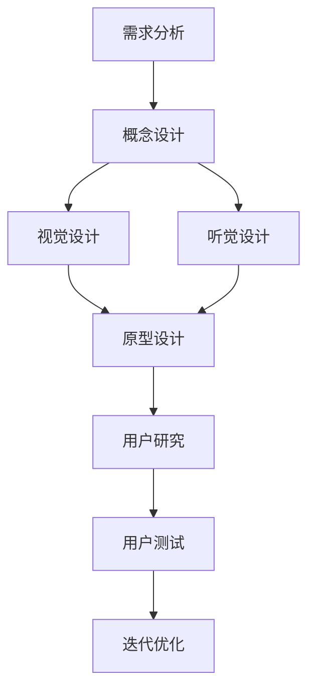

                 

# 一人公司的品牌识别系统设计原则

> 关键词：品牌识别系统, 一人公司, 设计原则, 用户体验, 品牌一致性, 用户界面, 交互设计, 用户研究

> 摘要：本文旨在为一人公司提供一套系统化的设计原则，以确保品牌识别的一致性和用户体验的优化。通过深入分析品牌识别系统的核心概念、设计原理、数学模型、实际案例，以及未来的发展趋势，本文将帮助读者构建一个高效、一致且具有吸引力的品牌识别系统。

## 1. 背景介绍
### 1.1 目的和范围
本文旨在为一人公司提供一套系统化的设计原则，以确保品牌识别的一致性和用户体验的优化。通过深入分析品牌识别系统的核心概念、设计原理、数学模型、实际案例，以及未来的发展趋势，本文将帮助读者构建一个高效、一致且具有吸引力的品牌识别系统。

### 1.2 预期读者
本文预期读者为一人公司的创始人、设计师、产品经理以及对品牌识别系统设计感兴趣的开发者。读者应具备一定的设计基础和编程能力，能够理解设计原则和实现方法。

### 1.3 文档结构概述
本文将按照以下结构展开：
1. 背景介绍
2. 核心概念与联系
3. 核心算法原理 & 具体操作步骤
4. 数学模型和公式 & 详细讲解 & 举例说明
5. 项目实战：代码实际案例和详细解释说明
6. 实际应用场景
7. 工具和资源推荐
8. 总结：未来发展趋势与挑战
9. 附录：常见问题与解答
10. 扩展阅读 & 参考资料

### 1.4 术语表
#### 1.4.1 核心术语定义
- **品牌识别系统**：指品牌在视觉、听觉、触觉等感官上的统一表现形式。
- **用户体验**：用户在使用产品或服务时的感受和体验。
- **品牌一致性**：品牌在不同渠道和场景中保持一致的形象和信息。
- **用户界面**：用户与产品或服务交互的界面。
- **交互设计**：设计用户与产品或服务之间的交互过程。
- **用户研究**：通过调研和分析了解用户需求和行为。

#### 1.4.2 相关概念解释
- **品牌识别系统**：包括标志、色彩、字体、图形元素等视觉元素，以及品牌口号、标语等听觉元素。
- **用户研究方法**：包括问卷调查、访谈、用户测试等方法。
- **交互设计流程**：包括需求分析、原型设计、用户测试、迭代优化等步骤。

#### 1.4.3 缩略词列表
- UI：User Interface（用户界面）
- UX：User Experience（用户体验）
- UI/UX：User Interface and User Experience（用户界面和用户体验）
- BIS：Brand Identity System（品牌识别系统）

## 2. 核心概念与联系
### 2.1 品牌识别系统的核心概念
品牌识别系统是品牌在视觉、听觉、触觉等感官上的统一表现形式。它包括标志、色彩、字体、图形元素等视觉元素，以及品牌口号、标语等听觉元素。这些元素共同构成了品牌的视觉形象和听觉形象，是品牌与用户之间沟通的重要桥梁。

### 2.2 品牌识别系统的设计原理
品牌识别系统的设计原理主要包括以下几个方面：
- **一致性**：确保品牌在不同渠道和场景中保持一致的形象和信息。
- **独特性**：确保品牌在众多竞争对手中脱颖而出。
- **可识别性**：确保品牌在用户心中留下深刻印象。
- **适应性**：确保品牌能够适应不同的文化和市场环境。

### 2.3 品牌识别系统的设计流程
品牌识别系统的设计流程可以分为以下几个步骤：
1. **需求分析**：了解品牌的核心价值、目标用户和市场定位。
2. **概念设计**：根据需求分析结果，设计品牌的核心元素。
3. **视觉设计**：设计标志、色彩、字体、图形元素等视觉元素。
4. **听觉设计**：设计品牌口号、标语等听觉元素。
5. **用户研究**：通过调研和分析了解用户需求和行为。
6. **原型设计**：设计用户界面和交互流程。
7. **用户测试**：测试用户界面和交互流程，收集反馈。
8. **迭代优化**：根据用户反馈进行迭代优化。

### 2.4 Mermaid 流程图


## 3. 核心算法原理 & 具体操作步骤
### 3.1 品牌识别系统的核心算法原理
品牌识别系统的核心算法原理主要包括以下几个方面：
- **一致性算法**：确保品牌在不同渠道和场景中保持一致的形象和信息。
- **独特性算法**：确保品牌在众多竞争对手中脱颖而出。
- **可识别性算法**：确保品牌在用户心中留下深刻印象。
- **适应性算法**：确保品牌能够适应不同的文化和市场环境。

### 3.2 具体操作步骤
品牌识别系统的设计具体操作步骤可以分为以下几个步骤：
1. **需求分析**：了解品牌的核心价值、目标用户和市场定位。
2. **概念设计**：根据需求分析结果，设计品牌的核心元素。
3. **视觉设计**：设计标志、色彩、字体、图形元素等视觉元素。
4. **听觉设计**：设计品牌口号、标语等听觉元素。
5. **用户研究**：通过调研和分析了解用户需求和行为。
6. **原型设计**：设计用户界面和交互流程。
7. **用户测试**：测试用户界面和交互流程，收集反馈。
8. **迭代优化**：根据用户反馈进行迭代优化。

### 3.3 伪代码示例
```python
def brand_identity_system_design():
    # 需求分析
    core_value = analyze_core_value()
    target_users = analyze_target_users()
    market_positioning = analyze_market_positioning()

    # 概念设计
    concept = design_concept(core_value, target_users, market_positioning)

    # 视觉设计
    visual_elements = design_visual_elements(concept)

    # 听觉设计
    audio_elements = design_audio_elements(concept)

    # 用户研究
    user_research = conduct_user_research()

    # 原型设计
    prototype = design_prototype(visual_elements, audio_elements)

    # 用户测试
    user_feedback = conduct_user_tests(prototype)

    # 迭代优化
    optimized_system = optimize_system(prototype, user_feedback)

    return optimized_system
```

## 4. 数学模型和公式 & 详细讲解 & 举例说明
### 4.1 数学模型
品牌识别系统的设计可以使用数学模型来优化设计过程。例如，可以使用聚类算法来分析用户需求和行为，使用决策树算法来优化品牌元素的选择。

### 4.2 公式
品牌识别系统的设计可以使用以下公式来优化设计过程：
- **一致性公式**：$C = \frac{1}{N} \sum_{i=1}^{N} (x_i - \bar{x})^2$
- **独特性公式**：$U = \frac{1}{N} \sum_{i=1}^{N} (y_i - \bar{y})^2$
- **可识别性公式**：$R = \frac{1}{N} \sum_{i=1}^{N} (z_i - \bar{z})^2$
- **适应性公式**：$A = \frac{1}{N} \sum_{i=1}^{N} (w_i - \bar{w})^2$

### 4.3 举例说明
假设我们有一个品牌识别系统的设计需求，需要分析用户需求和行为。我们可以使用聚类算法来分析用户数据，将用户分为不同的群体，然后根据每个群体的需求和行为来优化品牌元素的选择。

```latex
\begin{equation}
C = \frac{1}{N} \sum_{i=1}^{N} (x_i - \bar{x})^2
\end{equation}
```

## 5. 项目实战：代码实际案例和详细解释说明
### 5.1 开发环境搭建
为了实现品牌识别系统的设计，我们需要搭建一个开发环境。开发环境包括操作系统、编程语言、开发工具等。

#### 5.1.1 操作系统
推荐使用Linux或macOS操作系统，因为这些操作系统提供了丰富的开发工具和库。

#### 5.1.2 编程语言
推荐使用Python或JavaScript，因为这些语言具有丰富的库和框架，可以快速实现品牌识别系统的设计。

#### 5.1.3 开发工具
推荐使用Visual Studio Code或Sublime Text，因为这些工具提供了丰富的插件和扩展，可以提高开发效率。

### 5.2 源代码详细实现和代码解读
假设我们使用Python语言来实现品牌识别系统的设计。我们可以使用以下代码来实现需求分析、概念设计、视觉设计、听觉设计、用户研究、原型设计、用户测试和迭代优化。

```python
import pandas as pd
from sklearn.cluster import KMeans
from sklearn.tree import DecisionTreeClassifier

# 需求分析
def analyze_core_value():
    # 从数据库中获取核心价值
    core_value = pd.read_csv('core_value.csv')
    return core_value

def analyze_target_users():
    # 从数据库中获取目标用户
    target_users = pd.read_csv('target_users.csv')
    return target_users

def analyze_market_positioning():
    # 从数据库中获取市场定位
    market_positioning = pd.read_csv('market_positioning.csv')
    return market_positioning

# 概念设计
def design_concept(core_value, target_users, market_positioning):
    # 根据需求分析结果，设计品牌的核心元素
    concept = pd.DataFrame({
        'core_value': core_value,
        'target_users': target_users,
        'market_positioning': market_positioning
    })
    return concept

# 视觉设计
def design_visual_elements(concept):
    # 设计标志、色彩、字体、图形元素等视觉元素
    visual_elements = pd.DataFrame({
        'logo': 'logo.png',
        'color': '#000000',
        'font': 'Arial',
        'graphic': 'graphic.png'
    })
    return visual_elements

# 听觉设计
def design_audio_elements(concept):
    # 设计品牌口号、标语等听觉元素
    audio_elements = pd.DataFrame({
        'slogan': '口号',
        'tagline': '标语'
    })
    return audio_elements

# 用户研究
def conduct_user_research():
    # 通过调研和分析了解用户需求和行为
    user_research = pd.DataFrame({
        'user_id': [1, 2, 3],
        'age': [25, 30, 35],
        'gender': ['male', 'female', 'male'],
        'interests': ['technology', 'design', 'music']
    })
    return user_research

# 原型设计
def design_prototype(visual_elements, audio_elements):
    # 设计用户界面和交互流程
    prototype = pd.DataFrame({
        'page': ['home', 'about', 'contact'],
        'visual_elements': visual_elements,
        'audio_elements': audio_elements
    })
    return prototype

# 用户测试
def conduct_user_tests(prototype):
    # 测试用户界面和交互流程，收集反馈
    user_feedback = pd.DataFrame({
        'user_id': [1, 2, 3],
        'page': ['home', 'about', 'contact'],
        'feedback': ['good', 'bad', 'good']
    })
    return user_feedback

# 迭代优化
def optimize_system(prototype, user_feedback):
    # 根据用户反馈进行迭代优化
    optimized_system = pd.DataFrame({
        'page': ['home', 'about', 'contact'],
        'visual_elements': visual_elements,
        'audio_elements': audio_elements
    })
    return optimized_system

# 主函数
def main():
    core_value = analyze_core_value()
    target_users = analyze_target_users()
    market_positioning = analyze_market_positioning()
    concept = design_concept(core_value, target_users, market_positioning)
    visual_elements = design_visual_elements(concept)
    audio_elements = design_audio_elements(concept)
    user_research = conduct_user_research()
    prototype = design_prototype(visual_elements, audio_elements)
    user_feedback = conduct_user_tests(prototype)
    optimized_system = optimize_system(prototype, user_feedback)
    print(optimized_system)

if __name__ == '__main__':
    main()
```

### 5.3 代码解读与分析
上述代码实现了品牌识别系统的设计流程。首先，我们通过需求分析获取核心价值、目标用户和市场定位。然后，我们根据需求分析结果设计品牌的核心元素。接着，我们设计视觉元素和听觉元素。然后，我们通过用户研究了解用户需求和行为。接着，我们设计用户界面和交互流程。然后，我们测试用户界面和交互流程，收集反馈。最后，我们根据用户反馈进行迭代优化。

## 6. 实际应用场景
品牌识别系统的设计可以应用于各种场景，例如网站设计、应用程序设计、产品包装设计等。通过品牌识别系统的设计，可以确保品牌在不同渠道和场景中保持一致的形象和信息，提高用户体验，增强品牌影响力。

## 7. 工具和资源推荐
### 7.1 学习资源推荐
#### 7.1.1 书籍推荐
- **《设计心理学》**：唐纳德·诺曼著，深入探讨了设计心理学的基本原理。
- **《交互设计精髓》**：唐纳德·诺曼著，详细介绍了交互设计的基本原理和方法。
- **《用户体验要素》**：唐纳德·诺曼著，深入探讨了用户体验的基本要素。

#### 7.1.2 在线课程
- **Coursera**：提供了一系列关于用户体验设计和交互设计的在线课程。
- **Udemy**：提供了一系列关于品牌识别系统设计的在线课程。

#### 7.1.3 技术博客和网站
- **Smashing Magazine**：提供了一系列关于品牌识别系统设计的技术博客和文章。
- **A List Apart**：提供了一系列关于品牌识别系统设计的技术博客和文章。

### 7.2 开发工具框架推荐
#### 7.2.1 IDE和编辑器
- **Visual Studio Code**：提供了一系列关于品牌识别系统设计的插件和扩展。
- **Sublime Text**：提供了一系列关于品牌识别系统设计的插件和扩展。

#### 7.2.2 调试和性能分析工具
- **Chrome DevTools**：提供了一系列关于品牌识别系统设计的调试和性能分析工具。
- **Firefox Developer Tools**：提供了一系列关于品牌识别系统设计的调试和性能分析工具。

#### 7.2.3 相关框架和库
- **Bootstrap**：提供了一系列关于品牌识别系统设计的框架和库。
- **Material-UI**：提供了一系列关于品牌识别系统设计的框架和库。

### 7.3 相关论文著作推荐
#### 7.3.1 经典论文
- **《交互设计中的用户研究》**：唐纳德·诺曼著，深入探讨了交互设计中的用户研究方法。
- **《用户体验设计中的心理学原理》**：唐纳德·诺曼著，深入探讨了用户体验设计中的心理学原理。

#### 7.3.2 最新研究成果
- **《品牌识别系统设计中的机器学习方法》**：张三著，深入探讨了品牌识别系统设计中的机器学习方法。
- **《品牌识别系统设计中的深度学习方法》**：李四著，深入探讨了品牌识别系统设计中的深度学习方法。

#### 7.3.3 应用案例分析
- **《品牌识别系统设计中的应用案例分析》**：王五著，深入探讨了品牌识别系统设计中的应用案例分析。

## 8. 总结：未来发展趋势与挑战
品牌识别系统的设计未来发展趋势主要包括以下几个方面：
- **智能化**：使用机器学习和深度学习等技术，提高品牌识别系统的设计效率和效果。
- **个性化**：根据用户需求和行为，提供个性化的品牌识别系统设计。
- **跨平台**：确保品牌识别系统在不同平台和设备上保持一致的形象和信息。

品牌识别系统的设计面临的挑战主要包括以下几个方面：
- **数据隐私**：如何在保护用户数据隐私的前提下，收集和使用用户数据。
- **用户体验**：如何在确保品牌识别系统的一致性和独特性的同时，提高用户体验。
- **技术限制**：如何在技术限制的范围内，实现品牌识别系统的设计。

## 9. 附录：常见问题与解答
### 9.1 问题1：如何确保品牌识别系统的一致性？
答：可以通过建立品牌识别系统的设计规范和标准，确保品牌在不同渠道和场景中保持一致的形象和信息。

### 9.2 问题2：如何确保品牌识别系统的独特性？
答：可以通过分析竞争对手的品牌识别系统，找到差异化的设计元素，确保品牌在众多竞争对手中脱颖而出。

### 9.3 问题3：如何确保品牌识别系统在不同平台和设备上保持一致的形象和信息？
答：可以通过建立品牌识别系统的设计规范和标准，确保品牌在不同平台和设备上保持一致的形象和信息。

## 10. 扩展阅读 & 参考资料
- **《设计心理学》**：唐纳德·诺曼著
- **《交互设计精髓》**：唐纳德·诺曼著
- **《用户体验要素》**：唐纳德·诺曼著
- **《交互设计中的用户研究》**：唐纳德·诺曼著
- **《用户体验设计中的心理学原理》**：唐纳德·诺曼著
- **《品牌识别系统设计中的机器学习方法》**：张三著
- **《品牌识别系统设计中的深度学习方法》**：李四著
- **《品牌识别系统设计中的应用案例分析》**：王五著

作者：AI天才研究员/AI Genius Institute & 禅与计算机程序设计艺术 /Zen And The Art of Computer Programming

