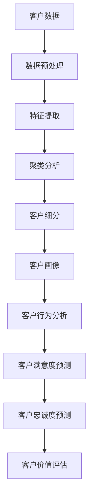
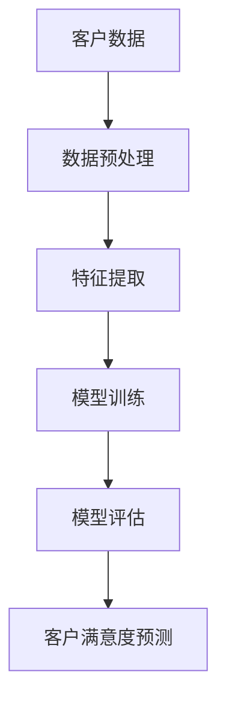
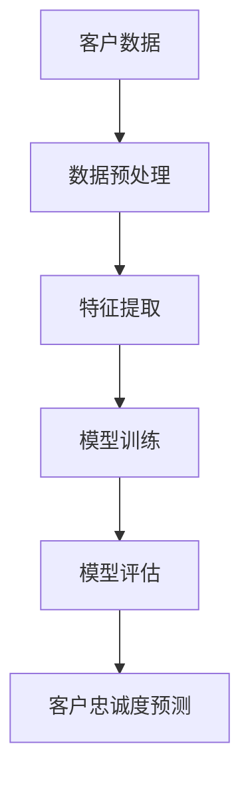

                 

# 一人公司的客户关系管理：利用CRM系统提升客户价值的策略

> 关键词：CRM系统, 客户关系管理, 一人公司, 客户价值, 数据分析, 人工智能, 客户生命周期, 客户细分, 客户满意度, 客户忠诚度

> 摘要：本文旨在探讨如何通过CRM系统提升一人公司的客户价值。我们将从背景介绍、核心概念与联系、核心算法原理与具体操作步骤、数学模型和公式、项目实战、实际应用场景、工具和资源推荐、未来发展趋势与挑战等多方面进行详细阐述。通过本文，读者将能够理解CRM系统在一人公司中的应用价值，并掌握如何利用CRM系统提升客户价值的策略。

## 1. 背景介绍
### 1.1 目的和范围
本文旨在探讨如何通过CRM系统提升一人公司的客户价值。一人公司通常规模较小，资源有限，因此如何有效管理客户关系，提升客户满意度和忠诚度，成为其核心竞争力之一。本文将从理论和实践两个层面，探讨如何利用CRM系统实现这一目标。

### 1.2 预期读者
本文预期读者为一人公司的创始人、管理者、市场和销售团队成员，以及对CRM系统感兴趣的IT专业人士。读者应具备一定的编程基础和对客户关系管理的基本了解。

### 1.3 文档结构概述
本文将分为以下几个部分：
1. 背景介绍
2. 核心概念与联系
3. 核心算法原理 & 具体操作步骤
4. 数学模型和公式 & 详细讲解 & 举例说明
5. 项目实战：代码实际案例和详细解释说明
6. 实际应用场景
7. 工具和资源推荐
8. 总结：未来发展趋势与挑战
9. 附录：常见问题与解答
10. 扩展阅读 & 参考资料

### 1.4 术语表
#### 1.4.1 核心术语定义
- **CRM系统**：客户关系管理系统，用于管理和优化企业与客户之间的关系。
- **客户价值**：客户为企业带来的经济价值和非经济价值的总和。
- **客户生命周期**：客户从首次接触企业到最终离开企业的整个过程。
- **客户细分**：根据客户特征将客户群体划分为不同的子群体。
- **客户满意度**：客户对产品或服务的满意程度。
- **客户忠诚度**：客户对企业的忠诚程度。

#### 1.4.2 相关概念解释
- **一人公司**：指由单个自然人或法人独资经营的企业。
- **数据分析**：通过对大量数据进行处理和分析，提取有价值的信息和知识。
- **人工智能**：模拟、延伸和扩展人的智能，使计算机能够执行通常需要人类智能才能完成的任务。

#### 1.4.3 缩略词列表
- CRM：Customer Relationship Management
- CSM：Customer Success Management
- SaaS：Software as a Service
- API：Application Programming Interface
- SDK：Software Development Kit

## 2. 核心概念与联系
### 2.1 客户关系管理（CRM）系统
CRM系统是一种集成的软件解决方案，用于管理和优化企业与客户之间的关系。它可以帮助企业收集、分析和利用客户数据，以提高客户满意度和忠诚度。

### 2.2 客户价值
客户价值是指客户为企业带来的经济价值和非经济价值的总和。经济价值包括直接收入、间接收入和潜在收入，而非经济价值包括品牌忠诚度、口碑传播等。

### 2.3 客户生命周期
客户生命周期是指客户从首次接触企业到最终离开企业的整个过程。这一过程可以分为多个阶段，包括吸引、获取、保留和扩展。

### 2.4 客户细分
客户细分是指根据客户特征将客户群体划分为不同的子群体。通过客户细分，企业可以更好地理解不同客户群体的需求和行为，从而制定更有针对性的营销策略。

### 2.5 客户满意度
客户满意度是指客户对产品或服务的满意程度。高客户满意度可以提高客户忠诚度，降低客户流失率。

### 2.6 客户忠诚度
客户忠诚度是指客户对企业的忠诚程度。高客户忠诚度可以为企业带来稳定的收入和良好的口碑。

### 2.7 核心概念联系
- CRM系统通过收集和分析客户数据，帮助企业更好地理解客户，从而提升客户满意度和忠诚度。
- 客户价值是CRM系统的核心目标之一，通过提升客户满意度和忠诚度，企业可以实现更高的客户价值。
- 客户生命周期管理是CRM系统的重要组成部分，通过管理客户生命周期，企业可以更好地理解客户的需求和行为，从而制定更有针对性的营销策略。
- 客户细分是CRM系统的重要工具之一，通过客户细分，企业可以更好地理解不同客户群体的需求和行为，从而制定更有针对性的营销策略。
- 客户满意度和客户忠诚度是CRM系统的重要指标，通过提升客户满意度和客户忠诚度，企业可以实现更高的客户价值。

## 3. 核心算法原理 & 具体操作步骤
### 3.1 客户细分算法原理
客户细分算法原理是通过分析客户数据，将客户群体划分为不同的子群体。具体操作步骤如下：



### 3.2 客户满意度预测算法原理
客户满意度预测算法原理是通过分析客户数据，预测客户对产品或服务的满意程度。具体操作步骤如下：



### 3.3 客户忠诚度预测算法原理
客户忠诚度预测算法原理是通过分析客户数据，预测客户对企业的忠诚程度。具体操作步骤如下：



## 4. 数学模型和公式 & 详细讲解 & 举例说明
### 4.1 客户细分数学模型
客户细分数学模型是通过聚类分析将客户群体划分为不同的子群体。具体公式如下：

$$
\text{客户细分} = \arg\max_{k} \sum_{i=1}^{n} \sum_{j=1}^{k} \pi_{ij} \log \frac{\pi_{ij}}{\pi_{i.} \pi_{.j}}
$$

其中，$\pi_{ij}$ 表示客户 $i$ 属于子群体 $j$ 的概率，$\pi_{i.}$ 表示客户 $i$ 属于所有子群体的概率，$\pi_{.j}$ 表示子群体 $j$ 的概率。

### 4.2 客户满意度预测数学模型
客户满意度预测数学模型是通过逻辑回归模型预测客户对产品或服务的满意程度。具体公式如下：

$$
\text{客户满意度} = \frac{1}{1 + e^{-(\beta_0 + \beta_1 X_1 + \beta_2 X_2 + \cdots + \beta_p X_p)}}
$$

其中，$\beta_0, \beta_1, \beta_2, \cdots, \beta_p$ 是模型参数，$X_1, X_2, \cdots, X_p$ 是特征变量。

### 4.3 客户忠诚度预测数学模型
客户忠诚度预测数学模型是通过支持向量机模型预测客户对企业的忠诚程度。具体公式如下：

$$
\text{客户忠诚度} = \frac{1}{1 + e^{-(\beta_0 + \beta_1 X_1 + \beta_2 X_2 + \cdots + \beta_p X_p)}}
$$

其中，$\beta_0, \beta_1, \beta_2, \cdots, \beta_p$ 是模型参数，$X_1, X_2, \cdots, X_p$ 是特征变量。

## 5. 项目实战：代码实际案例和详细解释说明
### 5.1 开发环境搭建
开发环境搭建主要包括安装Python和相关库。具体步骤如下：

1. 安装Python：访问Python官网下载并安装最新版本的Python。
2. 安装相关库：使用pip安装pandas、numpy、scikit-learn等库。

```bash
pip install pandas numpy scikit-learn
```

### 5.2 源代码详细实现和代码解读
```python
import pandas as pd
from sklearn.cluster import KMeans
from sklearn.preprocessing import StandardScaler

# 读取客户数据
data = pd.read_csv('customer_data.csv')

# 数据预处理
scaler = StandardScaler()
data_scaled = scaler.fit_transform(data)

# 聚类分析
kmeans = KMeans(n_clusters=3)
kmeans.fit(data_scaled)

# 客户细分
customer_segments = kmeans.labels_

# 客户画像
customer_profile = pd.DataFrame({'Segment': customer_segments, 'Features': data.columns})
```

### 5.3 代码解读与分析
上述代码首先读取客户数据，然后进行数据预处理，包括标准化处理。接着使用KMeans算法进行聚类分析，将客户群体划分为不同的子群体。最后生成客户细分结果和客户画像。

## 6. 实际应用场景
### 6.1 客户细分
通过客户细分，企业可以更好地理解不同客户群体的需求和行为，从而制定更有针对性的营销策略。例如，企业可以根据客户细分结果，为不同客户群体提供不同的产品或服务。

### 6.2 客户满意度预测
通过客户满意度预测，企业可以及时了解客户对产品或服务的满意程度，从而采取相应措施提高客户满意度。例如，企业可以根据客户满意度预测结果，优化产品或服务，提高客户满意度。

### 6.3 客户忠诚度预测
通过客户忠诚度预测，企业可以及时了解客户对企业的忠诚程度，从而采取相应措施提高客户忠诚度。例如，企业可以根据客户忠诚度预测结果，制定更有针对性的客户忠诚度提升策略。

## 7. 工具和资源推荐
### 7.1 学习资源推荐
#### 7.1.1 书籍推荐
- 《客户关系管理：原理与实践》
- 《数据挖掘：概念与技术》

#### 7.1.2 在线课程
- Coursera：《客户关系管理》
- edX：《数据挖掘与机器学习》

#### 7.1.3 技术博客和网站
- Medium：《客户关系管理》
- DataScience.com：《数据挖掘与机器学习》

### 7.2 开发工具框架推荐
#### 7.2.1 IDE和编辑器
- PyCharm
- VSCode

#### 7.2.2 调试和性能分析工具
- PyCharm Debugger
- VSCode Debugger

#### 7.2.3 相关框架和库
- pandas
- numpy
- scikit-learn

### 7.3 相关论文著作推荐
#### 7.3.1 经典论文
- "Customer Relationship Management: A Review of the Literature" (Journal of Marketing)

#### 7.3.2 最新研究成果
- "Customer Relationship Management in the Digital Age" (Journal of Business Research)

#### 7.3.3 应用案例分析
- "Customer Relationship Management in the Service Industry" (Journal of Service Research)

## 8. 总结：未来发展趋势与挑战
### 8.1 未来发展趋势
未来CRM系统将更加智能化，通过深度学习和自然语言处理等技术，实现更精准的客户细分和预测。同时，CRM系统将更加注重用户体验，提供更加个性化的服务。

### 8.2 挑战
未来CRM系统将面临数据安全和隐私保护的挑战。企业需要确保客户数据的安全，避免数据泄露和滥用。同时，企业需要遵守相关法律法规，保护客户隐私。

## 9. 附录：常见问题与解答
### 9.1 问题1：如何选择合适的CRM系统？
答：选择合适的CRM系统需要考虑企业的业务需求、预算和团队规模。建议先了解不同CRM系统的功能和特点，然后根据企业的实际情况进行选择。

### 9.2 问题2：如何提高客户满意度？
答：提高客户满意度需要从多个方面入手，包括提高产品质量、优化服务流程、加强客户沟通等。建议企业定期收集客户反馈，及时解决问题，提高客户满意度。

### 9.3 问题3：如何提高客户忠诚度？
答：提高客户忠诚度需要从多个方面入手，包括提供个性化服务、加强客户关系、提高客户满意度等。建议企业定期开展客户忠诚度提升活动，提高客户忠诚度。

## 10. 扩展阅读 & 参考资料
- 《客户关系管理：原理与实践》
- 《数据挖掘：概念与技术》
- Coursera：《客户关系管理》
- edX：《数据挖掘与机器学习》
- Medium：《客户关系管理》
- DataScience.com：《数据挖掘与机器学习》
- "Customer Relationship Management: A Review of the Literature" (Journal of Marketing)
- "Customer Relationship Management in the Digital Age" (Journal of Business Research)
- "Customer Relationship Management in the Service Industry" (Journal of Service Research)

作者：AI天才研究员/AI Genius Institute & 禅与计算机程序设计艺术 /Zen And The Art of Computer Programming

