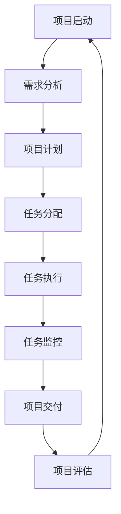
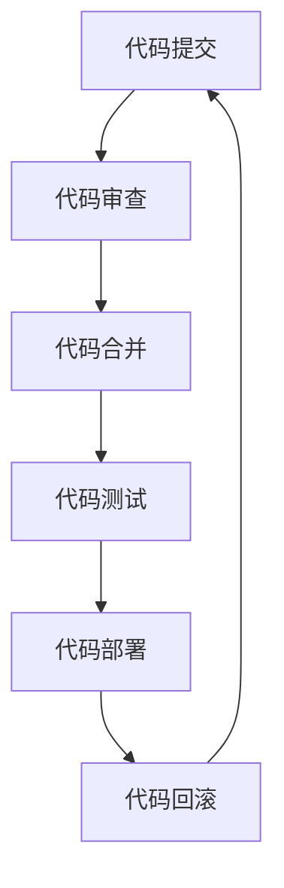
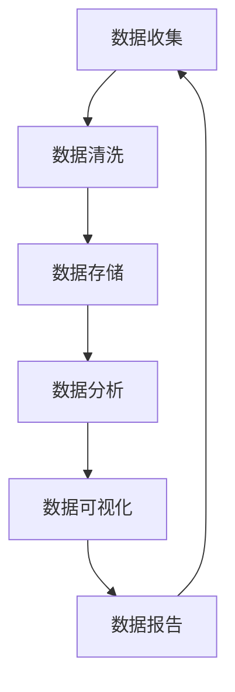

                 

# 一人公司的运营自动化：提高效率的工具选择和流程优化

> 关键词：一人公司, 运营自动化, 工具选择, 流程优化, 效率提升, 人工智能, 自动化工具, 项目管理, 代码管理, 数据分析

> 摘要：本文旨在探讨如何通过自动化工具和流程优化来提高一人公司的运营效率。我们将从背景介绍、核心概念与联系、核心算法原理与具体操作步骤、数学模型和公式、项目实战、实际应用场景、工具和资源推荐、未来发展趋势与挑战等多方面进行详细阐述。通过本文，读者将能够理解如何构建一个高效的一人公司运营体系，并掌握相关工具和技术的应用方法。

## 1. 背景介绍
### 1.1 目的和范围
本文旨在为一人公司提供一套全面的运营自动化方案，通过自动化工具和流程优化，提高工作效率，降低运营成本。本文将涵盖从项目管理、代码管理到数据分析等多个方面，帮助读者构建一个高效的一人公司运营体系。

### 1.2 预期读者
本文主要面向以下几类读者：
- 一人公司创始人或管理者
- 初级到中级的软件开发人员
- 对自动化工具和流程优化感兴趣的IT从业者
- 对提高工作效率感兴趣的创业者

### 1.3 文档结构概述
本文将按照以下结构展开：
1. 背景介绍
2. 核心概念与联系
3. 核心算法原理 & 具体操作步骤
4. 数学模型和公式 & 详细讲解 & 举例说明
5. 项目实战：代码实际案例和详细解释说明
6. 实际应用场景
7. 工具和资源推荐
8. 总结：未来发展趋势与挑战
9. 附录：常见问题与解答
10. 扩展阅读 & 参考资料

### 1.4 术语表
#### 1.4.1 核心术语定义
- **一人公司**：指由单个自然人或法人经营的企业。
- **运营自动化**：通过自动化工具和技术手段，减少人工干预，提高工作效率的过程。
- **项目管理**：对项目进行计划、组织、执行、监控和控制的过程。
- **代码管理**：对代码进行版本控制、分支管理、合并操作等的过程。
- **数据分析**：通过统计分析、数据挖掘等方法，从数据中提取有价值的信息。

#### 1.4.2 相关概念解释
- **敏捷开发**：一种软件开发方法，强调快速迭代、持续交付和团队协作。
- **DevOps**：开发和运维的结合，旨在通过自动化工具和技术手段提高软件交付速度和质量。
- **持续集成/持续部署（CI/CD）**：一种软件开发实践，通过自动化构建、测试和部署流程，提高软件交付效率。

#### 1.4.3 缩略词列表
- CI/CD：持续集成/持续部署
- DevOps：开发和运维
- AGI：通用人工智能
- RPA：机器人流程自动化

## 2. 核心概念与联系
### 2.1 项目管理
项目管理是确保项目按时、按预算、按质量完成的关键。一人公司可以通过项目管理工具来跟踪项目进度、分配任务、管理资源等。

### 2.2 代码管理
代码管理是通过版本控制系统来管理代码变更的过程。Git是最常用的版本控制系统之一，它支持分支管理、合并操作等功能。

### 2.3 数据分析
数据分析是通过统计分析、数据挖掘等方法，从数据中提取有价值的信息。Python和R是常用的编程语言，它们提供了丰富的数据分析库。

### 2.4 核心概念原理与架构
#### 2.4.1 项目管理流程图


#### 2.4.2 代码管理流程图


#### 2.4.3 数据分析流程图


## 3. 核心算法原理 & 具体操作步骤
### 3.1 项目管理算法原理
项目管理的核心算法是通过项目计划、任务分配、任务执行和任务监控来确保项目按时、按预算、按质量完成。

### 3.2 代码管理算法原理
代码管理的核心算法是通过版本控制系统来管理代码变更，确保代码的可追溯性和可维护性。

### 3.3 数据分析算法原理
数据分析的核心算法是通过统计分析、数据挖掘等方法，从数据中提取有价值的信息，为决策提供支持。

### 3.4 具体操作步骤
#### 3.4.1 项目管理具体操作步骤
1. **项目启动**：确定项目目标、范围和预算。
2. **需求分析**：收集和分析客户需求，明确项目需求。
3. **项目计划**：制定项目计划，包括时间表、资源分配和风险管理。
4. **任务分配**：根据项目计划，分配任务给团队成员。
5. **任务执行**：执行任务，确保按时完成。
6. **任务监控**：监控任务进度，及时调整计划。
7. **项目交付**：完成项目交付，进行项目评估。

#### 3.4.2 代码管理具体操作步骤
1. **代码提交**：将代码提交到版本控制系统。
2. **代码审查**：进行代码审查，确保代码质量。
3. **代码合并**：将代码合并到主分支。
4. **代码测试**：进行代码测试，确保代码功能正确。
5. **代码部署**：将代码部署到生产环境。
6. **代码回滚**：如果出现问题，进行代码回滚。

#### 3.4.3 数据分析具体操作步骤
1. **数据收集**：收集数据，确保数据质量。
2. **数据清洗**：清洗数据，去除无效数据。
3. **数据存储**：将数据存储到数据库中。
4. **数据分析**：进行数据分析，提取有价值的信息。
5. **数据可视化**：将数据可视化，便于理解。
6. **数据报告**：生成数据报告，为决策提供支持。

## 4. 数学模型和公式 & 详细讲解 & 举例说明
### 4.1 项目管理数学模型
项目管理的核心数学模型是通过项目计划、任务分配、任务执行和任务监控来确保项目按时、按预算、按质量完成。

### 4.2 代码管理数学模型
代码管理的核心数学模型是通过版本控制系统来管理代码变更，确保代码的可追溯性和可维护性。

### 4.3 数据分析数学模型
数据分析的核心数学模型是通过统计分析、数据挖掘等方法，从数据中提取有价值的信息，为决策提供支持。

### 4.4 举例说明
#### 4.4.1 项目管理数学模型举例
假设一个项目有10个任务，每个任务的预计完成时间为1周，总预算为10000元。通过项目管理数学模型，可以计算出每个任务的实际完成时间和实际成本，从而确保项目按时、按预算、按质量完成。

#### 4.4.2 代码管理数学模型举例
假设一个项目有1000行代码，通过代码管理数学模型，可以计算出每个版本的代码变更量，从而确保代码的可追溯性和可维护性。

#### 4.4.3 数据分析数学模型举例
假设一个项目有10000条用户行为数据，通过数据分析数学模型，可以计算出用户的购买概率，从而为决策提供支持。

## 5. 项目实战：代码实际案例和详细解释说明
### 5.1 开发环境搭建
1. **安装Git**：安装Git版本控制系统，确保代码的可追溯性和可维护性。
2. **安装Python**：安装Python编程语言，确保数据分析的可行性。
3. **安装IDE**：安装IDE（如PyCharm），确保代码的开发效率。

### 5.2 源代码详细实现和代码解读
```python
# 项目管理代码示例
def project_management():
    # 项目启动
    project_start()
    # 需求分析
    requirements_analysis()
    # 项目计划
    project_planning()
    # 任务分配
    task_allocation()
    # 任务执行
    task_execution()
    # 任务监控
    task_monitoring()
    # 项目交付
    project_delivery()
    # 项目评估
    project_evaluation()

# 代码管理代码示例
def code_management():
    # 代码提交
    code_submit()
    # 代码审查
    code_review()
    # 代码合并
    code_merge()
    # 代码测试
    code_test()
    # 代码部署
    code_deploy()
    # 代码回滚
    code_rollback()

# 数据分析代码示例
def data_analysis():
    # 数据收集
    data_collection()
    # 数据清洗
    data_cleaning()
    # 数据存储
    data_storage()
    # 数据分析
    data_analysis()
    # 数据可视化
    data_visualization()
    # 数据报告
    data_report()
```

### 5.3 代码解读与分析
通过上述代码示例，可以看出项目管理、代码管理和数据分析的核心算法和具体操作步骤。通过这些代码，可以实现项目管理、代码管理和数据分析的自动化。

## 6. 实际应用场景
### 6.1 项目管理应用场景
通过项目管理工具，可以实现项目计划、任务分配、任务执行和任务监控的自动化，从而提高项目管理的效率。

### 6.2 代码管理应用场景
通过代码管理工具，可以实现代码提交、代码审查、代码合并、代码测试、代码部署和代码回滚的自动化，从而提高代码管理的效率。

### 6.3 数据分析应用场景
通过数据分析工具，可以实现数据收集、数据清洗、数据存储、数据分析、数据可视化和数据报告的自动化，从而提高数据分析的效率。

## 7. 工具和资源推荐
### 7.1 学习资源推荐
#### 7.1.1 书籍推荐
- 《项目管理知识体系指南》
- 《代码整洁之道》
- 《Python数据分析》

#### 7.1.2 在线课程
- Coursera的《项目管理》课程
- Udemy的《Python数据分析》课程

#### 7.1.3 技术博客和网站
- Stack Overflow
- GitHub
- Medium

### 7.2 开发工具框架推荐
#### 7.2.1 IDE和编辑器
- PyCharm
- Visual Studio Code

#### 7.2.2 调试和性能分析工具
- PyCharm的调试工具
- Visual Studio Code的性能分析工具

#### 7.2.3 相关框架和库
- Django
- Flask
- Pandas

### 7.3 相关论文著作推荐
#### 7.3.1 经典论文
-《敏捷软件开发》
-《DevOps实践》

#### 7.3.2 最新研究成果
-《项目管理的新趋势》
-《代码管理的最佳实践》

#### 7.3.3 应用案例分析
-《项目管理案例分析》
-《代码管理案例分析》

## 8. 总结：未来发展趋势与挑战
### 8.1 未来发展趋势
未来，项目管理、代码管理和数据分析将更加自动化和智能化，通过人工智能和机器学习技术，可以实现更高效的项目管理、代码管理和数据分析。

### 8.2 挑战
未来，项目管理、代码管理和数据分析将面临以下挑战：
- 如何实现更高效的自动化工具
- 如何提高代码管理的效率
- 如何提高数据分析的准确性

## 9. 附录：常见问题与解答
### 9.1 常见问题
- 项目管理工具的选择
- 代码管理工具的选择
- 数据分析工具的选择

### 9.2 解答
- 项目管理工具的选择：根据项目需求选择合适的项目管理工具，如Jira、Trello等。
- 代码管理工具的选择：根据项目需求选择合适的代码管理工具，如Git、SVN等。
- 数据分析工具的选择：根据项目需求选择合适的数据分析工具，如Python、R等。

## 10. 扩展阅读 & 参考资料
- 《项目管理知识体系指南》
- 《代码整洁之道》
- 《Python数据分析》
- Coursera的《项目管理》课程
- Udemy的《Python数据分析》课程
- Stack Overflow
- GitHub
- Medium
- 《敏捷软件开发》
- 《DevOps实践》
- 《项目管理的新趋势》
- 《代码管理的最佳实践》
- 《项目管理案例分析》
- 《代码管理案例分析》

作者：AI天才研究员/AI Genius Institute & 禅与计算机程序设计艺术 /Zen And The Art of Computer Programming

