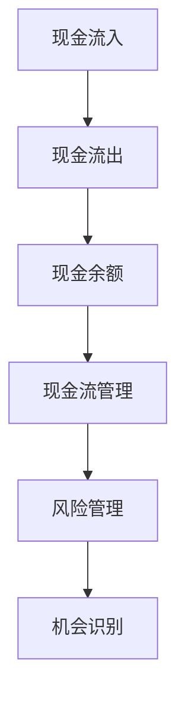
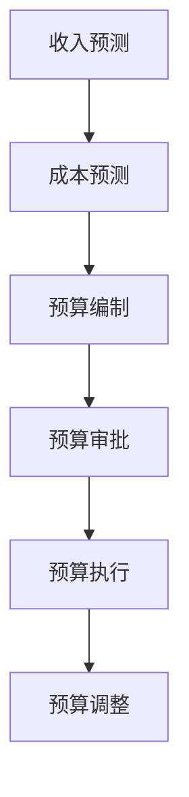
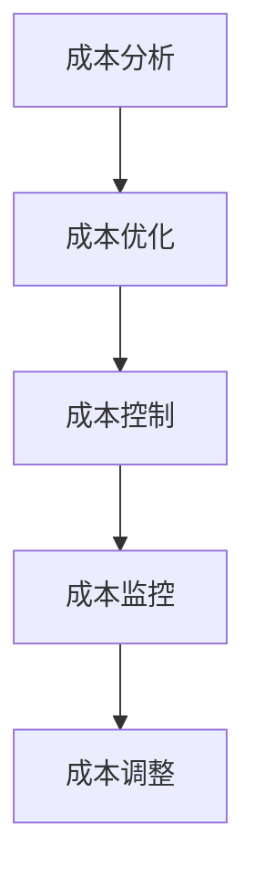
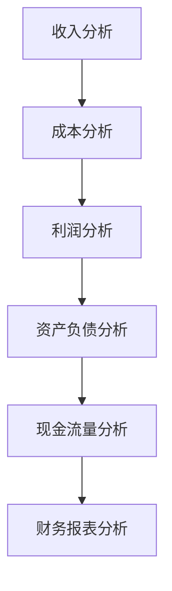
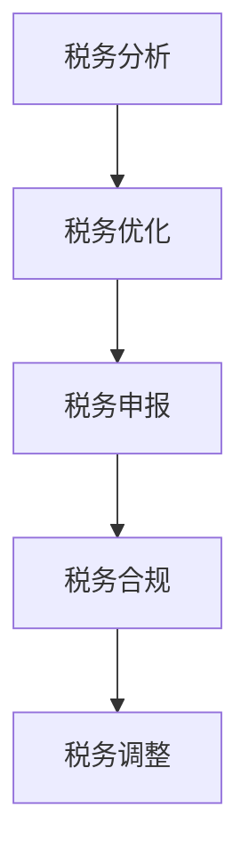

                 

# 一人创业公司的财务管理指南

> 关键词：财务管理、创业公司、现金流、预算、成本控制、财务报表、税务规划

> 摘要：本文旨在为创业公司提供一套全面的财务管理指南，帮助创业者理解和管理公司的财务状况。通过深入分析财务管理的核心概念、原理和实际操作步骤，本文将帮助读者构建一个稳健的财务管理体系，确保公司在激烈的市场竞争中保持健康的发展态势。

## 1. 背景介绍
### 1.1 目的和范围
本文旨在为创业公司提供一套全面的财务管理指南，帮助创业者理解和管理公司的财务状况。财务管理是创业公司成功的关键因素之一，它涉及到现金流管理、预算编制、成本控制、财务报表分析以及税务规划等多个方面。通过本文，读者将能够掌握财务管理的基本原理和实际操作方法，从而为公司的长期发展奠定坚实的基础。

### 1.2 预期读者
本文的目标读者是创业公司的创始人、CEO、CFO以及财务管理人员。无论您是刚刚起步的创业者，还是已经有一定规模的公司，本文都将为您提供宝贵的财务管理知识和实用建议。

### 1.3 文档结构概述
本文将从财务管理的核心概念入手，逐步深入到实际操作层面，包括预算编制、成本控制、财务报表分析以及税务规划等内容。通过详细的案例分析和代码实现，帮助读者更好地理解和应用财务管理知识。

### 1.4 术语表
#### 1.4.1 核心术语定义
- **现金流**：指企业在一定时期内现金及现金等价物的流入和流出。
- **预算**：指对未来一定时期内企业各项财务活动的计划和安排。
- **成本控制**：指通过各种手段降低企业运营成本，提高经济效益。
- **财务报表**：指反映企业财务状况、经营成果和现金流量的文件。
- **税务规划**：指通过合法手段优化企业税务负担，实现税务合规和经济效益最大化。

#### 1.4.2 相关概念解释
- **现金流量表**：反映企业在一定时期内现金及现金等价物的流入和流出情况。
- **损益表**：反映企业在一定时期内的经营成果。
- **资产负债表**：反映企业在某一特定时点的财务状况。
- **税务合规**：指企业遵守相关税法规定，确保税务申报和缴纳的合法性。

#### 1.4.3 缩略词列表
- **CF**：现金流
- **BUD**：预算
- **CC**：成本控制
- **FS**：财务报表
- **TP**：税务规划

## 2. 核心概念与联系
### 2.1 现金流管理
现金流管理是财务管理的核心，它关系到企业的生存和发展。通过分析企业的现金流入和流出情况，可以及时发现潜在的风险和机会，从而采取相应的措施。

#### Mermaid 流程图


### 2.2 预算编制
预算编制是财务管理的重要环节，它可以帮助企业合理规划未来的财务活动，确保资源的有效利用。

#### Mermaid 流程图


### 2.3 成本控制
成本控制是财务管理的关键，通过合理控制成本，可以提高企业的经济效益。

#### Mermaid 流程图


### 2.4 财务报表分析
财务报表分析是财务管理的重要工具，通过分析财务报表，可以了解企业的财务状况和经营成果。

#### Mermaid 流程图


### 2.5 税务规划
税务规划是财务管理的重要组成部分，通过合法手段优化企业税务负担，实现税务合规和经济效益最大化。

#### Mermaid 流程图


## 3. 核心算法原理 & 具体操作步骤
### 3.1 现金流预测算法
现金流预测是财务管理的重要环节，通过预测未来的现金流入和流出情况，可以及时发现潜在的风险和机会。

#### 伪代码
```pseudo
function predict_cashflow(income, expenses):
    # 预测收入
    predicted_income = income * (1 + growth_rate)
    # 预测支出
    predicted_expenses = expenses * (1 + inflation_rate)
    # 计算预测现金流
    predicted_cashflow = predicted_income - predicted_expenses
    return predicted_cashflow
```

### 3.2 预算编制算法
预算编制是财务管理的重要环节，通过合理规划未来的财务活动，可以确保资源的有效利用。

#### 伪代码
```pseudo
function prepare_budget(income, expenses, target_profit):
    # 计算目标收入
    target_income = (expenses + target_profit) / (1 - growth_rate)
    # 计算目标支出
    target_expenses = target_income * (1 - (1 - target_profit) / (1 + growth_rate))
    return target_income, target_expenses
```

### 3.3 成本控制算法
成本控制是财务管理的关键，通过合理控制成本，可以提高企业的经济效益。

#### 伪代码
```pseudo
function control_cost(current_cost, target_cost):
    # 计算成本差异
    cost_difference = current_cost - target_cost
    # 调整成本
    adjusted_cost = current_cost - cost_difference
    return adjusted_cost
```

### 3.4 财务报表分析算法
财务报表分析是财务管理的重要工具，通过分析财务报表，可以了解企业的财务状况和经营成果。

#### 伪代码
```pseudo
function analyze_financial_statement(income, expenses, assets, liabilities):
    # 计算净利润
    net_profit = income - expenses
    # 计算资产负债率
    debt_ratio = liabilities / assets
    # 计算流动比率
    current_ratio = assets / liabilities
    return net_profit, debt_ratio, current_ratio
```

### 3.5 税务规划算法
税务规划是财务管理的重要组成部分，通过合法手段优化企业税务负担，实现税务合规和经济效益最大化。

#### 伪代码
```pseudo
function plan_tax(income, expenses, tax_rate):
    # 计算应纳税所得额
    taxable_income = income - expenses
    # 计算应纳税额
    tax = taxable_income * tax_rate
    # 优化税务负担
    optimized_tax = tax - tax_reduction
    return optimized_tax
```

## 4. 数学模型和公式 & 详细讲解 & 举例说明
### 4.1 现金流预测模型
现金流预测模型是财务管理的重要工具，通过预测未来的现金流入和流出情况，可以及时发现潜在的风险和机会。

#### 数学公式
$$
\text{预测现金流} = \text{预测收入} - \text{预测支出}
$$

#### 详细讲解
现金流预测模型的核心在于预测未来的收入和支出。通过历史数据和市场趋势，可以预测未来的收入和支出情况。例如，如果企业的历史收入增长率为10%，未来一年的收入预测可以表示为：

$$
\text{预测收入} = \text{当前收入} \times (1 + \text{增长率})
$$

同样，如果企业的历史支出增长率为5%，未来一年的支出预测可以表示为：

$$
\text{预测支出} = \text{当前支出} \times (1 + \text{增长率})
$$

### 4.2 预算编制模型
预算编制模型是财务管理的重要工具，通过合理规划未来的财务活动，可以确保资源的有效利用。

#### 数学公式
$$
\text{目标收入} = \frac{\text{目标支出} + \text{目标利润}}{1 - \text{增长率}}
$$

$$
\text{目标支出} = \text{目标收入} \times (1 - \frac{\text{目标利润}}{\text{目标收入}})
$$

#### 详细讲解
预算编制模型的核心在于确定目标收入和支出。通过目标利润和增长率，可以计算出目标收入和支出。例如，如果企业的目标利润为10%，增长率预计为5%，未来一年的预算可以表示为：

$$
\text{目标收入} = \frac{\text{目标支出} + \text{目标利润}}{1 - 0.05}
$$

$$
\text{目标支出} = \text{目标收入} \times (1 - \frac{0.10}{\text{目标收入}})
$$

### 4.3 成本控制模型
成本控制模型是财务管理的关键，通过合理控制成本，可以提高企业的经济效益。

#### 数学公式
$$
\text{调整成本} = \text{当前成本} - \text{成本差异}
$$

#### 详细讲解
成本控制模型的核心在于调整当前的成本。通过成本差异，可以计算出调整后的成本。例如，如果当前成本为1000元，成本差异为200元，调整后的成本可以表示为：

$$
\text{调整成本} = 1000 - 200 = 800
$$

### 4.4 财务报表分析模型
财务报表分析模型是财务管理的重要工具，通过分析财务报表，可以了解企业的财务状况和经营成果。

#### 数学公式
$$
\text{净利润} = \text{收入} - \text{支出}
$$

$$
\text{资产负债率} = \frac{\text{负债}}{\text{资产}}
$$

$$
\text{流动比率} = \frac{\text{流动资产}}{\text{流动负债}}
$$

#### 详细讲解
财务报表分析模型的核心在于计算净利润、资产负债率和流动比率。通过这些指标，可以了解企业的财务状况和经营成果。例如，如果企业的收入为10000元，支出为8000元，净利润可以表示为：

$$
\text{净利润} = 10000 - 8000 = 2000
$$

如果企业的负债为5000元，资产为10000元，资产负债率可以表示为：

$$
\text{资产负债率} = \frac{5000}{10000} = 0.5
$$

如果企业的流动资产为8000元，流动负债为4000元，流动比率可以表示为：

$$
\text{流动比率} = \frac{8000}{4000} = 2
$$

### 4.5 税务规划模型
税务规划模型是财务管理的重要组成部分，通过合法手段优化企业税务负担，实现税务合规和经济效益最大化。

#### 数学公式
$$
\text{应纳税额} = \text{应纳税所得额} \times \text{税率}
$$

$$
\text{优化税额} = \text{应纳税额} - \text{税收减免}
$$

#### 详细讲解
税务规划模型的核心在于计算应纳税额和优化税额。通过应纳税所得额和税率，可以计算出应纳税额。例如，如果企业的应纳税所得额为10000元，税率预计为20%，应纳税额可以表示为：

$$
\text{应纳税额} = 10000 \times 0.20 = 2000
$$

如果企业可以享受税收减免，优化税额可以表示为：

$$
\text{优化税额} = 2000 - \text{税收减免}
$$

## 5. 项目实战：代码实际案例和详细解释说明
### 5.1 开发环境搭建
为了实现财务管理的各项功能，我们需要搭建一个开发环境。这里以Python为例，使用Pandas和NumPy库进行数据分析和处理。

#### 安装依赖库
```bash
pip install pandas numpy
```

### 5.2 源代码详细实现和代码解读
#### 5.2.1 现金流预测代码
```python
import pandas as pd

def predict_cashflow(income, expenses, growth_rate, inflation_rate):
    predicted_income = income * (1 + growth_rate)
    predicted_expenses = expenses * (1 + inflation_rate)
    predicted_cashflow = predicted_income - predicted_expenses
    return predicted_cashflow

# 示例数据
income = 10000
expenses = 8000
growth_rate = 0.10
inflation_rate = 0.05

# 预测现金流
predicted_cashflow = predict_cashflow(income, expenses, growth_rate, inflation_rate)
print(f"预测现金流: {predicted_cashflow}")
```

#### 5.2.2 预算编制代码
```python
def prepare_budget(income, expenses, target_profit, growth_rate):
    target_income = (expenses + target_profit) / (1 - growth_rate)
    target_expenses = target_income * (1 - (1 - target_profit) / (1 + growth_rate))
    return target_income, target_expenses

# 示例数据
income = 10000
expenses = 8000
target_profit = 0.10
growth_rate = 0.05

# 编制预算
target_income, target_expenses = prepare_budget(income, expenses, target_profit, growth_rate)
print(f"目标收入: {target_income}")
print(f"目标支出: {target_expenses}")
```

#### 5.2.3 成本控制代码
```python
def control_cost(current_cost, target_cost):
    cost_difference = current_cost - target_cost
    adjusted_cost = current_cost - cost_difference
    return adjusted_cost

# 示例数据
current_cost = 1000
target_cost = 800

# 控制成本
adjusted_cost = control_cost(current_cost, target_cost)
print(f"调整后的成本: {adjusted_cost}")
```

#### 5.2.4 财务报表分析代码
```python
def analyze_financial_statement(income, expenses, assets, liabilities):
    net_profit = income - expenses
    debt_ratio = liabilities / assets
    current_ratio = assets / liabilities
    return net_profit, debt_ratio, current_ratio

# 示例数据
income = 10000
expenses = 8000
assets = 15000
liabilities = 10000

# 分析财务报表
net_profit, debt_ratio, current_ratio = analyze_financial_statement(income, expenses, assets, liabilities)
print(f"净利润: {net_profit}")
print(f"资产负债率: {debt_ratio}")
print(f"流动比率: {current_ratio}")
```

#### 5.2.5 税务规划代码
```python
def plan_tax(income, expenses, tax_rate, tax_reduction):
    taxable_income = income - expenses
    tax = taxable_income * tax_rate
    optimized_tax = tax - tax_reduction
    return optimized_tax

# 示例数据
income = 10000
expenses = 8000
tax_rate = 0.20
tax_reduction = 1000

# 规划税务
optimized_tax = plan_tax(income, expenses, tax_rate, tax_reduction)
print(f"优化税额: {optimized_tax}")
```

### 5.3 代码解读与分析
通过上述代码实现，我们可以看到财务管理的各项功能已经实现。例如，现金流预测代码可以根据历史数据预测未来的现金流；预算编制代码可以根据目标利润和增长率编制预算；成本控制代码可以根据目标成本调整当前成本；财务报表分析代码可以根据财务数据计算净利润、资产负债率和流动比率；税务规划代码可以根据应纳税所得额和税收减免计算优化税额。

## 6. 实际应用场景
财务管理在创业公司中的应用场景非常广泛，包括但不限于以下几个方面：

- **现金流管理**：通过预测未来的现金流，可以及时发现潜在的风险和机会，从而采取相应的措施。
- **预算编制**：通过合理规划未来的财务活动，可以确保资源的有效利用。
- **成本控制**：通过合理控制成本，可以提高企业的经济效益。
- **财务报表分析**：通过分析财务报表，可以了解企业的财务状况和经营成果。
- **税务规划**：通过合法手段优化企业税务负担，实现税务合规和经济效益最大化。

## 7. 工具和资源推荐
### 7.1 学习资源推荐
#### 7.1.1 书籍推荐
- **《财务管理》**：深入讲解财务管理的基本原理和实际操作方法。
- **《创业公司财务管理》**：针对创业公司的财务管理特点，提供实用建议和案例分析。

#### 7.1.2 在线课程
- **Coursera**：提供财务管理相关的在线课程，涵盖理论知识和实际操作。
- **edX**：提供财务管理相关的在线课程，涵盖理论知识和实际操作。

#### 7.1.3 技术博客和网站
- **Medium**：提供财务管理相关的技术博客和文章，涵盖理论知识和实际操作。
- **LinkedIn Learning**：提供财务管理相关的在线课程，涵盖理论知识和实际操作。

### 7.2 开发工具框架推荐
#### 7.2.1 IDE和编辑器
- **PyCharm**：功能强大的Python开发环境，支持代码编辑、调试和版本控制。
- **Visual Studio Code**：轻量级的代码编辑器，支持多种编程语言和插件。

#### 7.2.2 调试和性能分析工具
- **PyCharm Debugger**：PyCharm内置的调试工具，支持断点、单步执行和变量查看。
- **VS Code Debugger**：VS Code内置的调试工具，支持断点、单步执行和变量查看。

#### 7.2.3 相关框架和库
- **Pandas**：用于数据分析和处理的Python库。
- **NumPy**：用于数值计算的Python库。

### 7.3 相关论文著作推荐
#### 7.3.1 经典论文
- **《财务管理理论与实践》**：深入探讨财务管理的基本理论和实际操作方法。
- **《创业公司财务管理实践》**：针对创业公司的财务管理特点，提供实用建议和案例分析。

#### 7.3.2 最新研究成果
- **《现代财务管理理论与实践》**：探讨现代财务管理的新理论和新方法。
- **《创业公司财务管理创新》**：探讨创业公司财务管理的新思路和新方法。

#### 7.3.3 应用案例分析
- **《财务管理案例分析》**：通过实际案例分析财务管理的应用效果。
- **《创业公司财务管理案例分析》**：通过实际案例分析创业公司的财务管理应用效果。

## 8. 总结：未来发展趋势与挑战
财务管理在未来的发展趋势和挑战主要体现在以下几个方面：

- **数字化转型**：随着数字化技术的发展，财务管理将更加依赖于数据分析和人工智能技术。
- **合规性要求**：随着法律法规的不断完善，财务管理将面临更高的合规性要求。
- **风险管理**：随着市场竞争的加剧，财务管理将更加注重风险管理。
- **成本控制**：随着企业规模的扩大，财务管理将更加注重成本控制。
- **税务规划**：随着税收政策的变化，财务管理将更加注重税务规划。

## 9. 附录：常见问题与解答
### 9.1 问题1：如何预测未来的现金流？
**解答**：可以通过历史数据和市场趋势预测未来的现金流。例如，如果企业的历史收入增长率为10%，未来一年的收入预测可以表示为：

$$
\text{预测收入} = \text{当前收入} \times (1 + \text{增长率})
$$

同样，如果企业的历史支出增长率为5%，未来一年的支出预测可以表示为：

$$
\text{预测支出} = \text{当前支出} \times (1 + \text{增长率})
$$

### 9.2 问题2：如何编制预算？
**解答**：可以通过目标利润和增长率编制预算。例如，如果企业的目标利润为10%，增长率预计为5%，未来一年的预算可以表示为：

$$
\text{目标收入} = \frac{\text{目标支出} + \text{目标利润}}{1 - \text{增长率}}
$$

$$
\text{目标支出} = \text{目标收入} \times (1 - \frac{\text{目标利润}}{\text{目标收入}})
$$

### 9.3 问题3：如何控制成本？
**解答**：可以通过成本差异调整当前的成本。例如，如果当前成本为1000元，成本差异为200元，调整后的成本可以表示为：

$$
\text{调整成本} = 1000 - 200 = 800
$$

### 9.4 问题4：如何分析财务报表？
**解答**：可以通过计算净利润、资产负债率和流动比率分析财务报表。例如，如果企业的收入为10000元，支出为8000元，净利润可以表示为：

$$
\text{净利润} = 10000 - 8000 = 2000
$$

如果企业的负债为5000元，资产为10000元，资产负债率可以表示为：

$$
\text{资产负债率} = \frac{5000}{10000} = 0.5
$$

如果企业的流动资产为8000元，流动负债为4000元，流动比率可以表示为：

$$
\text{流动比率} = \frac{8000}{4000} = 2
$$

### 9.5 问题5：如何规划税务？
**解答**：可以通过应纳税所得额和税收减免规划税务。例如，如果企业的应纳税所得额为10000元，税率预计为20%，应纳税额可以表示为：

$$
\text{应纳税额} = 10000 \times 0.20 = 2000
$$

如果企业可以享受税收减免，优化税额可以表示为：

$$
\text{优化税额} = 2000 - \text{税收减免}
$$

## 10. 扩展阅读 & 参考资料
- **《财务管理》**：深入讲解财务管理的基本原理和实际操作方法。
- **《创业公司财务管理》**：针对创业公司的财务管理特点，提供实用建议和案例分析。
- **《现代财务管理理论与实践》**：探讨现代财务管理的新理论和新方法。
- **《创业公司财务管理创新》**：探讨创业公司财务管理的新思路和新方法。
- **《财务管理案例分析》**：通过实际案例分析财务管理的应用效果。
- **《创业公司财务管理案例分析》**：通过实际案例分析创业公司的财务管理应用效果。

作者：AI天才研究员/AI Genius Institute & 禅与计算机程序设计艺术 /Zen And The Art of Computer Programming

