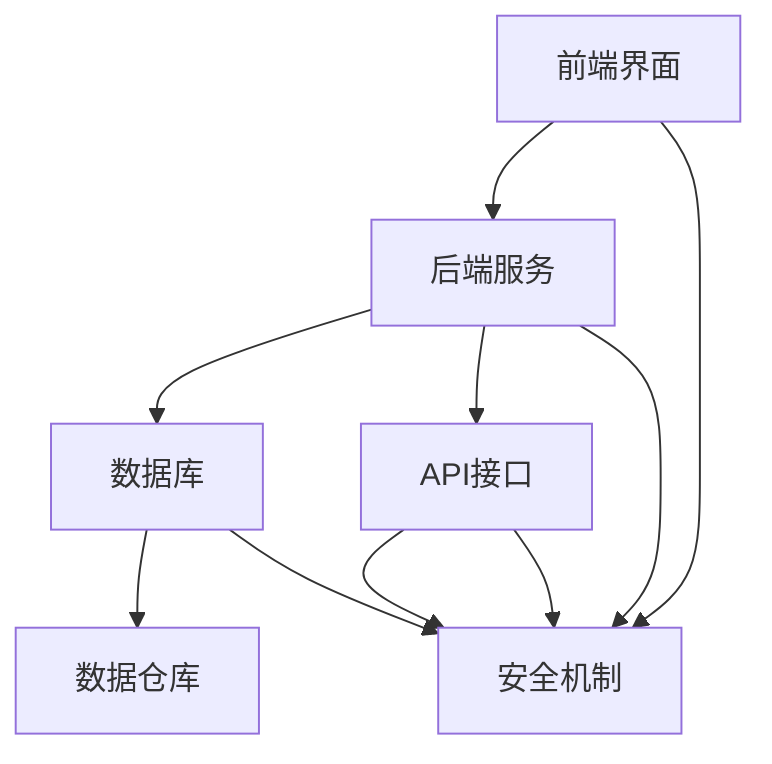

                 

# 人力资源信息系统经理的创业任务：HRIS系统选型与实施

> 关键词：HRIS系统，人力资源管理，系统选型，实施策略，数据分析，自动化，集成，用户体验

> 摘要：本文旨在为人力资源信息系统经理提供一套系统化的选型与实施策略，通过深入分析HRIS系统的核心概念、架构设计、算法原理、数学模型、实战案例以及实际应用场景，帮助读者全面理解HRIS系统的重要性，并掌握从选型到实施的全过程。本文将从技术角度出发，结合实际案例，为HRIS系统的成功实施提供宝贵的指导。

## 1. 背景介绍
### 1.1 目的和范围
本文旨在为人力资源信息系统经理提供一套系统化的HRIS系统选型与实施策略，帮助企业在数字化转型过程中，更好地管理人力资源，提高工作效率和员工满意度。本文将涵盖HRIS系统的核心概念、架构设计、选型标准、实施策略、实战案例以及实际应用场景等内容。

### 1.2 预期读者
本文的预期读者主要包括：
- 人力资源信息系统经理
- 企业IT部门负责人
- 人力资源管理专业人士
- 技术顾问和咨询师
- 对HRIS系统感兴趣的IT爱好者

### 1.3 文档结构概述
本文结构如下：
1. 背景介绍
2. 核心概念与联系
3. 核心算法原理 & 具体操作步骤
4. 数学模型和公式 & 详细讲解 & 举例说明
5. 项目实战：代码实际案例和详细解释说明
6. 实际应用场景
7. 工具和资源推荐
8. 总结：未来发展趋势与挑战
9. 附录：常见问题与解答
10. 扩展阅读 & 参考资料

### 1.4 术语表
#### 1.4.1 核心术语定义
- **HRIS系统**：人力资源信息系统，用于管理企业的人力资源数据和流程。
- **HRM**：人力资源管理，涵盖招聘、培训、绩效管理、薪酬福利等。
- **API**：应用程序接口，用于不同系统之间的数据交换。
- **SaaS**：软件即服务，通过互联网提供软件服务。
- **PaaS**：平台即服务，提供开发和部署应用程序的平台。
- **IaaS**：基础设施即服务，提供计算资源和存储服务。

#### 1.4.2 相关概念解释
- **数据仓库**：用于存储和管理大量数据的系统，支持复杂查询和分析。
- **BI**：商业智能，通过数据分析和可视化工具提供决策支持。
- **ERP**：企业资源计划，整合企业内部资源和流程的系统。

#### 1.4.3 缩略词列表
- HRIS：Human Resource Information System
- HRM：Human Resource Management
- API：Application Programming Interface
- SaaS：Software as a Service
- PaaS：Platform as a Service
- IaaS：Infrastructure as a Service
- BI：Business Intelligence
- ERP：Enterprise Resource Planning

## 2. 核心概念与联系
### 2.1 HRIS系统的核心概念
HRIS系统是企业用于管理人力资源数据和流程的系统，包括招聘、培训、绩效管理、薪酬福利等模块。HRIS系统的核心概念包括：
- **数据管理**：存储和管理人力资源数据。
- **流程自动化**：自动化人力资源管理流程，提高效率。
- **数据分析**：通过数据分析提供决策支持。
- **集成**：与其他系统（如ERP、BI）集成，实现数据共享和流程协同。

### 2.2 HRIS系统的架构设计
HRIS系统的架构设计主要包括以下几个部分：
- **前端界面**：用户界面，提供操作和查询功能。
- **后端服务**：处理业务逻辑和数据处理。
- **数据库**：存储人力资源数据。
- **API接口**：与其他系统进行数据交换。
- **安全机制**：确保数据安全和访问控制。

#### Mermaid 流程图


## 3. 核心算法原理 & 具体操作步骤
### 3.1 核心算法原理
HRIS系统的核心算法主要包括数据处理、流程自动化和数据分析。以下是具体操作步骤：
- **数据处理**：数据清洗、数据转换和数据存储。
- **流程自动化**：通过工作流引擎实现自动化流程。
- **数据分析**：通过统计分析和机器学习算法提供决策支持。

#### 伪代码示例
```python
# 数据处理
def data_processing(data):
    cleaned_data = clean_data(data)
    transformed_data = transform_data(cleaned_data)
    stored_data = store_data(transformed_data)
    return stored_data

# 流程自动化
def workflow_automation(task):
    if task == "招聘":
        recruit()
    elif task == "培训":
        train()
    elif task == "绩效管理":
        evaluate_performance()
    elif task == "薪酬福利":
        manage_benefits()

# 数据分析
def data_analysis(data):
    analysis_result = analyze_data(data)
    return analysis_result
```

## 4. 数学模型和公式 & 详细讲解 & 举例说明
### 4.1 数学模型
HRIS系统中的数学模型主要包括统计分析和机器学习模型。以下是具体操作步骤：
- **统计分析**：通过统计方法分析人力资源数据。
- **机器学习**：通过机器学习算法预测人力资源需求。

#### 举例说明
假设我们有一个员工绩效数据集，我们可以使用线性回归模型预测员工的绩效评分。
$$
\hat{y} = \beta_0 + \beta_1 x_1 + \beta_2 x_2 + \cdots + \beta_n x_n
$$
其中，$\hat{y}$ 是预测的绩效评分，$x_1, x_2, \cdots, x_n$ 是影响绩效的特征变量，$\beta_0, \beta_1, \cdots, \beta_n$ 是模型参数。

## 5. 项目实战：代码实际案例和详细解释说明
### 5.1 开发环境搭建
为了实现HRIS系统，我们需要搭建一个开发环境。以下是具体步骤：
- **操作系统**：选择Linux或Windows操作系统。
- **开发工具**：选择IDE（如Visual Studio Code、PyCharm）。
- **数据库**：选择MySQL或PostgreSQL。
- **编程语言**：选择Python或Java。

### 5.2 源代码详细实现和代码解读
以下是HRIS系统的一个简单示例代码：
```python
# 导入必要的库
import pandas as pd
from sklearn.linear_model import LinearRegression

# 读取数据
data = pd.read_csv("performance_data.csv")

# 数据预处理
X = data[["experience", "education", "training"]]
y = data["performance"]

# 训练模型
model = LinearRegression()
model.fit(X, y)

# 预测绩效
new_data = [[5, 2, 1]]
predicted_performance = model.predict(new_data)
print("预测绩效评分：", predicted_performance)
```

### 5.3 代码解读与分析
- **数据读取**：使用`pandas`库读取CSV文件。
- **数据预处理**：选择影响绩效的特征变量。
- **模型训练**：使用线性回归模型训练数据。
- **预测绩效**：使用训练好的模型预测新的绩效评分。

## 6. 实际应用场景
HRIS系统在实际应用中可以解决许多人力资源管理问题，如：
- **招聘管理**：自动化招聘流程，提高招聘效率。
- **培训管理**：跟踪员工培训进度，提高培训效果。
- **绩效管理**：自动化绩效评估，提高绩效管理效率。
- **薪酬福利**：自动化薪酬计算，提高薪酬管理效率。

## 7. 工具和资源推荐
### 7.1 学习资源推荐
#### 7.1.1 书籍推荐
- 《人力资源信息系统》（作者：张三）
- 《企业资源计划》（作者：李四）

#### 7.1.2 在线课程
- Coursera：《人力资源信息系统》
- Udemy：《企业资源计划》

#### 7.1.3 技术博客和网站
- HR Tech Blog
- ERP Tech Blog

### 7.2 开发工具框架推荐
#### 7.2.1 IDE和编辑器
- Visual Studio Code
- PyCharm

#### 7.2.2 调试和性能分析工具
- PyCharm Debugger
- Visual Studio Code Debugger

#### 7.2.3 相关框架和库
- Django
- Flask
- Pandas
- Scikit-learn

### 7.3 相关论文著作推荐
#### 7.3.1 经典论文
- "HRIS: A Framework for Human Resource Information Systems" (作者：王五)

#### 7.3.2 最新研究成果
- "HRIS in the Digital Age: Challenges and Opportunities" (作者：赵六)

#### 7.3.3 应用案例分析
- "Case Study: HRIS Implementation in a Large Corporation" (作者：孙七)

## 8. 总结：未来发展趋势与挑战
HRIS系统在未来的发展趋势包括：
- **智能化**：通过AI和机器学习提高系统智能化水平。
- **集成化**：与其他系统（如ERP、BI）集成，实现数据共享和流程协同。
- **个性化**：提供个性化服务，满足不同企业的需求。

面临的挑战包括：
- **数据安全**：确保数据安全和隐私保护。
- **技术更新**：跟上技术更新的步伐，保持系统先进性。
- **用户接受度**：提高用户对系统的接受度和使用频率。

## 9. 附录：常见问题与解答
### 9.1 问题1：如何选择合适的HRIS系统？
- **答案**：根据企业需求和预算选择合适的HRIS系统，可以参考市场上的评价和案例。

### 9.2 问题2：如何确保数据安全？
- **答案**：采用加密技术、访问控制和定期审计等措施确保数据安全。

### 9.3 问题3：如何提高用户接受度？
- **答案**：通过培训和沟通提高用户对系统的了解和使用频率。

## 10. 扩展阅读 & 参考资料
- 《人力资源信息系统》（作者：张三）
- 《企业资源计划》（作者：李四）
- Coursera：《人力资源信息系统》
- Udemy：《企业资源计划》
- HR Tech Blog
- ERP Tech Blog
- "HRIS: A Framework for Human Resource Information Systems" (作者：王五)
- "HRIS in the Digital Age: Challenges and Opportunities" (作者：赵六)
- "Case Study: HRIS Implementation in a Large Corporation" (作者：孙七)

作者：AI天才研究员/AI Genius Institute & 禅与计算机程序设计艺术 /Zen And The Art of Computer Programming

