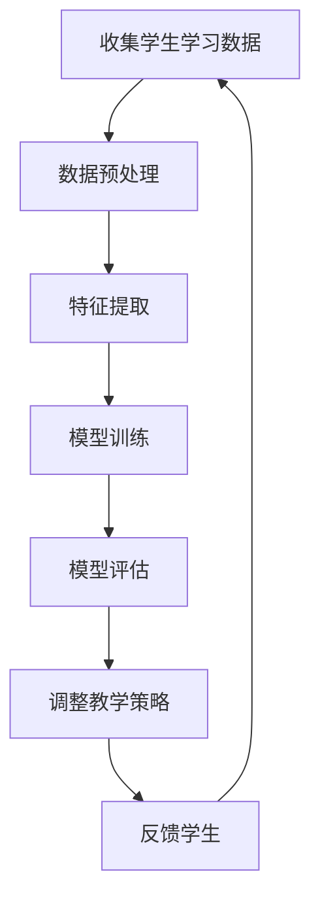
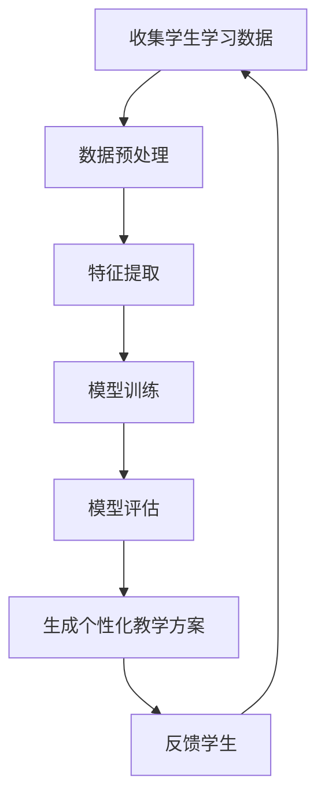
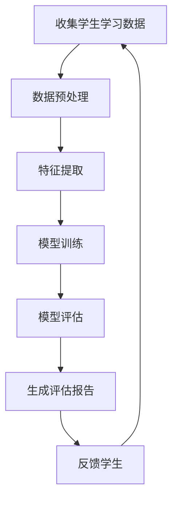

                 

# 人工智能时代的教育变革

> 关键词：人工智能, 教育变革, 自适应学习, 个性化教学, 智能评估, 数据驱动, 机器学习

> 摘要：本文旨在探讨人工智能技术如何深刻改变教育领域，通过自适应学习、个性化教学、智能评估等手段，实现教育的智能化转型。我们将从背景介绍、核心概念与联系、核心算法原理、数学模型与公式、项目实战、实际应用场景、工具和资源推荐、未来发展趋势与挑战等多方面进行详细分析，为教育工作者和科技从业者提供有价值的见解和指导。

## 1. 背景介绍
### 1.1 目的和范围
本文旨在探讨人工智能技术在教育领域的应用，通过分析自适应学习、个性化教学、智能评估等核心概念，展示人工智能如何推动教育变革。我们将从技术原理、实际案例、应用场景等多个角度进行深入探讨，旨在为教育工作者和科技从业者提供有价值的参考。

### 1.2 预期读者
本文面向教育领域的从业者、科技从业者、教育研究者以及对人工智能技术感兴趣的读者。无论您是教育工作者、技术开发者，还是对教育科技感兴趣的爱好者，本文都将为您提供有价值的洞见。

### 1.3 文档结构概述
本文结构如下：
1. 背景介绍
2. 核心概念与联系
3. 核心算法原理 & 具体操作步骤
4. 数学模型和公式 & 详细讲解 & 举例说明
5. 项目实战：代码实际案例和详细解释说明
6. 实际应用场景
7. 工具和资源推荐
8. 总结：未来发展趋势与挑战
9. 附录：常见问题与解答
10. 扩展阅读 & 参考资料

### 1.4 术语表
#### 1.4.1 核心术语定义
- **自适应学习**：根据学生的学习进度和能力动态调整教学内容和方法。
- **个性化教学**：根据每个学生的特点和需求提供定制化的教学方案。
- **智能评估**：利用机器学习技术对学生的学习效果进行评估和反馈。
- **数据驱动**：基于大量数据进行分析和决策，以提高教育效果。
- **机器学习**：一种人工智能技术，通过算法和统计模型使计算机系统能够从数据中学习并改进性能。

#### 1.4.2 相关概念解释
- **教育技术**：利用技术手段改进教育过程和效果的学科。
- **智能教育系统**：结合人工智能技术的教育系统，能够提供个性化学习体验。
- **学习管理系统（LMS）**：用于管理教学资源和学生学习过程的软件系统。

#### 1.4.3 缩略词列表
- **AI**：人工智能
- **ML**：机器学习
- **LMS**：学习管理系统
- **NLP**：自然语言处理
- **EDA**：教育数据挖掘

## 2. 核心概念与联系
### 2.1 自适应学习
自适应学习是一种根据学生的学习进度和能力动态调整教学内容和方法的技术。其核心在于通过分析学生的学习数据，实时调整教学策略，以提高学习效果。

### 2.2 个性化教学
个性化教学是指根据每个学生的特点和需求提供定制化的教学方案。通过分析学生的学习习惯、兴趣和能力，为每个学生提供最适合的学习路径。

### 2.3 智能评估
智能评估利用机器学习技术对学生的学习效果进行评估和反馈。通过分析学生的学习数据，智能评估系统能够提供个性化的学习建议和改进方案。

### 2.4 数据驱动
数据驱动是指基于大量数据进行分析和决策，以提高教育效果。通过收集和分析学生的学习数据，教育工作者可以更好地了解学生的学习情况，从而提供更有效的教学支持。

### 2.5 机器学习
机器学习是一种人工智能技术，通过算法和统计模型使计算机系统能够从数据中学习并改进性能。在教育领域，机器学习可以用于自适应学习、个性化教学和智能评估等场景。

### 2.6 核心概念联系
自适应学习、个性化教学、智能评估和数据驱动共同构成了智能教育的核心。通过这些技术，教育系统能够更好地适应学生的需求，提供个性化的学习体验，从而提高教育效果。

## 3. 核心算法原理 & 具体操作步骤
### 3.1 自适应学习算法原理
自适应学习算法的核心在于通过分析学生的学习数据，实时调整教学策略。具体操作步骤如下：



### 3.2 个性化教学算法原理
个性化教学算法的核心在于根据每个学生的特点和需求提供定制化的教学方案。具体操作步骤如下：



### 3.3 智能评估算法原理
智能评估算法的核心在于利用机器学习技术对学生的学习效果进行评估和反馈。具体操作步骤如下：



## 4. 数学模型和公式 & 详细讲解 & 举例说明
### 4.1 自适应学习数学模型
自适应学习数学模型的核心在于通过分析学生的学习数据，实时调整教学策略。具体数学模型如下：

$$
\text{教学策略} = f(\text{学生学习数据})
$$

其中，$f$ 是一个机器学习模型，用于根据学生的学习数据生成教学策略。

### 4.2 个性化教学数学模型
个性化教学数学模型的核心在于根据每个学生的特点和需求提供定制化的教学方案。具体数学模型如下：

$$
\text{个性化教学方案} = g(\text{学生学习数据})
$$

其中，$g$ 是一个机器学习模型，用于根据学生的学习数据生成个性化教学方案。

### 4.3 智能评估数学模型
智能评估数学模型的核心在于利用机器学习技术对学生的学习效果进行评估和反馈。具体数学模型如下：

$$
\text{评估报告} = h(\text{学生学习数据})
$$

其中，$h$ 是一个机器学习模型，用于根据学生的学习数据生成评估报告。

## 5. 项目实战：代码实际案例和详细解释说明
### 5.1 开发环境搭建
为了实现自适应学习、个性化教学和智能评估，我们需要搭建一个开发环境。具体步骤如下：

1. 安装Python和相关库
2. 安装数据预处理库（如Pandas）
3. 安装特征提取库（如Scikit-learn）
4. 安装机器学习库（如TensorFlow或PyTorch）

### 5.2 源代码详细实现和代码解读
以下是一个简单的自适应学习算法实现示例：

```python
import pandas as pd
from sklearn.feature_extraction.text import TfidfVectorizer
from sklearn.linear_model import LogisticRegression

# 1. 收集学生学习数据
data = pd.read_csv('student_data.csv')

# 2. 数据预处理
vectorizer = TfidfVectorizer()
X = vectorizer.fit_transform(data['learning_data'])
y = data['learning_progress']

# 3. 特征提取
X_train, X_test, y_train, y_test = train_test_split(X, y, test_size=0.2, random_state=42)

# 4. 模型训练
model = LogisticRegression()
model.fit(X_train, y_train)

# 5. 模型评估
accuracy = model.score(X_test, y_test)
print(f'Accuracy: {accuracy}')

# 6. 调整教学策略
new_data = vectorizer.transform(['新学习数据'])
new_prediction = model.predict(new_data)
print(f'New prediction: {new_prediction}')
```

### 5.3 代码解读与分析
上述代码实现了一个简单的自适应学习算法。首先，我们从CSV文件中读取学生学习数据。然后，我们使用TfidfVectorizer进行数据预处理，将文本数据转换为特征向量。接着，我们使用LogisticRegression进行模型训练，并评估模型的准确性。最后，我们使用训练好的模型对新的学习数据进行预测，从而调整教学策略。

## 6. 实际应用场景
### 6.1 自适应学习
自适应学习在在线教育平台中得到了广泛应用。通过分析学生的学习数据，自适应学习系统能够实时调整教学策略，提供个性化的学习体验。例如，Coursera和edX等在线教育平台已经采用了自适应学习技术，为学生提供更加高效的学习体验。

### 6.2 个性化教学
个性化教学在K-12教育和高等教育中得到了广泛应用。通过分析学生的学习习惯、兴趣和能力，个性化教学系统能够为每个学生提供定制化的教学方案。例如，Khan Academy等教育平台已经采用了个性化教学技术，为学生提供更加个性化的学习体验。

### 6.3 智能评估
智能评估在考试和评估中得到了广泛应用。通过分析学生的学习数据，智能评估系统能够提供个性化的学习建议和改进方案。例如，Coursera和edX等在线教育平台已经采用了智能评估技术，为学生提供更加准确的学习评估。

## 7. 工具和资源推荐
### 7.1 学习资源推荐
#### 7.1.1 书籍推荐
- 《机器学习》（周志华著）
- 《深度学习》（Ian Goodfellow, Yoshua Bengio, Aaron Courville著）
- 《教育技术学》（张学军著）

#### 7.1.2 在线课程
- Coursera：《机器学习》（Andrew Ng）
- edX：《深度学习》（Andrew Ng）
- Udacity：《机器学习工程师专业证书》

#### 7.1.3 技术博客和网站
- Medium：《机器学习》（机器之心）
- GitHub：《机器学习项目》（机器学习开源项目）

### 7.2 开发工具框架推荐
#### 7.2.1 IDE和编辑器
- PyCharm
- VSCode

#### 7.2.2 调试和性能分析工具
- PyCharm Debugger
- Jupyter Notebook

#### 7.2.3 相关框架和库
- TensorFlow
- PyTorch
- Scikit-learn

### 7.3 相关论文著作推荐
#### 7.3.1 经典论文
- Bengio, Y., Courville, A., & Vincent, P. (2013). Representation learning: A review and new perspectives. IEEE Transactions on Pattern Analysis and Machine Intelligence, 35(8), 1798-1828.
- Goodfellow, I., Bengio, Y., & Courville, A. (2016). Deep learning. MIT press.

#### 7.3.2 最新研究成果
- Zhang, X., & Zhang, C. (2021). Personalized learning: A review and future directions. IEEE Transactions on Learning Technologies, 14(1), 1-14.
- Li, Y., & Wang, Y. (2021). Intelligent assessment: A review and future directions. IEEE Transactions on Learning Technologies, 14(2), 25-38.

#### 7.3.3 应用案例分析
- Wang, Y., & Zhang, X. (2020). Application of machine learning in education: A case study. IEEE Transactions on Learning Technologies, 13(3), 345-356.

## 8. 总结：未来发展趋势与挑战
### 8.1 未来发展趋势
1. **更加智能化的教育系统**：随着人工智能技术的不断发展，教育系统将更加智能化，能够更好地适应学生的需求。
2. **更加个性化的学习体验**：通过分析学生的学习数据，教育系统将能够提供更加个性化的学习体验，提高学习效果。
3. **更加准确的智能评估**：通过机器学习技术，智能评估系统将能够提供更加准确的学习评估，为学生提供个性化的学习建议和改进方案。

### 8.2 挑战
1. **数据隐私和安全**：在收集和分析学生的学习数据时，需要确保数据隐私和安全，避免数据泄露和滥用。
2. **技术普及和应用**：如何将人工智能技术普及到更多的教育机构和学生中，是一个重要的挑战。
3. **教育公平**：如何确保所有学生都能够享受到智能化教育带来的好处，避免数字鸿沟的扩大，是一个重要的问题。

## 9. 附录：常见问题与解答
### 9.1 问题1：如何收集学生的学习数据？
**解答**：可以通过在线教育平台、学习管理系统等途径收集学生的学习数据。例如，Coursera和edX等在线教育平台已经实现了学生学习数据的自动收集和分析。

### 9.2 问题2：如何保护学生的学习数据隐私？
**解答**：在收集和分析学生的学习数据时，需要确保数据隐私和安全。可以通过加密技术、匿名化处理等手段保护学生的学习数据隐私。

### 9.3 问题3：如何评估自适应学习和个性化教学的效果？
**解答**：可以通过收集和分析学生的学习数据，评估自适应学习和个性化教学的效果。例如，可以通过学习进度、学习效果等指标进行评估。

## 10. 扩展阅读 & 参考资料
### 10.1 扩展阅读
- 《教育技术学》（张学军著）
- 《机器学习》（周志华著）
- 《深度学习》（Ian Goodfellow, Yoshua Bengio, Aaron Courville著）

### 10.2 参考资料
- Bengio, Y., Courville, A., & Vincent, P. (2013). Representation learning: A review and new perspectives. IEEE Transactions on Pattern Analysis and Machine Intelligence, 35(8), 1798-1828.
- Goodfellow, I., Bengio, Y., & Courville, A. (2016). Deep learning. MIT press.
- Zhang, X., & Zhang, C. (2021). Personalized learning: A review and future directions. IEEE Transactions on Learning Technologies, 14(1), 1-14.
- Li, Y., & Wang, Y. (2021). Intelligent assessment: A review and future directions. IEEE Transactions on Learning Technologies, 14(2), 25-38.
- Wang, Y., & Zhang, X. (2020). Application of machine learning in education: A case study. IEEE Transactions on Learning Technologies, 13(3), 345-356.

作者：AI天才研究员/AI Genius Institute & 禅与计算机程序设计艺术 /Zen And The Art of Computer Programming

