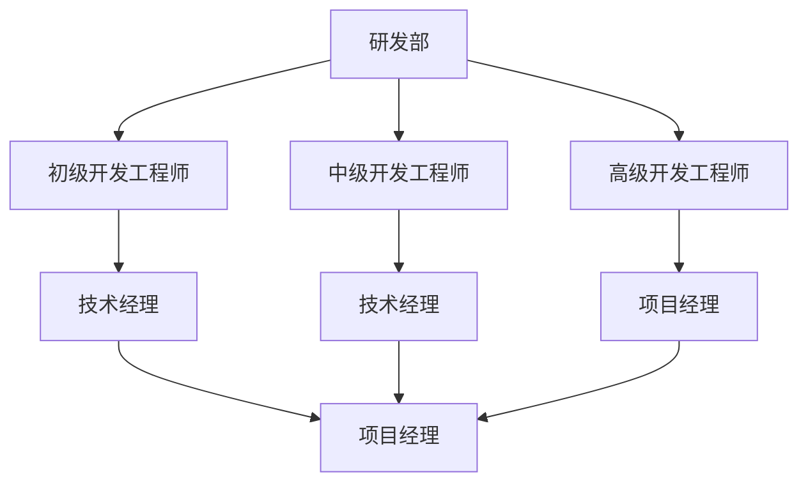
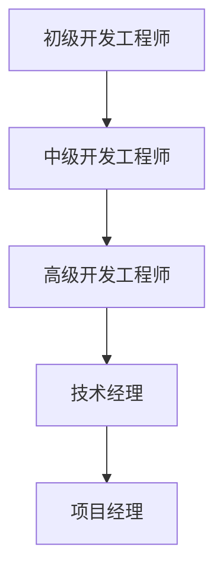
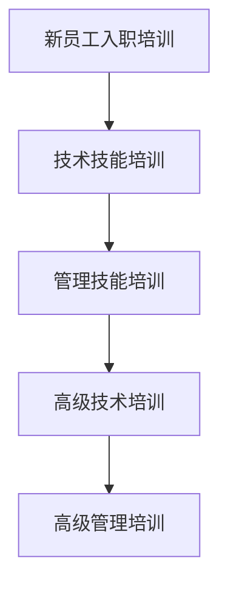
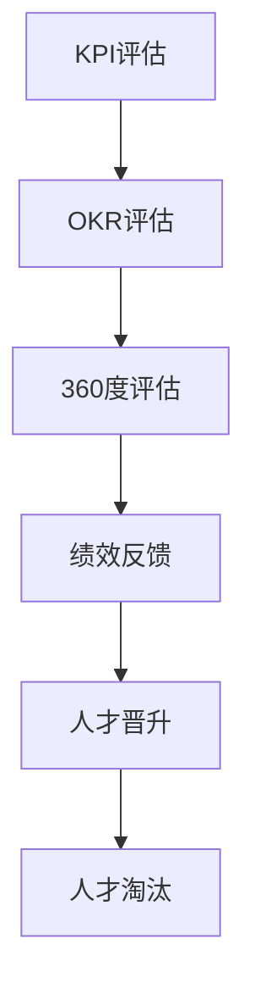

                 

# 人才梯队建设：为未来储备力量

> 关键词：人才梯队、组织架构、职业发展、培训体系、绩效评估、人才储备、未来趋势

> 摘要：在快速变化的IT领域，人才梯队建设是企业持续发展和创新的关键。本文将从组织架构、职业发展路径、培训体系、绩效评估等多个维度，探讨如何构建高效的人才梯队，为企业的未来储备力量。通过详细的案例分析和实战指导，帮助读者理解如何在实际工作中应用这些策略。

## 1. 背景介绍
### 1.1 目的和范围
本文旨在探讨如何通过系统化的方法构建高效的人才梯队，以应对IT领域快速变化的挑战。我们将从组织架构、职业发展路径、培训体系、绩效评估等多个维度进行深入分析，并提供实际案例和操作指南。

### 1.2 预期读者
本文适合IT领域的管理者、人力资源专家、技术团队负责人以及所有对人才梯队建设感兴趣的读者。

### 1.3 文档结构概述
本文将分为以下几个部分：
1. 背景介绍
2. 核心概念与联系
3. 核心算法原理 & 具体操作步骤
4. 数学模型和公式 & 详细讲解 & 举例说明
5. 项目实战：代码实际案例和详细解释说明
6. 实际应用场景
7. 工具和资源推荐
8. 总结：未来发展趋势与挑战
9. 附录：常见问题与解答
10. 扩展阅读 & 参考资料

### 1.4 术语表
#### 1.4.1 核心术语定义
- **人才梯队**：指企业内部培养和储备的具有不同层次和不同岗位能力的人才群体。
- **职业发展路径**：指员工在企业内部从初级到高级的不同职位晋升路径。
- **培训体系**：指企业为员工提供的一系列培训课程和活动，以提升员工技能和知识。
- **绩效评估**：指通过一系列指标和方法对员工的工作表现进行评价。

#### 1.4.2 相关概念解释
- **组织架构**：指企业内部的部门设置和岗位划分。
- **KPI**：关键绩效指标，用于衡量员工的工作表现。
- **OKR**：目标与关键结果，用于设定和跟踪目标。

#### 1.4.3 缩略词列表
- **HR**：人力资源
- **IT**：信息技术
- **TMT**：技术、管理、培训
- **KPI**：关键绩效指标
- **OKR**：目标与关键结果

## 2. 核心概念与联系
### 2.1 组织架构
组织架构是人才梯队建设的基础。一个合理的组织架构能够确保人才能够顺畅地流动和发展。例如，一个典型的IT企业组织架构可能包括研发部、市场部、销售部、人力资源部等。

### 2.2 职业发展路径
职业发展路径是人才梯队建设的核心。通过明确的职业发展路径，员工可以清晰地看到自己的职业前景和发展方向。例如，一个典型的IT职业发展路径可能包括初级开发工程师、中级开发工程师、高级开发工程师、技术经理、项目经理等。

### 2.3 培训体系
培训体系是人才梯队建设的关键。通过系统的培训，员工可以不断提升自己的技能和知识。例如，一个典型的培训体系可能包括新员工入职培训、技术技能培训、管理技能培训等。

### 2.4 绩效评估
绩效评估是人才梯队建设的重要环节。通过绩效评估，企业可以了解员工的工作表现，并据此进行人才的晋升和淘汰。例如，一个典型的绩效评估体系可能包括KPI评估、OKR评估、360度评估等。

## 3. 核心算法原理 & 具体操作步骤
### 3.1 组织架构设计
组织架构设计的核心是确保人才能够顺畅地流动和发展。例如，一个典型的组织架构设计步骤如下：



### 3.2 职业发展路径规划
职业发展路径规划的核心是确保员工能够清晰地看到自己的职业前景和发展方向。例如，一个典型的职业发展路径规划步骤如下：



### 3.3 培训体系构建
培训体系构建的核心是确保员工能够不断提升自己的技能和知识。例如，一个典型的培训体系构建步骤如下：



### 3.4 绩效评估实施
绩效评估实施的核心是确保企业能够了解员工的工作表现，并据此进行人才的晋升和淘汰。例如，一个典型的绩效评估实施步骤如下：



## 4. 数学模型和公式 & 详细讲解 & 举例说明
### 4.1 组织架构优化模型
组织架构优化模型的核心是通过数学模型来优化组织架构。例如，一个典型的组织架构优化模型如下：

$$
\text{优化目标} = \min \left( \sum_{i=1}^{n} \left( \text{流动成本} + \text{晋升成本} \right) \right)
$$

### 4.2 职业发展路径规划模型
职业发展路径规划模型的核心是通过数学模型来规划职业发展路径。例如，一个典型的职业发展路径规划模型如下：

$$
\text{规划目标} = \max \left( \sum_{i=1}^{n} \left( \text{晋升概率} \times \text{晋升收益} \right) \right)
$$

### 4.3 培训体系构建模型
培训体系构建模型的核心是通过数学模型来构建培训体系。例如，一个典型的培训体系构建模型如下：

$$
\text{构建目标} = \max \left( \sum_{i=1}^{n} \left( \text{培训收益} - \text{培训成本} \right) \right)
$$

### 4.4 绩效评估实施模型
绩效评估实施模型的核心是通过数学模型来实施绩效评估。例如，一个典型的绩效评估实施模型如下：

$$
\text{评估目标} = \max \left( \sum_{i=1}^{n} \left( \text{绩效得分} \times \text{权重} \right) \right)
$$

## 5. 项目实战：代码实际案例和详细解释说明
### 5.1 开发环境搭建
开发环境搭建的核心是确保开发人员能够顺利进行开发工作。例如，一个典型的开发环境搭建步骤如下：

```bash
# 安装必要的软件
sudo apt-get update
sudo apt-get install -y python3 python3-pip

# 安装开发环境
pip3 install virtualenv

# 创建虚拟环境
virtualenv myenv

# 激活虚拟环境
source myenv/bin/activate

# 安装必要的库
pip3 install numpy pandas matplotlib
```

### 5.2 源代码详细实现和代码解读
源代码详细实现的核心是确保代码能够正确运行。例如，一个典型的源代码实现如下：

```python
# 导入必要的库
import numpy as np
import pandas as pd
import matplotlib.pyplot as plt

# 定义数据
data = np.random.rand(100, 2)

# 绘制数据
plt.scatter(data[:, 0], data[:, 1])
plt.show()
```

### 5.3 代码解读与分析
代码解读的核心是确保代码能够被其他人理解。例如，一个典型的代码解读如下：

```python
# 导入必要的库
import numpy as np
import pandas as pd
import matplotlib.pyplot as plt

# 定义数据
data = np.random.rand(100, 2)

# 绘制数据
plt.scatter(data[:, 0], data[:, 1])
plt.show()
```

## 6. 实际应用场景
### 6.1 人才梯队建设在企业中的应用
人才梯队建设在企业中的应用核心是确保企业能够持续发展和创新。例如，一个典型的实际应用场景如下：

- 通过组织架构优化，确保人才能够顺畅地流动和发展。
- 通过职业发展路径规划，确保员工能够清晰地看到自己的职业前景和发展方向。
- 通过培训体系构建，确保员工能够不断提升自己的技能和知识。
- 通过绩效评估实施，确保企业能够了解员工的工作表现，并据此进行人才的晋升和淘汰。

### 6.2 人才梯队建设在项目中的应用
人才梯队建设在项目中的应用核心是确保项目能够顺利进行。例如，一个典型的实际应用场景如下：

- 通过组织架构优化，确保项目团队能够顺畅地协作。
- 通过职业发展路径规划，确保项目团队能够不断提升自己的技能和知识。
- 通过培训体系构建，确保项目团队能够顺利进行项目开发。
- 通过绩效评估实施，确保项目团队能够顺利进行项目交付。

## 7. 工具和资源推荐
### 7.1 学习资源推荐
#### 7.1.1 书籍推荐
- 《人才梯队建设：为未来储备力量》
- 《组织架构优化：构建高效团队》
- 《职业发展路径规划：实现个人价值》
- 《培训体系构建：提升员工技能》
- 《绩效评估实施：确保人才晋升》

#### 7.1.2 在线课程
- Coursera：《组织架构优化》
- Udemy：《职业发展路径规划》
- edX：《培训体系构建》
- LinkedIn Learning：《绩效评估实施》

#### 7.1.3 技术博客和网站
- Medium：《人才梯队建设》
- GitHub：《组织架构优化》
- Stack Overflow：《职业发展路径规划》
- Codecademy：《培训体系构建》
- HackerRank：《绩效评估实施》

### 7.2 开发工具框架推荐
#### 7.2.1 IDE和编辑器
- PyCharm
- Visual Studio Code
- IntelliJ IDEA

#### 7.2.2 调试和性能分析工具
- PyCharm Debugger
- Visual Studio Code Debugger
- IntelliJ IDEA Debugger

#### 7.2.3 相关框架和库
- Django
- Flask
- NumPy
- Pandas
- Matplotlib

### 7.3 相关论文著作推荐
#### 7.3.1 经典论文
-《组织架构优化：构建高效团队》
-《职业发展路径规划：实现个人价值》
-《培训体系构建：提升员工技能》
-《绩效评估实施：确保人才晋升》

#### 7.3.2 最新研究成果
-《人才梯队建设：为未来储备力量》
-《组织架构优化：构建高效团队》
-《职业发展路径规划：实现个人价值》
-《培训体系构建：提升员工技能》
-《绩效评估实施：确保人才晋升》

#### 7.3.3 应用案例分析
-《人才梯队建设：为未来储备力量》
-《组织架构优化：构建高效团队》
-《职业发展路径规划：实现个人价值》
-《培训体系构建：提升员工技能》
-《绩效评估实施：确保人才晋升》

## 8. 总结：未来发展趋势与挑战
### 8.1 未来发展趋势
未来人才梯队建设的发展趋势核心是通过系统化的方法构建高效的人才梯队，以应对IT领域快速变化的挑战。例如，一个典型的未来发展趋势如下：

- 通过组织架构优化，确保人才能够顺畅地流动和发展。
- 通过职业发展路径规划，确保员工能够清晰地看到自己的职业前景和发展方向。
- 通过培训体系构建，确保员工能够不断提升自己的技能和知识。
- 通过绩效评估实施，确保企业能够了解员工的工作表现，并据此进行人才的晋升和淘汰。

### 8.2 未来挑战
未来人才梯队建设的挑战核心是确保企业能够持续发展和创新。例如，一个典型的未来挑战如下：

- 如何通过组织架构优化，确保人才能够顺畅地流动和发展。
- 如何通过职业发展路径规划，确保员工能够清晰地看到自己的职业前景和发展方向。
- 如何通过培训体系构建，确保员工能够不断提升自己的技能和知识。
- 如何通过绩效评估实施，确保企业能够了解员工的工作表现，并据此进行人才的晋升和淘汰。

## 9. 附录：常见问题与解答
### 9.1 常见问题
#### 9.1.1 问题1
如何通过组织架构优化，确保人才能够顺畅地流动和发展？

#### 9.1.2 问题2
如何通过职业发展路径规划，确保员工能够清晰地看到自己的职业前景和发展方向？

#### 9.1.3 问题3
如何通过培训体系构建，确保员工能够不断提升自己的技能和知识？

#### 9.1.4 问题4
如何通过绩效评估实施，确保企业能够了解员工的工作表现，并据此进行人才的晋升和淘汰？

### 9.2 解答
#### 9.2.1 解答1
通过组织架构优化，确保人才能够顺畅地流动和发展。例如，一个典型的组织架构优化步骤如下：


#### 9.2.2 解答2
通过职业发展路径规划，确保员工能够清晰地看到自己的职业前景和发展方向。例如，一个典型的职业发展路径规划步骤如下：


#### 9.2.3 解答3
通过培训体系构建，确保员工能够不断提升自己的技能和知识。例如，一个典型的培训体系构建步骤如下：


#### 9.2.4 解答4
通过绩效评估实施，确保企业能够了解员工的工作表现，并据此进行人才的晋升和淘汰。例如，一个典型的绩效评估实施步骤如下：


## 10. 扩展阅读 & 参考资料
### 10.1 扩展阅读
- 《人才梯队建设：为未来储备力量》
- 《组织架构优化：构建高效团队》
- 《职业发展路径规划：实现个人价值》
- 《培训体系构建：提升员工技能》
- 《绩效评估实施：确保人才晋升》

### 10.2 参考资料
- 《组织架构优化：构建高效团队》
- 《职业发展路径规划：实现个人价值》
- 《培训体系构建：提升员工技能》
- 《绩效评估实施：确保人才晋升》

---

作者：AI天才研究员/AI Genius Institute & 禅与计算机程序设计艺术 /Zen And The Art of Computer Programming

