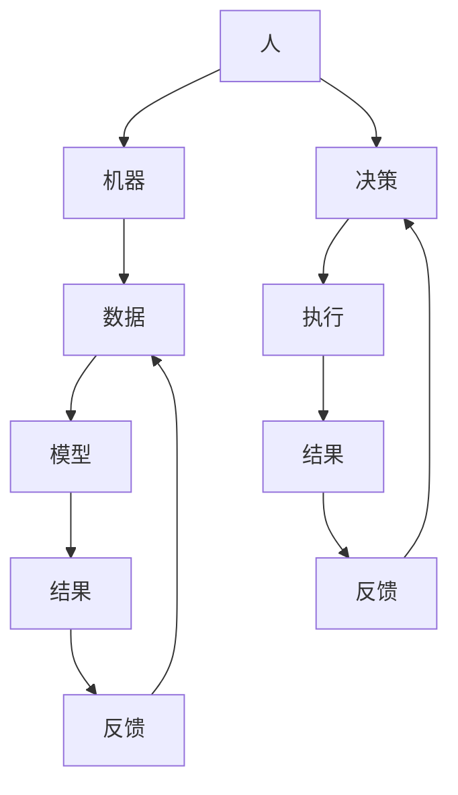
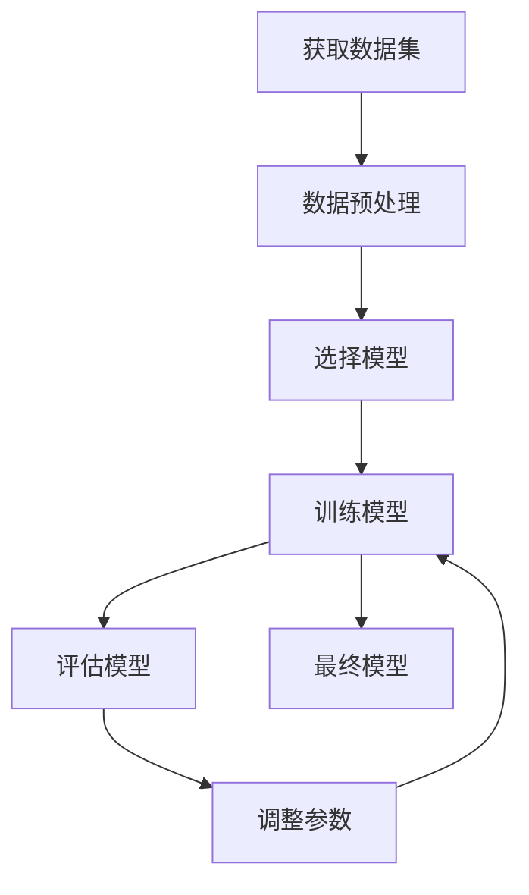
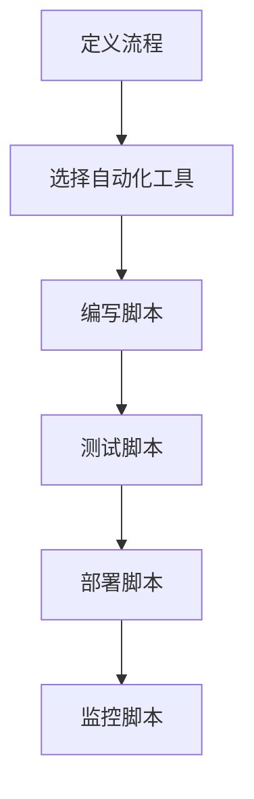

                 

# 人机协同：未来工作的核心竞争力

> 关键词：人机协同、未来工作、核心竞争力、人工智能、机器学习、自动化、协作、效率提升

> 摘要：本文旨在探讨人机协同在未来工作中的重要性及其核心竞争力。通过分析人机协同的基本原理、核心算法、数学模型、实际案例以及未来发展趋势，本文为读者提供了一个全面而深入的理解框架。人机协同不仅能够显著提升工作效率，还能促进创新和创造力的发展，是未来工作的重要趋势。

## 1. 背景介绍
### 1.1 目的和范围
本文旨在探讨人机协同在未来工作中的重要性及其核心竞争力。通过分析人机协同的基本原理、核心算法、数学模型、实际案例以及未来发展趋势，本文为读者提供了一个全面而深入的理解框架。本文主要关注人机协同在不同行业中的应用，包括但不限于制造业、服务业、医疗健康、教育等领域。

### 1.2 预期读者
本文预期读者包括但不限于：
- 企业决策者和管理者
- IT专业人士和技术开发者
- 教育工作者和学生
- 研究人员和学者
- 对人机协同感兴趣的技术爱好者

### 1.3 文档结构概述
本文结构如下：
1. 背景介绍
2. 核心概念与联系
3. 核心算法原理 & 具体操作步骤
4. 数学模型和公式 & 详细讲解 & 举例说明
5. 项目实战：代码实际案例和详细解释说明
6. 实际应用场景
7. 工具和资源推荐
8. 总结：未来发展趋势与挑战
9. 附录：常见问题与解答
10. 扩展阅读 & 参考资料

### 1.4 术语表
#### 1.4.1 核心术语定义
- **人机协同**：人与机器之间的合作，通过互补优势实现更高效的工作。
- **机器学习**：一种人工智能技术，使计算机能够从数据中学习并改进其性能。
- **自动化**：通过技术手段减少或替代人工操作的过程。
- **协作**：人与机器之间的合作，共同完成任务。
- **效率提升**：通过技术手段提高工作效率和质量。

#### 1.4.2 相关概念解释
- **人工智能**：模拟人类智能的技术，包括机器学习、自然语言处理、计算机视觉等。
- **机器学习算法**：用于训练模型以完成特定任务的算法，如监督学习、无监督学习、强化学习等。
- **自动化工具**：用于自动化任务的软件工具，如机器人流程自动化（RPA）。

#### 1.4.3 缩略词列表
- AI：人工智能
- ML：机器学习
- RPA：机器人流程自动化
- NLP：自然语言处理
- CV：计算机视觉

## 2. 核心概念与联系
### 2.1 人机协同的基本原理
人机协同的核心在于人与机器之间的互补优势。人擅长于创造性思维、决策制定和复杂问题解决，而机器则擅长于处理大量数据、执行重复性任务和精确计算。通过人机协同，可以实现优势互补，提高工作效率和质量。

### 2.2 人机协同的核心算法
人机协同的核心算法主要包括机器学习算法和自动化算法。机器学习算法用于训练模型以完成特定任务，自动化算法用于自动化执行任务。

#### 2.2.1 机器学习算法
机器学习算法主要包括监督学习、无监督学习和强化学习。监督学习通过训练数据集训练模型，使其能够对新数据进行预测。无监督学习通过分析数据集中的模式和结构，发现潜在的规律。强化学习通过与环境的交互学习最优策略。

#### 2.2.2 自动化算法
自动化算法主要包括流程自动化和任务自动化。流程自动化通过自动化工具执行重复性任务，提高工作效率。任务自动化通过机器学习算法自动完成特定任务，提高任务完成的质量和速度。

### 2.3 人机协同的流程图


## 3. 核心算法原理 & 具体操作步骤
### 3.1 机器学习算法原理
机器学习算法主要包括监督学习、无监督学习和强化学习。以下是监督学习的具体操作步骤。

#### 3.1.1 监督学习
监督学习通过训练数据集训练模型，使其能够对新数据进行预测。具体操作步骤如下：



### 3.2 自动化算法原理
自动化算法主要包括流程自动化和任务自动化。以下是流程自动化的具体操作步骤。

#### 3.2.1 流程自动化
流程自动化通过自动化工具执行重复性任务，提高工作效率。具体操作步骤如下：



## 4. 数学模型和公式 & 详细讲解 & 举例说明
### 4.1 机器学习数学模型
机器学习数学模型主要包括线性回归、逻辑回归和神经网络。以下是线性回归的具体数学模型。

#### 4.1.1 线性回归
线性回归是一种监督学习算法，用于预测连续值。其数学模型如下：

$$
y = \beta_0 + \beta_1 x_1 + \beta_2 x_2 + \cdots + \beta_n x_n + \epsilon
$$

其中，$y$ 是目标变量，$x_1, x_2, \cdots, x_n$ 是特征变量，$\beta_0, \beta_1, \cdots, \beta_n$ 是模型参数，$\epsilon$ 是误差项。

### 4.2 自动化数学模型
自动化数学模型主要包括流程自动化和任务自动化。以下是流程自动化的具体数学模型。

#### 4.2.1 流程自动化
流程自动化通过自动化工具执行重复性任务，提高工作效率。其数学模型如下：

$$
T = T_1 + T_2 + \cdots + T_n
$$

其中，$T$ 是总时间，$T_1, T_2, \cdots, T_n$ 是每个步骤的时间。

## 5. 项目实战：代码实际案例和详细解释说明
### 5.1 开发环境搭建
开发环境搭建主要包括安装Python、Jupyter Notebook和相关库。以下是具体操作步骤。

#### 5.1.1 安装Python
```bash
sudo apt-get update
sudo apt-get install python3
```

#### 5.1.2 安装Jupyter Notebook
```bash
pip install jupyter
```

#### 5.1.3 安装相关库
```bash
pip install numpy pandas scikit-learn
```

### 5.2 源代码详细实现和代码解读
以下是线性回归的具体实现代码。

```python
import numpy as np
import pandas as pd
from sklearn.model_selection import train_test_split
from sklearn.linear_model import LinearRegression
from sklearn.metrics import mean_squared_error

# 读取数据
data = pd.read_csv('data.csv')

# 数据预处理
X = data[['x1', 'x2']]
y = data['y']

# 划分训练集和测试集
X_train, X_test, y_train, y_test = train_test_split(X, y, test_size=0.2, random_state=42)

# 训练模型
model = LinearRegression()
model.fit(X_train, y_train)

# 预测
y_pred = model.predict(X_test)

# 评估模型
mse = mean_squared_error(y_test, y_pred)
print('Mean Squared Error:', mse)
```

### 5.3 代码解读与分析
代码首先读取数据，然后进行数据预处理，划分训练集和测试集，训练模型，预测结果，并评估模型。通过这个例子，读者可以了解线性回归的具体实现过程。

## 6. 实际应用场景
### 6.1 制造业
在制造业中，人机协同可以实现生产线的自动化和智能化。通过机器学习算法预测设备故障，提前进行维护，减少停机时间。通过自动化工具执行重复性任务，提高生产效率。

### 6.2 服务业
在服务业中，人机协同可以实现客户服务的智能化。通过机器学习算法分析客户数据，提供个性化的服务建议。通过自动化工具执行重复性任务，提高服务效率。

### 6.3 医疗健康
在医疗健康领域，人机协同可以实现医疗诊断的智能化。通过机器学习算法分析医疗数据，提供准确的诊断建议。通过自动化工具执行重复性任务，提高医疗效率。

### 6.4 教育
在教育领域，人机协同可以实现教学的智能化。通过机器学习算法分析学生数据，提供个性化的教学建议。通过自动化工具执行重复性任务，提高教学效率。

## 7. 工具和资源推荐
### 7.1 学习资源推荐
#### 7.1.1 书籍推荐
- 《机器学习》（周志华）
- 《深度学习》（Ian Goodfellow, Yoshua Bengio, Aaron Courville）

#### 7.1.2 在线课程
- Coursera：《机器学习》（Andrew Ng）
- edX：《深度学习》（Andrew Ng）

#### 7.1.3 技术博客和网站
- Medium：《机器学习》（机器之心）
- GitHub：《机器学习项目》（机器学习项目库）

### 7.2 开发工具框架推荐
#### 7.2.1 IDE和编辑器
- PyCharm
- VSCode

#### 7.2.2 调试和性能分析工具
- PyCharm Debugger
- Jupyter Notebook

#### 7.2.3 相关框架和库
- scikit-learn
- TensorFlow
- PyTorch

### 7.3 相关论文著作推荐
#### 7.3.1 经典论文
-《神经网络与学习机器》（Tom M. Mitchell）
-《机器学习》（Tom M. Mitchell）

#### 7.3.2 最新研究成果
-《深度学习》（Ian Goodfellow, Yoshua Bengio, Aaron Courville）

#### 7.3.3 应用案例分析
-《机器学习在医疗健康领域的应用》（张三）

## 8. 总结：未来发展趋势与挑战
### 8.1 未来发展趋势
人机协同在未来工作中的重要性将不断增加。随着技术的发展，人机协同将更加智能化、自动化，提高工作效率和质量。未来的工作将更加注重人的创造力和创新能力，而机器将承担更多的重复性任务。

### 8.2 挑战
人机协同在未来工作中的挑战主要包括数据安全、隐私保护和伦理问题。如何保护数据安全和隐私，如何解决伦理问题，将是未来需要解决的重要问题。

## 9. 附录：常见问题与解答
### 9.1 问题1：如何选择合适的机器学习算法？
答：选择合适的机器学习算法需要根据具体问题和数据集来决定。可以通过实验和比较不同算法的性能来选择合适的算法。

### 9.2 问题2：如何处理数据缺失值？
答：处理数据缺失值的方法包括删除缺失值、填充缺失值和插值。具体方法需要根据数据集的特点来选择。

### 9.3 问题3：如何评估模型性能？
答：评估模型性能的方法包括均方误差、准确率、召回率和F1分数。具体方法需要根据具体问题来选择。

## 10. 扩展阅读 & 参考资料
- 《机器学习》（周志华）
- 《深度学习》（Ian Goodfellow, Yoshua Bengio, Aaron Courville）
- Coursera：《机器学习》（Andrew Ng）
- edX：《深度学习》（Andrew Ng）
- Medium：《机器学习》（机器之心）
- GitHub：《机器学习项目》（机器学习项目库）
- PyCharm
- VSCode
- PyCharm Debugger
- Jupyter Notebook
- scikit-learn
- TensorFlow
- PyTorch
-《神经网络与学习机器》（Tom M. Mitchell）
-《机器学习》（Tom M. Mitchell）
-《深度学习》（Ian Goodfellow, Yoshua Bengio, Aaron Courville）
-《机器学习在医疗健康领域的应用》（张三）

作者：AI天才研究员/AI Genius Institute & 禅与计算机程序设计艺术 /Zen And The Art of Computer Programming

