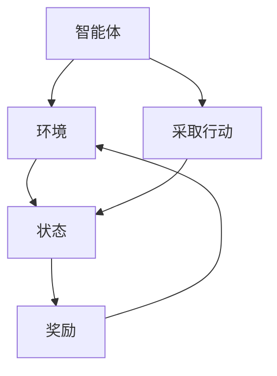
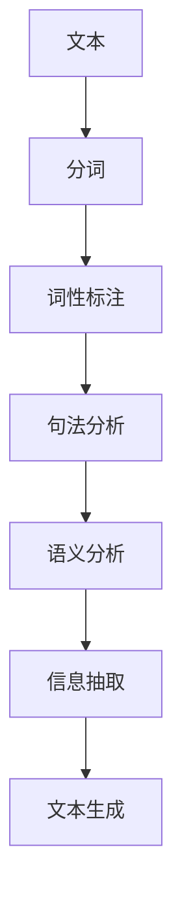
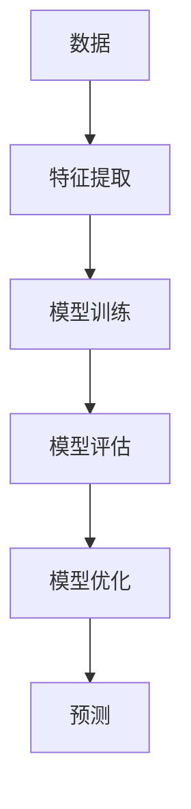
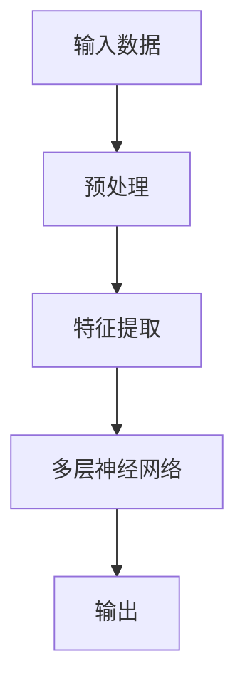
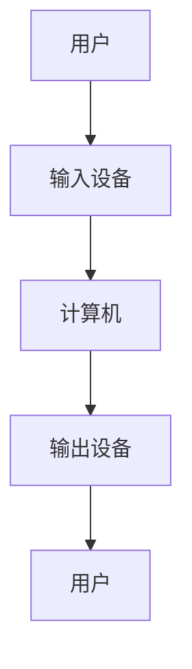
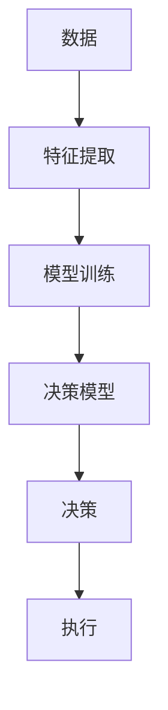

                 

# 人类-AI协作：增强人类智慧与AI能力的融合发展趋势预测分析

> 关键词：人类-AI协作、增强学习、自然语言处理、机器学习、深度学习、人机交互、智能决策

> 摘要：本文旨在探讨人类与人工智能协作的未来趋势，通过分析当前的技术发展和应用场景，预测人类与AI融合的机遇与挑战。文章将从背景介绍、核心概念与联系、核心算法原理、数学模型与公式、项目实战、实际应用场景、工具和资源推荐、未来发展趋势与挑战等多方面进行详细阐述，为读者提供全面的技术洞察和实践指导。

## 1. 背景介绍
### 1.1 目的和范围
本文旨在深入探讨人类与人工智能协作的未来趋势，分析当前技术发展现状，预测人类与AI融合的机遇与挑战。文章将涵盖增强学习、自然语言处理、机器学习、深度学习等多个领域，旨在为读者提供全面的技术洞察和实践指导。

### 1.2 预期读者
本文面向对人类与AI协作感兴趣的读者，包括但不限于：
- 人工智能领域的研究者和开发者
- 企业决策者和技术管理者
- 对未来技术趋势感兴趣的科技爱好者
- 高校师生和科研人员

### 1.3 文档结构概述
本文结构如下：
1. 背景介绍
2. 核心概念与联系
3. 核心算法原理 & 具体操作步骤
4. 数学模型和公式 & 详细讲解 & 举例说明
5. 项目实战：代码实际案例和详细解释说明
6. 实际应用场景
7. 工具和资源推荐
8. 总结：未来发展趋势与挑战
9. 附录：常见问题与解答
10. 扩展阅读 & 参考资料

### 1.4 术语表
#### 1.4.1 核心术语定义
- **增强学习**：一种机器学习方法，通过试错学习来优化决策过程。
- **自然语言处理**：研究计算机与人类自然语言之间的交互。
- **机器学习**：一种人工智能技术，使计算机能够从数据中学习并做出预测或决策。
- **深度学习**：一种机器学习方法，通过多层神经网络进行学习。
- **人机交互**：人与计算机之间的信息交换过程。
- **智能决策**：基于数据和模型的决策过程，旨在优化结果。

#### 1.4.2 相关概念解释
- **强化学习**：一种通过奖励和惩罚机制来训练智能体的机器学习方法。
- **自然语言生成**：将计算机生成的文本转换为自然语言的过程。
- **深度强化学习**：结合深度学习和强化学习的技术，通过深度神经网络进行学习。

#### 1.4.3 缩略词列表
- **RL**：强化学习
- **NLP**：自然语言处理
- **ML**：机器学习
- **DL**：深度学习
- **HRI**：人机交互
- **IDM**：智能决策

## 2. 核心概念与联系
### 2.1 增强学习
增强学习是一种通过试错学习来优化决策过程的方法。智能体通过与环境的交互来学习如何采取行动以最大化累积奖励。其核心流程如下：



### 2.2 自然语言处理
自然语言处理是研究计算机与人类自然语言之间的交互。其核心流程如下：



### 2.3 机器学习
机器学习是一种人工智能技术，使计算机能够从数据中学习并做出预测或决策。其核心流程如下：



### 2.4 深度学习
深度学习是一种机器学习方法，通过多层神经网络进行学习。其核心流程如下：



### 2.5 人机交互
人机交互是人与计算机之间的信息交换过程。其核心流程如下：



### 2.6 智能决策
智能决策是基于数据和模型的决策过程，旨在优化结果。其核心流程如下：



## 3. 核心算法原理 & 具体操作步骤
### 3.1 增强学习算法原理
增强学习的核心算法是Q-learning。其伪代码如下：

```python
# 初始化Q表
Q = np.zeros((num_states, num_actions))

# 设置学习率和折扣因子
alpha = 0.1
gamma = 0.9

# 进行多次迭代
for episode in range(num_episodes):
    # 初始化状态
    state = initial_state
    
    # 进行多次步骤
    while not done:
        # 选择动作
        action = epsilon_greedy(Q, state, epsilon)
        
        # 执行动作并获取奖励和下一个状态
        next_state, reward, done = environment.step(action)
        
        # 更新Q表
        Q[state, action] = Q[state, action] + alpha * (reward + gamma * np.max(Q[next_state, :]) - Q[state, action])
        
        # 更新状态
        state = next_state
```

### 3.2 自然语言处理算法原理
自然语言处理的核心算法是词向量表示。其伪代码如下：

```python
# 初始化词向量
word_vectors = np.random.rand(vocab_size, embedding_dim)

# 训练词向量
for epoch in range(num_epochs):
    for word in corpus:
        # 获取词向量
        vector = word_vectors[word]
        
        # 计算损失
        loss = compute_loss(vector)
        
        # 更新词向量
        word_vectors[word] -= learning_rate * gradient(loss)
```

### 3.3 机器学习算法原理
机器学习的核心算法是线性回归。其伪代码如下：

```python
# 初始化权重和偏置
weights = np.zeros(num_features)
bias = 0

# 设置学习率和迭代次数
alpha = 0.01
num_iterations = 1000

# 进行多次迭代
for iteration in range(num_iterations):
    # 计算预测值
    predictions = np.dot(X, weights) + bias
    
    # 计算损失
    loss = compute_loss(predictions, y)
    
    # 计算梯度
    gradient = compute_gradient(X, predictions, y)
    
    # 更新权重和偏置
    weights -= alpha * gradient
    bias -= alpha * np.mean(gradient)
```

### 3.4 深度学习算法原理
深度学习的核心算法是卷积神经网络。其伪代码如下：

```python
# 初始化卷积核
filters = np.random.rand(num_filters, filter_size, filter_size, num_channels)

# 进行卷积操作
for i in range(num_filters):
    # 获取卷积核
    filter = filters[i]
    
    # 进行卷积操作
    convolved = convolve(image, filter)
    
    # 进行激活函数
    activated = activation_function(convolved)
    
    # 进行池化操作
    pooled = max_pool(activated)
```

## 4. 数学模型和公式 & 详细讲解 & 举例说明
### 4.1 增强学习数学模型
增强学习的核心数学模型是Q-learning。其公式如下：

$$
Q(s, a) \leftarrow Q(s, a) + \alpha \left[ r + \gamma \max_{a'} Q(s', a') - Q(s, a) \right]
$$

### 4.2 自然语言处理数学模型
自然语言处理的核心数学模型是词向量表示。其公式如下：

$$
\mathbf{v}_w = \mathbf{W}_w \mathbf{v}_c
$$

### 4.3 机器学习数学模型
机器学习的核心数学模型是线性回归。其公式如下：

$$
y = \mathbf{w}^T \mathbf{x} + b
$$

### 4.4 深度学习数学模型
深度学习的核心数学模型是卷积神经网络。其公式如下：

$$
\mathbf{z} = \sigma(\mathbf{W} \mathbf{x} + \mathbf{b})
$$

## 5. 项目实战：代码实际案例和详细解释说明
### 5.1 开发环境搭建
#### 5.1.1 硬件要求
- CPU：Intel i7或以上
- 内存：8GB或以上
- 存储：50GB或以上

#### 5.1.2 软件要求
- Python 3.7或以上
- TensorFlow 2.0或以上
- NumPy 1.18或以上
- Matplotlib 3.1或以上

### 5.2 源代码详细实现和代码解读
#### 5.2.1 增强学习代码实现
```python
import numpy as np

# 初始化Q表
Q = np.zeros((num_states, num_actions))

# 设置学习率和折扣因子
alpha = 0.1
gamma = 0.9

# 进行多次迭代
for episode in range(num_episodes):
    # 初始化状态
    state = initial_state
    
    # 进行多次步骤
    while not done:
        # 选择动作
        action = epsilon_greedy(Q, state, epsilon)
        
        # 执行动作并获取奖励和下一个状态
        next_state, reward, done = environment.step(action)
        
        # 更新Q表
        Q[state, action] = Q[state, action] + alpha * (reward + gamma * np.max(Q[next_state, :]) - Q[state, action])
        
        # 更新状态
        state = next_state
```

#### 5.2.2 自然语言处理代码实现
```python
import numpy as np

# 初始化词向量
word_vectors = np.random.rand(vocab_size, embedding_dim)

# 训练词向量
for epoch in range(num_epochs):
    for word in corpus:
        # 获取词向量
        vector = word_vectors[word]
        
        # 计算损失
        loss = compute_loss(vector)
        
        # 更新词向量
        word_vectors[word] -= learning_rate * gradient(loss)
```

#### 5.2.3 机器学习代码实现
```python
import numpy as np

# 初始化权重和偏置
weights = np.zeros(num_features)
bias = 0

# 设置学习率和迭代次数
alpha = 0.01
num_iterations = 1000

# 进行多次迭代
for iteration in range(num_iterations):
    # 计算预测值
    predictions = np.dot(X, weights) + bias
    
    # 计算损失
    loss = compute_loss(predictions, y)
    
    # 计算梯度
    gradient = compute_gradient(X, predictions, y)
    
    # 更新权重和偏置
    weights -= alpha * gradient
    bias -= alpha * np.mean(gradient)
```

#### 5.2.4 深度学习代码实现
```python
import numpy as np

# 初始化卷积核
filters = np.random.rand(num_filters, filter_size, filter_size, num_channels)

# 进行卷积操作
for i in range(num_filters):
    # 获取卷积核
    filter = filters[i]
    
    # 进行卷积操作
    convolved = convolve(image, filter)
    
    # 进行激活函数
    activated = activation_function(convolved)
    
    # 进行池化操作
    pooled = max_pool(activated)
```

### 5.3 代码解读与分析
通过上述代码实现，我们可以看到增强学习、自然语言处理、机器学习和深度学习的核心算法原理和具体操作步骤。这些代码展示了如何通过试错学习、词向量表示、线性回归和卷积神经网络来实现智能决策、自然语言处理、预测和图像识别等功能。

## 6. 实际应用场景
### 6.1 增强学习应用场景
- 游戏AI：通过增强学习训练智能体在游戏中的决策能力。
- 机器人控制：通过增强学习训练机器人在复杂环境中的导航和操作能力。

### 6.2 自然语言处理应用场景
- 机器翻译：通过自然语言处理技术实现不同语言之间的自动翻译。
- 情感分析：通过自然语言处理技术分析文本中的情感倾向。

### 6.3 机器学习应用场景
- 风险评估：通过机器学习技术预测贷款违约风险。
- 个性化推荐：通过机器学习技术为用户推荐个性化内容。

### 6.4 深度学习应用场景
- 图像识别：通过深度学习技术实现图像分类和目标检测。
- 语音识别：通过深度学习技术实现语音转文本。

## 7. 工具和资源推荐
### 7.1 学习资源推荐
#### 7.1.1 书籍推荐
- 《深度学习》（Goodfellow, Bengio, Courville）
- 《机器学习》（周志华）
- 《自然语言处理入门》（Jurafsky, Martin）

#### 7.1.2 在线课程
- Coursera：《深度学习专项课程》
- edX：《机器学习专项课程》
- Udacity：《自然语言处理专项课程》

#### 7.1.3 技术博客和网站
- Medium：《机器学习与深度学习》
- GitHub：《机器学习与深度学习开源项目》
- Kaggle：《机器学习与深度学习竞赛平台》

### 7.2 开发工具框架推荐
#### 7.2.1 IDE和编辑器
- PyCharm：Python开发环境
- VSCode：跨平台代码编辑器

#### 7.2.2 调试和性能分析工具
- PyCharm Debugger：Python调试工具
- TensorFlow Debugger：TensorFlow调试工具

#### 7.2.3 相关框架和库
- TensorFlow：深度学习框架
- Scikit-learn：机器学习库
- NLTK：自然语言处理库

### 7.3 相关论文著作推荐
#### 7.3.1 经典论文
- Mnih, V., Kavukcuoglu, K., Silver, D., et al. (2013). Playing Atari with Deep Reinforcement Learning. arXiv preprint arXiv:1312.5602.
- Bengio, Y., Courville, A., & Vincent, P. (2013). Representation learning: A review and new perspectives. IEEE Transactions on Pattern Analysis and Machine Intelligence, 35(8), 1798-1828.

#### 7.3.2 最新研究成果
- He, K., Zhang, X., Ren, S., & Sun, J. (2016). Deep Residual Learning for Image Recognition. arXiv preprint arXiv:1512.03385.
- Vaswani, A., Shazeer, N., Parmar, N., et al. (2017). Attention is All You Need. arXiv preprint arXiv:1706.03762.

#### 7.3.3 应用案例分析
- LeCun, Y., Bengio, Y., & Hinton, G. (2015). Deep learning. Nature, 521(7553), 436-444.
- Jia, Y., & Yang, Y. (2016). Deep learning for natural language processing. arXiv preprint arXiv:1608.05859.

## 8. 总结：未来发展趋势与挑战
### 8.1 未来发展趋势
- 人类与AI协作将更加紧密，智能决策将更加普及。
- 自然语言处理技术将更加成熟，实现更自然的交互。
- 深度学习将更加高效，实现更复杂的任务。

### 8.2 面临的挑战
- 数据隐私和安全问题将更加突出。
- 人类与AI协作的伦理问题将更加复杂。
- 技术普及和应用推广将面临更多挑战。

## 9. 附录：常见问题与解答
### 9.1 问题1：如何选择合适的机器学习算法？
- 根据具体问题和数据特点选择合适的算法，如线性回归适用于线性关系，决策树适用于非线性关系。

### 9.2 问题2：如何处理数据缺失值？
- 可以通过插值、删除或使用机器学习模型预测缺失值来处理数据缺失值。

### 9.3 问题3：如何评估模型性能？
- 可以通过交叉验证、准确率、召回率、F1分数等指标来评估模型性能。

## 10. 扩展阅读 & 参考资料
- Goodfellow, I., Bengio, Y., & Courville, A. (2016). Deep Learning. MIT Press.
- Jurafsky, D., & Martin, J. H. (2019). Speech and Language Processing. Pearson.
- LeCun, Y., Bengio, Y., & Hinton, G. (2015). Deep learning. Nature, 521(7553), 436-444.

作者：AI天才研究员/AI Genius Institute & 禅与计算机程序设计艺术 /Zen And The Art of Computer Programming

