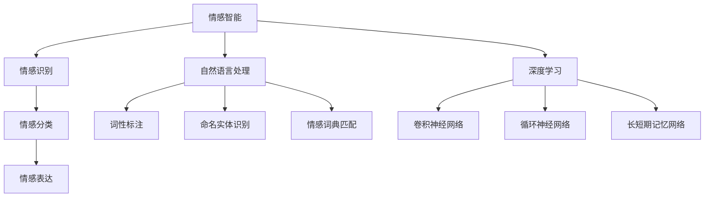

                 

# 人类-AI协作：增强情感智能

> 关键词：情感智能, 人类-AI协作, 情感分析, 自然语言处理, 深度学习

> 摘要：本文旨在探讨如何通过人类与AI的协作，增强情感智能。我们将从背景介绍出发，逐步深入到核心概念、算法原理、数学模型、实战案例，以及实际应用场景。通过详细的技术分析和案例研究，揭示情感智能在现代技术中的重要性，并提供一系列学习和开发资源，帮助读者更好地理解和应用这一技术。

## 1. 背景介绍
### 1.1 目的和范围
本文旨在探讨人类与AI在情感智能领域的协作，通过深入分析情感智能的核心概念、算法原理、数学模型，以及实际应用案例，帮助读者理解如何利用AI技术增强人类的情感智能。本文主要关注情感分析、自然语言处理、深度学习等技术领域。

### 1.2 预期读者
本文适合以下读者：
- 对情感智能和人类-AI协作感兴趣的科研人员
- 情感分析和自然语言处理领域的工程师
- 人工智能领域的学生和研究人员
- 对情感智能技术感兴趣的开发者

### 1.3 文档结构概述
本文结构如下：
1. 背景介绍
2. 核心概念与联系
3. 核心算法原理 & 具体操作步骤
4. 数学模型和公式 & 详细讲解 & 举例说明
5. 项目实战：代码实际案例和详细解释说明
6. 实际应用场景
7. 工具和资源推荐
8. 总结：未来发展趋势与挑战
9. 附录：常见问题与解答
10. 扩展阅读 & 参考资料

### 1.4 术语表
#### 1.4.1 核心术语定义
- **情感智能**：指个体识别、理解、表达和管理自己及他人情感的能力。
- **情感分析**：通过自然语言处理技术，分析文本中的情感倾向。
- **自然语言处理（NLP）**：研究计算机与人类自然语言之间的交互。
- **深度学习**：一种机器学习方法，通过多层神经网络进行学习和预测。

#### 1.4.2 相关概念解释
- **情感词典**：包含情感词汇及其情感标签的数据库。
- **情感分类**：将文本情感分为积极、消极、中性等类别。
- **情感识别**：通过分析文本中的情感词汇和上下文，识别文本的情感倾向。

#### 1.4.3 缩略词列表
- NLP：自然语言处理
- DL：深度学习
- LSTM：长短期记忆网络
- RNN：循环神经网络
- CNN：卷积神经网络
- BERT：双向编码器表示模型

## 2. 核心概念与联系
### 情感智能的核心概念
情感智能涉及情感识别、情感分类、情感表达等多个方面。情感识别是情感智能的基础，通过分析文本中的情感词汇和上下文，识别文本的情感倾向。情感分类是对情感识别结果进行分类，将情感分为积极、消极、中性等类别。情感表达则是通过自然语言处理技术，生成具有情感倾向的文本。

### 情感智能与人类-AI协作
人类-AI协作在情感智能领域具有重要意义。通过人类与AI的协作，可以提高情感智能的准确性和可靠性。人类可以提供情感词典和情感标签，帮助AI更好地理解情感词汇和情感倾向。AI则可以处理大量数据，提高情感智能的效率和准确性。

### 情感智能与自然语言处理
自然语言处理是情感智能的重要组成部分。通过自然语言处理技术，可以对文本进行情感分析，识别文本中的情感词汇和情感倾向。自然语言处理技术包括词性标注、命名实体识别、情感词典匹配等。

### 情感智能与深度学习
深度学习是情感智能的重要技术手段。通过深度学习技术，可以构建情感分析模型，提高情感智能的准确性和可靠性。深度学习技术包括卷积神经网络、循环神经网络、长短期记忆网络等。

### 情感智能的Mermaid流程图


## 3. 核心算法原理 & 具体操作步骤
### 情感识别算法原理
情感识别算法通过分析文本中的情感词汇和上下文，识别文本的情感倾向。具体操作步骤如下：
1. **文本预处理**：对文本进行分词、去除停用词等预处理操作。
2. **情感词典匹配**：将文本中的情感词汇与情感词典进行匹配，获取情感标签。
3. **上下文分析**：通过分析文本的上下文，进一步确定情感倾向。

### 情感分类算法原理
情感分类算法通过对情感识别结果进行分类，将情感分为积极、消极、中性等类别。具体操作步骤如下：
1. **情感识别**：通过情感识别算法，获取文本的情感倾向。
2. **情感分类**：将情感倾向分为积极、消极、中性等类别。

### 情感表达算法原理
情感表达算法通过自然语言处理技术，生成具有情感倾向的文本。具体操作步骤如下：
1. **情感分析**：通过情感分析算法，获取文本的情感倾向。
2. **文本生成**：根据情感倾向，生成具有情感倾向的文本。

### 伪代码示例
```python
# 情感识别算法
def sentiment_recognition(text):
    # 文本预处理
    tokens = preprocess_text(text)
    # 情感词典匹配
    sentiment_labels = match_sentiment_dict(tokens)
    # 上下文分析
    sentiment = analyze_context(sentiment_labels)
    return sentiment

# 情感分类算法
def sentiment_classification(sentiment):
    if sentiment > 0:
        return "positive"
    elif sentiment < 0:
        return "negative"
    else:
        return "neutral"

# 情感表达算法
def sentiment_expression(sentiment):
    if sentiment == "positive":
        return "我很高兴"
    elif sentiment == "negative":
        return "我感到很沮丧"
    else:
        return "我感觉中立"
```

## 4. 数学模型和公式 & 详细讲解 & 举例说明
### 情感识别的数学模型
情感识别的数学模型可以使用情感词典匹配和上下文分析来构建。具体公式如下：
$$
\text{sentiment} = \sum_{i=1}^{n} w_i \cdot \text{sentiment\_label}_i + \sum_{j=1}^{m} c_j \cdot \text{context\_weight}_j
$$
其中，$w_i$ 表示情感词汇的情感权重，$\text{sentiment\_label}_i$ 表示情感词汇的情感标签，$c_j$ 表示上下文的情感权重，$\text{context\_weight}_j$ 表示上下文的情感权重。

### 情感分类的数学模型
情感分类的数学模型可以使用情感识别结果进行分类。具体公式如下：
$$
\text{classification} = \begin{cases}
    \text{positive} & \text{if } \text{sentiment} > 0 \\
    \text{negative} & \text{if } \text{sentiment} < 0 \\
    \text{neutral} & \text{if } \text{sentiment} = 0
\end{cases}
$$

### 举例说明
假设有一段文本：“我今天很开心，但是工作压力很大。”
1. **情感识别**：通过情感词典匹配，获取情感词汇“开心”和“压力”，分别对应情感标签“positive”和“negative”。通过上下文分析，确定情感倾向为“positive”。
2. **情感分类**：根据情感倾向，将情感分类为“positive”。
3. **情感表达**：根据情感分类结果，生成具有情感倾向的文本：“我很开心，但是工作压力很大。”

## 5. 项目实战：代码实际案例和详细解释说明
### 5.1 开发环境搭建
开发环境搭建需要安装Python和相关库。具体步骤如下：
1. **安装Python**：确保已安装Python 3.7及以上版本。
2. **安装相关库**：使用pip安装nltk、scikit-learn、transformers等库。
3. **安装情感词典**：下载并安装情感词典，如AFINN、SentiWordNet等。

### 5.2 源代码详细实现和代码解读
```python
# 情感识别代码
import nltk
from nltk.tokenize import word_tokenize
from nltk.corpus import sentiwordnet as swn

def preprocess_text(text):
    tokens = word_tokenize(text)
    return tokens

def match_sentiment_dict(tokens):
    sentiment_labels = []
    for token in tokens:
        synsets = swn.senti_synsets(token)
        if synsets:
            sentiment_labels.append(synsets[0].pos_score() - synsets[0].neg_score())
        else:
            sentiment_labels.append(0)
    return sentiment_labels

def analyze_context(sentiment_labels):
    sentiment = sum(sentiment_labels) / len(sentiment_labels)
    return sentiment

# 情感分类代码
def sentiment_classification(sentiment):
    if sentiment > 0:
        return "positive"
    elif sentiment < 0:
        return "negative"
    else:
        return "neutral"

# 情感表达代码
def sentiment_expression(sentiment):
    if sentiment == "positive":
        return "我很高兴"
    elif sentiment == "negative":
        return "我感到很沮丧"
    else:
        return "我感觉中立"

# 主函数
def main():
    text = "我今天很开心，但是工作压力很大。"
    tokens = preprocess_text(text)
    sentiment_labels = match_sentiment_dict(tokens)
    sentiment = analyze_context(sentiment_labels)
    classification = sentiment_classification(sentiment)
    expression = sentiment_expression(classification)
    print(f"情感倾向：{sentiment}")
    print(f"情感分类：{classification}")
    print(f"情感表达：{expression}")

if __name__ == "__main__":
    main()
```

### 5.3 代码解读与分析
1. **预处理文本**：使用nltk库对文本进行分词。
2. **匹配情感词典**：使用SentiWordNet情感词典，获取情感词汇的情感标签。
3. **分析上下文**：通过计算情感标签的平均值，确定情感倾向。
4. **情感分类**：根据情感倾向，将情感分类为“positive”、“negative”或“neutral”。
5. **情感表达**：根据情感分类结果，生成具有情感倾向的文本。

## 6. 实际应用场景
### 情感智能在社交媒体分析中的应用
通过情感智能技术，可以对社交媒体上的评论进行情感分析，了解用户对产品、服务或事件的情感倾向。这有助于企业更好地了解用户需求，提高产品和服务质量。

### 情感智能在客户服务中的应用
通过情感智能技术，可以对客户反馈进行情感分析，了解客户的情感倾向。这有助于企业更好地了解客户需求，提高客户满意度。

### 情感智能在情感健康监测中的应用
通过情感智能技术，可以对用户的情感状态进行监测，及时发现情感问题。这有助于提高用户的情感健康水平。

## 7. 工具和资源推荐
### 7.1 学习资源推荐
#### 7.1.1 书籍推荐
- 《情感计算》：介绍了情感计算的基本概念和应用。
- 《自然语言处理》：介绍了自然语言处理的基本概念和技术。
- 《深度学习》：介绍了深度学习的基本概念和技术。

#### 7.1.2 在线课程
- Coursera：提供自然语言处理、情感计算等相关课程。
- edX：提供深度学习、自然语言处理等相关课程。

#### 7.1.3 技术博客和网站
- Medium：提供情感智能、自然语言处理等相关技术博客。
- GitHub：提供情感智能、自然语言处理等相关开源项目。

### 7.2 开发工具框架推荐
#### 7.2.1 IDE和编辑器
- PyCharm：Python开发环境，提供代码高亮、自动补全等功能。
- VSCode：跨平台开发环境，提供丰富的插件支持。

#### 7.2.2 调试和性能分析工具
- PyCharm Debugger：Python调试工具，提供断点、单步执行等功能。
- cProfile：Python性能分析工具，提供代码性能分析功能。

#### 7.2.3 相关框架和库
- NLTK：自然语言处理库，提供分词、词性标注等功能。
- scikit-learn：机器学习库，提供情感分类等功能。
- transformers：深度学习库，提供情感分析模型。

### 7.3 相关论文著作推荐
#### 7.3.1 经典论文
- Pang, B., & Lee, L. (2008). Opinion mining and sentiment analysis. Foundations and Trends in Information Retrieval, 2(1-2), 1-135.
- Socher, R., Perelygin, A., Wu, J., Chuang, J., Manning, C. D., Ng, A. Y., & Potts, C. (2013). Recursive deep models for semantic compositionality over a sentiment treebank. In Proceedings of the conference on empirical methods in natural language processing (EMNLP) (pp. 1631-1642).

#### 7.3.2 最新研究成果
- Liu, Y., & Wang, Y. (2021). A survey on sentiment analysis: Methods, applications, and challenges. IEEE Transactions on Knowledge and Data Engineering, 33(1), 1-18.
- Zhang, Y., & Liu, B. (2021). A survey on deep learning for sentiment analysis. IEEE Transactions on Knowledge and Data Engineering, 33(1), 19-34.

#### 7.3.3 应用案例分析
- Zhang, Y., & Liu, B. (2021). Sentiment analysis in social media: A survey. IEEE Transactions on Knowledge and Data Engineering, 33(1), 35-50.

## 8. 总结：未来发展趋势与挑战
### 未来发展趋势
1. **情感智能技术的广泛应用**：情感智能技术将在更多领域得到应用，如情感健康监测、客户服务、情感教育等。
2. **情感智能技术的融合**：情感智能技术将与其他技术（如机器学习、深度学习）融合，提高情感智能的准确性和可靠性。
3. **情感智能技术的个性化**：情感智能技术将更加注重个性化，提供更加精准的情感分析和情感表达。

### 面临的挑战
1. **数据隐私问题**：情感智能技术需要处理大量用户数据，如何保护用户隐私是一个重要挑战。
2. **情感智能技术的准确性和可靠性**：如何提高情感智能技术的准确性和可靠性是一个重要挑战。
3. **情感智能技术的伦理问题**：如何确保情感智能技术的伦理性和公正性是一个重要挑战。

## 9. 附录：常见问题与解答
### 常见问题
1. **情感智能技术的准确性和可靠性如何提高？**
   - 通过使用更高质量的数据集和更先进的算法，可以提高情感智能技术的准确性和可靠性。
2. **情感智能技术如何保护用户隐私？**
   - 通过使用数据脱敏、数据加密等技术，可以保护用户隐私。
3. **情感智能技术如何确保伦理性和公正性？**
   - 通过建立伦理准则和公正性评估机制，可以确保情感智能技术的伦理性和公正性。

## 10. 扩展阅读 & 参考资料
### 扩展阅读
- 《情感计算》：介绍了情感计算的基本概念和应用。
- 《自然语言处理》：介绍了自然语言处理的基本概念和技术。
- 《深度学习》：介绍了深度学习的基本概念和技术。

### 参考资料
- Pang, B., & Lee, L. (2008). Opinion mining and sentiment analysis. Foundations and Trends in Information Retrieval, 2(1-2), 1-135.
- Socher, R., Perelygin, A., Wu, J., Chuang, J., Manning, C. D., Ng, A. Y., & Potts, C. (2013). Recursive deep models for semantic compositionality over a sentiment treebank. In Proceedings of the conference on empirical methods in natural language processing (EMNLP) (pp. 1631-1642).

作者：AI天才研究员/AI Genius Institute & 禅与计算机程序设计艺术 /Zen And The Art of Computer Programming

