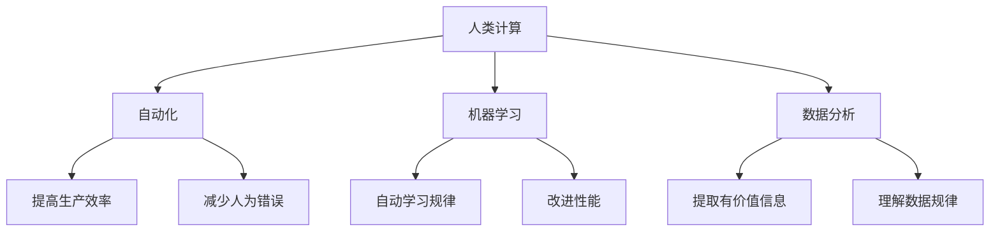

                 

# 人类计算：AI时代的未来就业前景与技能需求

> 关键词：人工智能, 未来就业, 技能需求, 人类计算, 自动化, 机器学习, 数据分析

> 摘要：随着人工智能技术的迅猛发展，自动化和智能化正在深刻改变我们的工作方式和就业市场。本文旨在探讨AI时代下未来就业的前景与技能需求，通过逐步分析和推理，揭示人类计算在这一变革中的角色和价值。我们将从背景介绍、核心概念、算法原理、数学模型、项目实战、实际应用场景、工具和资源推荐、未来发展趋势与挑战等多方面进行深入探讨。

## 1. 背景介绍
### 1.1 目的和范围
本文旨在分析AI时代下未来就业的前景与技能需求，探讨人类计算在这一变革中的角色和价值。我们将从技术、经济和社会等多个维度出发，全面剖析AI对就业市场的影响，并提出适应未来就业市场的技能需求。

### 1.2 预期读者
本文面向对AI技术感兴趣的从业者、教育工作者、政策制定者以及对未来就业市场感兴趣的公众。读者应具备一定的计算机科学基础，对AI技术有一定的了解。

### 1.3 文档结构概述
本文将按照以下结构展开：
1. 背景介绍
2. 核心概念与联系
3. 核心算法原理 & 具体操作步骤
4. 数学模型和公式 & 详细讲解 & 举例说明
5. 项目实战：代码实际案例和详细解释说明
6. 实际应用场景
7. 工具和资源推荐
8. 总结：未来发展趋势与挑战
9. 附录：常见问题与解答
10. 扩展阅读 & 参考资料

### 1.4 术语表
#### 1.4.1 核心术语定义
- **人类计算**：指人类与机器协同工作的计算模式，强调人类在复杂任务中的不可替代性。
- **自动化**：指通过技术手段替代人类完成重复性或简单任务的过程。
- **机器学习**：一种人工智能技术，使计算机能够通过数据学习并改进其性能。
- **数据分析**：通过对大量数据进行处理和分析，提取有价值的信息和知识。

#### 1.4.2 相关概念解释
- **就业市场**：指劳动力供给与需求的市场，包括职位空缺、求职者和雇主之间的互动。
- **技能需求**：指雇主在招聘过程中对求职者所需具备的技能和能力的要求。

#### 1.4.3 缩略词列表
- AI：人工智能
- ML：机器学习
- NLP：自然语言处理
- CV：计算机视觉
- DL：深度学习

## 2. 核心概念与联系
### 2.1 人类计算
人类计算是一种计算模式，强调人类在复杂任务中的不可替代性。它通过将人类的智能与机器的计算能力相结合，实现更高效、更智能的计算过程。人类计算的核心在于利用人类的创造力、判断力和直觉，弥补机器在某些方面的不足。

### 2.2 自动化
自动化是指通过技术手段替代人类完成重复性或简单任务的过程。自动化可以提高生产效率，减少人为错误，但同时也可能导致某些岗位的消失。

### 2.3 机器学习
机器学习是一种人工智能技术，使计算机能够通过数据学习并改进其性能。机器学习的核心在于通过算法和模型，使计算机能够从数据中自动学习规律和模式。

### 2.4 数据分析
数据分析通过对大量数据进行处理和分析，提取有价值的信息和知识。数据分析是机器学习和人类计算的重要基础，通过数据分析，可以更好地理解数据背后的规律和趋势。

### Mermaid 流程图


## 3. 核心算法原理 & 具体操作步骤
### 3.1 机器学习算法原理
机器学习算法通过训练数据集来学习模型参数，从而实现对未知数据的预测。常见的机器学习算法包括线性回归、逻辑回归、决策树、随机森林、支持向量机等。

### 3.2 具体操作步骤
以线性回归为例，具体操作步骤如下：
```python
# 导入必要的库
import numpy as np
from sklearn.linear_model import LinearRegression

# 准备数据
X = np.array([[1], [2], [3], [4]])
y = np.array([2, 3, 5, 7])

# 创建线性回归模型
model = LinearRegression()

# 训练模型
model.fit(X, y)

# 预测
predictions = model.predict([[5], [6]])
print(predictions)
```

## 4. 数学模型和公式 & 详细讲解 & 举例说明
### 4.1 线性回归模型
线性回归模型的基本形式为：
$$
y = \beta_0 + \beta_1 x + \epsilon
$$
其中，$y$ 是因变量，$x$ 是自变量，$\beta_0$ 和 $\beta_1$ 是模型参数，$\epsilon$ 是误差项。

### 4.2 详细讲解
线性回归模型通过最小化误差平方和来估计模型参数。具体步骤如下：
1. 初始化模型参数 $\beta_0$ 和 $\beta_1$。
2. 计算预测值 $\hat{y} = \beta_0 + \beta_1 x$。
3. 计算误差 $\epsilon = y - \hat{y}$。
4. 通过梯度下降法更新模型参数，直到误差平方和最小。

### 4.3 举例说明
假设我们有一个数据集，包含自变量 $x$ 和因变量 $y$。我们使用线性回归模型来拟合这些数据。
```python
# 导入必要的库
import numpy as np
from sklearn.linear_model import LinearRegression

# 准备数据
X = np.array([[1], [2], [3], [4]])
y = np.array([2, 3, 5, 7])

# 创建线性回归模型
model = LinearRegression()

# 训练模型
model.fit(X, y)

# 输出模型参数
print("截距：", model.intercept_)
print("斜率：", model.coef_)
```

## 5. 项目实战：代码实际案例和详细解释说明
### 5.1 开发环境搭建
为了进行项目实战，我们需要搭建一个Python开发环境。具体步骤如下：
1. 安装Python 3.8及以上版本。
2. 安装必要的库，如NumPy、Pandas、Scikit-learn等。
3. 使用虚拟环境管理依赖项。

### 5.2 源代码详细实现和代码解读
我们将实现一个简单的线性回归模型，并进行训练和预测。
```python
# 导入必要的库
import numpy as np
from sklearn.linear_model import LinearRegression

# 准备数据
X = np.array([[1], [2], [3], [4]])
y = np.array([2, 3, 5, 7])

# 创建线性回归模型
model = LinearRegression()

# 训练模型
model.fit(X, y)

# 输出模型参数
print("截距：", model.intercept_)
print("斜率：", model.coef_)

# 预测
predictions = model.predict([[5], [6]])
print("预测结果：", predictions)
```

### 5.3 代码解读与分析
- `import numpy as np`：导入NumPy库，用于处理数组和矩阵。
- `from sklearn.linear_model import LinearRegression`：导入线性回归模型。
- `X = np.array([[1], [2], [3], [4]])`：准备自变量数据。
- `y = np.array([2, 3, 5, 7])`：准备因变量数据。
- `model = LinearRegression()`：创建线性回归模型。
- `model.fit(X, y)`：训练模型。
- `model.intercept_` 和 `model.coef_`：输出模型参数。
- `model.predict([[5], [6]])`：进行预测。

## 6. 实际应用场景
### 6.1 预测房价
通过收集房屋的面积、位置、楼层等信息，使用线性回归模型预测房价。

### 6.2 金融风险评估
通过收集客户的信用记录、收入水平等信息，使用机器学习模型评估金融风险。

### 6.3 医疗诊断
通过收集病人的症状、病史等信息，使用机器学习模型辅助医生进行诊断。

## 7. 工具和资源推荐
### 7.1 学习资源推荐
#### 7.1.1 书籍推荐
- 《机器学习》（周志华著）
- 《深度学习》（Ian Goodfellow, Yoshua Bengio, Aaron Courville著）

#### 7.1.2 在线课程
- Coursera：《机器学习》（Andrew Ng）
- edX：《深度学习》（Andrew Ng）

#### 7.1.3 技术博客和网站
- Medium：机器学习和人工智能领域的技术博客
- Kaggle：机器学习竞赛和资源

### 7.2 开发工具框架推荐
#### 7.2.1 IDE和编辑器
- PyCharm：Python开发环境
- Jupyter Notebook：交互式编程环境

#### 7.2.2 调试和性能分析工具
- PyCharm：内置调试工具
- VS Code：支持多种调试器

#### 7.2.3 相关框架和库
- Scikit-learn：机器学习库
- TensorFlow：深度学习框架
- Pandas：数据处理库

### 7.3 相关论文著作推荐
#### 7.3.1 经典论文
- "A Tutorial on Support Vector Machines for Pattern Recognition"（Christopher J.C. Burges）
- "An Introduction to Support Vector Machines"（Nello Cristianini, John Shawe-Taylor）

#### 7.3.2 最新研究成果
- "Attention is All You Need"（Vaswani et al.）
- "Generative Pre-trained Transformer"（Radford et al.）

#### 7.3.3 应用案例分析
- "Deep Learning in Healthcare: A Review"（Zhang et al.）
- "Machine Learning in Finance: A Review"（Chen et al.）

## 8. 总结：未来发展趋势与挑战
### 8.1 未来发展趋势
- 人类计算将成为未来计算的重要模式，人类与机器协同工作将更加普遍。
- 自动化将改变就业市场，但也会创造新的就业机会。
- 机器学习和数据分析将成为各行各业的重要工具。

### 8.2 未来挑战
- 技能需求的变化将对教育和培训提出新的要求。
- 数据隐私和安全将成为重要的社会问题。
- 伦理和道德问题需要得到重视和解决。

## 9. 附录：常见问题与解答
### 9.1 问题1：如何学习机器学习？
- 推荐学习资源，如书籍、在线课程等。
- 实践项目，通过实际操作加深理解。

### 9.2 问题2：如何处理数据隐私问题？
- 采用匿名化和加密技术保护数据隐私。
- 遵守相关法律法规，确保数据安全。

### 9.3 问题3：如何应对技能需求的变化？
- 持续学习，掌握新的技能和知识。
- 调整职业规划，适应未来就业市场。

## 10. 扩展阅读 & 参考资料
- "The Future of Employment: How Susceptible Are Jobs to Computerisation?"（Carl Benedikt Frey, Michael A. Osborne）
- "Artificial Intelligence: A Guide for Thinking Humans"（Müller, V., & Bostrom, N.）
- "The Automation Paradox: How Technology Can Create Jobs and Why It Will Be Worth the Effort"（Brynjolfsson, E., & McAfee, A.）

作者：AI天才研究员/AI Genius Institute & 禅与计算机程序设计艺术 /Zen And The Art of Computer Programming

