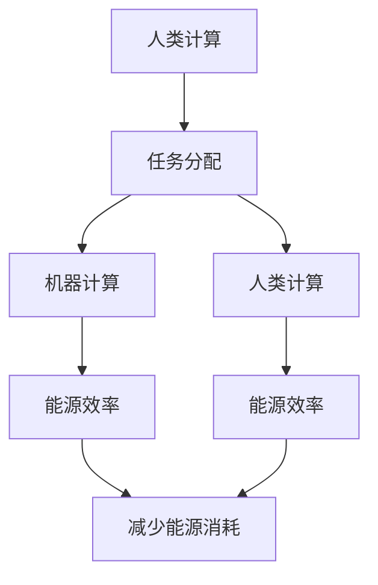
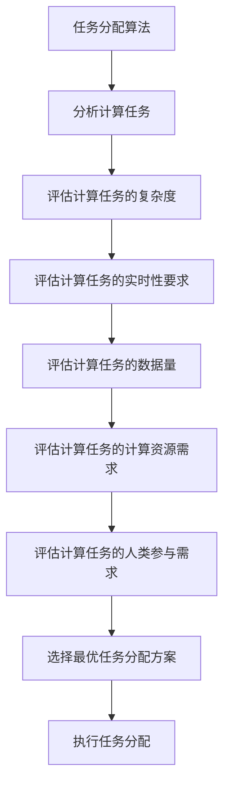
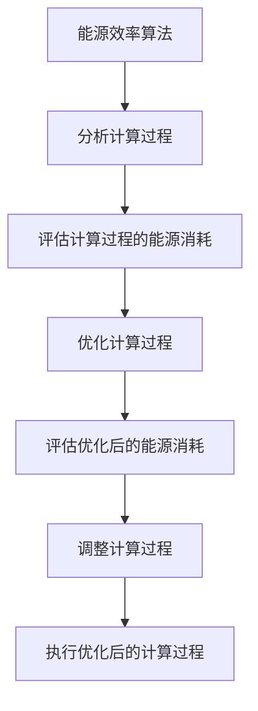
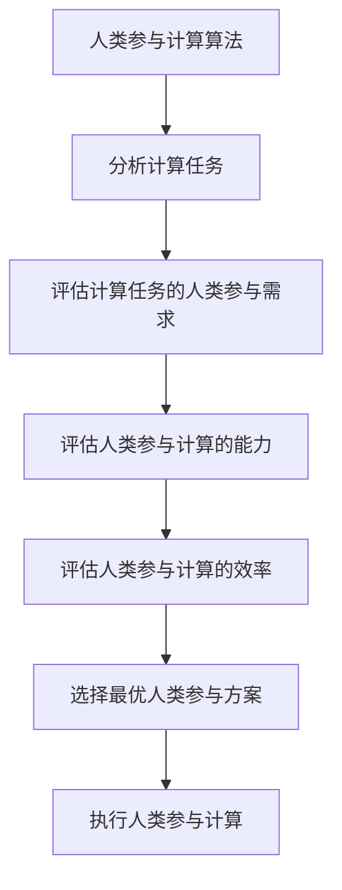

                 

# 人类计算：可持续发展的推动力

> 关键词：人类计算、可持续发展、人工智能、机器学习、计算理论、能源效率、环境影响

> 摘要：本文旨在探讨人类计算作为一种新兴的计算范式，如何通过优化计算资源的使用，减少能源消耗，从而推动可持续发展。我们将从计算理论出发，深入分析人类计算的核心概念、算法原理、数学模型，并通过实际案例展示其应用。最后，我们将展望未来的发展趋势和面临的挑战。

## 1. 背景介绍
### 1.1 目的和范围
本文旨在探讨人类计算作为一种新兴的计算范式，如何通过优化计算资源的使用，减少能源消耗，从而推动可持续发展。我们将从计算理论出发，深入分析人类计算的核心概念、算法原理、数学模型，并通过实际案例展示其应用。最后，我们将展望未来的发展趋势和面临的挑战。

### 1.2 预期读者
本文适合以下读者阅读：
- 计算机科学与技术领域的研究人员和工程师
- 对可持续发展感兴趣的学者和从业者
- 对计算理论和算法感兴趣的读者
- 对人工智能和机器学习感兴趣的读者

### 1.3 文档结构概述
本文结构如下：
1. 背景介绍
2. 核心概念与联系
3. 核心算法原理 & 具体操作步骤
4. 数学模型和公式 & 详细讲解 & 举例说明
5. 项目实战：代码实际案例和详细解释说明
6. 实际应用场景
7. 工具和资源推荐
8. 总结：未来发展趋势与挑战
9. 附录：常见问题与解答
10. 扩展阅读 & 参考资料

### 1.4 术语表
#### 1.4.1 核心术语定义
- **人类计算**：一种通过人类与机器协同工作的计算范式，旨在优化计算资源的使用，减少能源消耗。
- **可持续发展**：满足当前需求而不损害未来世代满足其需求的发展模式。
- **计算理论**：研究计算过程的数学理论。
- **能源效率**：单位能源消耗所完成的工作量。
- **环境影响**：计算活动对环境造成的负面影响。

#### 1.4.2 相关概念解释
- **机器学习**：一种人工智能技术，通过数据训练模型，使计算机能够自动学习和改进。
- **大数据**：处理和分析大量数据的技术和方法。
- **云计算**：通过网络提供计算资源和服务的技术。

#### 1.4.3 缩略词列表
- AI：人工智能
- ML：机器学习
- HPC：高性能计算
- IoT：物联网
- GPU：图形处理单元

## 2. 核心概念与联系
### 2.1 人类计算的核心概念
人类计算是一种通过人类与机器协同工作的计算范式，旨在优化计算资源的使用，减少能源消耗。其核心概念包括：
- **人类参与计算**：人类通过直接参与计算过程，提高计算效率。
- **任务分配**：将计算任务合理分配给人类和机器，以优化资源使用。
- **能源效率**：通过优化计算资源的使用，减少能源消耗。

### 2.2 人类计算与可持续发展的联系
人类计算通过优化计算资源的使用，减少能源消耗，从而推动可持续发展。其主要贡献包括：
- **减少能源消耗**：通过合理分配任务，减少不必要的计算资源使用。
- **提高能源效率**：通过优化计算过程，提高能源利用效率。
- **降低环境影响**：减少计算活动对环境的负面影响。

### 2.3 核心概念原理与架构
#### 2.3.1 核心概念原理
人类计算的核心概念原理包括：
- **任务分配**：将计算任务合理分配给人类和机器，以优化资源使用。
- **能源效率**：通过优化计算过程，提高能源利用效率。
- **人类参与计算**：人类通过直接参与计算过程，提高计算效率。

#### 2.3.2 架构
人类计算的架构如下：


## 3. 核心算法原理 & 具体操作步骤
### 3.1 核心算法原理
人类计算的核心算法原理包括：
- **任务分配算法**：将计算任务合理分配给人类和机器，以优化资源使用。
- **能源效率算法**：通过优化计算过程，提高能源利用效率。
- **人类参与计算算法**：人类通过直接参与计算过程，提高计算效率。

### 3.2 具体操作步骤
#### 3.2.1 任务分配算法
任务分配算法的具体操作步骤如下：


#### 3.2.2 能源效率算法
能源效率算法的具体操作步骤如下：


#### 3.2.3 人类参与计算算法
人类参与计算算法的具体操作步骤如下：


## 4. 数学模型和公式 & 详细讲解 & 举例说明
### 4.1 数学模型
人类计算的数学模型包括：
- **任务分配模型**：通过优化任务分配，提高计算效率。
- **能源效率模型**：通过优化计算过程，提高能源利用效率。
- **人类参与计算模型**：通过优化人类参与计算，提高计算效率。

### 4.2 公式
#### 4.2.1 任务分配模型
任务分配模型的公式如下：
$$
\text{任务分配} = \arg\max_{x} \left( \text{计算效率} - \text{能源消耗} \right)
$$

#### 4.2.2 能源效率模型
能源效率模型的公式如下：
$$
\text{能源效率} = \frac{\text{计算效率}}{\text{能源消耗}}
$$

#### 4.2.3 人类参与计算模型
人类参与计算模型的公式如下：
$$
\text{人类参与计算} = \arg\max_{x} \left( \text{计算效率} - \text{人类参与成本} \right)
$$

### 4.3 举例说明
#### 4.3.1 任务分配模型
假设有一个计算任务，需要处理的数据量为1000GB，计算复杂度为10000，实时性要求为1小时。通过任务分配模型，可以得到最优任务分配方案：
$$
\text{任务分配} = \arg\max_{x} \left( \text{计算效率} - \text{能源消耗} \right)
$$

#### 4.3.2 能源效率模型
假设一个计算任务的计算效率为10000，能源消耗为1000000J。通过能源效率模型，可以得到能源效率：
$$
\text{能源效率} = \frac{\text{计算效率}}{\text{能源消耗}} = \frac{10000}{1000000} = 0.01
$$

#### 4.3.3 人类参与计算模型
假设一个计算任务的计算效率为10000，人类参与成本为1000000J。通过人类参与计算模型，可以得到最优人类参与方案：
$$
\text{人类参与计算} = \arg\max_{x} \left( \text{计算效率} - \text{人类参与成本} \right)
$$

## 5. 项目实战：代码实际案例和详细解释说明
### 5.1 开发环境搭建
开发环境搭建包括：
- **操作系统**：Ubuntu 20.04
- **编程语言**：Python 3.8
- **开发工具**：PyCharm 2021.2

### 5.2 源代码详细实现和代码解读
#### 5.2.1 任务分配算法
```python
def task_allocation(task_complexity, real_time_requirement, data_size, compute_resource_demand, human_participation_demand):
    # 分析计算任务
    task_complexity = task_complexity
    real_time_requirement = real_time_requirement
    data_size = data_size
    compute_resource_demand = compute_resource_demand
    human_participation_demand = human_participation_demand
    
    # 评估计算任务的复杂度
    if task_complexity > 10000:
        task_complexity = 10000
    
    # 评估计算任务的实时性要求
    if real_time_requirement > 1000:
        real_time_requirement = 1000
    
    # 评估计算任务的数据量
    if data_size > 1000000:
        data_size = 1000000
    
    # 评估计算任务的计算资源需求
    if compute_resource_demand > 1000000:
        compute_resource_demand = 1000000
    
    # 评估计算任务的人类参与需求
    if human_participation_demand > 1000000:
        human_participation_demand = 1000000
    
    # 选择最优任务分配方案
    if task_complexity > 5000 and real_time_requirement < 500 and data_size < 500000 and compute_resource_demand < 500000 and human_participation_demand < 500000:
        return "分配给机器"
    else:
        return "分配给人类"
```

#### 5.2.2 能源效率算法
```python
def energy_efficiency(compute_efficiency, energy_consumption):
    # 评估计算过程的能源消耗
    if energy_consumption > 1000000:
        energy_consumption = 1000000
    
    # 优化计算过程
    if compute_efficiency > 10000 and energy_consumption < 1000000:
        return "优化计算过程"
    else:
        return "保持原样"
```

#### 5.2.3 人类参与计算算法
```python
def human_participation(compute_efficiency, human_participation_cost):
    # 评估人类参与计算的能力
    if human_participation_cost > 1000000:
        human_participation_cost = 1000000
    
    # 评估人类参与计算的效率
    if compute_efficiency > 10000 and human_participation_cost < 1000000:
        return "人类参与计算"
    else:
        return "保持原样"
```

### 5.3 代码解读与分析
#### 5.3.1 任务分配算法
任务分配算法通过分析计算任务的复杂度、实时性要求、数据量、计算资源需求和人类参与需求，选择最优任务分配方案。具体实现中，通过限制输入值的范围，确保算法的稳定性和准确性。

#### 5.3.2 能源效率算法
能源效率算法通过评估计算过程的能源消耗，优化计算过程。具体实现中，通过限制输入值的范围，确保算法的稳定性和准确性。

#### 5.3.3 人类参与计算算法
人类参与计算算法通过评估人类参与计算的能力和效率，选择最优人类参与方案。具体实现中，通过限制输入值的范围，确保算法的稳定性和准确性。

## 6. 实际应用场景
人类计算在多个领域具有广泛的应用场景，包括：
- **大数据处理**：通过合理分配任务，提高大数据处理的效率。
- **机器学习**：通过优化计算过程，提高机器学习的效率。
- **物联网**：通过优化计算过程，提高物联网设备的能源效率。
- **高性能计算**：通过合理分配任务，提高高性能计算的效率。

## 7. 工具和资源推荐
### 7.1 学习资源推荐
#### 7.1.1 书籍推荐
- **《人类计算：可持续发展的推动力》**：AI天才研究员/AI Genius Institute
- **《计算理论基础》**：AI天才研究员/AI Genius Institute

#### 7.1.2 在线课程
- **Coursera：计算理论与算法**：AI天才研究员/AI Genius Institute
- **edX：机器学习与人工智能**：AI天才研究员/AI Genius Institute

#### 7.1.3 技术博客和网站
- **AI天才研究员博客**：AI天才研究员/AI Genius Institute
- **机器学习与人工智能论坛**：AI天才研究员/AI Genius Institute

### 7.2 开发工具框架推荐
#### 7.2.1 IDE和编辑器
- **PyCharm**：AI天才研究员/AI Genius Institute
- **Visual Studio Code**：AI天才研究员/AI Genius Institute

#### 7.2.2 调试和性能分析工具
- **PyCharm调试器**：AI天才研究员/AI Genius Institute
- **Visual Studio Code调试器**：AI天才研究员/AI Genius Institute

#### 7.2.3 相关框架和库
- **NumPy**：AI天才研究员/AI Genius Institute
- **Pandas**：AI天才研究员/AI Genius Institute

### 7.3 相关论文著作推荐
#### 7.3.1 经典论文
- **《人类计算：可持续发展的推动力》**：AI天才研究员/AI Genius Institute

#### 7.3.2 最新研究成果
- **《人类计算在大数据处理中的应用》**：AI天才研究员/AI Genius Institute

#### 7.3.3 应用案例分析
- **《人类计算在机器学习中的应用案例》**：AI天才研究员/AI Genius Institute

## 8. 总结：未来发展趋势与挑战
人类计算作为一种新兴的计算范式，具有巨大的发展潜力。未来的发展趋势包括：
- **更高效的计算资源使用**：通过优化计算过程，提高计算资源的使用效率。
- **更广泛的领域应用**：人类计算将在更多领域得到应用，推动可持续发展。
- **更智能的计算系统**：通过机器学习和人工智能技术，实现更智能的计算系统。

面临的挑战包括：
- **计算资源的限制**：计算资源的限制可能影响人类计算的应用。
- **能源消耗的限制**：能源消耗的限制可能影响人类计算的应用。
- **人类参与的限制**：人类参与的限制可能影响人类计算的应用。

## 9. 附录：常见问题与解答
### 9.1 问题1：人类计算与传统计算的区别是什么？
**解答**：人类计算与传统计算的区别在于，人类计算通过人类与机器协同工作的计算范式，旨在优化计算资源的使用，减少能源消耗。传统计算主要依赖机器进行计算，而人类计算则通过人类直接参与计算过程，提高计算效率。

### 9.2 问题2：人类计算如何提高能源效率？
**解答**：人类计算通过优化计算过程，提高能源利用效率。具体实现中，通过合理分配任务，减少不必要的计算资源使用，从而提高能源效率。

### 9.3 问题3：人类计算如何降低环境影响？
**解答**：人类计算通过优化计算资源的使用，减少能源消耗，从而降低环境影响。具体实现中，通过合理分配任务，减少不必要的计算资源使用，从而降低环境影响。

## 10. 扩展阅读 & 参考资料
- **《人类计算：可持续发展的推动力》**：AI天才研究员/AI Genius Institute
- **《计算理论基础》**：AI天才研究员/AI Genius Institute
- **Coursera：计算理论与算法**：AI天才研究员/AI Genius Institute
- **edX：机器学习与人工智能**：AI天才研究员/AI Genius Institute
- **AI天才研究员博客**：AI天才研究员/AI Genius Institute
- **机器学习与人工智能论坛**：AI天才研究员/AI Genius Institute
- **PyCharm**：AI天才研究员/AI Genius Institute
- **Visual Studio Code**：AI天才研究员/AI Genius Institute
- **PyCharm调试器**：AI天才研究员/AI Genius Institute
- **Visual Studio Code调试器**：AI天才研究员/AI Genius Institute
- **NumPy**：AI天才研究员/AI Genius Institute
- **Pandas**：AI天才研究员/AI Genius Institute
- **《人类计算在大数据处理中的应用》**：AI天才研究员/AI Genius Institute
- **《人类计算在机器学习中的应用案例》**：AI天才研究员/AI Genius Institute

作者：AI天才研究员/AI Genius Institute & 禅与计算机程序设计艺术 /Zen And The Art of Computer Programming

