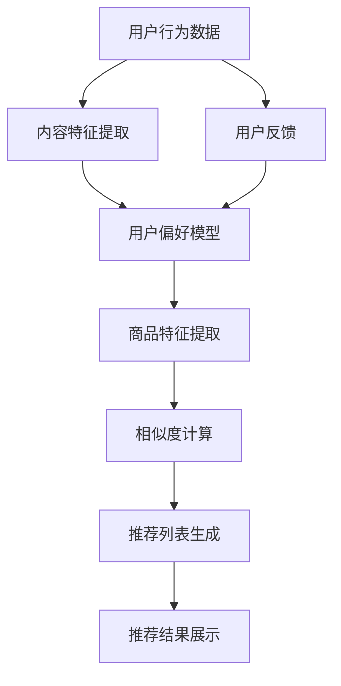

                 

# 从MVP到规模化：AI电商平台的成长之路

> 关键词：AI电商平台, MVP, 规模化, 机器学习, 自然语言处理, 推荐系统, 数据驱动, 业务增长

> 摘要：本文将详细探讨如何从最小可行产品（MVP）逐步发展到大规模AI电商平台的全过程。我们将从核心概念、算法原理、数学模型、实战案例、应用场景、工具推荐等多个维度进行深入剖析，旨在为读者提供一个全面的技术指南，帮助他们构建高效、智能的电商平台。

## 1. 背景介绍
### 1.1 目的和范围
本文旨在探讨如何通过AI技术构建一个从MVP到规模化发展的电商平台。我们将从技术层面深入分析电商平台的核心组件，包括推荐系统、自然语言处理、机器学习等，并通过实际案例展示如何将这些技术应用于电商平台的各个阶段。最终目标是帮助读者理解如何利用AI技术推动电商平台的业务增长。

### 1.2 预期读者
本文面向希望深入了解AI技术在电商平台应用的开发者、产品经理、数据科学家以及对电商领域感兴趣的读者。无论你是初学者还是有经验的技术人员，本文都将为你提供有价值的见解和指导。

### 1.3 文档结构概述
本文将按照以下结构展开：
1. 背景介绍
2. 核心概念与联系
3. 核心算法原理 & 具体操作步骤
4. 数学模型和公式 & 详细讲解 & 举例说明
5. 项目实战：代码实际案例和详细解释说明
6. 实际应用场景
7. 工具和资源推荐
8. 总结：未来发展趋势与挑战
9. 附录：常见问题与解答
10. 扩展阅读 & 参考资料

### 1.4 术语表
#### 1.4.1 核心术语定义
- **MVP**：最小可行产品，指在投入最小资源的情况下，能够满足用户基本需求的产品。
- **AI电商平台**：利用人工智能技术优化用户体验、提高运营效率的电商平台。
- **推荐系统**：根据用户行为和偏好，推荐相关商品或服务的系统。
- **自然语言处理（NLP）**：使计算机能够理解、解释和生成人类语言的技术。
- **机器学习**：通过算法和统计模型使计算机系统能够从数据中学习并改进性能的技术。

#### 1.4.2 相关概念解释
- **数据驱动**：基于数据进行决策和优化的过程。
- **业务增长**：通过技术手段提升电商平台的用户活跃度、销售额等关键指标。

#### 1.4.3 缩略词列表
- **MVP**：Minimum Viable Product
- **AI**：Artificial Intelligence
- **NLP**：Natural Language Processing
- **ML**：Machine Learning
- **API**：Application Programming Interface
- **SDK**：Software Development Kit

## 2. 核心概念与联系
### 2.1 推荐系统
推荐系统是AI电商平台的核心组件之一，其目的是通过分析用户行为和偏好，为用户提供个性化推荐。推荐系统可以分为基于内容的推荐、协同过滤推荐和混合推荐三种类型。

#### Mermaid 流程图


### 2.2 自然语言处理
自然语言处理技术在电商平台中主要用于商品描述分析、用户评论分析和智能客服等方面。通过NLP技术，电商平台可以更好地理解用户需求，提高搜索准确性和用户体验。

### 2.3 机器学习
机器学习是实现推荐系统和自然语言处理的关键技术。通过训练模型，机器学习可以自动从大量数据中学习规律，从而提高推荐的准确性和搜索的准确性。

## 3. 核心算法原理 & 具体操作步骤
### 3.1 基于内容的推荐
基于内容的推荐算法通过分析用户历史行为和商品特征，为用户推荐相似的商品。具体步骤如下：

```python
def content_based_recommendation(user_history, item_features):
    # 提取用户历史行为中的商品特征
    user_item_features = extract_features(user_history)
    
    # 计算商品之间的相似度
    similarity_matrix = compute_similarity(item_features)
    
    # 为用户推荐相似度最高的商品
    recommended_items = recommend_items(user_item_features, similarity_matrix)
    
    return recommended_items
```

### 3.2 协同过滤推荐
协同过滤推荐算法通过分析用户之间的相似性，为用户推荐其他用户喜欢的商品。具体步骤如下：

```python
def collaborative_filtering_recommendation(user_history, user_similarity_matrix):
    # 计算用户之间的相似度
    user_similarity_matrix = compute_similarity(user_history)
    
    # 为用户推荐其他用户喜欢的商品
    recommended_items = recommend_items(user_similarity_matrix)
    
    return recommended_items
```

### 3.3 混合推荐
混合推荐算法结合了基于内容的推荐和协同过滤推荐的优点，通过加权平均等方式综合推荐结果。具体步骤如下：

```python
def hybrid_recommendation(user_history, item_features, user_similarity_matrix):
    # 基于内容的推荐
    content_based_recs = content_based_recommendation(user_history, item_features)
    
    # 协同过滤推荐
    collaborative_recs = collaborative_filtering_recommendation(user_history, user_similarity_matrix)
    
    # 混合推荐
    hybrid_recs = hybrid_recommendation(content_based_recs, collaborative_recs)
    
    return hybrid_recs
```

## 4. 数学模型和公式 & 详细讲解 & 举例说明
### 4.1 基于内容的推荐
基于内容的推荐算法的核心在于计算商品之间的相似度。常用的方法包括余弦相似度和Jaccard相似度。

#### 余弦相似度
$$
\text{cosine\_similarity}(A, B) = \frac{A \cdot B}{\|A\| \|B\|}
$$

#### Jaccard相似度
$$
\text{jaccard\_similarity}(A, B) = \frac{|A \cap B|}{|A \cup B|}
$$

### 4.2 协同过滤推荐
协同过滤推荐算法的核心在于计算用户之间的相似度。常用的方法包括皮尔逊相关系数和余弦相似度。

#### 皮尔逊相关系数
$$
\text{pearson\_correlation}(A, B) = \frac{\sum_{i=1}^{n} (A_i - \bar{A})(B_i - \bar{B})}{\sqrt{\sum_{i=1}^{n} (A_i - \bar{A})^2} \sqrt{\sum_{i=1}^{n} (B_i - \bar{B})^2}}
$$

### 4.3 混合推荐
混合推荐算法通过加权平均等方式综合推荐结果。具体公式如下：

$$
\text{hybrid\_recommendation}(A, B) = w_1 \cdot A + w_2 \cdot B
$$

其中，$w_1$ 和 $w_2$ 分别是基于内容的推荐和协同过滤推荐的权重。

## 5. 项目实战：代码实际案例和详细解释说明
### 5.1 开发环境搭建
为了实现上述推荐系统，我们需要搭建一个开发环境。具体步骤如下：

1. 安装Python和相关库
2. 安装数据库（如MySQL）
3. 安装推荐系统框架（如Surprise）

### 5.2 源代码详细实现和代码解读
```python
import pandas as pd
from surprise import Dataset, Reader, KNNBasic
from surprise.model_selection import cross_validate

# 读取数据
data = pd.read_csv('user_history.csv')

# 定义数据集
reader = Reader(rating_scale=(1, 5))
dataset = Dataset.load_from_df(data[['user_id', 'item_id', 'rating']], reader)

# 训练模型
algo = KNNBasic()
cross_validate(algo, dataset, measures=['RMSE', 'MAE'], cv=5, verbose=True)
```

### 5.3 代码解读与分析
上述代码首先读取用户历史行为数据，然后定义数据集和推荐算法。最后，通过交叉验证评估模型性能。

## 6. 实际应用场景
### 6.1 用户个性化推荐
通过推荐系统，电商平台可以根据用户的历史行为和偏好，为用户提供个性化推荐，提高用户满意度和购买转化率。

### 6.2 智能客服
通过自然语言处理技术，电商平台可以实现智能客服，自动回答用户问题，提高用户体验。

### 6.3 搜索优化
通过机器学习技术，电商平台可以优化搜索算法，提高搜索准确性和用户体验。

## 7. 工具和资源推荐
### 7.1 学习资源推荐
#### 7.1.1 书籍推荐
- 《推荐系统实践》
- 《自然语言处理实战》
- 《机器学习实战》

#### 7.1.2 在线课程
- Coursera上的《推荐系统》课程
- edX上的《自然语言处理》课程
- Udacity上的《机器学习》课程

#### 7.1.3 技术博客和网站
- Medium上的AI和机器学习博客
- GitHub上的开源项目
- Kaggle上的数据科学竞赛

### 7.2 开发工具框架推荐
#### 7.2.1 IDE和编辑器
- PyCharm
- VSCode

#### 7.2.2 调试和性能分析工具
- PyCharm的调试工具
- Python的cProfile模块

#### 7.2.3 相关框架和库
- Scikit-learn
- TensorFlow
- PyTorch

### 7.3 相关论文著作推荐
#### 7.3.1 经典论文
- 《推荐系统中的协同过滤》
- 《自然语言处理中的深度学习》
- 《机器学习中的特征工程》

#### 7.3.2 最新研究成果
- 《基于深度学习的推荐系统》
- 《自然语言处理中的迁移学习》
- 《机器学习中的强化学习》

#### 7.3.3 应用案例分析
- 《阿里巴巴的推荐系统实践》
- 《亚马逊的自然语言处理应用》
- 《谷歌的机器学习应用》

## 8. 总结：未来发展趋势与挑战
### 8.1 未来发展趋势
- 个性化推荐将更加精准
- 自然语言处理技术将更加成熟
- 机器学习将更加普及

### 8.2 面临的挑战
- 数据隐私和安全问题
- 算法的可解释性问题
- 技术人才短缺问题

## 9. 附录：常见问题与解答
### 9.1 问题：如何处理数据缺失问题？
答：可以通过填充缺失值、删除缺失值或使用插值方法来处理数据缺失问题。

### 9.2 问题：如何提高推荐系统的准确率？
答：可以通过增加训练数据量、优化特征工程和调整模型参数来提高推荐系统的准确率。

## 10. 扩展阅读 & 参考资料
- 《推荐系统实践》
- 《自然语言处理实战》
- 《机器学习实战》
- Coursera上的《推荐系统》课程
- edX上的《自然语言处理》课程
- Udacity上的《机器学习》课程
- Medium上的AI和机器学习博客
- GitHub上的开源项目
- Kaggle上的数据科学竞赛
- PyCharm
- VSCode
- PyCharm的调试工具
- Python的cProfile模块
- Scikit-learn
- TensorFlow
- PyTorch
- 《推荐系统中的协同过滤》
- 《自然语言处理中的深度学习》
- 《机器学习中的特征工程》
- 《基于深度学习的推荐系统》
- 《自然语言处理中的迁移学习》
- 《机器学习中的强化学习》
- 《阿里巴巴的推荐系统实践》
- 《亚马逊的自然语言处理应用》
- 《谷歌的机器学习应用》

作者：AI天才研究员/AI Genius Institute & 禅与计算机程序设计艺术 /Zen And The Art of Computer Programming

