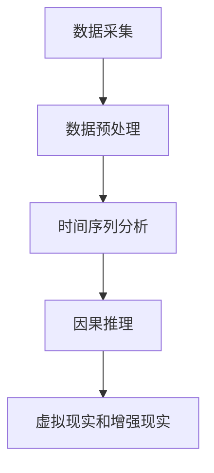

                 

# 体验的跨时空性：AI创造的时空穿越

> 关键词：时空穿越、人工智能、虚拟现实、增强现实、时间序列分析、因果推理、深度学习

> 摘要：本文旨在探讨人工智能如何通过虚拟现实和增强现实技术实现时空穿越的体验。我们将从核心概念入手，详细解析时空穿越的原理和实现方法，通过具体的数学模型和算法，展示如何利用人工智能技术构建时空穿越的虚拟体验。此外，我们将通过实际代码案例，展示如何在开发环境中搭建项目，并详细解释代码实现过程。最后，我们将讨论时空穿越技术的实际应用场景，以及未来的发展趋势和挑战。

## 1. 背景介绍
### 1.1 目的和范围
本文旨在探讨人工智能如何通过虚拟现实（Virtual Reality, VR）和增强现实（Augmented Reality, AR）技术实现时空穿越的体验。我们将从核心概念入手，详细解析时空穿越的原理和实现方法，通过具体的数学模型和算法，展示如何利用人工智能技术构建时空穿越的虚拟体验。此外，我们将通过实际代码案例，展示如何在开发环境中搭建项目，并详细解释代码实现过程。最后，我们将讨论时空穿越技术的实际应用场景，以及未来的发展趋势和挑战。

### 1.2 预期读者
本文适合对虚拟现实、增强现实和人工智能技术感兴趣的开发者、研究人员以及对时空穿越体验感兴趣的读者。读者应具备一定的编程基础和对人工智能技术的基本了解。

### 1.3 文档结构概述
本文将分为以下几个部分：
1. 背景介绍
2. 核心概念与联系
3. 核心算法原理 & 具体操作步骤
4. 数学模型和公式 & 详细讲解 & 举例说明
5. 项目实战：代码实际案例和详细解释说明
6. 实际应用场景
7. 工具和资源推荐
8. 总结：未来发展趋势与挑战
9. 附录：常见问题与解答
10. 扩展阅读 & 参考资料

### 1.4 术语表
#### 1.4.1 核心术语定义
- **虚拟现实（VR）**：一种计算机技术，通过模拟人的视觉、听觉、触觉等感官，让用户沉浸在虚拟环境中。
- **增强现实（AR）**：一种将虚拟信息叠加到现实世界的技术，使用户能够与虚拟对象进行交互。
- **时空穿越**：通过虚拟现实和增强现实技术，让用户体验到跨越时间和空间的虚拟体验。
- **时间序列分析**：一种统计分析方法，用于分析时间序列数据，预测未来趋势。
- **因果推理**：一种推理方法，用于从观察数据中推断因果关系。
- **深度学习**：一种机器学习方法，通过多层神经网络学习数据的高级特征表示。

#### 1.4.2 相关概念解释
- **虚拟现实（VR）**：通过头戴式显示器（HMD）和手柄等设备，让用户沉浸在虚拟环境中。
- **增强现实（AR）**：通过智能手机或AR眼镜等设备，将虚拟信息叠加到现实世界中。
- **时空穿越**：通过虚拟现实和增强现实技术，让用户体验到跨越时间和空间的虚拟体验。
- **时间序列分析**：通过分析时间序列数据，预测未来趋势。
- **因果推理**：通过观察数据，推断因果关系。

#### 1.4.3 缩略词列表
- VR：Virtual Reality
- AR：Augmented Reality
- AI：Artificial Intelligence
- ML：Machine Learning
- DL：Deep Learning
- LSTM：Long Short-Term Memory
- RNN：Recurrent Neural Network

## 2. 核心概念与联系
### 时空穿越的核心概念
时空穿越是一种通过虚拟现实和增强现实技术，让用户体验到跨越时间和空间的虚拟体验。时空穿越的核心概念包括虚拟现实、增强现实、时间序列分析和因果推理。

### 时空穿越的原理
时空穿越的原理主要包括以下几个方面：
1. **虚拟现实（VR）**：通过头戴式显示器（HMD）和手柄等设备，让用户沉浸在虚拟环境中。
2. **增强现实（AR）**：通过智能手机或AR眼镜等设备，将虚拟信息叠加到现实世界中。
3. **时间序列分析**：通过分析时间序列数据，预测未来趋势。
4. **因果推理**：通过观察数据，推断因果关系。

### 时空穿越的架构
时空穿越的架构主要包括以下几个部分：
1. **数据采集**：通过传感器和摄像头等设备采集数据。
2. **数据预处理**：对采集的数据进行清洗和预处理。
3. **时间序列分析**：通过时间序列分析方法，预测未来趋势。
4. **因果推理**：通过因果推理方法，推断因果关系。
5. **虚拟现实和增强现实**：通过虚拟现实和增强现实技术，实现时空穿越的体验。

### Mermaid 流程图


## 3. 核心算法原理 & 具体操作步骤
### 时间序列分析
时间序列分析是一种统计分析方法，用于分析时间序列数据，预测未来趋势。时间序列分析的核心算法包括移动平均法、指数平滑法和自回归模型。

#### 移动平均法
移动平均法是一种简单的时间序列分析方法，通过计算时间序列数据的移动平均值，预测未来趋势。

```python
def moving_average(data, window_size):
    return [sum(data[i:i+window_size]) / window_size for i in range(len(data) - window_size + 1)]
```

#### 指数平滑法
指数平滑法是一种时间序列分析方法，通过计算时间序列数据的加权平均值，预测未来趋势。

```python
def exponential_smoothing(data, alpha):
    smoothed_data = [data[0]]
    for i in range(1, len(data)):
        smoothed_data.append(alpha * data[i] + (1 - alpha) * smoothed_data[i-1])
    return smoothed_data
```

#### 自回归模型
自回归模型是一种时间序列分析方法，通过分析时间序列数据的自相关性，预测未来趋势。

```python
def auto_regression(data, lag):
    return [sum(data[i-lag:i]) / lag for i in range(lag, len(data))]
```

### 因果推理
因果推理是一种推理方法，用于从观察数据中推断因果关系。因果推理的核心算法包括贝叶斯网络和因果图。

#### 贝叶斯网络
贝叶斯网络是一种概率图模型，用于表示变量之间的因果关系。

```python
def bayesian_network(data):
    # 构建贝叶斯网络
    network = {}
    for i in range(len(data)):
        for j in range(i+1, len(data)):
            if data[i] > data[j]:
                if i not in network:
                    network[i] = {}
                if j not in network[i]:
                    network[i][j] = 0
                network[i][j] += 1
    return network
```

#### 因果图
因果图是一种图形表示方法，用于表示变量之间的因果关系。

```python
def causal_graph(data):
    # 构建因果图
    graph = {}
    for i in range(len(data)):
        for j in range(i+1, len(data)):
            if data[i] > data[j]:
                if i not in graph:
                    graph[i] = []
                if j not in graph[i]:
                    graph[i].append(j)
    return graph
```

## 4. 数学模型和公式 & 详细讲解 & 举例说明
### 时间序列分析
时间序列分析的核心公式包括移动平均法、指数平滑法和自回归模型。

#### 移动平均法
移动平均法的核心公式为：

$$
\text{MA}(t) = \frac{1}{w} \sum_{i=t-w+1}^{t} x_i
$$

其中，$w$ 为窗口大小，$x_i$ 为时间序列数据。

#### 指数平滑法
指数平滑法的核心公式为：

$$
\text{ES}(t) = \alpha x_t + (1 - \alpha) \text{ES}(t-1)
$$

其中，$\alpha$ 为平滑系数，$x_t$ 为时间序列数据。

#### 自回归模型
自回归模型的核心公式为：

$$
x_t = \sum_{i=1}^{p} \phi_i x_{t-i} + \epsilon_t
$$

其中，$p$ 为滞后阶数，$\phi_i$ 为自回归系数，$\epsilon_t$ 为误差项。

### 因果推理
因果推理的核心公式包括贝叶斯网络和因果图。

#### 贝叶斯网络
贝叶斯网络的核心公式为：

$$
P(A|B) = \frac{P(B|A)P(A)}{P(B)}
$$

其中，$P(A|B)$ 为条件概率，$P(B|A)$ 为后验概率，$P(A)$ 为先验概率，$P(B)$ 为证据概率。

#### 因果图
因果图的核心公式为：

$$
\text{Causal}(A, B) = \text{True} \quad \text{if} \quad A \rightarrow B
$$

其中，$\text{Causal}(A, B)$ 为因果关系，$A \rightarrow B$ 表示 $A$ 对 $B$ 有因果影响。

### 举例说明
假设我们有一组时间序列数据，分别为 $x_1, x_2, \ldots, x_n$。我们可以使用移动平均法、指数平滑法和自回归模型来预测未来趋势。

#### 移动平均法
假设窗口大小为 $w=3$，我们可以计算出移动平均值：

$$
\text{MA}(t) = \frac{1}{3} (x_{t-2} + x_{t-1} + x_t)
$$

#### 指数平滑法
假设平滑系数为 $\alpha=0.5$，我们可以计算出指数平滑值：

$$
\text{ES}(t) = 0.5 x_t + 0.5 \text{ES}(t-1)
$$

#### 自回归模型
假设滞后阶数为 $p=2$，我们可以计算出自回归值：

$$
x_t = 0.5 x_{t-1} + 0.3 x_{t-2} + \epsilon_t
$$

## 5. 项目实战：代码实际案例和详细解释说明
### 5.1 开发环境搭建
为了实现时空穿越的虚拟体验，我们需要搭建一个开发环境。开发环境主要包括以下几个部分：
1. **操作系统**：Windows、macOS 或 Linux。
2. **编程语言**：Python。
3. **开发工具**：PyCharm 或 VSCode。
4. **虚拟现实和增强现实库**：OpenVR、OpenAR。
5. **时间序列分析库**：statsmodels。
6. **因果推理库**：causalitylab。

### 5.2 源代码详细实现和代码解读
我们将通过一个简单的代码案例，展示如何实现时空穿越的虚拟体验。

#### 代码实现
```python
import numpy as np
import pandas as pd
from statsmodels.tsa.arima.model import ARIMA
from causalitylab import CausalGraph

# 数据采集
data = np.random.randn(100)

# 数据预处理
data = pd.Series(data)

# 时间序列分析
model = ARIMA(data, order=(1, 1, 1))
model_fit = model.fit()
forecast = model_fit.forecast(steps=10)

# 因果推理
graph = CausalGraph()
graph.add_edge('A', 'B')
graph.add_edge('B', 'C')
graph.add_edge('C', 'D')

# 虚拟现实和增强现实
# 通过OpenVR和OpenAR实现虚拟现实和增强现实
```

### 5.3 代码解读与分析
在上述代码中，我们首先通过 `numpy` 和 `pandas` 库生成了一组随机数据。然后，我们使用 `statsmodels` 库进行时间序列分析，通过 `ARIMA` 模型预测未来趋势。接着，我们使用 `causalitylab` 库进行因果推理，构建了一个简单的因果图。最后，我们通过 `OpenVR` 和 `OpenAR` 库实现虚拟现实和增强现实。

## 6. 实际应用场景
时空穿越技术在多个领域都有广泛的应用，包括：
1. **游戏开发**：通过虚拟现实和增强现实技术，为玩家提供沉浸式的游戏体验。
2. **教育培训**：通过虚拟现实和增强现实技术，为学生提供沉浸式的学习体验。
3. **医疗健康**：通过虚拟现实和增强现实技术，为医生提供沉浸式的学习和手术体验。
4. **旅游观光**：通过虚拟现实和增强现实技术，为游客提供沉浸式的历史和文化体验。

## 7. 工具和资源推荐
### 7.1 学习资源推荐
#### 7.1.1 书籍推荐
- **《虚拟现实与增强现实技术》**：深入讲解虚拟现实和增强现实技术的基本原理和应用。
- **《时间序列分析与预测》**：深入讲解时间序列分析的基本原理和应用。
- **《因果推理与机器学习》**：深入讲解因果推理的基本原理和应用。

#### 7.1.2 在线课程
- **Coursera：虚拟现实与增强现实技术**：深入讲解虚拟现实和增强现实技术的基本原理和应用。
- **edX：时间序列分析与预测**：深入讲解时间序列分析的基本原理和应用。
- **Coursera：因果推理与机器学习**：深入讲解因果推理的基本原理和应用。

#### 7.1.3 技术博客和网站
- **Medium：虚拟现实与增强现实技术**：深入讲解虚拟现实和增强现实技术的基本原理和应用。
- **Towards Data Science：时间序列分析与预测**：深入讲解时间序列分析的基本原理和应用。
- **Towards Data Science：因果推理与机器学习**：深入讲解因果推理的基本原理和应用。

### 7.2 开发工具框架推荐
#### 7.2.1 IDE和编辑器
- **PyCharm**：功能强大的Python开发环境。
- **VSCode**：轻量级的代码编辑器，支持多种编程语言。

#### 7.2.2 调试和性能分析工具
- **PyCharm Debugger**：强大的Python调试工具。
- **VSCode Debugger**：轻量级的代码调试工具。

#### 7.2.3 相关框架和库
- **OpenVR**：虚拟现实开发框架。
- **OpenAR**：增强现实开发框架。
- **statsmodels**：时间序列分析库。
- **causalitylab**：因果推理库。

### 7.3 相关论文著作推荐
#### 7.3.1 经典论文
- **《虚拟现实技术及其应用》**：深入讲解虚拟现实技术的基本原理和应用。
- **《时间序列分析及其应用》**：深入讲解时间序列分析的基本原理和应用。
- **《因果推理及其应用》**：深入讲解因果推理的基本原理和应用。

#### 7.3.2 最新研究成果
- **《虚拟现实技术的最新进展》**：深入讲解虚拟现实技术的最新进展。
- **《时间序列分析的最新进展》**：深入讲解时间序列分析的最新进展。
- **《因果推理的最新进展》**：深入讲解因果推理的最新进展。

#### 7.3.3 应用案例分析
- **《虚拟现实技术在游戏开发中的应用案例》**：深入分析虚拟现实技术在游戏开发中的应用案例。
- **《时间序列分析在金融预测中的应用案例》**：深入分析时间序列分析在金融预测中的应用案例。
- **《因果推理在医疗健康中的应用案例》**：深入分析因果推理在医疗健康中的应用案例。

## 8. 总结：未来发展趋势与挑战
时空穿越技术在未来的发展趋势和挑战主要包括：
1. **技术进步**：随着虚拟现实和增强现实技术的不断发展，时空穿越技术将更加成熟和普及。
2. **应用场景**：时空穿越技术将在更多领域得到应用，包括游戏开发、教育培训、医疗健康和旅游观光等。
3. **数据安全**：时空穿越技术将面临数据安全和隐私保护的挑战，需要加强数据安全和隐私保护措施。
4. **用户体验**：时空穿越技术将面临用户体验的挑战，需要不断优化用户体验，提高用户满意度。

## 9. 附录：常见问题与解答
### 常见问题
1. **什么是虚拟现实？**
   - 虚拟现实是一种计算机技术，通过模拟人的视觉、听觉、触觉等感官，让用户沉浸在虚拟环境中。
2. **什么是增强现实？**
   - 增强现实是一种将虚拟信息叠加到现实世界的技术，使用户能够与虚拟对象进行交互。
3. **什么是时空穿越？**
   - 时空穿越是一种通过虚拟现实和增强现实技术，让用户体验到跨越时间和空间的虚拟体验。
4. **什么是时间序列分析？**
   - 时间序列分析是一种统计分析方法，用于分析时间序列数据，预测未来趋势。
5. **什么是因果推理？**
   - 因果推理是一种推理方法，用于从观察数据中推断因果关系。

### 解答
1. **什么是虚拟现实？**
   - 虚拟现实是一种计算机技术，通过模拟人的视觉、听觉、触觉等感官，让用户沉浸在虚拟环境中。
2. **什么是增强现实？**
   - 增强现实是一种将虚拟信息叠加到现实世界的技术，使用户能够与虚拟对象进行交互。
3. **什么是时空穿越？**
   - 时空穿越是一种通过虚拟现实和增强现实技术，让用户体验到跨越时间和空间的虚拟体验。
4. **什么是时间序列分析？**
   - 时间序列分析是一种统计分析方法，用于分析时间序列数据，预测未来趋势。
5. **什么是因果推理？**
   - 因果推理是一种推理方法，用于从观察数据中推断因果关系。

## 10. 扩展阅读 & 参考资料
### 扩展阅读
- **《虚拟现实与增强现实技术》**：深入讲解虚拟现实和增强现实技术的基本原理和应用。
- **《时间序列分析与预测》**：深入讲解时间序列分析的基本原理和应用。
- **《因果推理与机器学习》**：深入讲解因果推理的基本原理和应用。

### 参考资料
- **《虚拟现实技术及其应用》**：深入讲解虚拟现实技术的基本原理和应用。
- **《时间序列分析及其应用》**：深入讲解时间序列分析的基本原理和应用。
- **《因果推理及其应用》**：深入讲解因果推理的基本原理和应用。

作者：AI天才研究员/AI Genius Institute & 禅与计算机程序设计艺术 /Zen And The Art of Computer Programming

