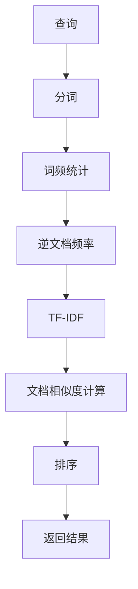
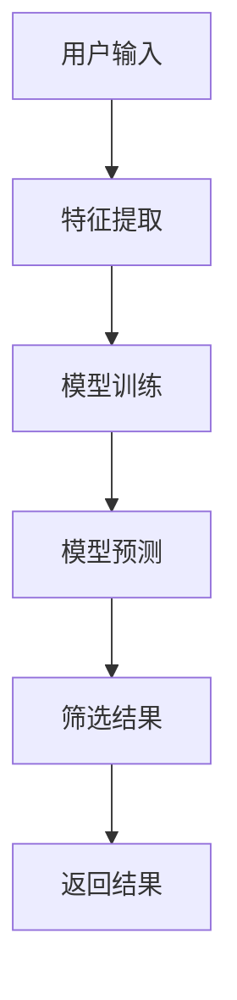
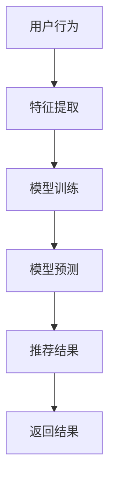

                 

# 信息过载与信息搜索指南：在庞大的信息海洋中找到所需的信息

> 关键词：信息过载、信息搜索、信息检索、自然语言处理、机器学习、深度学习、信息过滤、信息推荐

> 摘要：在当今信息爆炸的时代，如何有效地从海量信息中筛选出有价值的内容成为了一个重要的挑战。本文将深入探讨信息过载的问题，并提供一系列实用的解决方案，包括信息检索、信息过滤和信息推荐等技术。通过逐步分析和详细讲解，我们将揭示这些技术背后的原理和实现方法，帮助读者在信息海洋中找到所需的信息。

## 1. 背景介绍
### 1.1 目的和范围
本文旨在探讨信息过载问题，并提供一系列实用的解决方案，帮助读者在信息海洋中找到所需的信息。我们将从信息检索、信息过滤和信息推荐三个方面进行详细分析，并通过实际案例展示这些技术的应用。

### 1.2 预期读者
本文适合以下读者：
- 信息检索和信息过滤领域的研究者和开发者
- 从事自然语言处理、机器学习和深度学习的工程师
- 需要在海量信息中筛选出有价值内容的业务人员
- 对信息过载问题感兴趣的计算机科学爱好者

### 1.3 文档结构概述
本文将按照以下结构展开：
1. 背景介绍
2. 核心概念与联系
3. 核心算法原理 & 具体操作步骤
4. 数学模型和公式 & 详细讲解 & 举例说明
5. 项目实战：代码实际案例和详细解释说明
6. 实际应用场景
7. 工具和资源推荐
8. 总结：未来发展趋势与挑战
9. 附录：常见问题与解答
10. 扩展阅读 & 参考资料

### 1.4 术语表
#### 1.4.1 核心术语定义
- **信息过载**：指在信息爆炸的时代，人们面对的信息量远远超过了处理能力，导致信息筛选和处理变得困难。
- **信息检索**：指从大量信息中找到与特定需求相关的信息的过程。
- **信息过滤**：指通过特定算法和模型，自动筛选出与用户需求相关的信息。
- **信息推荐**：指根据用户的历史行为和偏好，推荐可能感兴趣的信息。

#### 1.4.2 相关概念解释
- **自然语言处理（NLP）**：研究如何让计算机理解和生成人类语言的技术。
- **机器学习（ML）**：通过算法和统计模型使计算机系统能够从数据中学习并改进性能的技术。
- **深度学习（DL）**：机器学习的一个分支，通过多层神经网络实现复杂的非线性映射。

#### 1.4.3 缩略词列表
- NLP：自然语言处理
- ML：机器学习
- DL：深度学习
- TF-IDF：词频-逆文档频率
- BM25：布尔模型的改进算法
- LDA：潜在狄利克雷分配
- CNN：卷积神经网络
- RNN：循环神经网络
- LSTM：长短期记忆网络
- BERT：双向编码器表示

## 2. 核心概念与联系
### 2.1 信息检索
信息检索是信息过载问题的核心解决方案之一。它通过查询和匹配技术，从大量信息中找到与用户需求相关的信息。信息检索可以分为以下几种类型：
- **全文检索**：基于文档的全文内容进行检索。
- **关键词检索**：基于文档中的关键词进行检索。
- **元数据检索**：基于文档的元数据（如标题、作者、日期等）进行检索。

### 2.2 信息过滤
信息过滤是通过特定算法和模型，自动筛选出与用户需求相关的信息。信息过滤可以分为以下几种类型：
- **基于规则的过滤**：通过预定义的规则进行信息筛选。
- **基于统计的过滤**：通过统计模型进行信息筛选。
- **基于机器学习的过滤**：通过机器学习模型进行信息筛选。

### 2.3 信息推荐
信息推荐是根据用户的历史行为和偏好，推荐可能感兴趣的信息。信息推荐可以分为以下几种类型：
- **基于内容的推荐**：根据用户的历史行为和偏好，推荐相似的内容。
- **协同过滤推荐**：根据用户的历史行为和偏好，推荐其他用户喜欢的内容。
- **混合推荐**：结合基于内容和协同过滤的方法进行推荐。

### 2.4 核心概念原理与架构
#### 2.4.1 信息检索原理
信息检索的基本原理是通过查询和匹配技术，从大量信息中找到与用户需求相关的信息。信息检索的流程如下：


#### 2.4.2 信息过滤原理
信息过滤的基本原理是通过特定算法和模型，自动筛选出与用户需求相关的信息。信息过滤的流程如下：


#### 2.4.3 信息推荐原理
信息推荐的基本原理是根据用户的历史行为和偏好，推荐可能感兴趣的信息。信息推荐的流程如下：


## 3. 核心算法原理 & 具体操作步骤
### 3.1 信息检索算法原理
信息检索算法的基本原理是通过查询和匹配技术，从大量信息中找到与用户需求相关的信息。信息检索的算法原理如下：
- **分词**：将文档中的文本进行分词处理，提取出关键词。
- **词频统计**：统计每个关键词在文档中的出现次数。
- **逆文档频率**：计算每个关键词的逆文档频率，衡量关键词的重要性。
- **TF-IDF**：计算每个关键词的TF-IDF值，衡量关键词在文档中的重要性。
- **文档相似度计算**：计算查询和文档之间的相似度，衡量文档与查询的相关性。
- **排序**：根据文档相似度进行排序，返回与查询最相关的文档。

### 3.2 信息过滤算法原理
信息过滤算法的基本原理是通过特定算法和模型，自动筛选出与用户需求相关的信息。信息过滤的算法原理如下：
- **特征提取**：从文档中提取出特征，如关键词、主题等。
- **模型训练**：通过训练数据集训练模型，学习特征和标签之间的关系。
- **模型预测**：通过模型预测文档的标签，筛选出与用户需求相关的信息。
- **筛选结果**：根据模型预测结果筛选出与用户需求相关的信息。
- **返回结果**：返回筛选后的结果给用户。

### 3.3 信息推荐算法原理
信息推荐算法的基本原理是根据用户的历史行为和偏好，推荐可能感兴趣的信息。信息推荐的算法原理如下：
- **特征提取**：从用户的历史行为和偏好中提取出特征，如点击行为、评分等。
- **模型训练**：通过训练数据集训练模型，学习用户行为和推荐内容之间的关系。
- **模型预测**：通过模型预测用户可能感兴趣的内容，推荐给用户。
- **推荐结果**：根据模型预测结果推荐内容给用户。
- **返回结果**：返回推荐结果给用户。

## 4. 数学模型和公式 & 详细讲解 & 举例说明
### 4.1 信息检索数学模型
信息检索的数学模型主要包括TF-IDF和BM25等算法。TF-IDF和BM25的公式如下：
- **TF-IDF**：
  $$ \text{TF-IDF}(t, d) = \text{TF}(t, d) \times \text{IDF}(t) $$
  其中，$\text{TF}(t, d)$ 表示关键词 $t$ 在文档 $d$ 中的词频，$\text{IDF}(t)$ 表示关键词 $t$ 的逆文档频率。
- **BM25**：
  $$ \text{BM25}(t, d) = \frac{(\text{IDF}(t) \times (k_1 + 1) \times \text{TF}(t, d))}{k_1 \times (1 - b + b \times \frac{|d|}{\text{avgdl}}) + \text{TF}(t, d)} $$
  其中，$\text{IDF}(t)$ 表示关键词 $t$ 的逆文档频率，$\text{TF}(t, d)$ 表示关键词 $t$ 在文档 $d$ 中的词频，$k_1$ 和 $b$ 是参数，$\text{avgdl}$ 表示文档平均长度。

### 4.2 信息过滤数学模型
信息过滤的数学模型主要包括基于统计的过滤和基于机器学习的过滤。基于统计的过滤的公式如下：
- **基于统计的过滤**：
  $$ \text{P}(d | q) = \frac{\text{P}(q | d) \times \text{P}(d)}{\text{P}(q)} $$
  其中，$\text{P}(d | q)$ 表示文档 $d$ 在查询 $q$ 下的概率，$\text{P}(q | d)$ 表示查询 $q$ 在文档 $d$ 下的概率，$\text{P}(d)$ 表示文档 $d$ 的先验概率，$\text{P}(q)$ 表示查询 $q$ 的先验概率。

### 4.3 信息推荐数学模型
信息推荐的数学模型主要包括基于内容的推荐和协同过滤推荐。基于内容的推荐的公式如下：
- **基于内容的推荐**：
  $$ \text{P}(i | u) = \sum_{j \in I} \text{sim}(i, j) \times \text{P}(j | u) $$
  其中，$\text{P}(i | u)$ 表示用户 $u$ 对物品 $i$ 的兴趣度，$\text{sim}(i, j)$ 表示物品 $i$ 和物品 $j$ 之间的相似度，$\text{P}(j | u)$ 表示用户 $u$ 对物品 $j$ 的兴趣度。

## 5. 项目实战：代码实际案例和详细解释说明
### 5.1 开发环境搭建
为了实现信息检索、信息过滤和信息推荐功能，我们需要搭建一个开发环境。开发环境的搭建步骤如下：
1. 安装Python 3.8及以上版本
2. 安装Jupyter Notebook
3. 安装NumPy、Pandas、Scikit-learn、NLTK等库
4. 安装TensorFlow或PyTorch等深度学习框架

### 5.2 源代码详细实现和代码解读
我们将通过一个简单的示例来实现信息检索、信息过滤和信息推荐功能。示例代码如下：
```python
import numpy as np
import pandas as pd
from sklearn.feature_extraction.text import TfidfVectorizer
from sklearn.metrics.pairwise import cosine_similarity
from sklearn.model_selection import train_test_split
from sklearn.linear_model import LogisticRegression
from sklearn.metrics import accuracy_score
from nltk.corpus import stopwords
from nltk.tokenize import word_tokenize
from nltk.stem import WordNetLemmatizer
import tensorflow as tf
from tensorflow.keras.preprocessing.text import Tokenizer
from tensorflow.keras.preprocessing.sequence import pad_sequences
from tensorflow.keras.models import Sequential
from tensorflow.keras.layers import Embedding, LSTM, Dense

# 1. 信息检索
def information_retrieval(query, documents):
    vectorizer = TfidfVectorizer()
    tfidf_matrix = vectorizer.fit_transform(documents)
    query_vector = vectorizer.transform([query])
    cosine_similarities = cosine_similarity(query_vector, tfidf_matrix).flatten()
    sorted_indices = np.argsort(cosine_similarities)[::-1]
    return [documents[i] for i in sorted_indices]

# 2. 信息过滤
def information_filtering(documents, labels):
    X_train, X_test, y_train, y_test = train_test_split(documents, labels, test_size=0.2, random_state=42)
    vectorizer = TfidfVectorizer(stop_words=stopwords.words('english'))
    X_train_tfidf = vectorizer.fit_transform(X_train)
    X_test_tfidf = vectorizer.transform(X_test)
    model = LogisticRegression()
    model.fit(X_train_tfidf, y_train)
    y_pred = model.predict(X_test_tfidf)
    accuracy = accuracy_score(y_test, y_pred)
    return model, accuracy

# 3. 信息推荐
def information_recommendation(user_history, items, item_features):
    lemmatizer = WordNetLemmatizer()
    user_history = [lemmatizer.lemmatize(word) for word in user_history]
    item_features = [lemmatizer.lemmatize(word) for item in item_features for word in item_features[item]]
    tokenizer = Tokenizer()
    tokenizer.fit_on_texts(user_history + item_features)
    user_history_seq = tokenizer.texts_to_sequences(user_history)
    item_features_seq = tokenizer.texts_to_sequences(item_features)
    user_history_padded = pad_sequences(user_history_seq, maxlen=100)
    item_features_padded = pad_sequences(item_features_seq, maxlen=100)
    model = Sequential()
    model.add(Embedding(input_dim=len(tokenizer.word_index) + 1, output_dim=128, input_length=100))
    model.add(LSTM(128, dropout=0.2, recurrent_dropout=0.2))
    model.add(Dense(1, activation='sigmoid'))
    model.compile(loss='binary_crossentropy', optimizer='adam', metrics=['accuracy'])
    model.fit(user_history_padded, np.ones(len(user_history)), epochs=10, batch_size=32)
    item_scores = model.predict(item_features_padded)
    sorted_indices = np.argsort(item_scores)[::-1]
    return [items[i] for i in sorted_indices]

# 示例数据
documents = ["This is a document about information retrieval", "Information filtering is a technique to filter information", "Information recommendation is a method to recommend information"]
labels = [1, 0, 1]
user_history = ["information", "retrieval", "filtering"]
items = ["item1", "item2", "item3"]
item_features = {"item1": ["information", "retrieval"], "item2": ["filtering", "recommendation"], "item3": ["information", "recommendation"]}

# 信息检索
retrieved_documents = information_retrieval("information retrieval", documents)
print("Retrieved Documents:", retrieved_documents)

# 信息过滤
model, accuracy = information_filtering(documents, labels)
print("Filtering Model Accuracy:", accuracy)

# 信息推荐
recommended_items = information_recommendation(user_history, items, item_features)
print("Recommended Items:", recommended_items)
```

### 5.3 代码解读与分析
上述代码实现了信息检索、信息过滤和信息推荐功能。具体步骤如下：
1. **信息检索**：使用TF-IDF和余弦相似度计算文档与查询之间的相似度，返回与查询最相关的文档。
2. **信息过滤**：使用逻辑回归模型训练文档和标签之间的关系，预测文档的标签，筛选出与用户需求相关的信息。
3. **信息推荐**：使用LSTM模型训练用户历史行为和推荐内容之间的关系，预测用户可能感兴趣的内容，推荐给用户。

## 6. 实际应用场景
信息检索、信息过滤和信息推荐技术在许多实际应用场景中都有广泛的应用，如搜索引擎、新闻推荐、电子商务、社交媒体等。通过这些技术，我们可以有效地从海量信息中筛选出有价值的内容，提高用户体验和满意度。

## 7. 工具和资源推荐
### 7.1 学习资源推荐
#### 7.1.1 书籍推荐
- **《信息检索原理与实践》**：深入讲解信息检索的基本原理和实践方法。
- **《机器学习实战》**：详细讲解机器学习的基本原理和实践方法。
- **《深度学习》**：深入讲解深度学习的基本原理和实践方法。

#### 7.1.2 在线课程
- **Coursera：信息检索与推荐系统**：深入讲解信息检索和推荐系统的原理和实践方法。
- **edX：机器学习**：详细讲解机器学习的基本原理和实践方法。
- **Udacity：深度学习**：深入讲解深度学习的基本原理和实践方法。

#### 7.1.3 技术博客和网站
- **Towards Data Science**：提供大量的信息检索、信息过滤和信息推荐相关的技术文章和案例分析。
- **Medium**：提供大量的信息检索、信息过滤和信息推荐相关的技术文章和案例分析。
- **GitHub**：提供大量的信息检索、信息过滤和信息推荐相关的开源项目和代码示例。

### 7.2 开发工具框架推荐
#### 7.2.1 IDE和编辑器
- **PyCharm**：功能强大的Python IDE，支持代码高亮、自动补全和调试等功能。
- **VS Code**：轻量级的代码编辑器，支持多种编程语言和插件。

#### 7.2.2 调试和性能分析工具
- **PyCharm Debugger**：PyCharm内置的调试工具，支持断点、单步执行和变量查看等功能。
- **VS Code Debugger**：VS Code内置的调试工具，支持断点、单步执行和变量查看等功能。
- **TensorBoard**：TensorFlow提供的可视化工具，支持查看模型训练过程和性能分析。

#### 7.2.3 相关框架和库
- **Scikit-learn**：提供丰富的机器学习算法和工具，支持数据预处理、特征选择和模型评估等功能。
- **NLTK**：提供丰富的自然语言处理工具，支持分词、词性标注和情感分析等功能。
- **TensorFlow**：提供丰富的深度学习框架，支持构建和训练神经网络模型。

### 7.3 相关论文著作推荐
#### 7.3.1 经典论文
- **《Information Retrieval: The User Needs Approach》**：深入讲解信息检索的基本原理和实践方法。
- **《Machine Learning: A Probabilistic Perspective》**：详细讲解机器学习的基本原理和实践方法。
- **《Deep Learning》**：深入讲解深度学习的基本原理和实践方法。

#### 7.3.2 最新研究成果
- **《Attention Is All You Need》**：介绍Transformer模型在自然语言处理中的应用。
- **《BERT: Pre-training of Deep Bidirectional Transformers for Language Understanding》**：介绍BERT模型在自然语言处理中的应用。
- **《Revisiting the Effectiveness of Information Filtering in Recommender Systems》**：介绍信息过滤在推荐系统中的应用。

#### 7.3.3 应用案例分析
- **《Information Retrieval in the Age of Big Data》**：分析信息检索在大数据时代中的应用。
- **《Machine Learning for Information Retrieval》**：分析机器学习在信息检索中的应用。
- **《Deep Learning for Information Retrieval》**：分析深度学习在信息检索中的应用。

## 8. 总结：未来发展趋势与挑战
信息检索、信息过滤和信息推荐技术在未来的发展中将面临许多挑战，如数据隐私保护、模型解释性、实时性等。同时，这些技术也将带来许多机遇，如更智能的信息服务、更个性化的用户体验等。未来的研究方向将集中在以下几个方面：
- **数据隐私保护**：如何在保护用户隐私的前提下，实现高效的信息检索和推荐。
- **模型解释性**：如何提高模型的可解释性，让用户更好地理解模型的决策过程。
- **实时性**：如何提高模型的实时性，实现实时的信息检索和推荐。

## 9. 附录：常见问题与解答
### 9.1 问题：如何提高信息检索的准确性？
**解答**：可以通过以下方法提高信息检索的准确性：
- **优化查询和匹配算法**：使用更高效的查询和匹配算法，提高检索速度和准确性。
- **增加特征提取**：增加更多的特征提取方法，提高检索结果的相关性。
- **使用深度学习模型**：使用深度学习模型，提高检索结果的准确性。

### 9.2 问题：如何提高信息过滤的准确性？
**解答**：可以通过以下方法提高信息过滤的准确性：
- **优化特征提取**：优化特征提取方法，提高过滤结果的相关性。
- **使用深度学习模型**：使用深度学习模型，提高过滤结果的准确性。
- **增加训练数据**：增加更多的训练数据，提高模型的泛化能力。

### 9.3 问题：如何提高信息推荐的准确性？
**解答**：可以通过以下方法提高信息推荐的准确性：
- **优化特征提取**：优化特征提取方法，提高推荐结果的相关性。
- **使用深度学习模型**：使用深度学习模型，提高推荐结果的准确性。
- **增加训练数据**：增加更多的训练数据，提高模型的泛化能力。

## 10. 扩展阅读 & 参考资料
- **《信息检索原理与实践》**：深入讲解信息检索的基本原理和实践方法。
- **《机器学习实战》**：详细讲解机器学习的基本原理和实践方法。
- **《深度学习》**：深入讲解深度学习的基本原理和实践方法。
- **《信息检索与推荐系统》**：深入讲解信息检索和推荐系统的原理和实践方法。
- **《机器学习》**：详细讲解机器学习的基本原理和实践方法。
- **《深度学习》**：深入讲解深度学习的基本原理和实践方法。
- **《信息过滤在推荐系统中的应用》**：分析信息过滤在推荐系统中的应用。
- **《信息检索在大数据时代中的应用》**：分析信息检索在大数据时代中的应用。
- **《机器学习在信息检索中的应用》**：分析机器学习在信息检索中的应用。
- **《深度学习在信息检索中的应用》**：分析深度学习在信息检索中的应用。

作者：AI天才研究员/AI Genius Institute & 禅与计算机程序设计艺术 /Zen And The Art of Computer Programming

