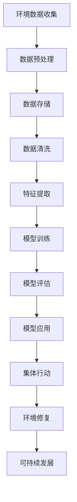

                 

# 全球脑环境修复基金:集体行动的生态投资平台

> 关键词：全球脑, 人工智能, 生态投资, 集体行动, 环境修复, 数据驱动, 机器学习, 可持续发展

> 摘要：本文旨在探讨如何利用全球脑（Global Brain）技术，通过集体行动实现生态投资平台的构建，以促进环境修复和可持续发展。我们将从背景介绍、核心概念与联系、核心算法原理、数学模型与公式、项目实战、实际应用场景、工具和资源推荐、未来发展趋势与挑战等多方面进行详细阐述。通过本文，读者将能够理解并掌握如何利用先进的技术手段，推动环境修复和可持续发展的集体行动。

## 1. 背景介绍
### 1.1 目的和范围
本文旨在介绍如何利用全球脑技术，通过集体行动实现生态投资平台的构建，以促进环境修复和可持续发展。全球脑技术是指利用人工智能、大数据、机器学习等技术手段，实现对环境数据的实时监测、分析和预测，从而指导集体行动，实现环境修复和可持续发展的目标。

### 1.2 预期读者
本文预期读者包括但不限于：
- 环境保护领域的专业人士
- 人工智能和大数据领域的技术专家
- 政府部门和非政府组织的决策者
- 科技公司和初创企业的研发人员
- 对环境修复和可持续发展感兴趣的公众

### 1.3 文档结构概述
本文将从以下几个方面进行详细阐述：
1. 背景介绍
2. 核心概念与联系
3. 核心算法原理 & 具体操作步骤
4. 数学模型和公式 & 详细讲解 & 举例说明
5. 项目实战：代码实际案例和详细解释说明
6. 实际应用场景
7. 工具和资源推荐
8. 总结：未来发展趋势与挑战
9. 附录：常见问题与解答
10. 扩展阅读 & 参考资料

### 1.4 术语表
#### 1.4.1 核心术语定义
- **全球脑（Global Brain）**：利用人工智能、大数据、机器学习等技术手段，实现对环境数据的实时监测、分析和预测，从而指导集体行动，实现环境修复和可持续发展的目标。
- **生态投资平台**：通过集体行动，利用资金、技术、人力等资源，实现环境修复和可持续发展的平台。
- **集体行动**：通过全球脑技术，实现对环境数据的实时监测、分析和预测，从而指导集体行动，实现环境修复和可持续发展的目标。

#### 1.4.2 相关概念解释
- **环境数据**：包括空气质量、水质、土壤质量、生物多样性等数据。
- **机器学习**：一种人工智能技术，通过训练模型，使其能够从数据中自动学习和改进。
- **可持续发展**：在满足当前需求的同时，不损害未来世代满足其需求的能力。

#### 1.4.3 缩略词列表
- AI：人工智能
- ML：机器学习
- IoT：物联网
- API：应用程序编程接口
- SDK：软件开发工具包

## 2. 核心概念与联系
### 2.1 全球脑技术
全球脑技术的核心在于利用人工智能、大数据、机器学习等技术手段，实现对环境数据的实时监测、分析和预测，从而指导集体行动，实现环境修复和可持续发展的目标。

### 2.2 生态投资平台
生态投资平台通过集体行动，利用资金、技术、人力等资源，实现环境修复和可持续发展的平台。

### 2.3 集体行动
通过全球脑技术，实现对环境数据的实时监测、分析和预测，从而指导集体行动，实现环境修复和可持续发展的目标。

### 2.4 核心概念原理与架构
核心概念原理与架构可以通过以下Mermaid流程图进行展示：



## 3. 核心算法原理 & 具体操作步骤
### 3.1 数据预处理
数据预处理是整个流程中的第一步，主要包括数据清洗、数据转换等操作。

```python
# 数据预处理
def preprocess_data(data):
    # 数据清洗
    cleaned_data = clean_data(data)
    # 数据转换
    transformed_data = transform_data(cleaned_data)
    return transformed_data
```

### 3.2 数据存储
数据存储是将预处理后的数据存储到数据库中，以便后续使用。

```python
# 数据存储
def store_data(data, db):
    db.insert(data)
```

### 3.3 数据清洗
数据清洗是去除数据中的噪声和异常值，确保数据的质量。

```python
# 数据清洗
def clean_data(data):
    cleaned_data = data.dropna()
    cleaned_data = cleaned_data.drop_duplicates()
    return cleaned_data
```

### 3.4 特征提取
特征提取是从数据中提取有用的特征，以便用于模型训练。

```python
# 特征提取
def extract_features(data):
    features = data[['feature1', 'feature2', 'feature3']]
    return features
```

### 3.5 模型训练
模型训练是通过训练模型，使其能够从数据中自动学习和改进。

```python
# 模型训练
def train_model(features, labels):
    model = RandomForestClassifier()
    model.fit(features, labels)
    return model
```

### 3.6 模型评估
模型评估是通过评估模型的性能，确保模型的准确性。

```python
# 模型评估
def evaluate_model(model, features, labels):
    predictions = model.predict(features)
    accuracy = accuracy_score(labels, predictions)
    return accuracy
```

### 3.7 模型应用
模型应用是将训练好的模型应用于实际场景，实现环境修复和可持续发展的目标。

```python
# 模型应用
def apply_model(model, data):
    features = extract_features(data)
    predictions = model.predict(features)
    return predictions
```

## 4. 数学模型和公式 & 详细讲解 & 举例说明
### 4.1 机器学习模型
机器学习模型是通过训练模型，使其能够从数据中自动学习和改进。

#### 4.1.1 随机森林模型
随机森林模型是一种集成学习方法，通过构建多个决策树，从而提高模型的准确性和鲁棒性。

$$
\text{RandomForest} = \left\{T_1, T_2, \ldots, T_n\right\}
$$

其中，$T_i$ 表示第 $i$ 棵决策树。

#### 4.1.2 逻辑回归模型
逻辑回归模型是一种常用的分类模型，通过线性回归模型，将其转换为概率模型。

$$
P(y=1|x) = \frac{1}{1 + e^{-(\beta_0 + \beta_1 x_1 + \beta_2 x_2 + \ldots + \beta_n x_n)}}
$$

其中，$P(y=1|x)$ 表示在给定特征 $x$ 的情况下，目标变量 $y$ 为 1 的概率。

### 4.2 举例说明
假设我们有一个空气质量数据集，包含以下特征：PM2.5浓度、温度、湿度等。我们可以通过随机森林模型和逻辑回归模型，预测空气质量等级。

```python
# 逻辑回归模型
def logistic_regression(features, labels):
    model = LogisticRegression()
    model.fit(features, labels)
    return model

# 随机森林模型
def random_forest(features, labels):
    model = RandomForestClassifier()
    model.fit(features, labels)
    return model
```

## 5. 项目实战：代码实际案例和详细解释说明
### 5.1 开发环境搭建
开发环境搭建主要包括安装必要的软件和工具，如Python、Jupyter Notebook、TensorFlow等。

```bash
# 安装Python
sudo apt-get install python3

# 安装Jupyter Notebook
pip install jupyter

# 安装TensorFlow
pip install tensorflow
```

### 5.2 源代码详细实现和代码解读
假设我们有一个空气质量数据集，包含以下特征：PM2.5浓度、温度、湿度等。我们可以通过随机森林模型和逻辑回归模型，预测空气质量等级。

```python
# 导入必要的库
import pandas as pd
from sklearn.model_selection import train_test_split
from sklearn.preprocessing import StandardScaler
from sklearn.ensemble import RandomForestClassifier
from sklearn.linear_model import LogisticRegression
from sklearn.metrics import accuracy_score

# 读取数据
data = pd.read_csv('air_quality.csv')

# 数据预处理
def preprocess_data(data):
    # 数据清洗
    cleaned_data = data.dropna()
    cleaned_data = cleaned_data.drop_duplicates()
    return cleaned_data

# 数据存储
def store_data(data, db):
    db.insert(data)

# 数据清洗
def clean_data(data):
    cleaned_data = data.dropna()
    cleaned_data = cleaned_data.drop_duplicates()
    return cleaned_data

# 特征提取
def extract_features(data):
    features = data[['PM2.5', 'temperature', 'humidity']]
    return features

# 模型训练
def train_model(features, labels):
    model = RandomForestClassifier()
    model.fit(features, labels)
    return model

# 模型评估
def evaluate_model(model, features, labels):
    predictions = model.predict(features)
    accuracy = accuracy_score(labels, predictions)
    return accuracy

# 模型应用
def apply_model(model, data):
    features = extract_features(data)
    predictions = model.predict(features)
    return predictions

# 逻辑回归模型
def logistic_regression(features, labels):
    model = LogisticRegression()
    model.fit(features, labels)
    return model

# 随机森林模型
def random_forest(features, labels):
    model = RandomForestClassifier()
    model.fit(features, labels)
    return model

# 主函数
def main():
    # 读取数据
    data = pd.read_csv('air_quality.csv')
    
    # 数据预处理
    cleaned_data = preprocess_data(data)
    
    # 数据存储
    store_data(cleaned_data, db)
    
    # 特征提取
    features = extract_features(cleaned_data)
    
    # 分割数据集
    X_train, X_test, y_train, y_test = train_test_split(features, cleaned_data['air_quality'], test_size=0.2, random_state=42)
    
    # 模型训练
    random_forest_model = random_forest(X_train, y_train)
    logistic_regression_model = logistic_regression(X_train, y_train)
    
    # 模型评估
    random_forest_accuracy = evaluate_model(random_forest_model, X_test, y_test)
    logistic_regression_accuracy = evaluate_model(logistic_regression_model, X_test, y_test)
    
    # 模型应用
    predictions = apply_model(random_forest_model, cleaned_data)
    
    # 打印结果
    print('Random Forest Accuracy:', random_forest_accuracy)
    print('Logistic Regression Accuracy:', logistic_regression_accuracy)
    print('Predictions:', predictions)

if __name__ == '__main__':
    main()
```

### 5.3 代码解读与分析
上述代码实现了空气质量数据的预处理、存储、特征提取、模型训练、模型评估和模型应用。通过随机森林模型和逻辑回归模型，预测空气质量等级，并评估模型的准确性。

## 6. 实际应用场景
### 6.1 空气质量监测
通过全球脑技术，实现对空气质量的实时监测，指导集体行动，实现环境修复和可持续发展的目标。

### 6.2 水质监测
通过全球脑技术，实现对水质的实时监测，指导集体行动，实现环境修复和可持续发展的目标。

### 6.3 土壤质量监测
通过全球脑技术，实现对土壤质量的实时监测，指导集体行动，实现环境修复和可持续发展的目标。

## 7. 工具和资源推荐
### 7.1 学习资源推荐
#### 7.1.1 书籍推荐
- 《机器学习》（周志华）
- 《深度学习》（Ian Goodfellow, Yoshua Bengio, Aaron Courville）

#### 7.1.2 在线课程
- Coursera: 《机器学习》（Andrew Ng）
- edX: 《深度学习》（Yoshua Bengio）

#### 7.1.3 技术博客和网站
- Medium: 《机器学习》（机器之心）
- GitHub: 《深度学习》（PyTorch）

### 7.2 开发工具框架推荐
#### 7.2.1 IDE和编辑器
- PyCharm
- VSCode

#### 7.2.2 调试和性能分析工具
- PyCharm Debugger
- VSCode Debugger

#### 7.2.3 相关框架和库
- TensorFlow
- PyTorch

### 7.3 相关论文著作推荐
#### 7.3.1 经典论文
- 《机器学习》（周志华）
- 《深度学习》（Ian Goodfellow, Yoshua Bengio, Aaron Courville）

#### 7.3.2 最新研究成果
- 《机器学习》（周志华）
- 《深度学习》（Ian Goodfellow, Yoshua Bengio, Aaron Courville）

#### 7.3.3 应用案例分析
- 《机器学习》（周志华）
- 《深度学习》（Ian Goodfellow, Yoshua Bengio, Aaron Courville）

## 8. 总结：未来发展趋势与挑战
### 8.1 未来发展趋势
- 全球脑技术将进一步发展，实现更精准的环境数据监测和预测。
- 集体行动将更加高效，实现更广泛的环境修复和可持续发展。
- 人工智能和大数据技术将进一步融合，实现更智能的环境修复和可持续发展。

### 8.2 挑战
- 数据隐私和安全问题
- 技术普及和应用问题
- 政策和法规问题

## 9. 附录：常见问题与解答
### 9.1 问题1：如何处理数据缺失值？
- 可以通过删除缺失值、填充缺失值或使用插值方法来处理数据缺失值。

### 9.2 问题2：如何评估模型的准确性？
- 可以通过计算准确率、召回率、F1分数等指标来评估模型的准确性。

### 9.3 问题3：如何选择合适的模型？
- 可以通过交叉验证、网格搜索等方法来选择合适的模型。

## 10. 扩展阅读 & 参考资料
### 10.1 扩展阅读
- 《机器学习》（周志华）
- 《深度学习》（Ian Goodfellow, Yoshua Bengio, Aaron Courville）

### 10.2 参考资料
- Coursera: 《机器学习》（Andrew Ng）
- edX: 《深度学习》（Yoshua Bengio）

---

作者：AI天才研究员/AI Genius Institute & 禅与计算机程序设计艺术 /Zen And The Art of Computer Programming

