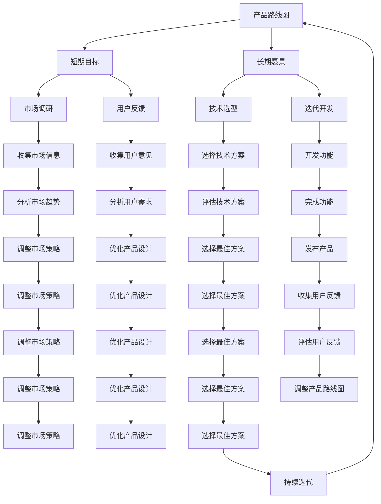

                 

# 创业公司的产品路线图：平衡短期目标和长期愿景

> 关键词：产品路线图、创业公司、短期目标、长期愿景、战略规划、市场调研、用户反馈、技术选型、迭代开发、敏捷开发、产品管理

> 摘要：本文旨在为创业公司提供一个系统性的方法论，帮助他们在追求短期目标的同时，不偏离长期愿景。通过详细阐述产品路线图的制定过程，结合实际案例和数学模型，本文将帮助读者理解如何平衡短期目标和长期愿景，从而实现可持续发展。

## 1. 背景介绍
### 1.1 目的和范围
本文旨在为创业公司提供一套系统性的方法论，帮助他们在追求短期目标的同时，不偏离长期愿景。我们将详细探讨如何制定产品路线图，以及如何在实际开发过程中平衡短期目标和长期愿景。本文将涵盖产品路线图的核心概念、制定流程、实际案例分析，以及相关工具和资源推荐。

### 1.2 预期读者
本文预期读者包括但不限于：
- 创业公司的创始人和产品经理
- 技术团队负责人和技术架构师
- 产品管理团队成员
- 对产品路线图和创业公司管理感兴趣的读者

### 1.3 文档结构概述
本文结构如下：
1. 背景介绍
2. 核心概念与联系
3. 核心算法原理 & 具体操作步骤
4. 数学模型和公式 & 详细讲解 & 举例说明
5. 项目实战：代码实际案例和详细解释说明
6. 实际应用场景
7. 工具和资源推荐
8. 总结：未来发展趋势与挑战
9. 附录：常见问题与解答
10. 扩展阅读 & 参考资料

### 1.4 术语表
#### 1.4.1 核心术语定义
- **产品路线图**：一种战略规划工具，用于展示产品开发的长期计划和短期目标。
- **短期目标**：在一定时间内需要完成的具体任务或里程碑。
- **长期愿景**：公司未来的发展方向和目标。
- **市场调研**：收集和分析市场信息的过程。
- **用户反馈**：用户对产品功能、性能等方面的反馈意见。
- **技术选型**：选择适合产品需求的技术方案。
- **迭代开发**：将产品开发过程分为多个小周期，每个周期完成一部分功能。
- **敏捷开发**：一种快速响应变化的软件开发方法。

#### 1.4.2 相关概念解释
- **战略规划**：制定长期目标和计划的过程。
- **市场调研**：通过各种手段收集市场信息，了解用户需求和竞争对手情况。
- **用户反馈**：通过各种渠道收集用户对产品的意见和建议。
- **技术选型**：根据产品需求选择合适的技术方案。
- **迭代开发**：将产品开发过程分为多个小周期，每个周期完成一部分功能。
- **敏捷开发**：一种快速响应变化的软件开发方法。

#### 1.4.3 缩略词列表
- MVP：Minimum Viable Product（最小可行产品）
- KPI：Key Performance Indicator（关键绩效指标）
- A/B测试：一种用于比较两个或多个版本效果的方法
- ROI：Return on Investment（投资回报率）

## 2. 核心概念与联系
### 2.1 产品路线图的核心概念
产品路线图是一种战略规划工具，用于展示产品开发的长期计划和短期目标。它可以帮助团队明确方向，确保资源的有效分配，同时保持灵活性以应对市场变化。

### 2.2 产品路线图的联系
产品路线图与短期目标和长期愿景密切相关。短期目标是实现长期愿景的具体步骤，而长期愿景则是指导短期目标的方向。通过合理规划产品路线图，创业公司可以在追求短期目标的同时，不偏离长期愿景。

### 2.3 Mermaid 流程图


## 3. 核心算法原理 & 具体操作步骤
### 3.1 核心算法原理
产品路线图的核心算法原理是通过分析市场调研和用户反馈，结合长期愿景和技术选型，制定出合理的短期目标。具体步骤如下：

1. **市场调研**：收集市场信息，了解用户需求和竞争对手情况。
2. **用户反馈**：通过各种渠道收集用户对产品的意见和建议。
3. **技术选型**：根据产品需求选择合适的技术方案。
4. **迭代开发**：将产品开发过程分为多个小周期，每个周期完成一部分功能。
5. **敏捷开发**：快速响应变化，确保产品能够满足市场需求。

### 3.2 具体操作步骤
1. **市场调研**：收集市场信息，了解用户需求和竞争对手情况。
2. **用户反馈**：通过各种渠道收集用户对产品的意见和建议。
3. **技术选型**：根据产品需求选择合适的技术方案。
4. **迭代开发**：将产品开发过程分为多个小周期，每个周期完成一部分功能。
5. **敏捷开发**：快速响应变化，确保产品能够满足市场需求。

### 3.3 伪代码示例
```python
def product路线图(市场调研, 用户反馈, 技术选型, 迭代开发, 敏捷开发):
    # 1. 市场调研
    市场信息 = 收集市场信息()
    用户需求 = 分析用户需求(市场信息)
    竞争对手情况 = 分析竞争对手情况(市场信息)
    
    # 2. 用户反馈
    用户意见 = 收集用户意见()
    用户建议 = 分析用户建议(用户意见)
    
    # 3. 技术选型
    技术方案 = 选择技术方案(用户需求, 用户建议)
    
    # 4. 迭代开发
    功能列表 = 制定功能列表(用户需求, 用户建议, 技术方案)
    开发周期 = 划分开发周期(功能列表)
    每个周期功能 = 完成功能(开发周期)
    
    # 5. 敏捷开发
    快速响应 = 快速响应变化(用户反馈, 市场变化)
    产品调整 = 调整产品(快速响应)
    
    return 产品路线图
```

## 4. 数学模型和公式 & 详细讲解 & 举例说明
### 4.1 数学模型
产品路线图可以通过数学模型来表示，其中关键绩效指标（KPI）和投资回报率（ROI）是重要的衡量标准。

### 4.2 公式
1. **关键绩效指标（KPI）**：用于衡量产品路线图的执行效果。
2. **投资回报率（ROI）**：用于衡量产品路线图的投资效益。

### 4.3 详细讲解
1. **关键绩效指标（KPI）**：KPI是衡量产品路线图执行效果的重要指标。常见的KPI包括用户增长率、活跃用户数、留存率等。
2. **投资回报率（ROI）**：ROI是衡量产品路线图投资效益的重要指标。ROI可以通过以下公式计算：
   $$ \text{ROI} = \frac{\text{收益} - \text{成本}}{\text{成本}} \times 100\% $$

### 4.4 举例说明
假设某创业公司正在开发一款社交应用，其目标是提高用户活跃度和留存率。通过市场调研和用户反馈，公司确定了以下KPI：
- 用户增长率：每月增长10%
- 活跃用户数：每月增长20%
- 留存率：每月保持在80%

通过投资回报率（ROI）计算，公司可以评估不同功能开发的投资效益。例如，开发新功能A的成本为10000元，预期收益为20000元，则ROI为100%。

## 5. 项目实战：代码实际案例和详细解释说明
### 5.1 开发环境搭建
1. **操作系统**：Windows 10
2. **编程语言**：Python 3.8
3. **开发工具**：Visual Studio Code
4. **版本控制**：Git

### 5.2 源代码详细实现和代码解读
```python
# 5.2.1 市场调研
def 收集市场信息():
    # 通过API获取市场数据
    市场数据 = 获取市场数据()
    return 市场数据

def 分析用户需求(市场数据):
    # 分析市场数据，提取用户需求
    用户需求 = 提取用户需求(市场数据)
    return 用户需求

def 分析竞争对手情况(市场数据):
    # 分析市场数据，提取竞争对手情况
    竞争对手情况 = 提取竞争对手情况(市场数据)
    return 竞争对手情况

# 5.2.2 用户反馈
def 收集用户意见():
    # 通过问卷调查收集用户意见
    用户意见 = 获取用户意见()
    return 用户意见

def 分析用户建议(用户意见):
    # 分析用户意见，提取用户建议
    用户建议 = 提取用户建议(用户意见)
    return 用户建议

# 5.2.3 技术选型
def 选择技术方案(用户需求, 用户建议):
    # 根据用户需求和用户建议选择合适的技术方案
    技术方案 = 选择合适的技术方案(用户需求, 用户建议)
    return 技术方案

# 5.2.4 迭代开发
def 制定功能列表(用户需求, 用户建议, 技术方案):
    # 根据用户需求和用户建议制定功能列表
    功能列表 = 制定功能列表(用户需求, 用户建议, 技术方案)
    return 功能列表

def 划分开发周期(功能列表):
    # 根据功能列表划分开发周期
    开发周期 = 划分开发周期(功能列表)
    return 开发周期

def 完成功能(开发周期):
    # 完成每个开发周期的功能
    每个周期功能 = 完成功能(开发周期)
    return 每个周期功能

# 5.2.5 敏捷开发
def 快速响应变化(用户反馈, 市场变化):
    # 快速响应用户反馈和市场变化
    快速响应 = 快速响应变化(用户反馈, 市场变化)
    return 快速响应

def 调整产品(快速响应):
    # 调整产品以适应快速响应
    产品调整 = 调整产品(快速响应)
    return 产品调整
```

### 5.3 代码解读与分析
1. **收集市场信息**：通过API获取市场数据，提取用户需求和竞争对手情况。
2. **收集用户意见**：通过问卷调查收集用户意见，提取用户建议。
3. **选择技术方案**：根据用户需求和用户建议选择合适的技术方案。
4. **制定功能列表**：根据用户需求和用户建议制定功能列表。
5. **划分开发周期**：根据功能列表划分开发周期。
6. **完成功能**：完成每个开发周期的功能。
7. **快速响应变化**：快速响应用户反馈和市场变化。
8. **调整产品**：调整产品以适应快速响应。

## 6. 实际应用场景
### 6.1 社交应用
假设某创业公司正在开发一款社交应用，其目标是提高用户活跃度和留存率。通过市场调研和用户反馈，公司确定了以下KPI：
- 用户增长率：每月增长10%
- 活跃用户数：每月增长20%
- 留存率：每月保持在80%

通过投资回报率（ROI）计算，公司可以评估不同功能开发的投资效益。例如，开发新功能A的成本为10000元，预期收益为20000元，则ROI为100%。

### 6.2 电子商务平台
假设某创业公司正在开发一款电子商务平台，其目标是提高用户购买转化率和用户满意度。通过市场调研和用户反馈，公司确定了以下KPI：
- 用户增长率：每月增长15%
- 购买转化率：每月增长10%
- 用户满意度：每月保持在90%

通过投资回报率（ROI）计算，公司可以评估不同功能开发的投资效益。例如，开发新功能B的成本为15000元，预期收益为30000元，则ROI为100%。

## 7. 工具和资源推荐
### 7.1 学习资源推荐
#### 7.1.1 书籍推荐
- 《精益创业》（The Lean Startup）：Eric Ries
- 《产品管理》（Product Management）：Scott Brinker
- 《敏捷项目管理》（Agile Project Management）：Kanban Method

#### 7.1.2 在线课程
- Coursera：《产品管理》（Product Management）
- Udemy：《精益创业》（The Lean Startup）

#### 7.1.3 技术博客和网站
- Medium：《产品路线图》（Product Roadmap）
- TechCrunch：《创业公司产品路线图》（Product Roadmap for Startups）

### 7.2 开发工具框架推荐
#### 7.2.1 IDE和编辑器
- Visual Studio Code
- PyCharm

#### 7.2.2 调试和性能分析工具
- PyCharm Debugger
- Visual Studio Code Debugger

#### 7.2.3 相关框架和库
- Django
- Flask

### 7.3 相关论文著作推荐
#### 7.3.1 经典论文
-《精益创业》（The Lean Startup）：Eric Ries
-《敏捷项目管理》（Agile Project Management）：Kanban Method

#### 7.3.2 最新研究成果
-《产品管理》（Product Management）：Scott Brinker

#### 7.3.3 应用案例分析
-《精益创业》（The Lean Startup）：Eric Ries

## 8. 总结：未来发展趋势与挑战
### 8.1 未来发展趋势
1. **市场调研**：市场调研将更加精准和高效，通过大数据和人工智能技术提高市场洞察力。
2. **用户反馈**：用户反馈将更加多样化和实时化，通过社交媒体和在线调查工具提高用户参与度。
3. **技术选型**：技术选型将更加灵活和多样化，通过云计算和容器化技术提高开发效率。
4. **迭代开发**：迭代开发将更加敏捷和快速，通过DevOps和持续集成/持续部署（CI/CD）提高开发速度。
5. **敏捷开发**：敏捷开发将更加普及和成熟，通过精益创业和敏捷项目管理提高产品成功率。

### 8.2 挑战
1. **市场变化**：市场变化快速，创业公司需要快速响应变化，调整产品路线图。
2. **用户需求**：用户需求多样化，创业公司需要不断收集和分析用户反馈，调整产品方向。
3. **技术选型**：技术选型复杂，创业公司需要不断评估和选择合适的技术方案。
4. **迭代开发**：迭代开发需要持续优化，创业公司需要不断调整开发流程，提高开发效率。
5. **敏捷开发**：敏捷开发需要持续改进，创业公司需要不断优化敏捷开发流程，提高产品成功率。

## 9. 附录：常见问题与解答
### 9.1 问题1：如何平衡短期目标和长期愿景？
**解答**：通过制定合理的产品路线图，将长期愿景分解为短期目标，确保每个短期目标都能为长期愿景做出贡献。

### 9.2 问题2：如何收集用户反馈？
**解答**：通过问卷调查、用户访谈、社交媒体等多种渠道收集用户反馈，确保用户意见的多样性和真实性。

### 9.3 问题3：如何选择合适的技术方案？
**解答**：通过市场调研和用户反馈，结合技术选型工具和专家意见，选择最适合产品需求的技术方案。

### 9.4 问题4：如何调整产品路线图？
**解答**：通过持续收集用户反馈和市场变化，调整产品路线图，确保产品能够满足市场需求。

## 10. 扩展阅读 & 参考资料
### 10.1 扩展阅读
- 《精益创业》（The Lean Startup）：Eric Ries
- 《产品管理》（Product Management）：Scott Brinker
- 《敏捷项目管理》（Agile Project Management）：Kanban Method

### 10.2 参考资料
- Coursera：《产品管理》（Product Management）
- Udemy：《精益创业》（The Lean Startup）
- Medium：《产品路线图》（Product Roadmap）
- TechCrunch：《创业公司产品路线图》（Product Roadmap for Startups）

---

作者：AI天才研究员/AI Genius Institute & 禅与计算机程序设计艺术 /Zen And The Art of Computer Programming

