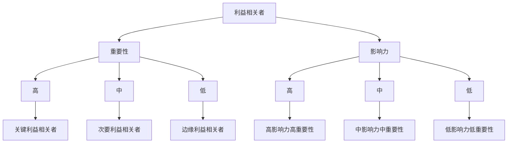
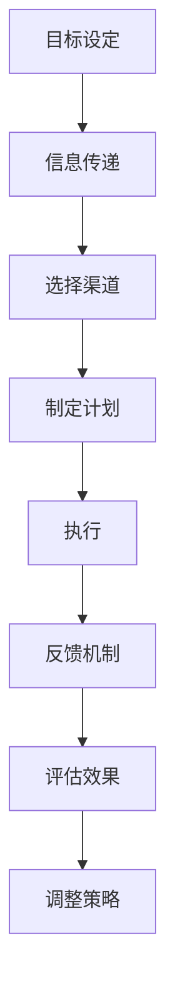

                 

# 创业公司的利益相关者沟通与社会影响力管理

> 关键词：利益相关者、沟通策略、社会影响力、创业公司、风险管理、利益冲突、透明度

> 摘要：本文旨在探讨创业公司在成长过程中如何有效地管理利益相关者沟通，以及如何通过积极的社会影响力管理来塑造正面的企业形象。我们将从理论基础出发，逐步深入到实际操作层面，通过案例分析和代码实现，为创业公司提供一套系统化的沟通与管理方案。

## 1. 背景介绍
### 1.1 目的和范围
本文旨在为创业公司提供一套系统化的利益相关者沟通与社会影响力管理方案。通过深入分析利益相关者的定义、沟通策略、风险管理以及透明度的重要性，帮助创业公司在成长过程中建立良好的企业形象，实现可持续发展。

### 1.2 预期读者
本文面向创业公司的创始人、CEO、COO、CMO、公关部门负责人以及所有对创业公司管理和成长感兴趣的读者。

### 1.3 文档结构概述
本文将从以下几个方面展开讨论：
1. 利益相关者的定义与分类
2. 利益相关者的沟通策略
3. 社会影响力管理的理论基础
4. 案例分析与代码实现
5. 实际应用场景
6. 工具和资源推荐
7. 总结与未来发展趋势

### 1.4 术语表
#### 1.4.1 核心术语定义
- **利益相关者**：指任何对创业公司有直接影响或被创业公司所影响的个人或组织。
- **沟通策略**：指为了实现特定目标而采取的一系列沟通方法和手段。
- **社会影响力**：指创业公司通过其行为和决策对社会产生的正面或负面影响。
- **风险管理**：指识别、评估和控制潜在风险的过程。
- **透明度**：指信息的公开性和可获取性。

#### 1.4.2 相关概念解释
- **利益冲突**：指不同利益相关者之间的利益不一致，可能导致沟通障碍。
- **利益相关者矩阵**：一种工具，用于识别和分类不同利益相关者及其重要性。

#### 1.4.3 缩略词列表
- CSR：Corporate Social Responsibility（企业社会责任）
- PR：Public Relations（公共关系）
- ROI：Return on Investment（投资回报率）

## 2. 核心概念与联系
### 利益相关者的定义与分类
利益相关者可以分为内部利益相关者和外部利益相关者。内部利益相关者包括员工、股东、董事会成员等；外部利益相关者包括客户、供应商、政府机构、媒体、社区成员等。

### 利益相关者的沟通策略
利益相关者的沟通策略主要包括：
- **目标设定**：明确沟通的目标和预期结果。
- **信息传递**：选择合适的信息传递渠道和方式。
- **反馈机制**：建立有效的反馈机制，确保信息的双向流动。
- **风险管理**：识别潜在的风险，并制定相应的应对措施。

### 社会影响力管理的理论基础
社会影响力管理的核心在于通过积极的行为和决策，实现对社会的正面影响。这包括：
- **企业社会责任（CSR）**：通过实际行动履行社会责任。
- **可持续发展**：确保公司的长期发展与社会的可持续发展相一致。
- **透明度**：通过公开透明的信息披露，增强公众信任。

## 3. 核心算法原理 & 具体操作步骤
### 利益相关者矩阵
利益相关者矩阵是一种工具，用于识别和分类不同利益相关者及其重要性。具体步骤如下：



### 沟通策略的实现
沟通策略的实现可以通过以下步骤进行：



## 4. 数学模型和公式 & 详细讲解 & 举例说明
### 透明度的量化模型
透明度可以通过以下公式进行量化：

$$
\text{透明度} = \frac{\text{公开信息量}}{\text{总信息量}} \times 100\%
$$

### 举例说明
假设一家创业公司有100条内部信息和50条外部信息，其中公开了30条内部信息和20条外部信息。则透明度为：

$$
\text{透明度} = \frac{30 + 20}{100 + 50} \times 100\% = 40\%
$$

## 5. 项目实战：代码实际案例和详细解释说明
### 5.1 开发环境搭建
为了实现利益相关者的沟通与管理，我们需要搭建一个基于Web的管理系统。开发环境包括：
- **编程语言**：Python
- **框架**：Django
- **数据库**：MySQL

### 5.2 源代码详细实现和代码解读
#### 利益相关者模型
```python
class Stakeholder(models.Model):
    name = models.CharField(max_length=100)
    type = models.CharField(max_length=50)
    importance = models.IntegerField()
    influence = models.IntegerField()
    description = models.TextField()
```

#### 沟通策略模型
```python
class CommunicationStrategy(models.Model):
    stakeholder = models.ForeignKey(Stakeholder, on_delete=models.CASCADE)
    goal = models.TextField()
    channels = models.TextField()
    plan = models.TextField()
    execution = models.TextField()
    feedback = models.TextField()
    evaluation = models.TextField()
```

### 5.3 代码解读与分析
通过上述代码，我们可以创建和管理利益相关者及其沟通策略。例如，创建一个利益相关者：

```python
stakeholder = Stakeholder.objects.create(
    name="客户",
    type="外部利益相关者",
    importance=8,
    influence=7,
    description="公司的主要收入来源"
)
```

## 6. 实际应用场景
### 利益相关者沟通案例
假设一家创业公司正在开发一款环保产品。通过利益相关者矩阵，他们识别出客户、供应商、政府机构和社区成员为主要利益相关者。通过制定相应的沟通策略，他们成功地获得了客户的信任和支持，同时也得到了政府机构的政策支持。

### 社会影响力管理案例
一家创业公司通过实施企业社会责任项目，如环保和教育，成功地提升了其社会影响力。这些项目不仅得到了社区成员的支持，还吸引了更多的投资者。

## 7. 工具和资源推荐
### 7.1 学习资源推荐
#### 书籍推荐
- 《企业社会责任：理论与实践》
- 《公共关系学》

#### 在线课程
- Coursera上的“企业社会责任”课程
- edX上的“公共关系管理”课程

#### 技术博客和网站
- Harvard Business Review
- Forbes

### 7.2 开发工具框架推荐
#### IDE和编辑器
- PyCharm
- VSCode

#### 调试和性能分析工具
- PyCharm的调试工具
- Python Profiler

#### 相关框架和库
- Django
- Flask

### 7.3 相关论文著作推荐
#### 经典论文
- "Corporate Social Responsibility: A Review of the Literature" (Journal of Management)

#### 最新研究成果
- "The Impact of Corporate Social Responsibility on Firm Performance" (Journal of Business Ethics)

#### 应用案例分析
- "Case Study: Patagonia's CSR Initiatives" (Harvard Business Review)

## 8. 总结：未来发展趋势与挑战
### 未来发展趋势
- 利益相关者沟通将更加注重个性化和定制化。
- 社会影响力管理将更加注重数据驱动和量化分析。
- 透明度将成为企业形象的重要组成部分。

### 挑战
- 如何平衡不同利益相关者之间的利益冲突。
- 如何在快速变化的市场环境中保持沟通的有效性。
- 如何利用技术手段提升沟通效率和效果。

## 9. 附录：常见问题与解答
### 常见问题
- Q：如何平衡不同利益相关者之间的利益冲突？
  A：通过建立透明的沟通机制和公正的决策流程，确保所有利益相关者的利益得到充分考虑。

- Q：如何在快速变化的市场环境中保持沟通的有效性？
  A：通过建立灵活的沟通策略和持续的反馈机制，确保沟通能够及时响应市场变化。

## 10. 扩展阅读 & 参考资料
- "Corporate Social Responsibility: A Review of the Literature" (Journal of Management)
- "The Impact of Corporate Social Responsibility on Firm Performance" (Journal of Business Ethics)
- "Case Study: Patagonia's CSR Initiatives" (Harvard Business Review)

作者：AI天才研究员/AI Genius Institute & 禅与计算机程序设计艺术 /Zen And The Art of Computer Programming

