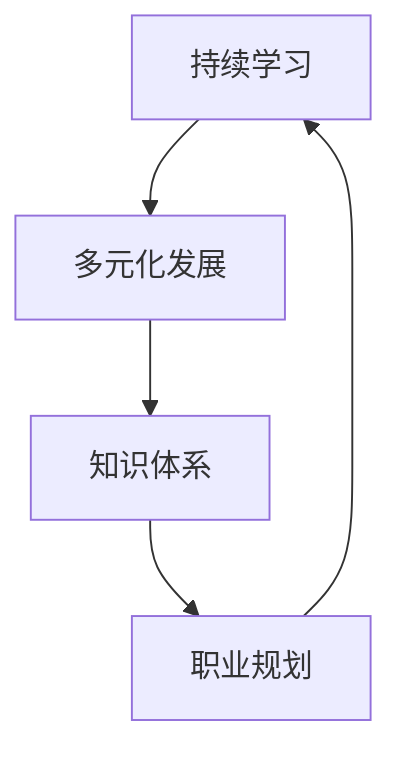

                 

# 创业者如何建立个人持续学习和多元化发展机制

> 关键词：持续学习、多元化发展、个人成长、创业、技术栈、终身学习、知识体系、职业规划

> 摘要：本文旨在为创业者提供一套系统化的个人持续学习和多元化发展机制，帮助他们在快速变化的技术环境中保持竞争力。通过构建清晰的知识体系、制定合理的职业规划、选择合适的学习资源和工具，创业者可以不断提升自我，实现个人与企业的共同成长。

## 1. 背景介绍
### 1.1 目的和范围
本文旨在为创业者提供一套系统化的个人持续学习和多元化发展机制，帮助他们在快速变化的技术环境中保持竞争力。通过构建清晰的知识体系、制定合理的职业规划、选择合适的学习资源和工具，创业者可以不断提升自我，实现个人与企业的共同成长。

### 1.2 预期读者
本文的预期读者是希望在技术领域持续成长的创业者，包括但不限于初创企业的创始人、技术团队领导者以及对技术有浓厚兴趣的个人开发者。

### 1.3 文档结构概述
本文将从以下几个方面展开讨论：
1. 核心概念与联系
2. 核心算法原理 & 具体操作步骤
3. 数学模型和公式 & 详细讲解 & 举例说明
4. 项目实战：代码实际案例和详细解释说明
5. 实际应用场景
6. 工具和资源推荐
7. 总结：未来发展趋势与挑战
8. 附录：常见问题与解答
9. 扩展阅读 & 参考资料

### 1.4 术语表
#### 1.4.1 核心术语定义
- **持续学习**：不断获取新知识和技能的过程。
- **多元化发展**：在多个领域或技术栈中进行学习和实践，以增强个人能力。
- **知识体系**：个人掌握的知识和技能的系统化结构。
- **职业规划**：为实现职业目标而制定的长期计划。
- **技术栈**：一个项目或产品所依赖的技术集合。

#### 1.4.2 相关概念解释
- **终身学习**：个人在职业生涯中不断学习新知识和技能的过程。
- **技术栈**：一个项目或产品所依赖的技术集合，包括编程语言、框架、工具等。

#### 1.4.3 缩略词列表
- **API**：应用程序编程接口
- **IDE**：集成开发环境
- **SDK**：软件开发工具包
- **ORM**：对象关系映射

## 2. 核心概念与联系
### 2.1 持续学习的重要性
持续学习是个人成长的关键。在技术领域，知识更新速度极快，只有不断学习新知识，才能保持竞争力。持续学习不仅包括技术知识，还包括软技能、行业趋势等。

### 2.2 多元化发展的必要性
多元化发展有助于创业者在遇到技术瓶颈时，能够从多个角度解决问题。通过学习不同的技术栈和领域知识，可以拓宽视野，提高解决问题的能力。

### 2.3 知识体系的构建
知识体系是个人持续学习和多元化发展的基础。一个清晰的知识体系可以帮助创业者系统地学习和掌握知识，避免知识碎片化。

### 2.4 职业规划的重要性
职业规划是实现个人目标的关键。通过制定合理的职业规划，创业者可以明确自己的发展方向，有针对性地进行学习和实践。

### 2.5 核心概念流程图


## 3. 核心算法原理 & 具体操作步骤
### 3.1 知识体系构建步骤
1. **确定学习目标**：明确自己希望掌握的知识领域。
2. **选择学习资源**：根据目标选择合适的书籍、在线课程等。
3. **制定学习计划**：合理安排学习时间，确保持续学习。
4. **实践应用**：将所学知识应用于实际项目中，加深理解。

### 3.2 职业规划步骤
1. **自我评估**：了解自己的兴趣、优势和劣势。
2. **设定目标**：明确职业目标，包括短期和长期目标。
3. **制定计划**：根据目标制定详细的学习和实践计划。
4. **定期评估**：定期评估进度，调整计划以适应变化。

## 4. 数学模型和公式 & 详细讲解 & 举例说明
### 4.1 数学模型
在构建知识体系时，可以使用数学模型来优化学习路径。例如，使用图论中的最短路径算法来确定学习顺序。

### 4.2 公式
假设有一个知识图谱，其中每个节点代表一个知识点，边代表知识点之间的关联。可以使用Dijkstra算法来找到从起点到终点的最短路径。

$$
\text{Dijkstra}(G, s) = \begin{cases}
    \text{distance}(s) = 0 \\
    \text{distance}(v) = \infty, \forall v \neq s \\
    \text{Q} = \text{all vertices} \\
    \text{while } Q \neq \emptyset \\
        \text{u} = \text{argmin}_{v \in Q} \text{distance}(v) \\
        \text{Q} = Q \setminus \{u\} \\
        \text{for each neighbor } v \text{ of } u \\
            \text{if } \text{distance}(u) + \text{weight}(u, v) < \text{distance}(v) \\
                \text{distance}(v) = \text{distance}(u) + \text{weight}(u, v) \\
                \text{predecessor}(v) = u
        \text{end for}
    \text{end while}
\end{cases}
$$

### 4.3 举例说明
假设有一个知识图谱，其中每个节点代表一个知识点，边代表知识点之间的关联。使用Dijkstra算法可以找到从“编程基础”到“机器学习”的最短路径。

## 5. 项目实战：代码实际案例和详细解释说明
### 5.1 开发环境搭建
1. **选择编程语言**：根据项目需求选择合适的编程语言。
2. **安装开发环境**：安装相应的IDE和开发工具。
3. **配置环境变量**：设置环境变量，确保开发环境正常运行。

### 5.2 源代码详细实现和代码解读
```python
# 项目结构
# ├── main.py
# ├── utils.py
# └── config.py

# main.py
import utils
from config import settings

def main():
    # 加载配置
    config = settings.load_config()
    
    # 执行任务
    result = utils.execute_task(config)
    
    # 输出结果
    print(result)

if __name__ == "__main__":
    main()

# utils.py
def execute_task(config):
    # 执行具体任务
    return "任务执行成功"

# config.py
class Settings:
    @staticmethod
    def load_config():
        # 加载配置文件
        return {"task": "example"}

```

### 5.3 代码解读与分析
- **main.py**：主程序文件，负责加载配置和执行任务。
- **utils.py**：工具模块，包含执行具体任务的函数。
- **config.py**：配置模块，包含加载配置文件的函数。

## 6. 实际应用场景
### 6.1 技术栈选择
创业者可以根据项目需求选择合适的技术栈。例如，对于一个Web应用，可以选择Python + Django + PostgreSQL。

### 6.2 项目管理
通过持续学习和多元化发展，创业者可以更好地管理项目，提高团队效率。

## 7. 工具和资源推荐
### 7.1 学习资源推荐
#### 7.1.1 书籍推荐
- **《代码大全》**：全面介绍软件开发的最佳实践。
- **《深入浅出设计模式》**：深入讲解设计模式及其应用。

#### 7.1.2 在线课程
- **Coursera**：提供丰富的计算机科学课程。
- **Udemy**：涵盖广泛的技术课程。

#### 7.1.3 技术博客和网站
- **Medium**：许多技术博客和文章。
- **GitHub**：查看开源项目和代码。

### 7.2 开发工具框架推荐
#### 7.2.1 IDE和编辑器
- **Visual Studio Code**：轻量级但功能强大的IDE。
- **PyCharm**：专为Python开发设计的IDE。

#### 7.2.2 调试和性能分析工具
- **PyCharm Debugger**：Python调试工具。
- **VisualVM**：Java性能分析工具。

#### 7.2.3 相关框架和库
- **Django**：Python Web框架。
- **Flask**：轻量级Python Web框架。

### 7.3 相关论文著作推荐
#### 7.3.1 经典论文
- **《软件工程原理》**：介绍软件工程的基本原理。
- **《设计模式：可复用面向对象软件的基础》**：经典设计模式书籍。

#### 7.3.2 最新研究成果
- **《人工智能与机器学习最新进展》**：介绍最新的AI和ML研究成果。
- **《区块链技术及其应用》**：探讨区块链技术及其应用。

#### 7.3.3 应用案例分析
- **《云计算与大数据应用案例》**：分析云计算和大数据的实际应用案例。
- **《物联网技术及其应用》**：探讨物联网技术及其应用。

## 8. 总结：未来发展趋势与挑战
### 8.1 未来发展趋势
- **技术融合**：不同技术领域的融合将带来新的机遇。
- **自动化与智能化**：自动化和智能化将成为主流。

### 8.2 挑战
- **技术更新速度**：技术更新速度极快，需要不断学习。
- **知识碎片化**：知识碎片化可能导致技能不连贯。

## 9. 附录：常见问题与解答
### 9.1 问题1：如何平衡工作和学习？
- **答案**：合理安排时间，制定详细的学习计划，确保学习和工作之间的平衡。

### 9.2 问题2：如何选择合适的学习资源？
- **答案**：根据自己的需求和兴趣选择合适的学习资源，可以参考书籍、在线课程和博客。

## 10. 扩展阅读 & 参考资料
- **《程序员修炼之道》**：介绍程序员的成长之路。
- **《软件架构模式》**：深入讲解软件架构模式及其应用。

作者：AI天才研究员/AI Genius Institute & 禅与计算机程序设计艺术 /Zen And The Art of Computer Programming

