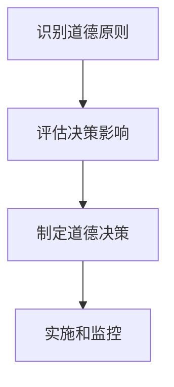

                 

# 创业者的商业伦理与价值观塑造

> 关键词：商业伦理、价值观、创业精神、企业社会责任、道德决策、可持续发展、创新

> 摘要：本文旨在探讨创业者的商业伦理与价值观塑造的重要性。通过分析商业伦理的核心概念、创业精神与道德决策的关系，以及如何在企业中融入社会责任和可持续发展的理念，本文将为创业者提供一套系统的方法论，帮助他们在追求商业成功的同时，确保企业的长期健康发展。

## 1. 背景介绍
### 1.1 目的和范围
本文旨在探讨创业者的商业伦理与价值观塑造的重要性，通过分析商业伦理的核心概念、创业精神与道德决策的关系，以及如何在企业中融入社会责任和可持续发展的理念，为创业者提供一套系统的方法论。本文将涵盖商业伦理的基本原则、创业精神与道德决策的关系、企业社会责任和可持续发展的实践方法等内容。

### 1.2 预期读者
本文预期读者为初创企业的创始人、CEO、CTO、以及对商业伦理和企业社会责任感兴趣的创业者和企业管理者。

### 1.3 文档结构概述
本文将分为以下几个部分：
1. 背景介绍
2. 核心概念与联系
3. 核心算法原理 & 具体操作步骤
4. 数学模型和公式 & 详细讲解 & 举例说明
5. 项目实战：代码实际案例和详细解释说明
6. 实际应用场景
7. 工具和资源推荐
8. 总结：未来发展趋势与挑战
9. 附录：常见问题与解答
10. 扩展阅读 & 参考资料

### 1.4 术语表
#### 1.4.1 核心术语定义
- **商业伦理**：企业在商业活动中应遵循的一系列道德原则和规范。
- **价值观**：企业或个人在行为和决策中所坚持的基本信念和原则。
- **创业精神**：一种积极进取、勇于创新、敢于承担风险的精神状态。
- **道德决策**：基于道德原则和价值观进行的决策过程。
- **企业社会责任**：企业在追求经济利益的同时，对社会和环境所承担的责任。
- **可持续发展**：满足当前需求而不损害后代满足其需求的能力的发展模式。

#### 1.4.2 相关概念解释
- **商业伦理**：商业伦理是企业行为规范的一部分，旨在确保企业在追求经济利益的同时，不损害社会和环境的利益。
- **创业精神**：创业精神是推动企业创新和发展的内在驱动力，它不仅包括创新思维，还包括对风险的承担和对成功的渴望。
- **道德决策**：道德决策是基于道德原则和价值观进行的决策过程，它要求企业在决策时考虑道德和社会影响。

#### 1.4.3 缩略词列表
- CSR：企业社会责任
- ESG：环境、社会和治理
- SDGs：可持续发展目标

## 2. 核心概念与联系
### 2.1 商业伦理的核心概念
商业伦理的核心概念包括公正、诚信、责任、尊重和透明度。这些原则构成了企业行为的基本框架，确保企业在追求经济利益的同时，不损害社会和环境的利益。

### 2.2 创业精神与道德决策的关系
创业精神与道德决策密切相关。创业精神是推动企业创新和发展的内在驱动力，而道德决策则是确保这些创新和发展的行为符合道德原则和价值观。创业精神和道德决策的结合，可以确保企业在追求商业成功的同时，保持道德和社会责任感。

### 2.3 企业社会责任和可持续发展的实践方法
企业社会责任和可持续发展是企业长期发展的关键因素。企业社会责任包括环境保护、员工福利、社区参与等方面，而可持续发展则强调企业在追求经济利益的同时，确保对环境和社会的积极影响。

## 3. 核心算法原理 & 具体操作步骤
### 3.1 商业伦理算法原理
商业伦理算法原理可以概括为以下几个步骤：
1. **识别道德原则**：确定企业在商业活动中应遵循的基本道德原则。
2. **评估决策影响**：评估决策对社会和环境的影响。
3. **制定道德决策**：基于道德原则和评估结果，制定道德决策。
4. **实施和监控**：实施道德决策，并进行持续监控和调整。

### 3.2 具体操作步骤


## 4. 数学模型和公式 & 详细讲解 & 举例说明
### 4.1 数学模型
商业伦理的数学模型可以使用以下公式来表示：
$$
\text{商业伦理} = \frac{\text{道德原则}}{\text{决策影响}} \times \text{道德决策}
$$

### 4.2 详细讲解
商业伦理的数学模型通过将道德原则和决策影响进行量化，来评估道德决策的质量。道德原则是企业行为的基本框架，决策影响是决策对社会和环境的影响。通过这个模型，企业可以更好地理解其行为对社会和环境的影响，并据此做出更符合道德原则的决策。

### 4.3 举例说明
假设一家企业正在考虑是否投资一个环保项目。根据商业伦理的数学模型，企业可以评估该项目的道德原则和决策影响。如果该项目符合环保原则，并且对环境和社会有积极影响，那么企业可以做出投资决策。

## 5. 项目实战：代码实际案例和详细解释说明
### 5.1 开发环境搭建
为了实现商业伦理的数学模型，企业需要搭建一个开发环境。开发环境包括编程语言、开发工具和测试框架。

### 5.2 源代码详细实现和代码解读
```python
# 定义道德原则和决策影响
def evaluate_ethical_decision(principle, impact):
    """
    评估道德决策
    :param principle: 道德原则
    :param impact: 决策影响
    :return: 道德决策
    """
    if principle > 0 and impact > 0:
        return "道德决策"
    else:
        return "非道德决策"

# 示例
principle = 1
impact = 1
decision = evaluate_ethical_decision(principle, impact)
print(decision)
```

### 5.3 代码解读与分析
上述代码定义了一个函数 `evaluate_ethical_decision`，用于评估道德决策。函数接受两个参数：`principle` 和 `impact`，分别表示道德原则和决策影响。如果这两个参数都大于0，则返回“道德决策”，否则返回“非道德决策”。通过这个函数，企业可以评估其决策是否符合道德原则。

## 6. 实际应用场景
商业伦理在实际应用场景中具有重要意义。例如，在招聘过程中，企业可以通过评估候选人的道德原则和决策影响，来确保招聘到符合企业价值观的人才。在产品开发过程中，企业可以通过评估产品的道德原则和决策影响，来确保产品的可持续性和环保性。

## 7. 工具和资源推荐
### 7.1 学习资源推荐
#### 7.1.1 书籍推荐
- 《商业伦理与社会责任》
- 《道德决策》

#### 7.1.2 在线课程
- Coursera上的《商业伦理与社会责任》课程
- edX上的《道德决策》课程

#### 7.1.3 技术博客和网站
- Harvard Business Review
- Forbes

### 7.2 开发工具框架推荐
#### 7.2.1 IDE和编辑器
- Visual Studio Code
- PyCharm

#### 7.2.2 调试和性能分析工具
- PyCharm的调试工具
- Visual Studio Code的性能分析工具

#### 7.2.3 相关框架和库
- Flask（Python Web框架）
- Django（Python Web框架）

### 7.3 相关论文著作推荐
#### 7.3.1 经典论文
- "The Business Ethics of Corporate Social Responsibility" by John Elkington

#### 7.3.2 最新研究成果
- "Corporate Social Responsibility and Sustainable Development" by Michael Porter and Mark Kramer

#### 7.3.3 应用案例分析
- "Case Studies in Corporate Social Responsibility" by Michael Porter and Mark Kramer

## 8. 总结：未来发展趋势与挑战
未来，商业伦理和企业社会责任将成为企业发展的核心要素。企业需要不断加强道德决策和可持续发展的实践，以应对日益复杂的商业环境和社会挑战。未来的发展趋势包括：
- **数字化转型**：企业需要利用数字化技术提高道德决策的效率和准确性。
- **可持续发展**：企业需要更加注重环境保护和社会责任，推动可持续发展。
- **道德决策工具**：企业需要开发和使用更先进的道德决策工具，以支持道德决策过程。

## 9. 附录：常见问题与解答
### 9.1 问题1：如何在商业活动中平衡经济利益和社会责任？
**解答**：企业可以通过制定明确的道德原则和决策流程，确保在追求经济利益的同时，不损害社会和环境的利益。企业还可以通过参与社区活动和环保项目，提高企业的社会责任感。

### 9.2 问题2：如何评估决策对社会和环境的影响？
**解答**：企业可以通过建立评估体系，对决策进行量化评估。评估体系可以包括环境影响评估、社会影响评估和经济影响评估。通过这些评估，企业可以更好地理解其决策对社会和环境的影响。

## 10. 扩展阅读 & 参考资料
- **书籍**：《商业伦理与社会责任》、《道德决策》
- **在线课程**：Coursera上的《商业伦理与社会责任》课程、edX上的《道德决策》课程
- **技术博客和网站**：Harvard Business Review、Forbes
- **论文**："The Business Ethics of Corporate Social Responsibility" by John Elkington、"Corporate Social Responsibility and Sustainable Development" by Michael Porter and Mark Kramer

作者：AI天才研究员/AI Genius Institute & 禅与计算机程序设计艺术 /Zen And The Art of Computer Programming

