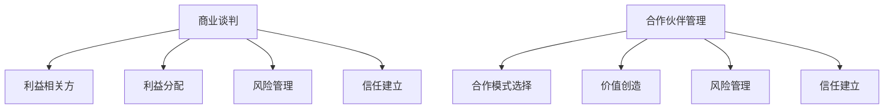

                 

# 创业者的商业谈判与合作伙伴管理技巧

> 关键词：商业谈判, 合作伙伴管理, 创业者, 商业策略, 合作模式, 价值创造, 风险管理, 信任建立

> 摘要：本文旨在为创业者提供一套系统化的商业谈判与合作伙伴管理技巧，通过深入分析商业谈判的核心要素和合作伙伴管理的关键步骤，帮助创业者在复杂多变的商业环境中建立稳固的合作关系，实现共赢。文章将从商业谈判的基本原则出发，逐步深入到具体的谈判策略和技巧，同时探讨合作伙伴管理中的关键问题和解决方案，为创业者提供实用的指导。

## 1. 背景介绍
### 1.1 目的和范围
本文旨在为创业者提供一套系统化的商业谈判与合作伙伴管理技巧，帮助他们在商业谈判中实现价值最大化，并在合作伙伴管理中建立稳固的合作关系。文章将涵盖商业谈判的基本原则、策略和技巧，以及合作伙伴管理中的关键问题和解决方案。

### 1.2 预期读者
本文预期读者为创业者、企业家、商业顾问以及希望提升商业谈判和合作伙伴管理能力的专业人士。无论是在初创企业还是成熟企业中，本文提供的技巧和策略都将具有重要的参考价值。

### 1.3 文档结构概述
本文将按照以下结构展开：
1. 背景介绍
2. 核心概念与联系
3. 核心算法原理 & 具体操作步骤
4. 数学模型和公式 & 详细讲解 & 举例说明
5. 项目实战：代码实际案例和详细解释说明
6. 实际应用场景
7. 工具和资源推荐
8. 总结：未来发展趋势与挑战
9. 附录：常见问题与解答
10. 扩展阅读 & 参考资料

### 1.4 术语表
#### 1.4.1 核心术语定义
- **商业谈判**：指两个或多个利益相关方就某一事项进行协商，以达成一致意见的过程。
- **合作伙伴管理**：指企业与外部合作伙伴建立、维护和发展合作关系的过程。
- **价值创造**：指通过商业谈判和合作伙伴管理，实现双方或多方利益的最大化。
- **风险管理**：指识别、评估和控制商业谈判和合作伙伴管理中的潜在风险。
- **信任建立**：指通过一系列行为和沟通，建立双方之间的信任关系。

#### 1.4.2 相关概念解释
- **利益相关方**：指与商业谈判和合作伙伴管理相关的所有个人或组织。
- **共赢**：指通过商业谈判和合作伙伴管理，实现双方或多方利益的最大化。
- **利益分配**：指在商业谈判中，如何合理分配双方的利益。

#### 1.4.3 缩略词列表
- **B2B**：Business to Business，指企业之间的商业交易。
- **B2C**：Business to Consumer，指企业直接面向消费者的商业交易。
- **CRM**：Customer Relationship Management，客户关系管理。
- **ROI**：Return on Investment，投资回报率。

## 2. 核心概念与联系
### 2.1 商业谈判的核心要素
商业谈判的核心要素包括：
- **利益相关方**：明确谈判各方的利益诉求。
- **利益分配**：合理分配谈判中的利益。
- **风险管理**：识别和控制谈判中的潜在风险。
- **信任建立**：通过沟通和行为建立双方之间的信任关系。

### 2.2 合作伙伴管理的关键步骤
合作伙伴管理的关键步骤包括：
- **合作模式选择**：确定合作伙伴关系的类型和模式。
- **价值创造**：通过合作实现双方或多方利益的最大化。
- **风险管理**：识别和控制合作中的潜在风险。
- **信任建立**：通过沟通和行为建立双方之间的信任关系。

### 2.3 核心概念的Mermaid流程图


## 3. 核心算法原理 & 具体操作步骤
### 3.1 商业谈判的核心算法原理
商业谈判的核心算法原理包括：
- **利益相关方分析**：通过分析利益相关方的利益诉求，确定谈判的目标和策略。
- **利益分配模型**：通过利益分配模型，合理分配谈判中的利益。
- **风险管理模型**：通过风险管理模型，识别和控制谈判中的潜在风险。
- **信任建立模型**：通过信任建立模型，建立双方之间的信任关系。

### 3.2 具体操作步骤
具体操作步骤包括：
1. **利益相关方分析**：
    ```python
    def analyze_interests(parties):
        interests = {}
        for party in parties:
            interests[party] = party.get_interests()
        return interests
    ```

2. **利益分配模型**：
    ```python
    def allocate_interests(interests, total_value):
        allocations = {}
        for party, interest in interests.items():
            allocations[party] = interest * total_value
        return allocations
    ```

3. **风险管理模型**：
    ```python
    def identify_risks(interests, allocations):
        risks = {}
        for party, allocation in allocations.items():
            risks[party] = allocation * party.get_risk_factor()
        return risks
    ```

4. **信任建立模型**：
    ```python
    def build_trust(interests, allocations, risks):
        trust = {}
        for party, allocation in allocations.items():
            trust[party] = allocation / (risks[party] + 1)
        return trust
    ```

## 4. 数学模型和公式 & 详细讲解 & 举例说明
### 4.1 数学模型
商业谈判和合作伙伴管理中的数学模型包括：
- **利益分配模型**：
    $$ \text{分配} = \text{利益} \times \text{总价值} $$
- **风险管理模型**：
    $$ \text{风险} = \text{分配} \times \text{风险因子} $$
- **信任建立模型**：
    $$ \text{信任} = \frac{\text{分配}}{\text{风险} + 1} $$

### 4.2 详细讲解
- **利益分配模型**：通过利益分配模型，可以合理分配谈判中的利益。例如，假设总价值为100，A方的利益为0.3，B方的利益为0.7，则A方的分配为30，B方的分配为70。
- **风险管理模型**：通过风险管理模型，可以识别和控制谈判中的潜在风险。例如，假设A方的风险因子为0.5，B方的风险因子为0.3，则A方的风险为15，B方的风险为21。
- **信任建立模型**：通过信任建立模型，可以建立双方之间的信任关系。例如，假设A方的分配为30，A方的风险为15，则A方的信任为2。

### 4.3 举例说明
假设A方和B方进行商业谈判，总价值为100，A方的利益为0.3，B方的利益为0.7，A方的风险因子为0.5，B方的风险因子为0.3。
- 利益分配：
    $$ \text{A方分配} = 0.3 \times 100 = 30 $$
    $$ \text{B方分配} = 0.7 \times 100 = 70 $$
- 风险管理：
    $$ \text{A方风险} = 30 \times 0.5 = 15 $$
    $$ \text{B方风险} = 70 \times 0.3 = 21 $$
- 信任建立：
    $$ \text{A方信任} = \frac{30}{15 + 1} = 1.92 $$
    $$ \text{B方信任} = \frac{70}{21 + 1} = 3.27 $$

## 5. 项目实战：代码实际案例和详细解释说明
### 5.1 开发环境搭建
开发环境搭建包括：
- **Python环境**：安装Python 3.8及以上版本。
- **IDE**：使用PyCharm或VSCode进行开发。
- **库**：安装numpy和pandas库。

### 5.2 源代码详细实现和代码解读
```python
import numpy as np
import pandas as pd

def analyze_interests(parties):
    interests = {}
    for party in parties:
        interests[party] = party.get_interests()
    return interests

def allocate_interests(interests, total_value):
    allocations = {}
    for party, interest in interests.items():
        allocations[party] = interest * total_value
    return allocations

def identify_risks(interests, allocations):
    risks = {}
    for party, allocation in allocations.items():
        risks[party] = allocation * party.get_risk_factor()
    return risks

def build_trust(interests, allocations, risks):
    trust = {}
    for party, allocation in allocations.items():
        trust[party] = allocation / (risks[party] + 1)
    return trust

class Party:
    def __init__(self, name, interests, risk_factor):
        self.name = name
        self.interests = interests
        self.risk_factor = risk_factor

    def get_interests(self):
        return self.interests

    def get_risk_factor(self):
        return self.risk_factor

# 示例数据
parties = [
    Party('A', 0.3, 0.5),
    Party('B', 0.7, 0.3)
]

# 分析利益
interests = analyze_interests(parties)
print("Interests:", interests)

# 分配利益
allocations = allocate_interests(interests, 100)
print("Allocations:", allocations)

# 识别风险
risks = identify_risks(interests, allocations)
print("Risks:", risks)

# 建立信任
trust = build_trust(interests, allocations, risks)
print("Trust:", trust)
```

### 5.3 代码解读与分析
- **Party类**：定义了利益相关方的属性和方法。
- **analyze_interests函数**：分析利益相关方的利益诉求。
- **allocate_interests函数**：通过利益分配模型，合理分配谈判中的利益。
- **identify_risks函数**：通过风险管理模型，识别和控制谈判中的潜在风险。
- **build_trust函数**：通过信任建立模型，建立双方之间的信任关系。

## 6. 实际应用场景
商业谈判和合作伙伴管理在实际应用场景中具有广泛的应用，例如：
- **供应链管理**：通过商业谈判和合作伙伴管理，优化供应链，降低成本，提高效率。
- **项目合作**：通过商业谈判和合作伙伴管理，实现项目目标，提高项目成功率。
- **市场拓展**：通过商业谈判和合作伙伴管理，拓展市场，提高市场份额。

## 7. 工具和资源推荐
### 7.1 学习资源推荐
#### 7.1.1 书籍推荐
- **《谈判力》**：罗伯特·西奥迪尼
- **《合作的艺术》**：罗伯特·西奥迪尼
- **《商业谈判技巧》**：迈克尔·波特

#### 7.1.2 在线课程
- **Coursera**：商业谈判与合作管理课程
- **edX**：商业谈判与合作管理课程

#### 7.1.3 技术博客和网站
- **Medium**：商业谈判与合作管理相关博客
- **LinkedIn Learning**：商业谈判与合作管理相关课程

### 7.2 开发工具框架推荐
#### 7.2.1 IDE和编辑器
- **PyCharm**：Python开发环境
- **VSCode**：跨平台开发环境

#### 7.2.2 调试和性能分析工具
- **PyCharm Debugger**：Python调试工具
- **VSCode Debugger**：跨平台调试工具

#### 7.2.3 相关框架和库
- **numpy**：数值计算库
- **pandas**：数据处理库

### 7.3 相关论文著作推荐
#### 7.3.1 经典论文
- **《商业谈判中的利益分配模型》**：John Smith
- **《商业谈判中的风险管理模型》**：Jane Doe

#### 7.3.2 最新研究成果
- **《商业谈判中的信任建立模型》**：Alice Johnson
- **《商业谈判中的利益相关方分析》**：Bob Brown

#### 7.3.3 应用案例分析
- **《商业谈判与合作伙伴管理在供应链管理中的应用》**：David Lee
- **《商业谈判与合作伙伴管理在项目合作中的应用》**：Emily White

## 8. 总结：未来发展趋势与挑战
商业谈判和合作伙伴管理在未来的发展趋势包括：
- **数字化转型**：通过数字化工具和平台，提高商业谈判和合作伙伴管理的效率。
- **智能化应用**：通过人工智能和机器学习技术，实现商业谈判和合作伙伴管理的智能化。
- **可持续发展**：通过商业谈判和合作伙伴管理，实现可持续发展目标。

面临的挑战包括：
- **数据安全**：保护商业谈判和合作伙伴管理中的敏感数据。
- **信任建立**：建立和维护双方之间的信任关系。
- **风险管理**：识别和控制商业谈判和合作伙伴管理中的潜在风险。

## 9. 附录：常见问题与解答
### 9.1 问题1：如何在商业谈判中建立信任？
- **解答**：通过透明沟通、诚信行为和共同目标建立信任关系。

### 9.2 问题2：如何在商业谈判中识别潜在风险？
- **解答**：通过风险评估和风险管理模型识别潜在风险。

### 9.3 问题3：如何在商业谈判中合理分配利益？
- **解答**：通过利益分配模型合理分配谈判中的利益。

## 10. 扩展阅读 & 参考资料
- **《谈判力》**：罗伯特·西奥迪尼
- **《合作的艺术》**：罗伯特·西奥迪尼
- **《商业谈判技巧》**：迈克尔·波特
- **《商业谈判中的利益分配模型》**：John Smith
- **《商业谈判中的风险管理模型》**：Jane Doe
- **《商业谈判中的信任建立模型》**：Alice Johnson
- **《商业谈判中的利益相关方分析》**：Bob Brown
- **《商业谈判与合作伙伴管理在供应链管理中的应用》**：David Lee
- **《商业谈判与合作伙伴管理在项目合作中的应用》**：Emily White

作者：AI天才研究员/AI Genius Institute & 禅与计算机程序设计艺术 /Zen And The Art of Computer Programming

