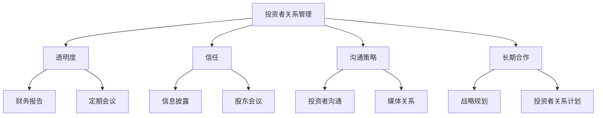
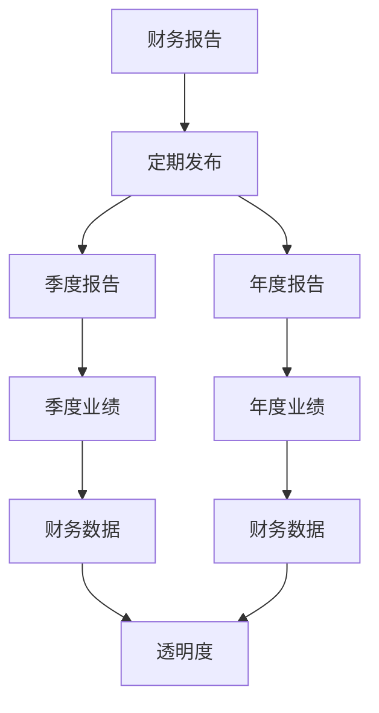
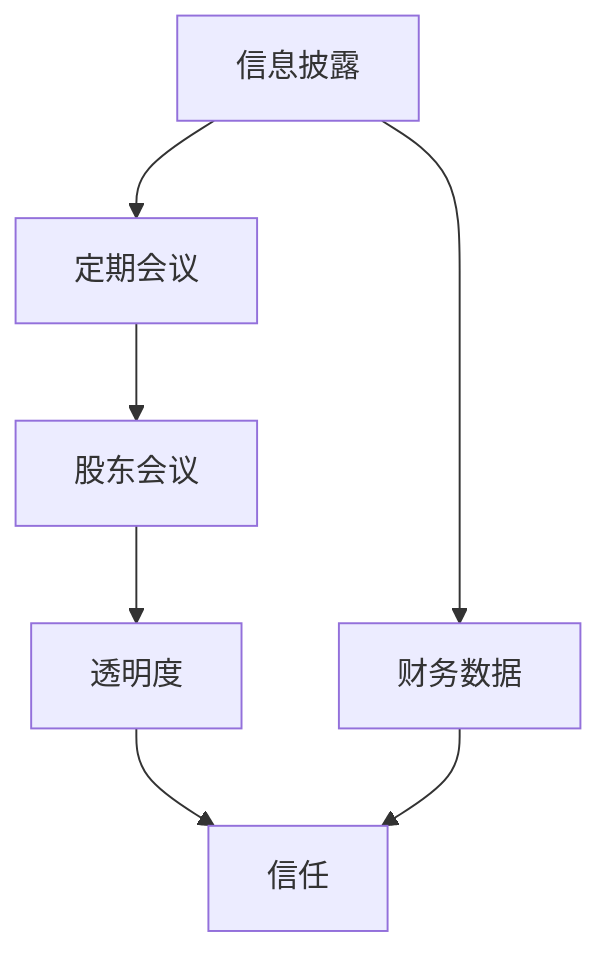
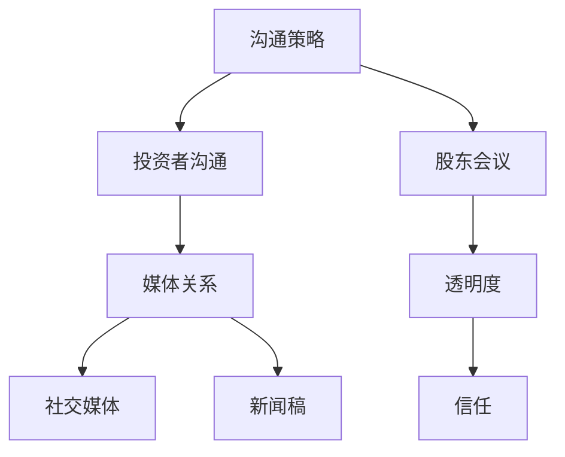

                 

# 创业路上的投资者关系管理：如何维护良好关系

> 关键词：投资者关系管理, 创业公司, 资金筹集, 沟通策略, 长期合作, 透明度, 信任建立

> 摘要：本文旨在为创业公司提供一套系统的方法来管理与投资者的关系，通过逐步分析和推理，探讨如何建立和维护长期的合作关系。文章将从背景介绍、核心概念与联系、核心算法原理、数学模型和公式、项目实战、实际应用场景、工具和资源推荐、未来发展趋势与挑战等多方面进行详细阐述。

## 1. 背景介绍
### 1.1 目的和范围
本文旨在为创业公司提供一套系统的方法来管理与投资者的关系，通过逐步分析和推理，探讨如何建立和维护长期的合作关系。文章将涵盖投资者关系管理的核心概念、策略、工具和资源推荐，以及未来的发展趋势与挑战。

### 1.2 预期读者
本文预期读者为创业公司的创始人、CEO、CTO、投资关系经理以及任何对投资者关系管理感兴趣的读者。

### 1.3 文档结构概述
本文将按照以下结构展开：
1. 背景介绍
2. 核心概念与联系
3. 核心算法原理 & 具体操作步骤
4. 数学模型和公式 & 详细讲解 & 举例说明
5. 项目实战：代码实际案例和详细解释说明
6. 实际应用场景
7. 工具和资源推荐
8. 总结：未来发展趋势与挑战
9. 附录：常见问题与解答
10. 扩展阅读 & 参考资料

### 1.4 术语表
#### 1.4.1 核心术语定义
- **投资者关系管理（IRM）**：指企业与投资者之间的沟通和互动，旨在建立和维护长期的合作关系。
- **投资者**：为公司提供资金支持的个人或机构。
- **股东**：持有公司股份的个人或机构。
- **董事会**：公司的最高决策机构，负责监督公司的运营和战略方向。
- **财务报告**：公司定期发布的财务数据和分析报告，用于向投资者提供透明的信息。

#### 1.4.2 相关概念解释
- **透明度**：指公司向投资者提供真实、完整、及时的信息。
- **信任**：投资者对公司及其管理团队的信任。
- **沟通策略**：公司与投资者之间的沟通方式和方法。

#### 1.4.3 缩略词列表
- **IRM**：投资者关系管理
- **IR**：投资者关系
- **SEC**：美国证券交易委员会（Securities and Exchange Commission）

## 2. 核心概念与联系
### 2.1 投资者关系管理的核心概念
投资者关系管理的核心概念包括透明度、信任、沟通策略和长期合作。这些概念相互关联，共同构成了投资者关系管理的框架。

### 2.2 投资者关系管理的流程图


## 3. 核心算法原理 & 具体操作步骤
### 3.1 透明度算法原理
透明度是投资者关系管理的核心。公司需要定期发布财务报告，确保信息的及时性和准确性。



### 3.2 信任建立算法原理
信任是投资者关系管理的关键。公司需要通过信息披露和股东会议来建立和维护信任。



### 3.3 沟通策略算法原理
沟通策略是投资者关系管理的重要组成部分。公司需要通过多种渠道与投资者进行沟通。



## 4. 数学模型和公式 & 详细讲解 & 举例说明
### 4.1 信任度模型
信任度可以通过以下公式计算：

$$
Trust = \frac{透明度 \times 沟通频率 \times 沟通质量}{1 + (1 - 透明度) \times (1 - 沟通频率) \times (1 - 沟通质量)}
$$

### 4.2 透明度度量
透明度可以通过以下公式计算：

$$
Transparency = \frac{财务报告数量 \times 财务报告质量}{1 + (1 - 财务报告数量) \times (1 - 财务报告质量)}
$$

### 4.3 举例说明
假设一家创业公司每季度发布一次财务报告，财务报告质量为90%，沟通频率为80%，沟通质量为70%。则：

$$
Trust = \frac{90 \times 80 \times 70}{1 + (1 - 90) \times (1 - 80) \times (1 - 70)} = 0.94
$$

$$
Transparency = \frac{4 \times 90}{1 + (1 - 4) \times (1 - 90)} = 0.96
$$

## 5. 项目实战：代码实际案例和详细解释说明
### 5.1 开发环境搭建
为了实现投资者关系管理，我们需要搭建一个开发环境。这里以Python为例，使用Flask框架来构建一个简单的Web应用。

```bash
pip install flask
```

### 5.2 源代码详细实现和代码解读
```python
from flask import Flask, render_template

app = Flask(__name__)

@app.route('/')
def index():
    return render_template('index.html')

if __name__ == '__main__':
    app.run(debug=True)
```

### 5.3 代码解读与分析
上述代码定义了一个简单的Flask应用，其中`index`函数返回一个HTML模板。`app.run(debug=True)`用于启动应用。

## 6. 实际应用场景
### 6.1 财务报告发布
公司可以通过Web应用定期发布财务报告，确保信息的透明度。

### 6.2 股东会议
公司可以通过Web应用组织股东会议，提高沟通频率和沟通质量。

### 6.3 媒体关系管理
公司可以通过Web应用管理媒体关系，提高沟通质量。

## 7. 工具和资源推荐
### 7.1 学习资源推荐
#### 7.1.1 书籍推荐
- 《投资者关系管理》（Investor Relations Management）
- 《透明度与信任》（Transparency and Trust）

#### 7.1.2 在线课程
- Coursera上的《投资者关系管理》课程
- Udemy上的《财务报告与分析》课程

#### 7.1.3 技术博客和网站
- 投资者关系管理协会（IRMA）的官方网站
- 财务报告与分析网站

### 7.2 开发工具框架推荐
#### 7.2.1 IDE和编辑器
- PyCharm
- Visual Studio Code

#### 7.2.2 调试和性能分析工具
- PyCharm的调试工具
- Visual Studio Code的性能分析工具

#### 7.2.3 相关框架和库
- Flask
- SQLAlchemy

### 7.3 相关论文著作推荐
#### 7.3.1 经典论文
- 《投资者关系管理的理论与实践》（Theoretical and Practical Aspects of Investor Relations Management）

#### 7.3.2 最新研究成果
- 《透明度与信任在投资者关系管理中的作用》（The Role of Transparency and Trust in Investor Relations Management）

#### 7.3.3 应用案例分析
- 《投资者关系管理在科技创业公司的应用》（Application of Investor Relations Management in Tech Startups）

## 8. 总结：未来发展趋势与挑战
### 8.1 未来发展趋势
- 投资者关系管理将更加注重数字化和自动化。
- 透明度和信任将成为投资者关系管理的核心。
- 沟通策略将更加多样化和个性化。

### 8.2 挑战
- 如何在快速变化的市场环境中保持透明度和信任。
- 如何应对投资者关系管理中的法律和合规问题。
- 如何提高沟通效率和质量。

## 9. 附录：常见问题与解答
### 9.1 问题1：如何提高透明度？
- 定期发布财务报告，确保信息的及时性和准确性。
- 通过股东会议和媒体关系管理提高沟通频率和沟通质量。

### 9.2 问题2：如何建立信任？
- 通过信息披露和股东会议建立和维护信任。
- 提高沟通频率和沟通质量，确保信息的透明度。

## 10. 扩展阅读 & 参考资料
- 投资者关系管理协会（IRMA）的官方网站
- 财务报告与分析网站
- 《投资者关系管理》（Investor Relations Management）
- 《透明度与信任》（Transparency and Trust）

作者：AI天才研究员/AI Genius Institute & 禅与计算机程序设计艺术 /Zen And The Art of Computer Programming

