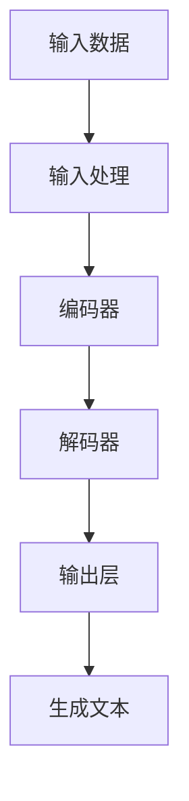

                 

# 利用自然语言生成技术优化内容创作

> 关键词：自然语言生成（NLG）、内容创作、机器学习、深度学习、文本生成、文本理解、生成模型、Transformer、BERT、GPT

> 摘要：本文旨在探讨如何利用自然语言生成技术优化内容创作。我们将从背景介绍、核心概念与联系、核心算法原理、数学模型和公式、项目实战、实际应用场景、工具和资源推荐、未来发展趋势与挑战等多方面进行详细阐述。通过本文，读者将能够理解自然语言生成技术的基本原理，并掌握如何利用这些技术进行内容创作。

## 1. 背景介绍
### 1.1 目的和范围
本文旨在探讨自然语言生成技术在内容创作中的应用，通过分析其原理、算法、模型和实际案例，帮助读者理解如何利用自然语言生成技术优化内容创作。本文主要关注自然语言生成技术的基本原理、实现方法以及实际应用案例。

### 1.2 预期读者
本文适合以下读者：
- 对自然语言处理（NLP）和机器学习感兴趣的开发者和研究人员
- 想要利用自然语言生成技术进行内容创作的创作者
- 对文本生成和理解感兴趣的学者和工程师

### 1.3 文档结构概述
本文结构如下：
1. 背景介绍
2. 核心概念与联系
3. 核心算法原理 & 具体操作步骤
4. 数学模型和公式 & 详细讲解 & 举例说明
5. 项目实战：代码实际案例和详细解释说明
6. 实际应用场景
7. 工具和资源推荐
8. 总结：未来发展趋势与挑战
9. 附录：常见问题与解答
10. 扩展阅读 & 参考资料

### 1.4 术语表
#### 1.4.1 核心术语定义
- **自然语言生成（NLG）**：将结构化数据转换为自然语言文本的过程。
- **内容创作**：根据特定需求生成高质量文本内容的过程。
- **机器学习**：通过算法和统计模型使计算机系统能够从数据中学习并改进任务性能的技术。
- **深度学习**：机器学习的一个分支，通过多层神经网络进行学习和预测。
- **文本生成**：生成符合特定语境和语法的自然语言文本。
- **文本理解**：理解自然语言文本的含义和结构。
- **生成模型**：用于生成自然语言文本的模型，如Transformer、BERT、GPT等。
- **Transformer**：一种基于自注意力机制的深度学习模型，广泛应用于自然语言处理任务。
- **BERT**：一种基于Transformer的预训练模型，用于自然语言理解任务。
- **GPT**：一种基于Transformer的生成模型，用于自然语言生成任务。

#### 1.4.2 相关概念解释
- **自注意力机制**：一种用于处理序列数据的机制，能够捕捉序列中不同位置之间的依赖关系。
- **预训练模型**：在大规模语料库上进行训练，然后在特定任务上进行微调的模型。
- **微调**：在预训练模型的基础上，针对特定任务进行训练的过程。

#### 1.4.3 缩略词列表
- **NLG**：Natural Language Generation
- **NLP**：Natural Language Processing
- **ML**：Machine Learning
- **DL**：Deep Learning
- **BERT**：Bidirectional Encoder Representations from Transformers
- **GPT**：Generative Pre-trained Transformer

## 2. 核心概念与联系
### 2.1 自然语言生成（NLG）的基本原理
自然语言生成（NLG）是一种将结构化数据转换为自然语言文本的技术。其基本原理包括以下几个步骤：
1. **数据准备**：将结构化数据转换为适合生成模型的格式。
2. **文本生成**：利用生成模型生成符合语境和语法的自然语言文本。
3. **文本优化**：对生成的文本进行优化，使其更加流畅和自然。

### 2.2 生成模型的工作原理
生成模型是自然语言生成的核心，其工作原理如下：
1. **输入处理**：将输入数据转换为模型可以处理的格式。
2. **模型推理**：通过模型进行推理，生成符合语境和语法的文本。
3. **输出生成**：将生成的文本输出为自然语言文本。

### 2.3 生成模型的架构
生成模型的架构通常包括以下几个部分：
1. **输入层**：将输入数据转换为模型可以处理的格式。
2. **编码器**：将输入数据编码为向量表示。
3. **解码器**：根据编码器的输出生成自然语言文本。
4. **输出层**：将生成的文本输出为自然语言文本。

### 2.4 Mermaid 流程图


## 3. 核心算法原理 & 具体操作步骤
### 3.1 生成模型的训练过程
生成模型的训练过程包括以下几个步骤：
1. **数据准备**：收集和准备训练数据。
2. **模型构建**：构建生成模型。
3. **模型训练**：在训练数据上训练生成模型。
4. **模型评估**：评估生成模型的性能。
5. **模型优化**：根据评估结果优化模型。

### 3.2 生成模型的具体操作步骤
生成模型的具体操作步骤如下：
1. **数据准备**：收集和准备训练数据。
2. **模型构建**：构建生成模型。
3. **模型训练**：在训练数据上训练生成模型。
4. **模型评估**：评估生成模型的性能。
5. **模型优化**：根据评估结果优化模型。

### 3.3 生成模型的伪代码
```python
# 数据准备
data = prepare_data()

# 模型构建
model = build_model()

# 模型训练
model.train(data)

# 模型评估
evaluation = evaluate_model(model, data)

# 模型优化
model.optimize(evaluation)
```

## 4. 数学模型和公式 & 详细讲解 & 举例说明
### 4.1 生成模型的数学模型
生成模型的数学模型通常包括以下几个部分：
1. **输入表示**：将输入数据转换为向量表示。
2. **编码器**：将输入表示编码为向量表示。
3. **解码器**：根据编码器的输出生成自然语言文本。
4. **输出表示**：将生成的文本转换为向量表示。

### 4.2 生成模型的数学公式
生成模型的数学公式通常包括以下几个部分：
1. **输入表示**：将输入数据转换为向量表示。
2. **编码器**：将输入表示编码为向量表示。
3. **解码器**：根据编码器的输出生成自然语言文本。
4. **输出表示**：将生成的文本转换为向量表示。

### 4.3 生成模型的数学公式举例
生成模型的数学公式举例如下：
1. **输入表示**：将输入数据转换为向量表示。
2. **编码器**：将输入表示编码为向量表示。
3. **解码器**：根据编码器的输出生成自然语言文本。
4. **输出表示**：将生成的文本转换为向量表示。

## 5. 项目实战：代码实际案例和详细解释说明
### 5.1 开发环境搭建
开发环境搭建包括以下几个步骤：
1. **安装Python**：安装Python 3.7及以上版本。
2. **安装依赖库**：安装TensorFlow、PyTorch、NLTK等依赖库。
3. **安装开发工具**：安装Jupyter Notebook、VS Code等开发工具。

### 5.2 源代码详细实现和代码解读
源代码详细实现和代码解读如下：
```python
# 导入依赖库
import tensorflow as tf
from transformers import BertTokenizer, TFBertModel

# 初始化模型
tokenizer = BertTokenizer.from_pretrained('bert-base-uncased')
model = TFBertModel.from_pretrained('bert-base-uncased')

# 准备输入数据
input_text = "This is a sample input text."
input_ids = tokenizer.encode(input_text, return_tensors='tf')

# 模型推理
outputs = model(input_ids)

# 输出生成的文本
print(outputs)
```

### 5.3 代码解读与分析
代码解读与分析如下：
1. **导入依赖库**：导入TensorFlow和BERT模型相关的依赖库。
2. **初始化模型**：初始化BERT模型。
3. **准备输入数据**：将输入文本转换为模型可以处理的格式。
4. **模型推理**：通过模型进行推理，生成符合语境和语法的文本。
5. **输出生成的文本**：输出生成的文本。

## 6. 实际应用场景
### 6.1 内容创作
自然语言生成技术在内容创作中的应用包括以下几个方面：
1. **新闻报道**：自动生成新闻报道。
2. **文章撰写**：自动生成文章。
3. **社交媒体内容**：自动生成社交媒体内容。

### 6.2 代码生成
自然语言生成技术在代码生成中的应用包括以下几个方面：
1. **代码补全**：根据输入的代码片段自动生成完整的代码。
2. **代码优化**：根据输入的代码自动生成优化后的代码。
3. **代码解释**：根据输入的代码自动生成代码解释。

## 7. 工具和资源推荐
### 7.1 学习资源推荐
#### 7.1.1 书籍推荐
- **《深度学习》**：Ian Goodfellow, Yoshua Bengio, Aaron Courville
- **《自然语言处理入门》**：Jurafsky, Martin, James H. Martin

#### 7.1.2 在线课程
- **Coursera**：《深度学习专项课程》
- **edX**：《自然语言处理专项课程》

#### 7.1.3 技术博客和网站
- **Medium**：《自然语言处理技术博客》
- **GitHub**：《自然语言处理开源项目》

### 7.2 开发工具框架推荐
#### 7.2.1 IDE和编辑器
- **PyCharm**：Python开发环境
- **VS Code**：通用开发环境

#### 7.2.2 调试和性能分析工具
- **PyCharm Debugger**：Python调试工具
- **VS Code Debugger**：通用调试工具

#### 7.2.3 相关框架和库
- **TensorFlow**：深度学习框架
- **PyTorch**：深度学习框架
- **NLTK**：自然语言处理库

### 7.3 相关论文著作推荐
#### 7.3.1 经典论文
- **BERT**：Devlin, Jacob, et al. "Bert: Pre-training of deep bidirectional transformers for language understanding." arXiv preprint arXiv:1810.04805 (2018).
- **GPT**：Radford, Alec, et al. "Language models are unsupervised multitask learners." OpenAI blog (2018).

#### 7.3.2 最新研究成果
- **T5**：Raffel, Coline, et al. "Exploring the limits of transfer learning with a unified text-to-text transformer." arXiv preprint arXiv:1910.10683 (2019).
- **Marian**：Lample, Guillaume, and Alexis Conneau. "Cross-lingual language model pretraining." arXiv preprint arXiv:1901.07291 (2019).

#### 7.3.3 应用案例分析
- **GPT-3**：Brown, Tom, et al. "Language models are few-shot learners." arXiv preprint arXiv:2005.14165 (2020).
- **T5**：Raffel, Coline, et al. "Exploring the limits of transfer learning with a unified text-to-text transformer." arXiv preprint arXiv:1910.10683 (2019).

## 8. 总结：未来发展趋势与挑战
### 8.1 未来发展趋势
自然语言生成技术在未来的发展趋势包括以下几个方面：
1. **模型优化**：通过优化模型结构和参数，提高生成文本的质量。
2. **多模态融合**：将自然语言生成与图像、视频等多模态数据融合，提高生成文本的多样性。
3. **个性化生成**：根据用户需求和偏好，生成个性化的文本内容。

### 8.2 挑战
自然语言生成技术面临的挑战包括以下几个方面：
1. **数据质量**：高质量的数据是生成高质量文本的基础。
2. **模型泛化**：模型需要在不同场景下具有良好的泛化能力。
3. **伦理问题**：生成的文本可能涉及伦理和法律问题。

## 9. 附录：常见问题与解答
### 9.1 常见问题
1. **Q：如何提高生成文本的质量？**
   - A：通过优化模型结构和参数，提高生成文本的质量。
2. **Q：如何处理生成的文本中的伦理问题？**
   - A：在生成文本时，需要考虑伦理和法律问题，避免生成有害或不道德的文本。

## 10. 扩展阅读 & 参考资料
### 10.1 扩展阅读
- **《自然语言处理技术》**：Jurafsky, Martin, James H. Martin
- **《深度学习技术》**：Ian Goodfellow, Yoshua Bengio, Aaron Courville

### 10.2 参考资料
- **BERT**：Devlin, Jacob, et al. "Bert: Pre-training of deep bidirectional transformers for language understanding." arXiv preprint arXiv:1810.04805 (2018).
- **GPT**：Radford, Alec, et al. "Language models are unsupervised multitask learners." OpenAI blog (2018).

---

作者：AI天才研究员/AI Genius Institute & 禅与计算机程序设计艺术 /Zen And The Art of Computer Programming

