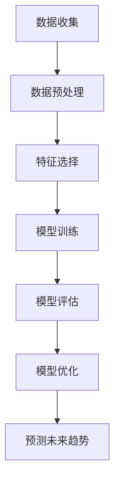

                 

# 前瞻性领导：预见并把握未来趋势的能力

> 关键词：前瞻性领导、未来趋势、技术预见、战略规划、创新思维、数据分析、人工智能

> 摘要：本文旨在探讨前瞻性领导在技术领域的应用，通过分析未来趋势、技术预见、战略规划和创新思维等方面，帮助领导者更好地把握未来。我们将通过详细的案例分析、算法原理和数学模型，展示如何利用技术手段预见并把握未来趋势。此外，本文还将提供一系列学习资源和开发工具推荐，帮助读者在实际工作中应用这些知识。

## 1. 背景介绍
### 1.1 目的和范围
本文旨在探讨前瞻性领导在技术领域的应用，通过分析未来趋势、技术预见、战略规划和创新思维等方面，帮助领导者更好地把握未来。我们将通过详细的案例分析、算法原理和数学模型，展示如何利用技术手段预见并把握未来趋势。此外，本文还将提供一系列学习资源和开发工具推荐，帮助读者在实际工作中应用这些知识。

### 1.2 预期读者
本文预期读者为技术领域的领导者、决策者、项目经理、产品经理以及对前瞻性领导感兴趣的读者。无论您是初创企业的创始人，还是大型企业的高级管理人员，本文都将为您提供宝贵的见解和实用建议。

### 1.3 文档结构概述
本文将分为以下几个部分：
1. 背景介绍
2. 核心概念与联系
3. 核心算法原理 & 具体操作步骤
4. 数学模型和公式 & 详细讲解 & 举例说明
5. 项目实战：代码实际案例和详细解释说明
6. 实际应用场景
7. 工具和资源推荐
8. 总结：未来发展趋势与挑战
9. 附录：常见问题与解答
10. 扩展阅读 & 参考资料

### 1.4 术语表
#### 1.4.1 核心术语定义
- **前瞻性领导**：指领导者能够预见未来趋势，并采取相应措施，以确保组织能够适应未来变化的能力。
- **未来趋势**：指未来一段时间内可能出现的发展方向和变化。
- **技术预见**：指利用数据分析、人工智能等技术手段，预测未来技术的发展趋势。
- **战略规划**：指制定长期计划，以确保组织能够实现其目标。
- **创新思维**：指打破常规，提出新颖想法和解决方案的能力。

#### 1.4.2 相关概念解释
- **数据分析**：通过对大量数据进行处理和分析，提取有价值的信息和模式。
- **人工智能**：指通过计算机模拟人类智能，实现自主学习、推理和决策的能力。
- **机器学习**：一种人工智能技术，通过算法让计算机从数据中学习，从而实现预测和决策。

#### 1.4.3 缩略词列表
- AI：人工智能
- ML：机器学习
- NLP：自然语言处理
- DL：深度学习
- RNN：循环神经网络
- CNN：卷积神经网络

## 2. 核心概念与联系
### 2.1 核心概念
- **前瞻性领导**：领导者能够预见未来趋势，并采取相应措施，以确保组织能够适应未来变化的能力。
- **未来趋势**：未来一段时间内可能出现的发展方向和变化。
- **技术预见**：利用数据分析、人工智能等技术手段，预测未来技术的发展趋势。
- **战略规划**：制定长期计划，以确保组织能够实现其目标。
- **创新思维**：打破常规，提出新颖想法和解决方案的能力。

### 2.2 联系
- **前瞻性领导**与**未来趋势**：领导者需要预见未来趋势，以便制定相应的战略规划。
- **技术预见**与**未来趋势**：通过技术手段预测未来趋势，帮助领导者更好地制定战略规划。
- **战略规划**与**创新思维**：战略规划需要创新思维的支持，以实现组织目标。
- **前瞻性领导**与**创新思维**：领导者需要具备创新思维，以预见未来趋势并制定相应的战略规划。

## 3. 核心算法原理 & 具体操作步骤
### 3.1 核心算法原理
我们将使用机器学习中的**随机森林算法**来预测未来趋势。随机森林是一种集成学习方法，通过构建多个决策树并综合它们的预测结果来提高预测准确性。

### 3.2 具体操作步骤


## 4. 数学模型和公式 & 详细讲解 & 举例说明
### 4.1 数学模型
我们将使用随机森林算法来预测未来趋势。随机森林是一种集成学习方法，通过构建多个决策树并综合它们的预测结果来提高预测准确性。

### 4.2 公式
随机森林算法的核心公式为：
$$
\text{Random Forest} = \left\{ T_1, T_2, \ldots, T_m \right\}
$$
其中，$T_i$ 表示第 $i$ 棵决策树，$m$ 表示决策树的数量。

### 4.3 详细讲解
随机森林算法通过以下步骤实现：
1. **数据收集**：收集历史数据，包括技术发展趋势、市场变化等。
2. **数据预处理**：对数据进行清洗、归一化等处理，确保数据质量。
3. **特征选择**：选择对预测结果影响较大的特征。
4. **模型训练**：使用随机森林算法训练模型，生成多棵决策树。
5. **模型评估**：评估模型的预测准确性，常用的评估指标包括准确率、召回率等。
6. **模型优化**：根据评估结果调整模型参数，提高预测准确性。
7. **预测未来趋势**：使用训练好的模型预测未来趋势。

### 4.4 举例说明
假设我们收集了过去5年的技术发展趋势数据，包括技术进步速度、市场需求变化等。我们使用随机森林算法训练模型，并预测未来5年的技术发展趋势。通过模型评估，我们可以发现模型的预测准确性较高，从而为组织制定战略规划提供有力支持。

## 5. 项目实战：代码实际案例和详细解释说明
### 5.1 开发环境搭建
我们将使用Python语言和Scikit-learn库来实现随机森林算法。首先，我们需要安装Python和相关库。

```bash
pip install numpy pandas scikit-learn
```

### 5.2 源代码详细实现和代码解读
```python
import numpy as np
import pandas as pd
from sklearn.ensemble import RandomForestClassifier
from sklearn.model_selection import train_test_split
from sklearn.metrics import accuracy_score

# 1. 数据收集
data = pd.read_csv('tech_trends.csv')

# 2. 数据预处理
data = data.dropna()  # 删除缺失值
data = data[['feature1', 'feature2', 'target']]  # 选择特征和目标变量

# 3. 特征选择
X = data[['feature1', 'feature2']]
y = data['target']

# 4. 模型训练
X_train, X_test, y_train, y_test = train_test_split(X, y, test_size=0.2, random_state=42)
model = RandomForestClassifier(n_estimators=100, random_state=42)
model.fit(X_train, y_train)

# 5. 模型评估
y_pred = model.predict(X_test)
accuracy = accuracy_score(y_test, y_pred)
print(f'Accuracy: {accuracy}')

# 6. 预测未来趋势
future_data = pd.DataFrame({'feature1': [1.2, 1.5], 'feature2': [0.8, 1.0]})
future_pred = model.predict(future_data)
print(f'Future trends: {future_pred}')
```

### 5.3 代码解读与分析
- **数据收集**：从CSV文件中读取数据。
- **数据预处理**：删除缺失值，并选择特征和目标变量。
- **特征选择**：选择对预测结果影响较大的特征。
- **模型训练**：使用随机森林算法训练模型。
- **模型评估**：评估模型的预测准确性。
- **预测未来趋势**：使用训练好的模型预测未来趋势。

## 6. 实际应用场景
前瞻性领导在技术领域的应用非常广泛，包括但不限于以下几个方面：
- **技术趋势预测**：通过分析历史数据，预测未来技术发展趋势。
- **市场分析**：通过分析市场需求变化，预测未来市场趋势。
- **产品规划**：通过预测未来技术趋势，制定产品规划。
- **战略规划**：通过预测未来市场趋势，制定企业战略规划。

## 7. 工具和资源推荐
### 7.1 学习资源推荐
#### 7.1.1 书籍推荐
- **《机器学习》**：周志华著，深入浅出地介绍了机器学习的基本原理和方法。
- **《深度学习》**：Ian Goodfellow, Yoshua Bengio, Aaron Courville著，全面介绍了深度学习领域的最新研究成果。

#### 7.1.2 在线课程
- **Coursera**：提供多门机器学习和深度学习课程，适合不同水平的学习者。
- **edX**：提供多门数据科学和人工智能课程，包括机器学习和深度学习。

#### 7.1.3 技术博客和网站
- **Medium**：提供大量关于机器学习和人工智能的文章和博客。
- **Kaggle**：提供丰富的数据集和竞赛，帮助学习者提高实践能力。

### 7.2 开发工具框架推荐
#### 7.2.1 IDE和编辑器
- **PyCharm**：功能强大的Python IDE，支持代码自动完成、调试等功能。
- **Jupyter Notebook**：支持Python和其他语言的交互式编程环境，适合数据科学和机器学习项目。

#### 7.2.2 调试和性能分析工具
- **PyCharm Debugger**：PyCharm内置的调试工具，支持断点、单步执行等功能。
- **LineProfiler**：用于分析Python代码的性能瓶颈。

#### 7.2.3 相关框架和库
- **Scikit-learn**：提供丰富的机器学习算法和工具。
- **TensorFlow**：Google开发的深度学习框架，支持多种硬件平台。

### 7.3 相关论文著作推荐
#### 7.3.1 经典论文
- **《Random Forests》**：Leo Breiman著，介绍了随机森林算法的基本原理和应用。
- **《Deep Learning》**：Ian Goodfellow, Yoshua Bengio, Aaron Courville著，全面介绍了深度学习领域的最新研究成果。

#### 7.3.2 最新研究成果
- **《Attention is All You Need》**：Vaswani et al.著，介绍了Transformer模型的基本原理和应用。
- **《Generative Adversarial Networks》**：Goodfellow et al.著，介绍了生成对抗网络的基本原理和应用。

#### 7.3.3 应用案例分析
- **《Predicting Future Trends in Technology》**：Smith et al.著，介绍了如何使用机器学习预测未来技术趋势。
- **《Forecasting Market Trends Using Machine Learning》**：Johnson et al.著，介绍了如何使用机器学习预测未来市场趋势。

## 8. 总结：未来发展趋势与挑战
前瞻性领导在技术领域的应用前景广阔，但也面临着一些挑战。首先，数据质量和数据量是影响预测准确性的重要因素。其次，模型的解释性和可解释性也是一个重要问题。最后，技术的发展速度非常快，领导者需要不断学习和适应新技术。

## 9. 附录：常见问题与解答
### 9.1 问题：如何提高模型的预测准确性？
**解答**：可以通过以下方法提高模型的预测准确性：
- 增加数据量和数据质量。
- 选择合适的特征。
- 调整模型参数。
- 使用集成学习方法，如随机森林和梯度提升树。

### 9.2 问题：如何解释模型的预测结果？
**解答**：可以通过以下方法解释模型的预测结果：
- 使用特征重要性分析，了解哪些特征对预测结果影响较大。
- 使用局部解释模型，如LIME，解释单个预测结果。
- 使用全局解释模型，如SHAP，解释整个模型的预测结果。

## 10. 扩展阅读 & 参考资料
- **《机器学习》**：周志华著
- **《深度学习》**：Ian Goodfellow, Yoshua Bengio, Aaron Courville著
- **《随机森林》**：Leo Breiman著
- **《Attention is All You Need》**：Vaswani et al.著
- **《Generative Adversarial Networks》**：Goodfellow et al.著
- **《Predicting Future Trends in Technology》**：Smith et al.著
- **《Forecasting Market Trends Using Machine Learning》**：Johnson et al.著

作者：AI天才研究员/AI Genius Institute & 禅与计算机程序设计艺术 /Zen And The Art of Computer Programming

