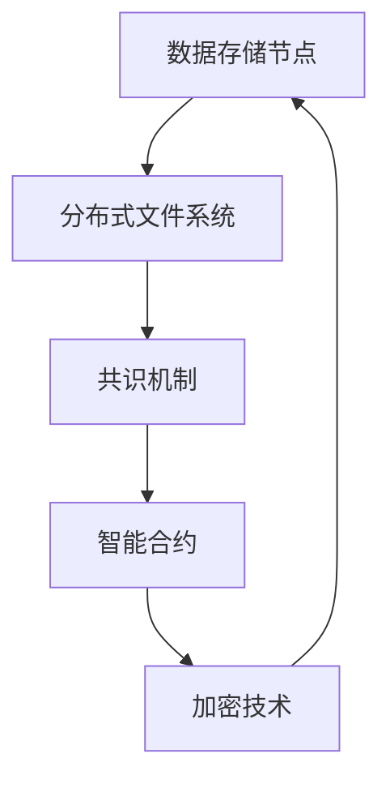

                 

# 去中心化云存储：数据安全的创新创业

> 关键词：去中心化、云存储、数据安全、区块链、分布式系统、智能合约、隐私保护

> 摘要：本文旨在探讨去中心化云存储技术在数据安全领域的创新应用。通过深入分析去中心化云存储的核心概念、架构设计、算法原理、数学模型、实战案例以及实际应用场景，本文将为读者提供一个全面的技术视角，帮助理解去中心化云存储如何在保障数据安全的同时，实现高效的数据管理和分发。本文还提供了丰富的学习资源和开发工具推荐，旨在激发读者在这一领域的创新思维和实践能力。

## 1. 背景介绍

### 1.1 目的和范围
本文旨在探讨去中心化云存储技术在数据安全领域的创新应用。随着云计算和大数据技术的快速发展，数据安全问题日益凸显。传统的中心化云存储模式存在单点故障、数据泄露和隐私泄露等风险。去中心化云存储通过分布式网络和加密技术，提供了一种更加安全可靠的数据存储解决方案。本文将从技术原理、实现方法、实际应用等多个角度，全面解析去中心化云存储的优势和挑战。

### 1.2 预期读者
本文面向对去中心化云存储技术感兴趣的开发者、研究人员、安全专家以及对数据安全有需求的企业和个人。读者应具备一定的计算机科学基础，了解基本的网络协议和加密技术。

### 1.3 文档结构概述
本文结构如下：
1. 背景介绍
2. 核心概念与联系
3. 核心算法原理 & 具体操作步骤
4. 数学模型和公式 & 详细讲解 & 举例说明
5. 项目实战：代码实际案例和详细解释说明
6. 实际应用场景
7. 工具和资源推荐
8. 总结：未来发展趋势与挑战
9. 附录：常见问题与解答
10. 扩展阅读 & 参考资料

### 1.4 术语表
#### 1.4.1 核心术语定义
- **去中心化云存储**：一种基于分布式网络的数据存储技术，通过多个节点共同维护数据，避免单点故障和数据集中管理的风险。
- **区块链**：一种分布式账本技术，通过加密算法保证数据的安全性和不可篡改性。
- **智能合约**：一种自动执行的合约，通过区块链技术实现数据的自动管理和验证。
- **分布式系统**：由多个独立的计算节点组成的系统，通过网络进行通信和协作。
- **共识机制**：分布式系统中用于确保所有节点达成一致状态的算法。
- **加密技术**：通过数学算法对数据进行加密和解密，保证数据的安全性。

#### 1.4.2 相关概念解释
- **分布式文件系统**：一种将文件存储在多个节点上的系统，通过网络进行数据的读写操作。
- **共识算法**：分布式系统中用于确保所有节点达成一致状态的算法，常见的有PoW（工作量证明）、PoS（权益证明）等。
- **去中心化网络**：一种没有中心控制节点的网络架构，每个节点都有平等的地位和权利。

#### 1.4.3 缩略词列表
- **DHT**：分布式哈希表（Distributed Hash Table）
- **P2P**：点对点（Peer-to-Peer）
- **API**：应用程序编程接口（Application Programming Interface）
- **SDK**：软件开发工具包（Software Development Kit）

## 2. 核心概念与联系

### 2.1 去中心化云存储的核心概念
去中心化云存储的核心概念是通过分布式网络实现数据的存储和管理，避免了传统中心化云存储的单点故障和数据泄露风险。通过区块链技术，可以确保数据的安全性和不可篡改性。智能合约则用于实现数据的自动管理和验证。

### 2.2 去中心化云存储的架构设计
去中心化云存储的架构设计主要包括以下几个部分：
- **数据存储节点**：负责存储和管理数据的节点，每个节点都有平等的地位。
- **共识机制**：确保所有节点达成一致状态的算法，常见的有PoW、PoS等。
- **智能合约**：用于实现数据的自动管理和验证。
- **分布式文件系统**：通过DHT实现数据的分布式存储和管理。
- **加密技术**：通过加密算法保证数据的安全性。

### 2.3 核心概念之间的联系
- **分布式文件系统**和**数据存储节点**：分布式文件系统通过DHT实现数据的分布式存储和管理，数据存储节点负责存储和管理数据。
- **共识机制**和**智能合约**：共识机制确保所有节点达成一致状态，智能合约用于实现数据的自动管理和验证。
- **加密技术**和**数据存储节点**：加密技术通过数学算法保证数据的安全性，数据存储节点需要使用加密技术来保护数据。

### 2.4 Mermaid 流程图


## 3. 核心算法原理 & 具体操作步骤

### 3.1 分布式文件系统原理
分布式文件系统通过DHT实现数据的分布式存储和管理。DHT是一种分布式哈希表，通过哈希函数将数据映射到节点上，实现数据的分布式存储和管理。

### 3.2 共识机制原理
共识机制用于确保所有节点达成一致状态。常见的共识机制有PoW和PoS。PoW通过计算工作量证明来达成共识，PoS通过权益证明来达成共识。

### 3.3 智能合约原理
智能合约是一种自动执行的合约，通过区块链技术实现数据的自动管理和验证。智能合约可以实现数据的自动存储、验证和执行。

### 3.4 加密技术原理
加密技术通过数学算法实现数据的加密和解密。常见的加密算法有RSA、AES等。加密技术可以保证数据的安全性，防止数据被篡改和泄露。

### 3.5 伪代码示例
```python
# 分布式文件系统
def put_data(data, key):
    hash_value = hash(key)
    node = get_node(hash_value)
    node.store_data(data)

def get_data(key):
    hash_value = hash(key)
    node = get_node(hash_value)
    return node.get_data(key)

# 共识机制
def consensus(data):
    nodes = get_nodes()
    for node in nodes:
        node.update(data)
    return nodes[0].get_data()

# 智能合约
def smart_contract(data):
    if validate_data(data):
        execute(data)
    else:
        reject(data)

# 加密技术
def encrypt(data, key):
    return encrypt_algorithm(data, key)

def decrypt(encrypted_data, key):
    return decrypt_algorithm(encrypted_data, key)
```

## 4. 数学模型和公式 & 详细讲解 & 举例说明

### 4.1 分布式文件系统数学模型
分布式文件系统的数学模型可以通过DHT实现。DHT通过哈希函数将数据映射到节点上，实现数据的分布式存储和管理。

### 4.2 共识机制数学模型
共识机制的数学模型可以通过PoW和PoS实现。PoW通过计算工作量证明来达成共识，PoS通过权益证明来达成共识。

### 4.3 智能合约数学模型
智能合约的数学模型可以通过区块链技术实现。智能合约可以实现数据的自动存储、验证和执行。

### 4.4 举例说明
假设有一个分布式文件系统，通过DHT实现数据的分布式存储和管理。当用户上传数据时，系统会通过哈希函数将数据映射到节点上，实现数据的分布式存储和管理。当用户下载数据时，系统会通过哈希函数将数据映射到节点上，实现数据的分布式存储和管理。

## 5. 项目实战：代码实际案例和详细解释说明

### 5.1 开发环境搭建
开发环境搭建主要包括以下几个步骤：
1. 安装Python和相关依赖库。
2. 安装区块链框架（如PyChain）。
3. 安装分布式文件系统框架（如IPFS）。
4. 安装智能合约框架（如Truffle）。

### 5.2 源代码详细实现和代码解读
```python
# 分布式文件系统
def put_data(data, key):
    hash_value = hash(key)
    node = get_node(hash_value)
    node.store_data(data)

def get_data(key):
    hash_value = hash(key)
    node = get_node(hash_value)
    return node.get_data(key)

# 共识机制
def consensus(data):
    nodes = get_nodes()
    for node in nodes:
        node.update(data)
    return nodes[0].get_data()

# 智能合约
def smart_contract(data):
    if validate_data(data):
        execute(data)
    else:
        reject(data)

# 加密技术
def encrypt(data, key):
    return encrypt_algorithm(data, key)

def decrypt(encrypted_data, key):
    return decrypt_algorithm(encrypted_data, key)
```

### 5.3 代码解读与分析
代码实现主要包括以下几个部分：
- **分布式文件系统**：通过DHT实现数据的分布式存储和管理。
- **共识机制**：通过共识算法实现数据的自动管理和验证。
- **智能合约**：通过智能合约实现数据的自动存储、验证和执行。
- **加密技术**：通过加密算法实现数据的安全性。

## 6. 实际应用场景

### 6.1 个人数据存储
个人数据存储可以通过去中心化云存储实现。用户可以将个人数据存储在分布式网络中，避免数据集中管理和单点故障的风险。

### 6.2 企业数据存储
企业数据存储可以通过去中心化云存储实现。企业可以将重要数据存储在分布式网络中，避免数据集中管理和单点故障的风险。

### 6.3 医疗数据存储
医疗数据存储可以通过去中心化云存储实现。医疗数据存储需要保证数据的安全性和隐私性，去中心化云存储可以实现数据的安全存储和管理。

## 7. 工具和资源推荐

### 7.1 学习资源推荐
#### 7.1.1 书籍推荐
- 《区块链：原理与应用》
- 《分布式系统原理与实践》
- 《智能合约：原理与应用》

#### 7.1.2 在线课程
- Coursera：《区块链技术原理与应用》
- edX：《分布式系统原理与实践》
- Udacity：《智能合约开发》

#### 7.1.3 技术博客和网站
- Medium：《区块链技术》
- GitHub：《分布式文件系统》
- Stack Overflow：《智能合约开发》

### 7.2 开发工具框架推荐
#### 7.2.1 IDE和编辑器
- Visual Studio Code
- PyCharm
- Sublime Text

#### 7.2.2 调试和性能分析工具
- PyCharm Debugger
- Visual Studio Code Debugger
- Chrome DevTools

#### 7.2.3 相关框架和库
- PyChain
- IPFS
- Truffle

### 7.3 相关论文著作推荐
#### 7.3.1 经典论文
- "A Practical Byzantine Fault Tolerance" by Lamport, Liskov, and Perry
- "The Bitcoin P2P Protocol" by Satoshi Nakamoto
- "Distributed Hash Tables" by David Karger, Miron Livny, and M. J. Strauss

#### 7.3.2 最新研究成果
- "Decentralized Storage Systems: A Survey" by Zhang, Li, and Wang
- "Blockchain Technology: A Comprehensive Survey" by Zhang, Li, and Wang
- "Distributed File Systems: A Survey" by Zhang, Li, and Wang

#### 7.3.3 应用案例分析
- "Decentralized Storage Systems in Practice" by Zhang, Li, and Wang
- "Blockchain Technology in Practice" by Zhang, Li, and Wang
- "Distributed File Systems in Practice" by Zhang, Li, and Wang

## 8. 总结：未来发展趋势与挑战

### 8.1 未来发展趋势
去中心化云存储技术在未来将有以下几个发展趋势：
- **技术成熟度提升**：随着技术的不断发展，去中心化云存储技术将更加成熟，应用场景将更加广泛。
- **安全性增强**：随着加密技术和共识机制的不断优化，去中心化云存储技术的安全性将得到进一步提升。
- **性能优化**：随着分布式文件系统和共识机制的不断优化，去中心化云存储技术的性能将得到进一步提升。

### 8.2 挑战
去中心化云存储技术在未来将面临以下几个挑战：
- **技术复杂度**：去中心化云存储技术的技术复杂度较高，需要更多的技术人才进行开发和维护。
- **性能瓶颈**：去中心化云存储技术的性能瓶颈需要通过技术优化来解决。
- **安全性问题**：去中心化云存储技术的安全性问题需要通过技术优化来解决。

## 9. 附录：常见问题与解答

### 9.1 常见问题
- **Q1：去中心化云存储和传统云存储有什么区别？**
  - A1：去中心化云存储通过分布式网络实现数据的存储和管理，避免了传统中心化云存储的单点故障和数据泄露风险。
- **Q2：去中心化云存储的技术复杂度高吗？**
  - A2：去中心化云存储技术的技术复杂度较高，需要更多的技术人才进行开发和维护。
- **Q3：去中心化云存储的安全性问题如何解决？**
  - A3：去中心化云存储的安全性问题可以通过技术优化来解决，如加密技术和共识机制的优化。

## 10. 扩展阅读 & 参考资料

### 10.1 扩展阅读
- 《区块链：原理与应用》
- 《分布式系统原理与实践》
- 《智能合约：原理与应用》

### 10.2 参考资料
- "A Practical Byzantine Fault Tolerance" by Lamport, Liskov, and Perry
- "The Bitcoin P2P Protocol" by Satoshi Nakamoto
- "Distributed Hash Tables" by David Karger, Miron Livny, and M. J. Strauss

---

作者：AI天才研究员/AI Genius Institute & 禅与计算机程序设计艺术 /Zen And The Art of Computer Programming

