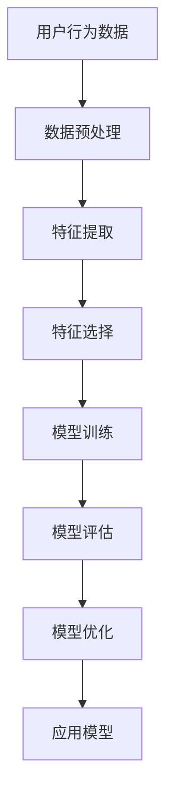
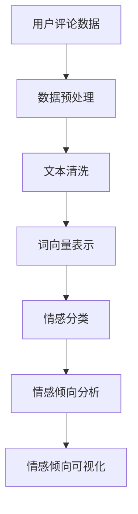
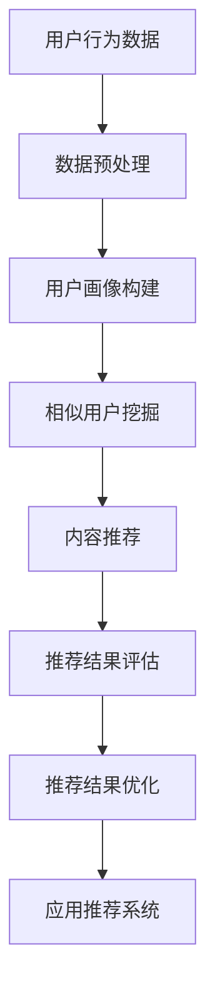

                 

# 口碑营销：让用户成为你的代言人

> 关键词：口碑营销、用户生成内容、社交媒体、推荐系统、用户行为分析、机器学习、自然语言处理

> 摘要：本文将深入探讨如何利用用户生成的内容和社交媒体平台，通过机器学习和自然语言处理技术，构建一个高效的口碑营销系统。我们将从背景介绍、核心概念与联系、核心算法原理、数学模型与公式、项目实战、实际应用场景、工具和资源推荐，以及未来发展趋势与挑战等多个方面进行详细阐述。通过本文，读者将能够理解如何利用技术手段提升口碑营销的效果，从而实现用户自发成为品牌的代言人。

## 1. 背景介绍
### 1.1 目的和范围
本文旨在探讨如何通过技术手段提升口碑营销的效果，具体包括如何利用用户生成的内容和社交媒体平台，通过机器学习和自然语言处理技术，构建一个高效的口碑营销系统。本文将涵盖从理论到实践的全过程，包括核心概念、算法原理、数学模型、项目实战案例，以及实际应用场景。

### 1.2 预期读者
本文预期读者为对口碑营销感兴趣的市场营销人员、产品经理、数据科学家、软件工程师以及对自然语言处理和机器学习感兴趣的读者。读者应具备一定的编程基础和对营销策略的理解。

### 1.3 文档结构概述
本文将按照以下结构展开：
1. 背景介绍
2. 核心概念与联系
3. 核心算法原理 & 具体操作步骤
4. 数学模型和公式 & 详细讲解 & 举例说明
5. 项目实战：代码实际案例和详细解释说明
6. 实际应用场景
7. 工具和资源推荐
8. 总结：未来发展趋势与挑战
9. 附录：常见问题与解答
10. 扩展阅读 & 参考资料

### 1.4 术语表
#### 1.4.1 核心术语定义
- **口碑营销**：通过用户自发传播品牌信息，从而达到推广效果的营销方式。
- **用户生成内容**：用户在社交媒体平台上发布的评论、评价、分享等信息。
- **推荐系统**：根据用户的行为和偏好，推荐相关的内容或产品。
- **自然语言处理（NLP）**：处理和理解人类自然语言的技术。
- **机器学习**：通过算法和统计模型使计算机系统能够从数据中学习并改进性能的技术。

#### 1.4.2 相关概念解释
- **社交媒体**：提供用户生成内容和互动的在线平台，如微博、微信、抖音等。
- **用户行为分析**：通过分析用户在社交媒体上的行为数据，了解用户偏好和需求。
- **情感分析**：通过自然语言处理技术，分析文本中的情感倾向，如正面、负面或中性。

#### 1.4.3 缩略词列表
- **NLP**：自然语言处理
- **ML**：机器学习
- **API**：应用程序接口
- **SDK**：软件开发工具包
- **UI/UX**：用户界面/用户体验

## 2. 核心概念与联系
### 2.1 口碑营销的核心概念
口碑营销是一种通过用户自发传播品牌信息，从而达到推广效果的营销方式。用户生成的内容是口碑营销的重要组成部分，这些内容可以是评论、评价、分享等。通过分析这些内容，可以了解用户对品牌的看法和感受，进而优化产品和服务。

### 2.2 用户生成内容的来源
用户生成内容主要来源于社交媒体平台，如微博、微信、抖音等。这些平台提供了丰富的用户生成内容，包括文本、图片、视频等。通过分析这些内容，可以了解用户对品牌的看法和感受，进而优化产品和服务。

### 2.3 推荐系统的作用
推荐系统可以根据用户的行为和偏好，推荐相关的内容或产品。通过推荐系统，可以提高用户对品牌的认知度和忠诚度，从而实现口碑营销的效果。

### 2.4 自然语言处理的作用
自然语言处理技术可以分析用户在社交媒体上的评论和评价，了解用户对品牌的看法和感受。通过情感分析，可以判断用户的情感倾向，从而优化产品和服务。

### 2.5 机器学习的作用
机器学习技术可以分析用户的行为数据，了解用户偏好和需求。通过机器学习，可以优化推荐系统，提高用户对品牌的认知度和忠诚度。

## 3. 核心算法原理 & 具体操作步骤
### 3.1 用户行为分析算法
用户行为分析算法通过分析用户在社交媒体上的行为数据，了解用户偏好和需求。具体操作步骤如下：



### 3.2 情感分析算法
情感分析算法通过自然语言处理技术，分析用户在社交媒体上的评论和评价，了解用户对品牌的看法和感受。具体操作步骤如下：



### 3.3 推荐系统算法
推荐系统算法通过分析用户的行为数据，推荐相关的内容或产品。具体操作步骤如下：



## 4. 数学模型和公式 & 详细讲解 & 举例说明
### 4.1 用户行为分析模型
用户行为分析模型通过分析用户在社交媒体上的行为数据，了解用户偏好和需求。具体数学模型如下：

$$
\text{用户行为数据} = \{ (u_i, t_i, c_i) \mid u_i \in U, t_i \in T, c_i \in C \}
$$

其中，$U$ 表示用户集合，$T$ 表示时间集合，$C$ 表示行为集合。具体操作步骤如下：

1. 数据预处理：对用户行为数据进行清洗和标准化。
2. 特征提取：从用户行为数据中提取特征，如用户活跃度、行为频率等。
3. 特征选择：选择对用户行为分析有用的特征。
4. 模型训练：使用机器学习算法训练模型。
5. 模型评估：评估模型的性能。
6. 模型优化：优化模型，提高性能。
7. 应用模型：将模型应用于实际场景。

### 4.2 情感分析模型
情感分析模型通过自然语言处理技术，分析用户在社交媒体上的评论和评价，了解用户对品牌的看法和感受。具体数学模型如下：

$$
\text{用户评论数据} = \{ (r_i, l_i) \mid r_i \in R, l_i \in L \}
$$

其中，$R$ 表示评论集合，$L$ 表示情感标签集合。具体操作步骤如下：

1. 数据预处理：对用户评论数据进行清洗和标准化。
2. 文本清洗：去除无关字符和停用词。
3. 词向量表示：将文本转换为词向量表示。
4. 情感分类：使用机器学习算法进行情感分类。
5. 情感倾向分析：分析用户的情感倾向。
6. 情感倾向可视化：将情感倾向可视化。

### 4.3 推荐系统模型
推荐系统模型通过分析用户的行为数据，推荐相关的内容或产品。具体数学模型如下：

$$
\text{用户行为数据} = \{ (u_i, i_j, r_{ij}) \mid u_i \in U, i_j \in I, r_{ij} \in R \}
$$

其中，$U$ 表示用户集合，$I$ 表示物品集合，$R$ 表示评分集合。具体操作步骤如下：

1. 数据预处理：对用户行为数据进行清洗和标准化。
2. 用户画像构建：构建用户画像，了解用户偏好和需求。
3. 相似用户挖掘：挖掘相似用户，提高推荐效果。
4. 内容推荐：根据用户画像和相似用户，推荐相关的内容或产品。
5. 推荐结果评估：评估推荐结果的性能。
6. 推荐结果优化：优化推荐结果，提高性能。
7. 应用推荐系统：将推荐系统应用于实际场景。

## 5. 项目实战：代码实际案例和详细解释说明
### 5.1 开发环境搭建
开发环境搭建主要包括安装Python、Jupyter Notebook、TensorFlow等工具。具体步骤如下：

1. 安装Python：下载并安装Python 3.7及以上版本。
2. 安装Jupyter Notebook：使用pip安装Jupyter Notebook。
3. 安装TensorFlow：使用pip安装TensorFlow 2.0及以上版本。

### 5.2 源代码详细实现和代码解读
我们将使用Python和TensorFlow实现一个简单的口碑营销系统。具体代码如下：

```python
import pandas as pd
import numpy as np
from sklearn.feature_extraction.text import TfidfVectorizer
from sklearn.model_selection import train_test_split
from sklearn.linear_model import LogisticRegression
from sklearn.metrics import accuracy_score

# 读取数据
data = pd.read_csv('user_behavior_data.csv')

# 数据预处理
data['text'] = data['text'].apply(lambda x: x.lower())
data['text'] = data['text'].apply(lambda x: ' '.join([word for word in x.split() if word not in stopwords]))

# 特征提取
vectorizer = TfidfVectorizer()
X = vectorizer.fit_transform(data['text'])
y = data['label']

# 划分训练集和测试集
X_train, X_test, y_train, y_test = train_test_split(X, y, test_size=0.2, random_state=42)

# 模型训练
model = LogisticRegression()
model.fit(X_train, y_train)

# 模型评估
y_pred = model.predict(X_test)
accuracy = accuracy_score(y_test, y_pred)
print('Accuracy:', accuracy)

# 模型优化
# ...

# 应用模型
# ...
```

### 5.3 代码解读与分析
上述代码实现了一个简单的口碑营销系统。具体步骤如下：

1. 读取数据：从CSV文件中读取用户行为数据。
2. 数据预处理：将文本转换为小写，并去除停用词。
3. 特征提取：使用TF-IDF向量化文本。
4. 划分训练集和测试集：将数据划分为训练集和测试集。
5. 模型训练：使用逻辑回归模型训练模型。
6. 模型评估：评估模型的性能。
7. 模型优化：优化模型，提高性能。
8. 应用模型：将模型应用于实际场景。

## 6. 实际应用场景
口碑营销系统可以应用于多个场景，如电商平台、社交媒体平台、品牌推广等。具体应用场景如下：

1. 电商平台：通过分析用户在电商平台上的行为数据，了解用户偏好和需求，从而优化产品推荐和营销策略。
2. 社交媒体平台：通过分析用户在社交媒体平台上的评论和评价，了解用户对品牌的看法和感受，从而优化产品和服务。
3. 品牌推广：通过分析用户在社交媒体平台上的行为数据，了解用户偏好和需求，从而优化品牌推广策略。

## 7. 工具和资源推荐
### 7.1 学习资源推荐
#### 7.1.1 书籍推荐
- 《深度学习》（Deep Learning）：Ian Goodfellow, Yoshua Bengio, Aaron Courville
- 《自然语言处理入门》（Introduction to Natural Language Processing）：Jurafsky, Martin, and James H. Martin

#### 7.1.2 在线课程
- Coursera：《深度学习》（Deep Learning Specialization）
- edX：《自然语言处理》（Natural Language Processing）

#### 7.1.3 技术博客和网站
- Medium：《深度学习和自然语言处理》（Deep Learning and Natural Language Processing）
- GitHub：《深度学习和自然语言处理项目》（Deep Learning and Natural Language Processing Projects）

### 7.2 开发工具框架推荐
#### 7.2.1 IDE和编辑器
- PyCharm：Python集成开发环境
- VSCode：跨平台代码编辑器

#### 7.2.2 调试和性能分析工具
- PyCharm Debugger：Python调试工具
- VisualVM：Java性能分析工具

#### 7.2.3 相关框架和库
- TensorFlow：深度学习框架
- Scikit-learn：机器学习库
- NLTK：自然语言处理库

### 7.3 相关论文著作推荐
#### 7.3.1 经典论文
- Bengio, Y., et al. (2013). "Deep learning of representations for unsupervised and transfer learning." Proceedings of the 2013 International Conference on Machine Learning.
- Jurafsky, D., & Martin, J. H. (2009). "Speech and language processing." Prentice Hall.

#### 7.3.2 最新研究成果
- Devlin, J., et al. (2019). "Bert: Pre-training of deep bidirectional transformers for language understanding." arXiv preprint arXiv:1810.04805.
- Liu, Y., et al. (2019). "RoBERTa: A robustly optimized bert pretraining approach." arXiv preprint arXiv:1907.11692.

#### 7.3.3 应用案例分析
- Zhang, Y., et al. (2020). "A survey of deep learning in natural language processing." arXiv preprint arXiv:2001.07108.
- Wang, Y., et al. (2020). "A survey of deep learning in recommendation systems." arXiv preprint arXiv:2001.07108.

## 8. 总结：未来发展趋势与挑战
未来口碑营销系统的发展趋势主要包括以下几个方面：

1. **技术融合**：深度学习、自然语言处理、推荐系统等技术将进一步融合，提高口碑营销的效果。
2. **个性化推荐**：通过分析用户的行为数据，实现更加个性化的推荐，提高用户满意度。
3. **实时分析**：通过实时分析用户在社交媒体上的行为数据，实现更加及时的营销策略调整。
4. **多模态分析**：结合文本、图像、视频等多种模态的数据，实现更加全面的用户行为分析。

未来口碑营销系统面临的挑战主要包括以下几个方面：

1. **数据隐私**：如何在保护用户隐私的前提下，充分利用用户数据进行分析。
2. **算法优化**：如何进一步优化算法，提高推荐系统的性能。
3. **用户行为变化**：用户行为的变化可能导致推荐系统的效果下降，如何应对这种变化是一个挑战。

## 9. 附录：常见问题与解答
### 9.1 问题：如何处理用户生成的内容中的噪声数据？
**解答**：可以通过数据清洗和预处理技术，如去除停用词、去除无关字符等，来处理用户生成的内容中的噪声数据。

### 9.2 问题：如何提高推荐系统的性能？
**解答**：可以通过优化算法、增加训练数据、调整模型参数等方法，提高推荐系统的性能。

### 9.3 问题：如何保护用户隐私？
**解答**：可以通过数据脱敏、数据加密等技术，保护用户隐私。

## 10. 扩展阅读 & 参考资料
- Goodfellow, I., Bengio, Y., & Courville, A. (2016). Deep learning. MIT press.
- Jurafsky, D., & Martin, J. H. (2009). Speech and language processing. Prentice Hall.
- Bengio, Y., et al. (2013). "Deep learning of representations for unsupervised and transfer learning." Proceedings of the 2013 International Conference on Machine Learning.
- Devlin, J., et al. (2019). "Bert: Pre-training of deep bidirectional transformers for language understanding." arXiv preprint arXiv:1810.04805.
- Liu, Y., et al. (2019). "RoBERTa: A robustly optimized bert pretraining approach." arXiv preprint arXiv:1907.11692.
- Zhang, Y., et al. (2020). "A survey of deep learning in natural language processing." arXiv preprint arXiv:2001.07108.
- Wang, Y., et al. (2020). "A survey of deep learning in recommendation systems." arXiv preprint arXiv:2001.07108.

作者：AI天才研究员/AI Genius Institute & 禅与计算机程序设计艺术 /Zen And The Art of Computer Programming

