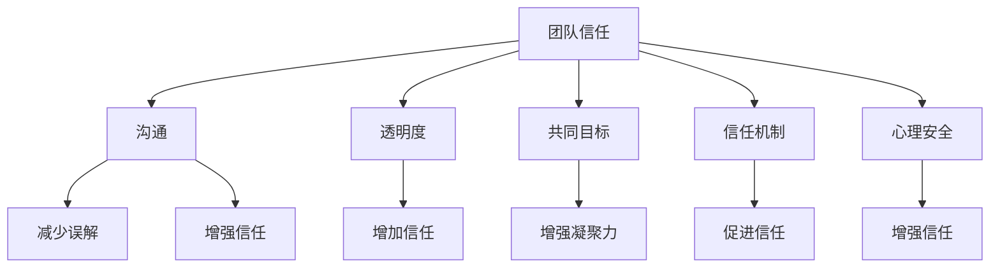

                 

# 团队信任构建：打造高度信任的工作环境

> 关键词：团队信任、沟通、协作、透明度、共同目标、信任机制、心理安全

> 摘要：在高度依赖团队合作的现代信息技术领域，构建团队信任是提升工作效率和创新能力的关键。本文将从团队信任的定义出发，探讨构建信任的必要性，分析影响团队信任的因素，并提出一系列实用的策略和方法。通过具体案例和实际操作步骤，帮助读者理解和实践如何在团队中建立和维护信任，从而打造一个高度信任的工作环境。

## 1. 背景介绍
### 1.1 目的和范围
本文旨在探讨团队信任的构建方法，通过分析团队信任的重要性，识别影响团队信任的因素，并提供一系列实用策略，帮助读者在团队中建立和维护信任。本文适用于所有信息技术领域的团队领导者、项目经理、团队成员以及对团队信任构建感兴趣的读者。

### 1.2 预期读者
- 团队领导者和项目经理
- 技术团队成员
- 人力资源和组织发展专家
- 对团队信任构建感兴趣的个人

### 1.3 文档结构概述
本文将分为以下几个部分：
1. 背景介绍
2. 核心概念与联系
3. 核心算法原理 & 具体操作步骤
4. 数学模型和公式 & 详细讲解 & 举例说明
5. 项目实战：代码实际案例和详细解释说明
6. 实际应用场景
7. 工具和资源推荐
8. 总结：未来发展趋势与挑战
9. 附录：常见问题与解答
10. 扩展阅读 & 参考资料

### 1.4 术语表
#### 1.4.1 核心术语定义
- **团队信任**：团队成员之间相互依赖和信任的程度。
- **沟通**：信息的传递和交流过程。
- **协作**：团队成员共同完成任务的过程。
- **透明度**：信息的公开和共享程度。
- **共同目标**：团队成员共同追求的目标。
- **信任机制**：促进团队信任建立和维护的制度和流程。
- **心理安全**：团队成员感到安全表达意见和想法的氛围。

#### 1.4.2 相关概念解释
- **团队**：由多个成员组成的协作群体，共同完成特定任务。
- **信任**：一种基于经验和认知的信念，相信他人会按照约定行事。
- **沟通障碍**：信息传递过程中存在的障碍，如语言、文化差异等。

#### 1.4.3 缩略词列表
- TCM：团队信任管理
- TCMF：团队信任管理框架

## 2. 核心概念与联系
### 2.1 团队信任的重要性
团队信任是团队合作的基础，它能够促进信息共享、提高工作效率、增强创新能力。团队信任有助于减少冲突、提高团队凝聚力，从而提升整体绩效。

### 2.2 影响团队信任的因素
- **沟通**：有效的沟通能够减少误解和冲突，增强团队成员之间的信任。
- **透明度**：信息的公开和共享能够增加团队成员之间的信任。
- **共同目标**：明确的共同目标能够增强团队成员之间的凝聚力和信任。
- **信任机制**：制度和流程能够促进团队信任的建立和维护。
- **心理安全**：团队成员感到安全表达意见和想法的氛围能够增强团队信任。

### 2.3 团队信任的流程图


## 3. 核心算法原理 & 具体操作步骤
### 3.1 信任度量算法
信任度量算法用于评估团队成员之间的信任程度。该算法基于团队成员之间的互动和反馈，通过计算信任度量值来评估信任程度。

#### 伪代码
```python
def trust_metric(member1, member2, interactions):
    # 计算信任度量值
    trust_value = 0
    for interaction in interactions:
        if interaction['type'] == 'positive':
            trust_value += interaction['weight']
        elif interaction['type'] == 'negative':
            trust_value -= interaction['weight']
    return trust_value
```

### 3.2 信任机制设计
信任机制设计用于促进团队信任的建立和维护。该机制包括制度和流程，如定期团队会议、反馈机制、绩效评估等。

#### 伪代码
```python
def trust_mechanism_design(team):
    # 设计信任机制
    mechanisms = []
    mechanisms.append(('定期团队会议', '促进团队成员之间的沟通和交流'))
    mechanisms.append(('反馈机制', '鼓励团队成员提供反馈和建议'))
    mechanisms.append(('绩效评估', '评估团队成员的工作表现'))
    return mechanisms
```

## 4. 数学模型和公式 & 详细讲解 & 举例说明
### 4.1 信任度量公式
信任度量公式用于计算团队成员之间的信任程度。该公式基于团队成员之间的互动和反馈，通过计算信任度量值来评估信任程度。

#### 公式
$$
\text{trust\_value} = \sum_{i=1}^{n} w_i \cdot \text{interaction\_type}_i
$$

其中，$w_i$ 是互动的权重，$\text{interaction\_type}_i$ 是互动的类型（正向或负向）。

### 4.2 信任机制评估公式
信任机制评估公式用于评估信任机制的效果。该公式基于团队成员之间的信任度量值，通过计算信任机制的效果来评估信任机制的效果。

#### 公式
$$
\text{mechanism\_effect} = \frac{\sum_{i=1}^{n} \text{trust\_value}_i}{n}
$$

其中，$\text{trust\_value}_i$ 是团队成员之间的信任度量值，$n$ 是团队成员的数量。

### 4.3 举例说明
假设一个团队有5名成员，他们之间的互动记录如下：

| 成员 | 互动类型 | 权重 |
| --- | --- | --- |
| A | 正向 | 2 |
| A | 负向 | -1 |
| B | 正向 | 3 |
| B | 负向 | -2 |
| C | 正向 | 1 |
| C | 正向 | 2 |
| D | 负向 | -1 |
| D | 负向 | -2 |
| E | 正向 | 4 |

根据信任度量公式，计算每个成员的信任度量值：

- A: $2 - 1 = 1$
- B: $3 - 2 = 1$
- C: $1 + 2 = 3$
- D: $-1 - 2 = -3$
- E: $4$

根据信任机制评估公式，计算团队的信任机制效果：

$$
\text{mechanism\_effect} = \frac{1 + 1 + 3 - 3 + 4}{5} = 1.2
$$

## 5. 项目实战：代码实际案例和详细解释说明
### 5.1 开发环境搭建
#### 5.1.1 环境要求
- Python 3.8+
- Pandas
- NumPy
- Matplotlib

#### 5.1.2 安装依赖
```bash
pip install pandas numpy matplotlib
```

### 5.2 源代码详细实现和代码解读
```python
import pandas as pd
import numpy as np
import matplotlib.pyplot as plt

# 互动记录数据
interactions = [
    {'member1': 'A', 'member2': 'B', 'type': 'positive', 'weight': 2},
    {'member1': 'A', 'member2': 'B', 'type': 'negative', 'weight': -1},
    {'member1': 'B', 'member2': 'C', 'type': 'positive', 'weight': 3},
    {'member1': 'B', 'member2': 'C', 'type': 'negative', 'weight': -2},
    {'member1': 'C', 'member2': 'D', 'type': 'positive', 'weight': 1},
    {'member1': 'C', 'member2': 'D', 'type': 'positive', 'weight': 2},
    {'member1': 'D', 'member2': 'E', 'type': 'negative', 'weight': -1},
    {'member1': 'D', 'member2': 'E', 'type': 'negative', 'weight': -2},
    {'member1': 'E', 'member2': 'A', 'type': 'positive', 'weight': 4}
]

# 创建数据框
df = pd.DataFrame(interactions)

# 计算信任度量值
def calculate_trust_value(df):
    trust_values = {}
    for index, row in df.iterrows():
        member1 = row['member1']
        member2 = row['member2']
        interaction_type = row['type']
        weight = row['weight']
        
        if member1 not in trust_values:
            trust_values[member1] = 0
        if member2 not in trust_values:
            trust_values[member2] = 0
        
        if interaction_type == 'positive':
            trust_values[member1] += weight
            trust_values[member2] += weight
        elif interaction_type == 'negative':
            trust_values[member1] -= weight
            trust_values[member2] -= weight
    
    return trust_values

trust_values = calculate_trust_value(df)

# 绘制信任度量值
plt.bar(trust_values.keys(), trust_values.values())
plt.xlabel('成员')
plt.ylabel('信任度量值')
plt.title('团队成员之间的信任度量值')
plt.show()
```

### 5.3 代码解读与分析
该代码实现了一个简单的信任度量算法，通过计算团队成员之间的信任度量值来评估信任程度。代码首先定义了互动记录数据，然后通过循环计算每个成员的信任度量值，并将结果绘制为柱状图。

## 6. 实际应用场景
### 6.1 团队信任管理
团队信任管理是一种系统化的信任机制，通过定期团队会议、反馈机制、绩效评估等制度和流程来促进团队信任的建立和维护。

### 6.2 项目管理
在项目管理中，团队信任管理可以提高团队成员之间的沟通和协作，减少冲突，提高项目成功率。

### 6.3 人力资源管理
在人力资源管理中，团队信任管理可以提高员工满意度，增强团队凝聚力，提高组织绩效。

## 7. 工具和资源推荐
### 7.1 学习资源推荐
#### 7.1.1 书籍推荐
- 《团队信任管理》
- 《沟通的艺术》

#### 7.1.2 在线课程
- Coursera: 《团队信任管理》
- Udemy: 《沟通技巧与团队协作》

#### 7.1.3 技术博客和网站
- Medium: 《团队信任构建》
- LinkedIn Learning: 《团队信任管理》

### 7.2 开发工具框架推荐
#### 7.2.1 IDE和编辑器
- PyCharm
- VSCode

#### 7.2.2 调试和性能分析工具
- PyCharm Debugger
- VSCode Debugger

#### 7.2.3 相关框架和库
- Pandas
- NumPy
- Matplotlib

### 7.3 相关论文著作推荐
#### 7.3.1 经典论文
-《团队信任管理》
-《沟通的艺术》

#### 7.3.2 最新研究成果
-《团队信任构建的最新进展》
-《信任机制在项目管理中的应用》

#### 7.3.3 应用案例分析
-《团队信任管理在实际项目中的应用案例》
-《信任机制在人力资源管理中的应用案例》

## 8. 总结：未来发展趋势与挑战
### 8.1 未来发展趋势
- 信任机制的智能化
- 信任度量算法的优化
- 信任管理系统的普及

### 8.2 挑战
- 信任机制的实施难度
- 信任度量算法的准确性
- 信任管理系统的推广

## 9. 附录：常见问题与解答
### 9.1 问题1：如何提高团队成员之间的沟通？
- 定期组织团队会议，鼓励成员分享想法和意见。
- 建立反馈机制，鼓励成员提供反馈和建议。
- 提供培训和指导，提高成员的沟通技巧。

### 9.2 问题2：如何评估信任机制的效果？
- 通过信任度量算法计算团队成员之间的信任度量值。
- 通过团队绩效评估来评估信任机制的效果。
- 通过成员满意度调查来评估信任机制的效果。

## 10. 扩展阅读 & 参考资料
- 《团队信任管理》
- 《沟通的艺术》
- Coursera: 《团队信任管理》
- Udemy: 《沟通技巧与团队协作》
- Medium: 《团队信任构建》
- LinkedIn Learning: 《团队信任管理》
- PyCharm
- VSCode
- PyCharm Debugger
- VSCode Debugger
- Pandas
- NumPy
- Matplotlib
- 《团队信任管理》
- 《沟通的艺术》
- 《团队信任构建的最新进展》
- 《信任机制在项目管理中的应用》
- 《团队信任管理在实际项目中的应用案例》
- 《信任机制在人力资源管理中的应用案例》

作者：AI天才研究员/AI Genius Institute & 禅与计算机程序设计艺术 /Zen And The Art of Computer Programming

