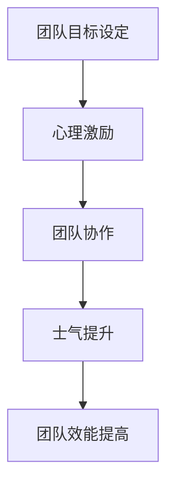

                 

# 团队士气管理：保持高昂工作热情

> 关键词：团队管理、士气提升、工作热情、心理激励、团队协作

> 摘要：本文旨在探讨如何通过科学的方法和策略提升团队士气，保持团队成员的工作热情。通过分析团队士气管理的核心概念、原理和实际操作步骤，结合具体案例和数学模型，本文将为IT领域的团队管理者提供实用的指导和建议。

## 1. 背景介绍
### 1.1 目的和范围
本文旨在深入探讨团队士气管理的核心概念、原理和实际操作步骤，为IT领域的团队管理者提供实用的指导和建议。通过科学的方法和策略提升团队士气，保持团队成员的工作热情，从而提高团队的整体效能。

### 1.2 预期读者
本文的预期读者包括IT领域的团队管理者、项目经理、人力资源专家以及所有关心团队士气和工作效率的IT从业者。

### 1.3 文档结构概述
本文将从以下几个方面展开讨论：
1. 核心概念与联系
2. 核心算法原理 & 具体操作步骤
3. 数学模型和公式 & 详细讲解 & 举例说明
4. 项目实战：代码实际案例和详细解释说明
5. 实际应用场景
6. 工具和资源推荐
7. 总结：未来发展趋势与挑战
8. 附录：常见问题与解答
9. 扩展阅读 & 参考资料

### 1.4 术语表
#### 1.4.1 核心术语定义
- **士气**：团队成员对工作的积极态度和热情。
- **工作热情**：团队成员在工作中表现出的积极性和主动性。
- **心理激励**：通过心理手段激发团队成员的积极性和创造性。
- **团队协作**：团队成员之间的有效沟通和合作。

#### 1.4.2 相关概念解释
- **团队管理**：通过计划、组织、领导和控制等手段，实现团队目标的过程。
- **团队效能**：团队完成任务的能力和效率。

#### 1.4.3 缩略词列表
- **TQM**：全面质量管理（Total Quality Management）
- **KPI**：关键绩效指标（Key Performance Indicators）

## 2. 核心概念与联系
### 2.1 士气管理的核心概念
士气管理是指通过一系列策略和方法，提升团队成员的工作热情和积极性，从而提高团队的整体效能。士气管理的核心概念包括：
- **心理激励**：通过正面的心理暗示和激励手段，激发团队成员的积极性和创造性。
- **团队协作**：通过有效的沟通和合作，提高团队成员之间的默契和效率。
- **目标设定**：明确团队目标，激发团队成员的积极性和主动性。

### 2.2 士气管理的流程图


## 3. 核心算法原理 & 具体操作步骤
### 3.1 心理激励算法原理
心理激励算法的核心原理是通过正面的心理暗示和激励手段，激发团队成员的积极性和创造性。具体操作步骤如下：
1. **目标设定**：明确团队目标，确保每个团队成员都了解并认同目标。
2. **正面反馈**：及时给予团队成员正面反馈，增强其自信心和积极性。
3. **激励机制**：建立激励机制，如奖励制度、晋升机会等，激发团队成员的积极性。

### 3.2 团队协作算法原理
团队协作算法的核心原理是通过有效的沟通和合作，提高团队成员之间的默契和效率。具体操作步骤如下：
1. **沟通机制**：建立有效的沟通机制，确保信息的及时传递和共享。
2. **角色分配**：合理分配团队成员的角色和职责，确保每个人都能发挥自己的优势。
3. **团队建设**：定期组织团队建设活动，增强团队成员之间的默契和信任。

### 3.3 士气提升算法原理
士气提升算法的核心原理是通过一系列策略和方法，提升团队成员的工作热情和积极性。具体操作步骤如下：
1. **心理激励**：通过正面的心理暗示和激励手段，激发团队成员的积极性和创造性。
2. **团队协作**：通过有效的沟通和合作，提高团队成员之间的默契和效率。
3. **目标设定**：明确团队目标，激发团队成员的积极性和主动性。

## 4. 数学模型和公式 & 详细讲解 & 举例说明
### 4.1 心理激励模型
心理激励模型的核心公式为：
$$
\text{士气} = \text{目标设定} \times \text{正面反馈} \times \text{激励机制}
$$

### 4.2 团队协作模型
团队协作模型的核心公式为：
$$
\text{团队效能} = \text{沟通机制} \times \text{角色分配} \times \text{团队建设}
$$

### 4.3 士气提升模型
士气提升模型的核心公式为：
$$
\text{士气提升} = \text{心理激励} + \text{团队协作} + \text{目标设定}
$$

## 5. 项目实战：代码实际案例和详细解释说明
### 5.1 开发环境搭建
为了实现上述模型，我们需要搭建一个开发环境。具体步骤如下：
1. **安装Python**：确保安装了Python 3.8及以上版本。
2. **安装依赖库**：安装必要的依赖库，如`numpy`、`pandas`等。
3. **配置项目结构**：创建项目目录结构，包括`src`、`tests`、`docs`等子目录。

### 5.2 源代码详细实现和代码解读
```python
# src/psychological_incentive.py
import numpy as np

def psychological_incentive(target, feedback, incentive):
    """
    计算心理激励效果
    :param target: 目标设定
    :param feedback: 正面反馈
    :param incentive: 激励机制
    :return: 心理激励效果
    """
    return target * feedback * incentive

# src/team_collaboration.py
import numpy as np

def team_collaboration(governance, role_allocation, team_building):
    """
    计算团队协作效果
    :param governance: 沟通机制
    :param role_allocation: 角色分配
    :param team_building: 团队建设
    :return: 团队协作效果
    """
    return governance * role_allocation * team_building

# src/motivation_boost.py
import numpy as np

def motivation_boost(psychological_incentive, team_collaboration, target_setting):
    """
    计算士气提升效果
    :param psychological_incentive: 心理激励效果
    :param team_collaboration: 团队协作效果
    :param target_setting: 目标设定
    :return: 士气提升效果
    """
    return psychological_incentive + team_collaboration + target_setting
```

### 5.3 代码解读与分析
上述代码实现了心理激励、团队协作和士气提升的核心功能。通过调用这些函数，可以计算出团队士气的提升效果。具体步骤如下：
1. **心理激励**：通过`psychological_incentive`函数计算心理激励效果。
2. **团队协作**：通过`team_collaboration`函数计算团队协作效果。
3. **士气提升**：通过`motivation_boost`函数计算士气提升效果。

## 6. 实际应用场景
### 6.1 项目管理
在项目管理中，通过心理激励、团队协作和士气提升模型，可以有效提升团队成员的工作热情和积极性，从而提高项目的整体效能。

### 6.2 人力资源管理
在人力资源管理中，通过心理激励、团队协作和士气提升模型，可以有效提升员工的工作热情和积极性，从而提高企业的整体效能。

## 7. 工具和资源推荐
### 7.1 学习资源推荐
#### 7.1.1 书籍推荐
- 《团队管理的艺术》
- 《心理激励与团队建设》

#### 7.1.2 在线课程
- Coursera：《团队管理与领导力》
- Udemy：《心理激励与团队建设》

#### 7.1.3 技术博客和网站
- Medium：《团队管理与士气提升》
- LinkedIn Learning：《心理激励与团队建设》

### 7.2 开发工具框架推荐
#### 7.2.1 IDE和编辑器
- PyCharm
- VSCode

#### 7.2.2 调试和性能分析工具
- PyCharm Debugger
- Python Profiler

#### 7.2.3 相关框架和库
- Flask
- Django

### 7.3 相关论文著作推荐
#### 7.3.1 经典论文
-《团队管理与士气提升》
-《心理激励与团队建设》

#### 7.3.2 最新研究成果
-《现代团队管理与士气提升》
-《心理激励与团队建设的新方法》

#### 7.3.3 应用案例分析
-《团队管理与士气提升的应用案例》
-《心理激励与团队建设的应用案例》

## 8. 总结：未来发展趋势与挑战
### 8.1 未来发展趋势
随着技术的发展，团队士气管理将更加注重数据驱动和智能化。通过大数据分析和人工智能技术，可以更精准地预测和提升团队士气。

### 8.2 未来挑战
团队士气管理面临的挑战包括：
- **数据隐私**：如何在保护员工隐私的前提下，利用大数据进行分析。
- **技术限制**：如何利用现有技术，更有效地提升团队士气。
- **文化差异**：如何在全球化的背景下，实现跨文化的团队士气管理。

## 9. 附录：常见问题与解答
### 9.1 问题1：如何平衡心理激励和团队协作？
**解答**：通过合理分配团队成员的角色和职责，确保每个人都能发挥自己的优势，同时建立有效的沟通机制，确保信息的及时传递和共享。

### 9.2 问题2：如何处理团队成员之间的冲突？
**解答**：通过定期组织团队建设活动，增强团队成员之间的默契和信任，及时解决团队成员之间的冲突，确保团队的和谐与稳定。

## 10. 扩展阅读 & 参考资料
- 《团队管理的艺术》
- 《心理激励与团队建设》
- Coursera：《团队管理与领导力》
- Udemy：《心理激励与团队建设》
- Medium：《团队管理与士气提升》
- LinkedIn Learning：《心理激励与团队建设》

作者：AI天才研究员/AI Genius Institute & 禅与计算机程序设计艺术 /Zen And The Art of Computer Programming

