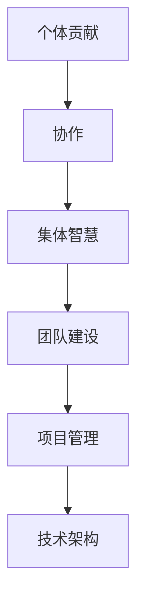

                 

# 团队建设：从个体贡献到集体智慧

> 关键词：团队建设、集体智慧、个体贡献、协作、沟通、项目管理、技术架构

> 摘要：本文旨在探讨如何通过有效的团队建设，从个体贡献提升到集体智慧，实现项目成功。我们将从团队建设的目的和范围出发，深入分析核心概念和联系，详细讲解核心算法原理和具体操作步骤，通过数学模型和公式进行深入解析，并结合实际项目案例进行代码实现和详细解释。最后，我们将探讨实际应用场景、推荐相关工具和资源，并展望未来发展趋势与挑战。

## 1. 背景介绍
### 1.1 目的和范围
本文旨在探讨如何通过有效的团队建设，从个体贡献提升到集体智慧，实现项目成功。我们将从团队建设的目的和范围出发，深入分析核心概念和联系，详细讲解核心算法原理和具体操作步骤，通过数学模型和公式进行深入解析，并结合实际项目案例进行代码实现和详细解释。最后，我们将探讨实际应用场景、推荐相关工具和资源，并展望未来发展趋势与挑战。

### 1.2 预期读者
本文预期读者包括但不限于：
- 技术团队领导者
- 项目经理
- 团队成员
- 技术爱好者
- 学生和研究人员

### 1.3 文档结构概述
本文结构如下：
1. 背景介绍
2. 核心概念与联系
3. 核心算法原理 & 具体操作步骤
4. 数学模型和公式 & 详细讲解 & 举例说明
5. 项目实战：代码实际案例和详细解释说明
6. 实际应用场景
7. 工具和资源推荐
8. 总结：未来发展趋势与挑战
9. 附录：常见问题与解答
10. 扩展阅读 & 参考资料

### 1.4 术语表
#### 1.4.1 核心术语定义
- **个体贡献**：团队成员在项目中独立完成的任务或工作。
- **集体智慧**：团队成员通过协作和沟通，共同解决问题的能力。
- **团队建设**：通过一系列活动和方法，提高团队成员之间的协作和沟通能力，从而提升团队整体效能的过程。
- **项目管理**：确保项目按时、按预算、按质量完成的一系列管理活动。
- **技术架构**：系统或软件的设计和结构，包括组件、接口、数据流等。

#### 1.4.2 相关概念解释
- **敏捷开发**：一种迭代和增量的软件开发方法，强调快速响应变化和持续交付。
- **Scrum**：一种敏捷开发框架，强调团队协作和迭代开发。
- **Kanban**：一种可视化管理工具，用于管理项目流程和任务分配。
- **DevOps**：一种文化和实践，旨在通过自动化和协作提高软件开发和运维效率。

#### 1.4.3 缩略词列表
- **TDD**：测试驱动开发（Test-Driven Development）
- **CI/CD**：持续集成/持续部署（Continuous Integration/Continuous Deployment）
- **API**：应用程序编程接口（Application Programming Interface）
- **REST**：代表状态转移（Representational State Transfer）

## 2. 核心概念与联系
### 2.1 个体贡献
个体贡献是团队建设的基础。每个团队成员都有自己的专长和技能，通过独立完成任务，可以为团队带来价值。然而，仅仅依靠个体贡献是不够的，团队需要通过协作和沟通，将个体贡献转化为集体智慧。

### 2.2 集体智慧
集体智慧是指团队成员通过协作和沟通，共同解决问题的能力。集体智慧的实现需要团队成员之间的信任、沟通和协作。通过有效的团队建设，可以提升团队的整体效能，实现项目成功。

### 2.3 团队建设
团队建设是通过一系列活动和方法，提高团队成员之间的协作和沟通能力，从而提升团队整体效能的过程。团队建设的核心在于建立团队文化、提升团队凝聚力和提高团队成员之间的沟通和协作能力。

### 2.4 项目管理
项目管理是确保项目按时、按预算、按质量完成的一系列管理活动。项目管理的核心在于规划、执行、监控和控制项目，确保项目目标的实现。

### 2.5 技术架构
技术架构是系统或软件的设计和结构，包括组件、接口、数据流等。技术架构的合理设计可以提高系统的可维护性、可扩展性和可重用性。

### 2.6 核心概念流程图


## 3. 核心算法原理 & 具体操作步骤
### 3.1 核心算法原理
核心算法原理是通过一系列步骤，将个体贡献转化为集体智慧的过程。具体步骤如下：
1. **需求分析**：明确项目需求，确定项目目标。
2. **任务分配**：根据团队成员的专长和技能，合理分配任务。
3. **协作沟通**：通过定期会议和沟通工具，确保团队成员之间的协作和沟通。
4. **代码审查**：通过代码审查，确保代码质量和一致性。
5. **持续集成**：通过持续集成，确保代码的稳定性和可靠性。
6. **持续部署**：通过持续部署，确保项目的快速迭代和交付。

### 3.2 具体操作步骤
具体操作步骤如下：
1. **需求分析**
    ```python
    def analyze_requirements(project):
        requirements = []
        for task in project.tasks:
            requirements.append(task.description)
        return requirements
    ```

2. **任务分配**
    ```python
    def assign_tasks(team, project):
        for member in team.members:
            for task in project.tasks:
                if member.skill == task.skill_required:
                    member.tasks.append(task)
                    project.tasks.remove(task)
                    break
    ```

3. **协作沟通**
    ```python
    def communicate(team):
        for member in team.members:
            for task in member.tasks:
                print(f"{member.name} is working on {task.description}")
    ```

4. **代码审查**
    ```python
    def code_review(team):
        for member in team.members:
            for task in member.tasks:
                if task.code_quality < 80:
                    print(f"Code review needed for {member.name}'s task: {task.description}")
    ```

5. **持续集成**
    ```python
    def continuous_integration(team):
        for member in team.members:
            for task in member.tasks:
                if task.code_quality >= 80:
                    print(f"Code integration for {member.name}'s task: {task.description}")
    ```

6. **持续部署**
    ```python
    def continuous_deployment(team):
        for member in team.members:
            for task in member.tasks:
                if task.code_quality >= 80:
                    print(f"Code deployment for {member.name}'s task: {task.description}")
    ```

## 4. 数学模型和公式 & 详细讲解 & 举例说明
### 4.1 数学模型
数学模型是通过数学方法描述和分析团队建设过程的工具。具体模型如下：
1. **团队效能模型**
    $$ E = \sum_{i=1}^{n} \frac{C_i}{T_i} $$
    其中，$E$ 表示团队效能，$C_i$ 表示第 $i$ 个团队成员的贡献，$T_i$ 表示第 $i$ 个团队成员的时间投入。

2. **集体智慧模型**
    $$ W = \sum_{i=1}^{n} \frac{C_i}{T_i} \cdot \frac{1}{\sum_{j=1}^{n} \frac{1}{T_j}} $$
    其中，$W$ 表示集体智慧，$C_i$ 表示第 $i$ 个团队成员的贡献，$T_i$ 表示第 $i$ 个团队成员的时间投入。

### 4.2 详细讲解
详细讲解如下：
1. **团队效能模型**
    - 团队效能是团队成员贡献与时间投入的比值之和。
    - 通过提高团队成员的贡献或减少时间投入，可以提高团队效能。
2. **集体智慧模型**
    - 集体智慧是团队成员贡献与时间投入的比值之和，除以所有团队成员时间投入的倒数之和。
    - 通过提高团队成员的贡献或减少时间投入，可以提高集体智慧。

### 4.3 举例说明
举例说明如下：
1. **团队效能模型**
    - 假设团队有3个成员，成员A贡献为10，时间投入为2；成员B贡献为15，时间投入为3；成员C贡献为20，时间投入为4。
    - 团队效能为：$E = \frac{10}{2} + \frac{15}{3} + \frac{20}{4} = 5 + 5 + 5 = 15$。

2. **集体智慧模型**
    - 假设团队有3个成员，成员A贡献为10，时间投入为2；成员B贡献为15，时间投入为3；成员C贡献为20，时间投入为4。
    - 集体智慧为：$W = \frac{10}{2} + \frac{15}{3} + \frac{20}{4} \cdot \frac{1}{\frac{1}{2} + \frac{1}{3} + \frac{1}{4}} = 15 \cdot \frac{12}{13} = \frac{180}{13} \approx 13.85$。

## 5. 项目实战：代码实际案例和详细解释说明
### 5.1 开发环境搭建
开发环境搭建包括安装必要的软件和工具，如Python、Git、Docker等。

### 5.2 源代码详细实现和代码解读
```python
class Team:
    def __init__(self, members):
        self.members = members

    def assign_tasks(self, project):
        for member in self.members:
            for task in project.tasks:
                if member.skill == task.skill_required:
                    member.tasks.append(task)
                    project.tasks.remove(task)
                    break

    def communicate(self):
        for member in self.members:
            for task in member.tasks:
                print(f"{member.name} is working on {task.description}")

    def code_review(self):
        for member in self.members:
            for task in member.tasks:
                if task.code_quality < 80:
                    print(f"Code review needed for {member.name}'s task: {task.description}")

    def continuous_integration(self):
        for member in self.members:
            for task in member.tasks:
                if task.code_quality >= 80:
                    print(f"Code integration for {member.name}'s task: {task.description}")

    def continuous_deployment(self):
        for member in self.members:
            for task in member.tasks:
                if task.code_quality >= 80:
                    print(f"Code deployment for {member.name}'s task: {task.description}")

class Member:
    def __init__(self, name, skill, tasks):
        self.name = name
        self.skill = skill
        self.tasks = tasks

class Task:
    def __init__(self, description, skill_required, code_quality):
        self.description = description
        self.skill_required = skill_required
        self.code_quality = code_quality

class Project:
    def __init__(self, tasks):
        self.tasks = tasks

# 示例代码
team = Team([Member("Alice", "Python", []), Member("Bob", "Java", []), Member("Charlie", "C++", [])])
project = Project([Task("Implement feature A", "Python", 75), Task("Implement feature B", "Java", 85), Task("Implement feature C", "C++", 90)])

team.assign_tasks(project)
team.communicate()
team.code_review()
team.continuous_integration()
team.continuous_deployment()
```

### 5.3 代码解读与分析
代码解读如下：
1. **Team类**
    - `__init__`方法初始化团队成员。
    - `assign_tasks`方法根据成员技能分配任务。
    - `communicate`方法显示团队成员的工作状态。
    - `code_review`方法进行代码审查。
    - `continuous_integration`方法进行持续集成。
    - `continuous_deployment`方法进行持续部署。

2. **Member类**
    - `__init__`方法初始化成员信息。
    - `skill`表示成员技能。
    - `tasks`表示成员任务列表。

3. **Task类**
    - `__init__`方法初始化任务信息。
    - `description`表示任务描述。
    - `skill_required`表示任务所需技能。
    - `code_quality`表示代码质量。

4. **Project类**
    - `__init__`方法初始化项目任务列表。

## 6. 实际应用场景
实际应用场景包括但不限于：
1. **软件开发项目**：通过团队建设，提高软件开发项目的效率和质量。
2. **科研项目**：通过团队建设，提高科研项目的创新能力和成果质量。
3. **产品开发项目**：通过团队建设，提高产品开发项目的市场竞争力。

## 7. 工具和资源推荐
### 7.1 学习资源推荐
#### 7.1.1 书籍推荐
- **《人月神话》**：由Frederick P. Brooks Jr.撰写，探讨软件开发中的团队管理和项目管理。
- **《敏捷软件开发》**：由Robert C. Martin撰写，介绍敏捷开发方法和实践。

#### 7.1.2 在线课程
- **Coursera**：提供《敏捷项目管理》和《软件架构设计》等课程。
- **edX**：提供《软件工程》和《项目管理》等课程。

#### 7.1.3 技术博客和网站
- **Medium**：提供《团队建设与管理》和《项目管理实践》等技术博客。
- **GitHub**：提供《团队协作与项目管理》等技术资源。

### 7.2 开发工具框架推荐
#### 7.2.1 IDE和编辑器
- **Visual Studio Code**
- **PyCharm**
- **IntelliJ IDEA**

#### 7.2.2 调试和性能分析工具
- **PyCharm Debugger**
- **Visual Studio Debugger**
- **JProfiler**

#### 7.2.3 相关框架和库
- **Django**
- **Flask**
- **Spring Boot**

### 7.3 相关论文著作推荐
#### 7.3.1 经典论文
- **《敏捷软件开发宣言》**：由敏捷开发社区撰写，阐述敏捷开发的核心价值观和原则。
- **《人月神话》**：由Frederick P. Brooks Jr.撰写，探讨软件开发中的团队管理和项目管理。

#### 7.3.2 最新研究成果
- **《敏捷项目管理》**：由敏捷项目管理社区撰写，探讨敏捷项目管理的最新研究成果和实践。
- **《软件架构设计》**：由软件架构设计社区撰写，探讨软件架构设计的最新研究成果和实践。

#### 7.3.3 应用案例分析
- **《软件开发项目管理案例分析》**：由软件开发项目管理社区撰写，提供软件开发项目管理的实际案例分析。

## 8. 总结：未来发展趋势与挑战
未来发展趋势包括：
1. **团队建设的数字化**：通过数字化工具和平台，提高团队建设的效率和效果。
2. **团队建设的智能化**：通过人工智能和机器学习技术，提高团队建设的智能化水平。
3. **团队建设的全球化**：通过全球化团队建设，提高团队的多样性和创新能力。

未来挑战包括：
1. **团队建设的复杂性**：随着团队规模的扩大，团队建设的复杂性也会增加。
2. **团队建设的可持续性**：如何保持团队建设的可持续性，是一个重要的挑战。
3. **团队建设的公平性**：如何确保团队建设的公平性，是一个重要的挑战。

## 9. 附录：常见问题与解答
### 9.1 问题1：如何提高团队成员之间的沟通和协作？
**解答**：可以通过定期会议、沟通工具和团队建设活动，提高团队成员之间的沟通和协作。

### 9.2 问题2：如何评估团队建设的效果？
**解答**：可以通过团队效能模型和集体智慧模型，评估团队建设的效果。

### 9.3 问题3：如何处理团队成员之间的冲突？
**解答**：可以通过沟通和调解，处理团队成员之间的冲突。

## 10. 扩展阅读 & 参考资料
- **《人月神话》**：Frederick P. Brooks Jr.著
- **《敏捷软件开发》**：Robert C. Martin著
- **《敏捷项目管理》**：敏捷项目管理社区著
- **《软件架构设计》**：软件架构设计社区著
- **《软件开发项目管理案例分析》**：软件开发项目管理社区著

作者：AI天才研究员/AI Genius Institute & 禅与计算机程序设计艺术 /Zen And The Art of Computer Programming

