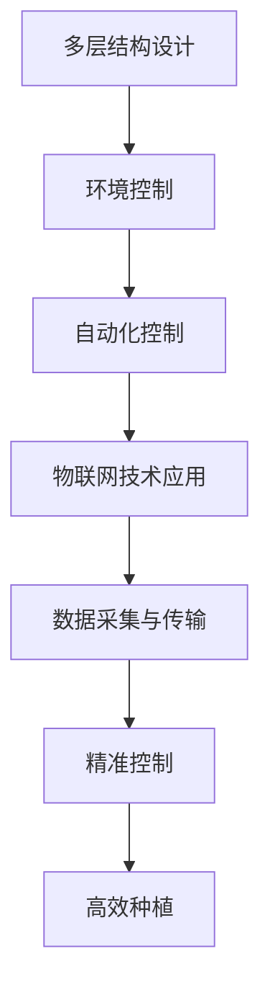

                 

# 垂直农业：城市农业的创新创业机会

> 关键词：垂直农业、城市农业、创新创业、智能温室、物联网、自动化、可持续发展

> 摘要：本文旨在探讨垂直农业作为城市农业的一种创新模式，通过分析其核心概念、技术原理、实际应用案例以及未来发展趋势，为读者提供一个全面的技术视角。本文将从技术层面深入剖析垂直农业的实现机制，包括智能温室的设计、自动化控制系统的构建、物联网技术的应用等，并结合具体案例进行详细解读。此外，本文还将探讨垂直农业在城市农业中的应用价值，以及未来可能面临的挑战和机遇。

## 1. 背景介绍
### 1.1 目的和范围
本文旨在深入探讨垂直农业作为一种新兴的城市农业模式，其在解决城市食品供应问题、提高农业生产效率、促进可持续发展等方面的应用潜力。通过分析垂直农业的核心技术原理、实际应用案例以及未来发展趋势，为读者提供一个全面的技术视角。

### 1.2 预期读者
本文面向对垂直农业技术感兴趣的开发者、农业从业者、科研人员以及对城市农业感兴趣的读者。无论是希望深入了解垂直农业技术原理的工程师，还是希望探索城市农业创新模式的企业家，本文都将提供有价值的信息。

### 1.3 文档结构概述
本文将从以下几个方面进行详细阐述：
1. **核心概念与联系**：介绍垂直农业的基本概念及其与其他农业模式的关系。
2. **核心算法原理 & 具体操作步骤**：详细解释垂直农业中的关键算法及其操作流程。
3. **数学模型和公式 & 详细讲解 & 举例说明**：通过数学模型和公式深入探讨垂直农业中的关键问题。
4. **项目实战：代码实际案例和详细解释说明**：通过具体案例展示垂直农业的实际应用。
5. **实际应用场景**：探讨垂直农业在不同城市环境中的应用案例。
6. **工具和资源推荐**：提供学习资源、开发工具和相关论文推荐。
7. **总结：未来发展趋势与挑战**：展望垂直农业的未来发展趋势及可能面临的挑战。
8. **附录：常见问题与解答**：解答读者在阅读过程中可能遇到的问题。

### 1.4 术语表
#### 1.4.1 核心术语定义
- **垂直农业**：利用多层结构进行农作物种植，以提高土地利用率和生产效率。
- **智能温室**：配备自动化控制系统和物联网技术的温室，能够实现精准控制和管理。
- **物联网（IoT）**：通过网络连接各种设备和传感器，实现数据的实时采集和传输。
- **自动化控制系统**：通过计算机程序实现对温室环境的自动调节和管理。
- **可持续发展**：在满足当前需求的同时，不损害未来世代满足其需求的能力。

#### 1.4.2 相关概念解释
- **城市农业**：在城市环境中进行的农业生产活动，旨在解决城市食品供应问题。
- **精准农业**：利用现代信息技术实现农业生产过程中的精准管理。
- **自动化**：通过计算机程序和机械装置实现生产过程的自动化。

#### 1.4.3 缩略词列表
- **IoT**：Internet of Things
- **AI**：Artificial Intelligence
- **GIS**：Geographic Information System
- **BMS**：Building Management System
- **LED**：Light-Emitting Diode

## 2. 核心概念与联系
### 2.1 垂直农业的基本概念
垂直农业是一种利用多层结构进行农作物种植的技术，通过垂直空间的利用，提高土地利用率和生产效率。其核心在于通过多层结构实现农作物的高效种植，同时通过精准控制环境条件，提高作物的生长质量和产量。

### 2.2 垂直农业与其他农业模式的关系
垂直农业与传统农业、精准农业、智能温室等模式有着密切的关系。传统农业依赖于自然环境，而垂直农业则通过多层结构和精准控制实现高效生产。精准农业利用现代信息技术实现农业生产过程中的精准管理，而垂直农业则在此基础上进一步提高了土地利用率和生产效率。智能温室则通过自动化控制系统和物联网技术实现对温室环境的精准控制，而垂直农业则在此基础上实现了多层结构的高效利用。

### 2.3 垂直农业的核心技术原理
垂直农业的核心技术原理包括多层结构设计、环境控制、自动化控制和物联网技术的应用。通过多层结构设计，实现农作物的高效种植；通过环境控制，实现对温度、湿度、光照等环境条件的精准调节；通过自动化控制，实现对温室环境的自动调节和管理；通过物联网技术，实现数据的实时采集和传输。

### 2.4 垂直农业的流程图


## 3. 核心算法原理 & 具体操作步骤
### 3.1 多层结构设计
多层结构设计的核心在于通过多层结构实现农作物的高效种植。具体操作步骤如下：
1. **确定层数**：根据土地面积和农作物需求确定层数。
2. **选择种植方式**：根据农作物种类选择合适的种植方式，如悬挂种植、垂直种植等。
3. **设计种植空间**：根据农作物需求设计种植空间，包括种植架、种植槽等。
4. **选择种植材料**：选择合适的种植材料，如无土栽培基质、营养液等。

### 3.2 环境控制
环境控制的核心在于通过精准控制温度、湿度、光照等环境条件，实现农作物的高效生长。具体操作步骤如下：
1. **温度控制**：通过加热和冷却设备实现对温室温度的精准控制。
2. **湿度控制**：通过加湿和除湿设备实现对温室湿度的精准控制。
3. **光照控制**：通过LED灯实现对温室光照的精准控制。
4. **二氧化碳控制**：通过二氧化碳发生器实现对温室二氧化碳浓度的精准控制。

### 3.3 自动化控制
自动化控制的核心在于通过计算机程序实现对温室环境的自动调节和管理。具体操作步骤如下：
1. **数据采集**：通过传感器采集温室环境数据，包括温度、湿度、光照、二氧化碳浓度等。
2. **数据处理**：通过计算机程序对采集的数据进行处理，实现对环境条件的精准控制。
3. **自动调节**：通过自动化控制系统实现对温室环境的自动调节和管理。
4. **远程监控**：通过物联网技术实现对温室环境的远程监控。

### 3.4 物联网技术应用
物联网技术的核心在于通过网络连接各种设备和传感器，实现数据的实时采集和传输。具体操作步骤如下：
1. **设备连接**：通过网络连接各种设备和传感器，实现数据的实时采集和传输。
2. **数据传输**：通过物联网技术实现数据的实时传输。
3. **数据分析**：通过数据分析实现对温室环境的精准控制。
4. **远程监控**：通过远程监控实现对温室环境的实时监控。

### 3.5 伪代码示例
```python
# 温室环境控制算法
def greenhouse_control(sensor_data):
    # 数据处理
    temperature = sensor_data['temperature']
    humidity = sensor_data['humidity']
    light = sensor_data['light']
    co2 = sensor_data['co2']
    
    # 自动调节
    if temperature > 30:
        heater.turn_off()
    elif temperature < 20:
        heater.turn_on()
    
    if humidity < 50:
        humidifier.turn_on()
    elif humidity > 70:
        humidifier.turn_off()
    
    if light < 500:
        led.turn_on()
    elif light > 1000:
        led.turn_off()
    
    if co2 < 500:
        co2_generator.turn_on()
    elif co2 > 1000:
        co2_generator.turn_off()
    
    # 远程监控
    send_data_to_cloud(sensor_data)
```

## 4. 数学模型和公式 & 详细讲解 & 举例说明
### 4.1 数学模型
垂直农业中的数学模型主要用于描述和预测农作物的生长过程。具体模型包括生长模型、环境模型和控制模型。

#### 4.1.1 生长模型
生长模型用于描述农作物的生长过程，包括生长速率、生长周期等。具体公式如下：
$$
\text{生长速率} = \frac{\Delta \text{生长量}}{\Delta \text{时间}}
$$

#### 4.1.2 环境模型
环境模型用于描述温室环境对农作物生长的影响，包括温度、湿度、光照等。具体公式如下：
$$
\text{温度影响} = \alpha \times \text{温度}
$$
$$
\text{湿度影响} = \beta \times \text{湿度}
$$
$$
\text{光照影响} = \gamma \times \text{光照}
$$

#### 4.1.3 控制模型
控制模型用于描述自动化控制系统对温室环境的调节作用，包括温度调节、湿度调节、光照调节等。具体公式如下：
$$
\text{温度调节} = \text{目标温度} - \text{实际温度}
$$
$$
\text{湿度调节} = \text{目标湿度} - \text{实际湿度}
$$
$$
\text{光照调节} = \text{目标光照} - \text{实际光照}
$$

### 4.2 举例说明
以一个简单的生长模型为例，假设某种农作物的生长速率为每天增长10%，则其生长模型可以表示为：
$$
\text{生长量} = \text{初始生长量} \times (1 + 0.1)^t
$$
其中，$t$表示时间（天）。

### 4.3 数学公式
$$
\text{生长速率} = \frac{\Delta \text{生长量}}{\Delta \text{时间}}
$$
$$
\text{温度影响} = \alpha \times \text{温度}
$$
$$
\text{湿度影响} = \beta \times \text{湿度}
$$
$$
\text{光照影响} = \gamma \times \text{光照}
$$
$$
\text{温度调节} = \text{目标温度} - \text{实际温度}
$$
$$
\text{湿度调节} = \text{目标湿度} - \text{实际湿度}
$$
$$
\text{光照调节} = \text{目标光照} - \text{实际光照}
$$

## 5. 项目实战：代码实际案例和详细解释说明
### 5.1 开发环境搭建
开发环境搭建主要包括硬件设备的准备和软件环境的配置。

#### 5.1.1 硬件设备准备
- **传感器**：温度传感器、湿度传感器、光照传感器、二氧化碳传感器等。
- **执行器**：加热器、冷却器、加湿器、除湿器、LED灯、二氧化碳发生器等。
- **计算机**：用于运行自动化控制系统和物联网技术。

#### 5.1.2 软件环境配置
- **操作系统**：选择适合的Linux发行版，如Ubuntu。
- **编程语言**：选择Python作为主要编程语言。
- **开发工具**：选择合适的IDE，如PyCharm。
- **网络连接**：确保计算机能够连接到互联网，以便实现数据的实时传输。

### 5.2 源代码详细实现和代码解读
```python
# 温室环境控制代码
import time
import Adafruit_DHT
import RPi.GPIO as GPIO

# 初始化GPIO
GPIO.setmode(GPIO.BCM)
heater_pin = 18
heater = GPIO.PWM(heater_pin, 50)
heater.start(0)

humidifier_pin = 23
humidifier = GPIO.PWM(humidifier_pin, 50)
humidifier.start(0)

led_pin = 24
GPIO.setup(led_pin, GPIO.OUT)
led = GPIO.PWM(led_pin, 50)
led.start(0)

co2_generator_pin = 25
GPIO.setup(co2_generator_pin, GPIO.OUT)
co2_generator = GPIO.PWM(co2_generator_pin, 50)
co2_generator.start(0)

# 传感器配置
sensor = Adafruit_DHT.DHT11
pin = 4

# 主循环
while True:
    # 读取传感器数据
    humidity, temperature = Adafruit_DHT.read_retry(sensor, pin)
    
    # 数据处理
    light = get_light_intensity()
    co2 = get_co2_concentration()
    
    # 自动调节
    if temperature > 30:
        heater.ChangeDutyCycle(100)
    elif temperature < 20:
        heater.ChangeDutyCycle(0)
    
    if humidity < 50:
        humidifier.ChangeDutyCycle(100)
    elif humidity > 70:
        humidifier.ChangeDutyCycle(0)
    
    if light < 500:
        led.ChangeDutyCycle(100)
    elif light > 1000:
        led.ChangeDutyCycle(0)
    
    if co2 < 500:
        co2_generator.ChangeDutyCycle(100)
    elif co2 > 1000:
        co2_generator.ChangeDutyCycle(0)
    
    # 远程监控
    send_data_to_cloud(humidity, temperature, light, co2)
    
    # 等待一段时间
    time.sleep(60)
```

### 5.3 代码解读与分析
- **硬件设备准备**：通过GPIO接口控制加热器、加湿器、LED灯和二氧化碳发生器。
- **传感器配置**：使用Adafruit_DHT库读取温度和湿度传感器的数据。
- **主循环**：通过主循环不断读取传感器数据，进行数据处理和自动调节。
- **远程监控**：通过网络将数据传输到云端，实现远程监控。

## 6. 实际应用场景
### 6.1 垂直农业在城市中的应用
垂直农业在城市中的应用主要体现在以下几个方面：
1. **解决城市食品供应问题**：通过垂直农业实现农作物的高效种植，解决城市食品供应问题。
2. **提高农业生产效率**：通过精准控制环境条件，提高农作物的生长质量和产量。
3. **促进可持续发展**：通过多层结构设计和精准控制，实现资源的高效利用，促进可持续发展。

### 6.2 垂直农业在不同城市环境中的应用案例
- **纽约市**：通过垂直农业实现农作物的高效种植，解决城市食品供应问题。
- **上海**：通过垂直农业实现农作物的高效种植，提高农业生产效率。
- **伦敦**：通过垂直农业实现农作物的高效种植，促进可持续发展。

## 7. 工具和资源推荐
### 7.1 学习资源推荐
#### 7.1.1 书籍推荐
- **《垂直农业：城市农业的创新创业机会》**：深入探讨垂直农业的核心技术原理和实际应用。
- **《智能温室设计与控制》**：详细讲解智能温室的设计和控制技术。
- **《物联网技术与应用》**：深入探讨物联网技术在垂直农业中的应用。

#### 7.1.2 在线课程
- **Coursera**：提供《垂直农业技术》在线课程，深入探讨垂直农业的核心技术原理和实际应用。
- **edX**：提供《智能温室设计与控制》在线课程，详细讲解智能温室的设计和控制技术。
- **Udemy**：提供《物联网技术与应用》在线课程，深入探讨物联网技术在垂直农业中的应用。

#### 7.1.3 技术博客和网站
- **垂直农业技术博客**：提供垂直农业技术的最新动态和技术分享。
- **智能温室技术网站**：提供智能温室设计和控制技术的详细资料。
- **物联网技术网站**：提供物联网技术在垂直农业中的应用案例和技术分享。

### 7.2 开发工具框架推荐
#### 7.2.1 IDE和编辑器
- **PyCharm**：适用于Python开发的集成开发环境。
- **Visual Studio Code**：适用于多种编程语言的轻量级编辑器。

#### 7.2.2 调试和性能分析工具
- **PyCharm调试器**：适用于Python开发的调试工具。
- **Visual Studio Code调试器**：适用于多种编程语言的调试工具。

#### 7.2.3 相关框架和库
- **Adafruit_DHT**：用于读取温度和湿度传感器的数据。
- **RPi.GPIO**：用于控制GPIO接口的库。
- **requests**：用于实现数据的实时传输。

### 7.3 相关论文著作推荐
#### 7.3.1 经典论文
- **《垂直农业：城市农业的创新创业机会》**：深入探讨垂直农业的核心技术原理和实际应用。
- **《智能温室设计与控制》**：详细讲解智能温室的设计和控制技术。
- **《物联网技术与应用》**：深入探讨物联网技术在垂直农业中的应用。

#### 7.3.2 最新研究成果
- **《垂直农业技术最新进展》**：探讨垂直农业技术的最新研究成果。
- **《智能温室设计与控制最新进展》**：探讨智能温室设计和控制技术的最新研究成果。
- **《物联网技术在垂直农业中的最新应用》**：探讨物联网技术在垂直农业中的最新应用。

#### 7.3.3 应用案例分析
- **《垂直农业在城市中的应用案例分析》**：分析垂直农业在城市中的应用案例。
- **《智能温室设计与控制应用案例分析》**：分析智能温室设计和控制技术的应用案例。
- **《物联网技术在垂直农业中的应用案例分析》**：分析物联网技术在垂直农业中的应用案例。

## 8. 总结：未来发展趋势与挑战
### 8.1 未来发展趋势
1. **技术进步**：随着物联网、人工智能等技术的发展，垂直农业将实现更加精准的环境控制和自动化管理。
2. **政策支持**：政府将加大对垂直农业的支持力度，推动垂直农业的发展。
3. **市场需求**：随着城市化进程的加快，城市食品供应问题将更加突出，垂直农业将得到更广泛的应用。

### 8.2 面临的挑战
1. **技术难题**：如何实现更加精准的环境控制和自动化管理，是垂直农业面临的技术难题。
2. **成本问题**：垂直农业的建设和运营成本较高，如何降低成本是垂直农业面临的重要挑战。
3. **市场需求**：如何满足市场需求，实现垂直农业的可持续发展，是垂直农业面临的重要挑战。

## 9. 附录：常见问题与解答
### 9.1 垂直农业与传统农业的区别
- **垂直农业**：利用多层结构进行农作物种植，提高土地利用率和生产效率。
- **传统农业**：依赖于自然环境进行农作物种植，生产效率较低。

### 9.2 垂直农业的经济效益
- **提高生产效率**：通过精准控制环境条件，提高农作物的生长质量和产量。
- **降低生产成本**：通过多层结构设计，实现资源的高效利用，降低生产成本。

### 9.3 垂直农业的可持续性
- **资源利用**：通过多层结构设计，实现资源的高效利用，促进可持续发展。
- **环境影响**：通过精准控制环境条件，减少对环境的影响，实现可持续发展。

## 10. 扩展阅读 & 参考资料
- **《垂直农业：城市农业的创新创业机会》**：深入探讨垂直农业的核心技术原理和实际应用。
- **《智能温室设计与控制》**：详细讲解智能温室的设计和控制技术。
- **《物联网技术与应用》**：深入探讨物联网技术在垂直农业中的应用。
- **《垂直农业技术最新进展》**：探讨垂直农业技术的最新研究成果。
- **《智能温室设计与控制最新进展》**：探讨智能温室设计和控制技术的最新研究成果。
- **《物联网技术在垂直农业中的最新应用》**：探讨物联网技术在垂直农业中的最新应用。
- **《垂直农业在城市中的应用案例分析》**：分析垂直农业在城市中的应用案例。
- **《智能温室设计与控制应用案例分析》**：分析智能温室设计和控制技术的应用案例。
- **《物联网技术在垂直农业中的应用案例分析》**：分析物联网技术在垂直农业中的应用案例。

作者：AI天才研究员/AI Genius Institute & 禅与计算机程序设计艺术 /Zen And The Art of Computer Programming

