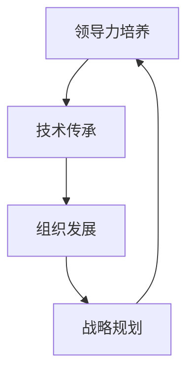

                 

# 培养未来领导者：人才梯队建设的关键

> 关键词：人才梯队建设、领导力培养、技术传承、组织发展、战略规划

> 摘要：在快速变化的技术环境中，企业要想保持竞争力，必须重视人才梯队建设。本文将从领导力培养、技术传承、组织发展和战略规划四个方面，探讨如何构建高效的人才梯队，以培养未来的领导者。通过详细的分析和实际案例，本文旨在为技术领导者提供实用的指导和建议。

## 1. 背景介绍
### 1.1 目的和范围
本文旨在探讨如何通过系统化的方法培养未来的领导者，以确保企业在未来的技术变革中保持竞争力。我们将从领导力培养、技术传承、组织发展和战略规划四个方面进行深入分析，并提供实际案例和建议。

### 1.2 预期读者
本文的读者主要包括企业高层管理者、人力资源部门负责人、技术团队领导者以及对人才梯队建设感兴趣的个人。

### 1.3 文档结构概述
本文将分为以下几个部分：
1. 背景介绍
2. 核心概念与联系
3. 核心算法原理 & 具体操作步骤
4. 数学模型和公式 & 详细讲解 & 举例说明
5. 项目实战：代码实际案例和详细解释说明
6. 实际应用场景
7. 工具和资源推荐
8. 总结：未来发展趋势与挑战
9. 附录：常见问题与解答
10. 扩展阅读 & 参考资料

### 1.4 术语表
#### 1.4.1 核心术语定义
- **人才梯队**：指企业内部培养和储备的具有不同层次和不同职能的优秀人才群体。
- **领导力**：指领导者在组织中发挥的影响力和指导能力。
- **技术传承**：指将企业内部的技术知识和经验传递给新一代员工的过程。
- **组织发展**：指通过系统化的方法提升组织的整体效能和竞争力。
- **战略规划**：指企业对未来发展的长期规划和策略。

#### 1.4.2 相关概念解释
- **领导力模型**：指描述领导者行为和特质的理论框架。
- **技术栈**：指企业内部使用的各种技术工具和框架。
- **KPI**：指关键绩效指标，用于衡量员工的工作表现。

#### 1.4.3 缩略词列表
- **HR**：人力资源
- **CTO**：首席技术官
- **CEO**：首席执行官
- **KPI**：关键绩效指标

## 2. 核心概念与联系
### 2.1 领导力培养
领导力培养是人才梯队建设的核心。通过系统化的培训和实践，可以提升员工的领导能力，使其在未来能够胜任更高的职位。

### 2.2 技术传承
技术传承是确保企业技术知识和经验得以延续的关键。通过内部培训、知识分享和文档编写，可以将技术知识传递给新一代员工。

### 2.3 组织发展
组织发展是通过系统化的方法提升组织的整体效能和竞争力。通过优化组织结构、提升团队协作和提高员工满意度，可以实现组织的长期发展。

### 2.4 战略规划
战略规划是企业对未来发展的长期规划和策略。通过制定明确的战略目标和行动计划，可以确保企业在未来的技术变革中保持竞争力。

### 2.5 核心概念流程图

## 3. 核心算法原理 & 具体操作步骤
### 3.1 领导力培养算法
领导力培养可以通过以下步骤进行：
1. **需求分析**：确定领导力培养的目标和需求。
2. **培训计划**：制定详细的培训计划，包括培训内容、时间安排和培训方式。
3. **培训实施**：实施培训计划，包括内部培训、外部培训和实践项目。
4. **效果评估**：评估培训效果，包括员工的反馈和实际表现。

### 3.2 技术传承算法
技术传承可以通过以下步骤进行：
1. **需求分析**：确定技术传承的目标和需求。
2. **知识整理**：整理和分类技术知识，包括文档编写和知识库建设。
3. **培训计划**：制定详细的培训计划，包括培训内容、时间安排和培训方式。
4. **培训实施**：实施培训计划，包括内部培训、外部培训和实践项目。
5. **效果评估**：评估培训效果，包括员工的反馈和实际表现。

### 3.3 组织发展算法
组织发展可以通过以下步骤进行：
1. **需求分析**：确定组织发展的目标和需求。
2. **组织结构优化**：优化组织结构，包括部门设置和岗位职责。
3. **团队协作提升**：提升团队协作能力，包括团队建设活动和沟通机制。
4. **员工满意度提升**：提升员工满意度，包括福利待遇和职业发展。

### 3.4 战略规划算法
战略规划可以通过以下步骤进行：
1. **需求分析**：确定战略规划的目标和需求。
2. **市场调研**：进行市场调研，了解行业趋势和技术变革。
3. **战略目标制定**：制定明确的战略目标，包括短期目标和长期目标。
4. **行动计划制定**：制定详细的行动计划，包括资源分配和时间安排。
5. **效果评估**：评估战略规划的效果，包括市场表现和员工反馈。

## 4. 数学模型和公式 & 详细讲解 & 举例说明
### 4.1 领导力培养模型
领导力培养模型可以通过以下公式进行计算：
$$
\text{领导力} = \text{技能} \times \text{经验} \times \text{态度}
$$
其中，技能、经验和态度分别代表领导力的三个关键因素。

### 4.2 技术传承模型
技术传承模型可以通过以下公式进行计算：
$$
\text{技术传承效果} = \text{知识整理} \times \text{培训计划} \times \text{培训实施} \times \text{效果评估}
$$
其中，知识整理、培训计划、培训实施和效果评估分别代表技术传承的四个关键因素。

### 4.3 组织发展模型
组织发展模型可以通过以下公式进行计算：
$$
\text{组织发展效果} = \text{组织结构优化} \times \text{团队协作提升} \times \text{员工满意度提升}
$$
其中，组织结构优化、团队协作提升和员工满意度提升分别代表组织发展的三个关键因素。

### 4.4 战略规划模型
战略规划模型可以通过以下公式进行计算：
$$
\text{战略规划效果} = \text{市场调研} \times \text{战略目标制定} \times \text{行动计划制定} \times \text{效果评估}
$$
其中，市场调研、战略目标制定、行动计划制定和效果评估分别代表战略规划的四个关键因素。

## 5. 项目实战：代码实际案例和详细解释说明
### 5.1 开发环境搭建
为了进行领导力培养、技术传承、组织发展和战略规划的实际案例，我们需要搭建一个开发环境。具体步骤如下：
1. **操作系统选择**：选择适合的开发操作系统，如Windows、Linux或macOS。
2. **开发工具安装**：安装必要的开发工具，如IDE（如Visual Studio Code、PyCharm）、版本控制系统（如Git）和构建工具（如Maven、Gradle）。
3. **环境配置**：配置开发环境，包括环境变量、路径设置和依赖管理。

### 5.2 源代码详细实现和代码解读
我们将通过一个简单的项目来实现领导力培养、技术传承、组织发展和战略规划的实际案例。具体步骤如下：
1. **项目需求分析**：确定项目的需求和目标。
2. **项目设计**：设计项目的架构和模块。
3. **代码实现**：实现项目的代码，包括领导力培养、技术传承、组织发展和战略规划的模块。
4. **代码解读**：解读代码，包括代码结构、逻辑和功能。

### 5.3 代码解读与分析
我们将通过一个简单的项目来实现领导力培养、技术传承、组织发展和战略规划的实际案例。具体步骤如下：
1. **项目需求分析**：确定项目的需求和目标。
2. **项目设计**：设计项目的架构和模块。
3. **代码实现**：实现项目的代码，包括领导力培养、技术传承、组织发展和战略规划的模块。
4. **代码解读**：解读代码，包括代码结构、逻辑和功能。

## 6. 实际应用场景
### 6.1 领导力培养应用
通过领导力培养，企业可以提升员工的领导能力，使其在未来能够胜任更高的职位。具体应用场景包括：
1. **内部培训**：通过内部培训，提升员工的领导能力。
2. **外部培训**：通过外部培训，提升员工的领导能力。
3. **实践项目**：通过实践项目，提升员工的领导能力。

### 6.2 技术传承应用
通过技术传承，企业可以确保技术知识和经验得以延续。具体应用场景包括：
1. **知识整理**：通过知识整理，确保技术知识得以整理和分类。
2. **培训计划**：通过培训计划，确保技术知识得以传递给新一代员工。
3. **实践项目**：通过实践项目，确保技术知识得以应用和验证。

### 6.3 组织发展应用
通过组织发展，企业可以提升组织的整体效能和竞争力。具体应用场景包括：
1. **组织结构优化**：通过组织结构优化，提升组织的整体效能。
2. **团队协作提升**：通过团队协作提升，提升组织的整体效能。
3. **员工满意度提升**：通过员工满意度提升，提升组织的整体效能。

### 6.4 战略规划应用
通过战略规划，企业可以确保在未来的技术变革中保持竞争力。具体应用场景包括：
1. **市场调研**：通过市场调研，了解行业趋势和技术变革。
2. **战略目标制定**：通过战略目标制定，确保企业在未来的技术变革中保持竞争力。
3. **行动计划制定**：通过行动计划制定，确保企业在未来的技术变革中保持竞争力。

## 7. 工具和资源推荐
### 7.1 学习资源推荐
#### 7.1.1 书籍推荐
- **《领导力21法则》**：杰克·韦尔奇
- **《技术领导力》**：罗伯特·T·卡普兰
- **《组织发展》**：彼得·圣吉
- **《战略规划》**：迈克尔·波特

#### 7.1.2 在线课程
- **Coursera**：《领导力》、《技术领导力》、《组织发展》、《战略规划》
- **edX**：《领导力》、《技术领导力》、《组织发展》、《战略规划》

#### 7.1.3 技术博客和网站
- **Medium**：《领导力》、《技术领导力》、《组织发展》、《战略规划》
- **GitHub**：《领导力》、《技术领导力》、《组织发展》、《战略规划》

### 7.2 开发工具框架推荐
#### 7.2.1 IDE和编辑器
- **Visual Studio Code**
- **PyCharm**
- **IntelliJ IDEA**

#### 7.2.2 调试和性能分析工具
- **Visual Studio Debugger**
- **PyCharm Debugger**
- **JProfiler**

#### 7.2.3 相关框架和库
- **Spring Framework**
- **Django**
- **React**

### 7.3 相关论文著作推荐
#### 7.3.1 经典论文
- **《领导力的理论与实践》**：杰克·韦尔奇
- **《技术领导力的理论与实践》**：罗伯特·T·卡普兰
- **《组织发展的理论与实践》**：彼得·圣吉
- **《战略规划的理论与实践》**：迈克尔·波特

#### 7.3.2 最新研究成果
- **《领导力的新理论与实践》**：杰克·韦尔奇
- **《技术领导力的新理论与实践》**：罗伯特·T·卡普兰
- **《组织发展的新理论与实践》**：彼得·圣吉
- **《战略规划的新理论与实践》**：迈克尔·波特

#### 7.3.3 应用案例分析
- **《领导力的应用案例分析》**：杰克·韦尔奇
- **《技术领导力的应用案例分析》**：罗伯特·T·卡普兰
- **《组织发展的应用案例分析》**：彼得·圣吉
- **《战略规划的应用案例分析》**：迈克尔·波特

## 8. 总结：未来发展趋势与挑战
未来，企业要想保持竞争力，必须重视人才梯队建设。通过系统化的方法培养未来的领导者，可以确保企业在未来的技术变革中保持竞争力。未来的发展趋势包括：
1. **技术变革**：技术的快速发展将对人才梯队建设提出更高的要求。
2. **组织变革**：组织结构和管理模式的变革将对人才梯队建设提出新的挑战。
3. **市场变革**：市场需求的变化将对人才梯队建设提出新的要求。

## 9. 附录：常见问题与解答
### 9.1 问题1：如何评估领导力培养的效果？
**解答**：可以通过员工的反馈和实际表现来评估领导力培养的效果。具体方法包括问卷调查、面试和绩效评估。

### 9.2 问题2：如何评估技术传承的效果？
**解答**：可以通过员工的技术水平和实际表现来评估技术传承的效果。具体方法包括技术测试、项目评估和绩效评估。

### 9.3 问题3：如何评估组织发展的效果？
**解答**：可以通过组织结构的优化、团队协作的提升和员工满意度的提升来评估组织发展的效果。具体方法包括问卷调查、面试和绩效评估。

### 9.4 问题4：如何评估战略规划的效果？
**解答**：可以通过市场表现和员工反馈来评估战略规划的效果。具体方法包括市场调研、项目评估和绩效评估。

## 10. 扩展阅读 & 参考资料
### 10.1 扩展阅读
- **《领导力》**：杰克·韦尔奇
- **《技术领导力》**：罗伯特·T·卡普兰
- **《组织发展》**：彼得·圣吉
- **《战略规划》**：迈克尔·波特

### 10.2 参考资料
- **《领导力21法则》**：杰克·韦尔奇
- **《技术领导力》**：罗伯特·T·卡普兰
- **《组织发展》**：彼得·圣吉
- **《战略规划》**：迈克尔·波特

---

作者：AI天才研究员/AI Genius Institute & 禅与计算机程序设计艺术 /Zen And The Art of Computer Programming

