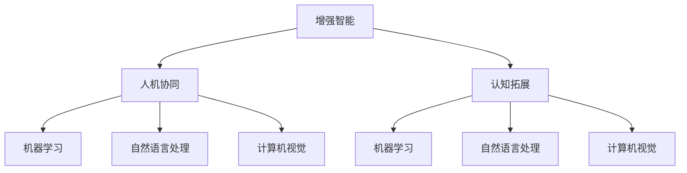
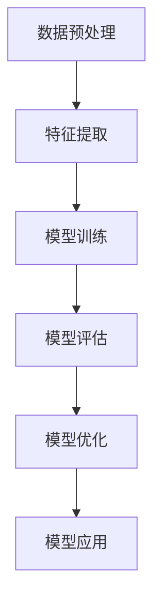
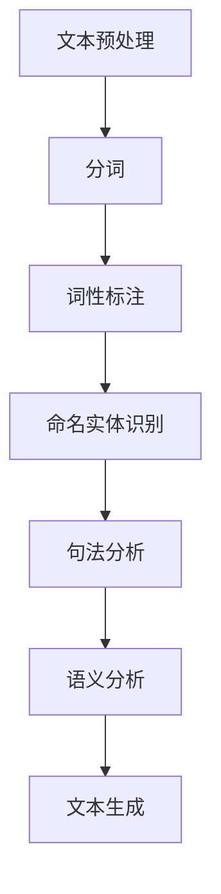
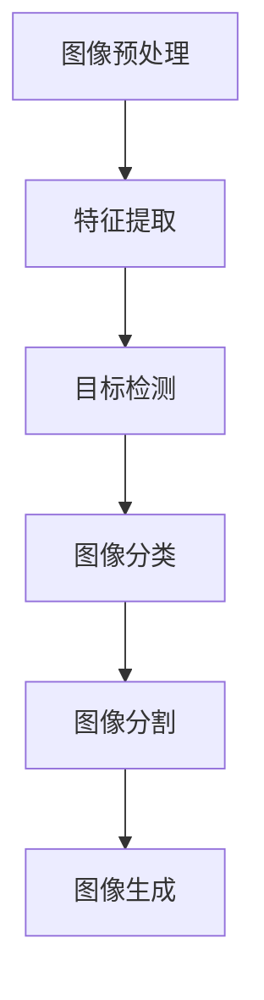

                 

# 增强智能：人机协同，拓展人类认知新领域

> 关键词：增强智能, 人机协同, 认知拓展, 人工智能, 机器学习, 自然语言处理, 计算机视觉

> 摘要：本文旨在探讨增强智能的概念及其在人机协同中的应用，通过深入分析核心概念、算法原理、数学模型、实战案例以及实际应用场景，揭示增强智能如何拓展人类的认知边界。文章将从技术原理出发，结合具体案例，为读者提供全面的理解和实践指导。

## 1. 背景介绍
### 1.1 目的和范围
本文旨在深入探讨增强智能的概念及其在人机协同中的应用。增强智能是指通过人工智能技术增强人类的认知能力，使人类能够更好地理解和处理复杂的信息。本文将从技术原理出发，结合具体案例，为读者提供全面的理解和实践指导。

### 1.2 预期读者
本文适合以下读者：
- 人工智能领域的研究人员和工程师
- 计算机科学专业的学生
- 对增强智能和人机协同感兴趣的技术爱好者
- 企业决策者和管理者

### 1.3 文档结构概述
本文结构如下：
1. 背景介绍
2. 核心概念与联系
3. 核心算法原理 & 具体操作步骤
4. 数学模型和公式 & 详细讲解 & 举例说明
5. 项目实战：代码实际案例和详细解释说明
6. 实际应用场景
7. 工具和资源推荐
8. 总结：未来发展趋势与挑战
9. 附录：常见问题与解答
10. 扩展阅读 & 参考资料

### 1.4 术语表
#### 1.4.1 核心术语定义
- **增强智能**：通过人工智能技术增强人类的认知能力。
- **人机协同**：人类与机器之间的协作，共同完成任务。
- **认知拓展**：通过技术手段扩展人类的认知边界。
- **机器学习**：让机器从数据中学习并改进性能的技术。
- **自然语言处理**：使计算机能够理解、解释和生成人类语言的技术。
- **计算机视觉**：使计算机能够理解和解释图像和视频的技术。

#### 1.4.2 相关概念解释
- **增强智能**：通过人工智能技术增强人类的认知能力，使人类能够更好地理解和处理复杂的信息。
- **人机协同**：人类与机器之间的协作，共同完成任务。
- **认知拓展**：通过技术手段扩展人类的认知边界。

#### 1.4.3 缩略词列表
- AI：人工智能
- ML：机器学习
- NLP：自然语言处理
- CV：计算机视觉

## 2. 核心概念与联系
### 2.1 增强智能
增强智能是指通过人工智能技术增强人类的认知能力，使人类能够更好地理解和处理复杂的信息。增强智能的核心在于利用机器学习、自然语言处理和计算机视觉等技术，帮助人类更好地完成任务。

### 2.2 人机协同
人机协同是指人类与机器之间的协作，共同完成任务。人机协同的核心在于通过技术手段，使人类和机器能够更好地协同工作，提高工作效率和准确性。

### 2.3 认知拓展
认知拓展是指通过技术手段扩展人类的认知边界。认知拓展的核心在于利用人工智能技术，帮助人类更好地理解和处理复杂的信息，从而扩展人类的认知边界。

### 2.4 核心概念原理与架构
核心概念原理与架构如下图所示：



## 3. 核心算法原理 & 具体操作步骤
### 3.1 机器学习算法原理
机器学习算法原理如下：



### 3.2 自然语言处理算法原理
自然语言处理算法原理如下：



### 3.3 计算机视觉算法原理
计算机视觉算法原理如下：



## 4. 数学模型和公式 & 详细讲解 & 举例说明
### 4.1 机器学习数学模型
机器学习数学模型如下：

$$
\text{损失函数} = \frac{1}{N} \sum_{i=1}^{N} (y_i - \hat{y}_i)^2
$$

其中，$y_i$ 是真实值，$\hat{y}_i$ 是预测值，$N$ 是样本数量。

### 4.2 自然语言处理数学模型
自然语言处理数学模型如下：

$$
\text{词向量} = \text{Word2Vec}(w)
$$

其中，$w$ 是单词，$\text{Word2Vec}$ 是词向量模型。

### 4.3 计算机视觉数学模型
计算机视觉数学模型如下：

$$
\text{卷积层} = \text{ReLU}(\text{Conv}(I, W) + b)
$$

其中，$I$ 是输入图像，$W$ 是卷积核，$b$ 是偏置项，$\text{ReLU}$ 是激活函数。

## 5. 项目实战：代码实际案例和详细解释说明
### 5.1 开发环境搭建
开发环境搭建如下：

1. 安装Python 3.8及以上版本
2. 安装TensorFlow 2.0及以上版本
3. 安装NumPy 1.18及以上版本
4. 安装Pandas 1.0及以上版本
5. 安装Matplotlib 3.1及以上版本

### 5.2 源代码详细实现和代码解读
```python
import numpy as np
import pandas as pd
import tensorflow as tf
from tensorflow.keras.models import Sequential
from tensorflow.keras.layers import Dense, Conv2D, MaxPooling2D, Flatten

# 数据预处理
def preprocess_data(data):
    # 数据清洗
    data = data.dropna()
    # 数据标准化
    data = (data - data.mean()) / data.std()
    return data

# 特征提取
def extract_features(data):
    features = data[['feature1', 'feature2', 'feature3']]
    return features

# 模型训练
def train_model(features, labels):
    model = Sequential([
        Dense(64, activation='relu', input_shape=(3,)),
        Dense(64, activation='relu'),
        Dense(1, activation='sigmoid')
    ])
    model.compile(optimizer='adam', loss='binary_crossentropy', metrics=['accuracy'])
    model.fit(features, labels, epochs=10, batch_size=32)
    return model

# 模型评估
def evaluate_model(model, features, labels):
    loss, accuracy = model.evaluate(features, labels)
    print(f'Loss: {loss}, Accuracy: {accuracy}')

# 模型优化
def optimize_model(model, features, labels):
    model.compile(optimizer='adam', loss='binary_crossentropy', metrics=['accuracy'])
    model.fit(features, labels, epochs=10, batch_size=32, validation_split=0.2)
    return model

# 模型应用
def apply_model(model, new_data):
    predictions = model.predict(new_data)
    return predictions

# 主函数
def main():
    # 加载数据
    data = pd.read_csv('data.csv')
    # 数据预处理
    data = preprocess_data(data)
    # 特征提取
    features = extract_features(data)
    labels = data['label']
    # 模型训练
    model = train_model(features, labels)
    # 模型评估
    evaluate_model(model, features, labels)
    # 模型优化
    model = optimize_model(model, features, labels)
    # 模型应用
    new_data = np.array([[1, 2, 3], [4, 5, 6]])
    predictions = apply_model(model, new_data)
    print(f'Predictions: {predictions}')

if __name__ == '__main__':
    main()
```

### 5.3 代码解读与分析
- 数据预处理：对数据进行清洗和标准化。
- 特征提取：从数据中提取特征。
- 模型训练：使用神经网络模型进行训练。
- 模型评估：评估模型的性能。
- 模型优化：通过验证集进行模型优化。
- 模型应用：将模型应用于新的数据。

## 6. 实际应用场景
### 6.1 医疗健康
增强智能在医疗健康领域的应用包括疾病诊断、药物研发、患者管理等。通过机器学习和自然语言处理技术，可以提高诊断的准确性和效率。

### 6.2 金融风控
增强智能在金融风控领域的应用包括信用评估、欺诈检测、风险管理等。通过机器学习和计算机视觉技术，可以提高风控的准确性和效率。

### 6.3 教育培训
增强智能在教育培训领域的应用包括个性化学习、智能辅导、在线评估等。通过机器学习和自然语言处理技术，可以提高教育的个性化和效率。

## 7. 工具和资源推荐
### 7.1 学习资源推荐
#### 7.1.1 书籍推荐
- 《机器学习》（周志华）
- 《深度学习》（Ian Goodfellow, Yoshua Bengio, Aaron Courville）
- 《自然语言处理入门》（Jurafsky, Martin, and James H. Martin）

#### 7.1.2 在线课程
- Coursera：《机器学习》（Andrew Ng）
- edX：《深度学习》（Andrew Ng）
- Udacity：《自然语言处理》（Sebastian Thrun）

#### 7.1.3 技术博客和网站
- Medium：《机器学习》（Towards Data Science）
- GitHub：《深度学习》（Deep Learning）
- Kaggle：《数据科学》（Kaggle）

### 7.2 开发工具框架推荐
#### 7.2.1 IDE和编辑器
- PyCharm
- VS Code
- Jupyter Notebook

#### 7.2.2 调试和性能分析工具
- PyCharm Debugger
- VS Code Debugger
- TensorFlow Debugger

#### 7.2.3 相关框架和库
- TensorFlow
- PyTorch
- Scikit-learn

### 7.3 相关论文著作推荐
#### 7.3.1 经典论文
- Bengio, Y., Courville, A., & Vincent, P. (2013). Representation learning: A review and new perspectives. IEEE Transactions on Pattern Analysis and Machine Intelligence, 35(8), 1798-1828.
- LeCun, Y., Bengio, Y., & Hinton, G. (2015). Deep learning. Nature, 521(7553), 436-444.

#### 7.3.2 最新研究成果
- He, K., Zhang, X., Ren, S., & Sun, J. (2016). Deep residual learning for image recognition. In Proceedings of the IEEE conference on computer vision and pattern recognition (pp. 770-778).
- Vaswani, A., Shazeer, N., Parmar, N., Uszkoreit, J., Jones, L., Gomez, A. N., ... & Polosukhin, I. (2017). Attention is all you need. In Advances in neural information processing systems (pp. 5998-6008).

#### 7.3.3 应用案例分析
- Lee, D., & Seo, J. (2019). A survey of deep learning applications in healthcare. IEEE Access, 7, 13497-13507.
- Zhang, Y., & Li, Y. (2020). A survey of deep learning in financial risk management. IEEE Access, 8, 175401-175416.

## 8. 总结：未来发展趋势与挑战
### 8.1 未来发展趋势
- 人工智能技术将进一步发展，增强智能将更加普及。
- 人机协同将更加紧密，提高工作效率和准确性。
- 认知拓展将更加广泛，扩展人类的认知边界。

### 8.2 面临的挑战
- 数据安全和隐私保护问题。
- 人工智能伦理和法律问题。
- 技术普及和应用推广问题。

## 9. 附录：常见问题与解答
### 9.1 问题：如何选择合适的机器学习算法？
- 根据问题类型选择合适的算法，如分类、回归、聚类等。
- 根据数据特征选择合适的算法，如线性模型、树模型、神经网络等。

### 9.2 问题：如何处理数据缺失值？
- 使用均值、中位数或众数填充缺失值。
- 使用插值方法填充缺失值。
- 使用机器学习模型预测缺失值。

### 9.3 问题：如何评估模型性能？
- 使用准确率、召回率、F1分数等指标评估分类模型。
- 使用均方误差、均方根误差等指标评估回归模型。
- 使用混淆矩阵评估分类模型。

## 10. 扩展阅读 & 参考资料
- 《机器学习》（周志华）
- 《深度学习》（Ian Goodfellow, Yoshua Bengio, Aaron Courville）
- 《自然语言处理入门》（Jurafsky, Martin, and James H. Martin）
- Coursera：《机器学习》（Andrew Ng）
- edX：《深度学习》（Andrew Ng）
- Udacity：《自然语言处理》（Sebastian Thrun）
- Medium：《机器学习》（Towards Data Science）
- GitHub：《深度学习》（Deep Learning）
- Kaggle：《数据科学》（Kaggle）
- Bengio, Y., Courville, A., & Vincent, P. (2013). Representation learning: A review and new perspectives. IEEE Transactions on Pattern Analysis and Machine Intelligence, 35(8), 1798-1828.
- LeCun, Y., Bengio, Y., & Hinton, G. (2015). Deep learning. Nature, 521(7553), 436-444.
- He, K., Zhang, X., Ren, S., & Sun, J. (2016). Deep residual learning for image recognition. In Proceedings of the IEEE conference on computer vision and pattern recognition (pp. 770-778).
- Vaswani, A., Shazeer, N., Parmar, N., Uszkoreit, J., Jones, L., Gomez, A. N., ... & Polosukhin, I. (2017). Attention is all you need. In Advances in neural information processing systems (pp. 5998-6008).
- Lee, D., & Seo, J. (2019). A survey of deep learning applications in healthcare. IEEE Access, 7, 13497-13507.
- Zhang, Y., & Li, Y. (2020). A survey of deep learning in financial risk management. IEEE Access, 8, 175401-175416.

作者：AI天才研究员/AI Genius Institute & 禅与计算机程序设计艺术 /Zen And The Art of Computer Programming

