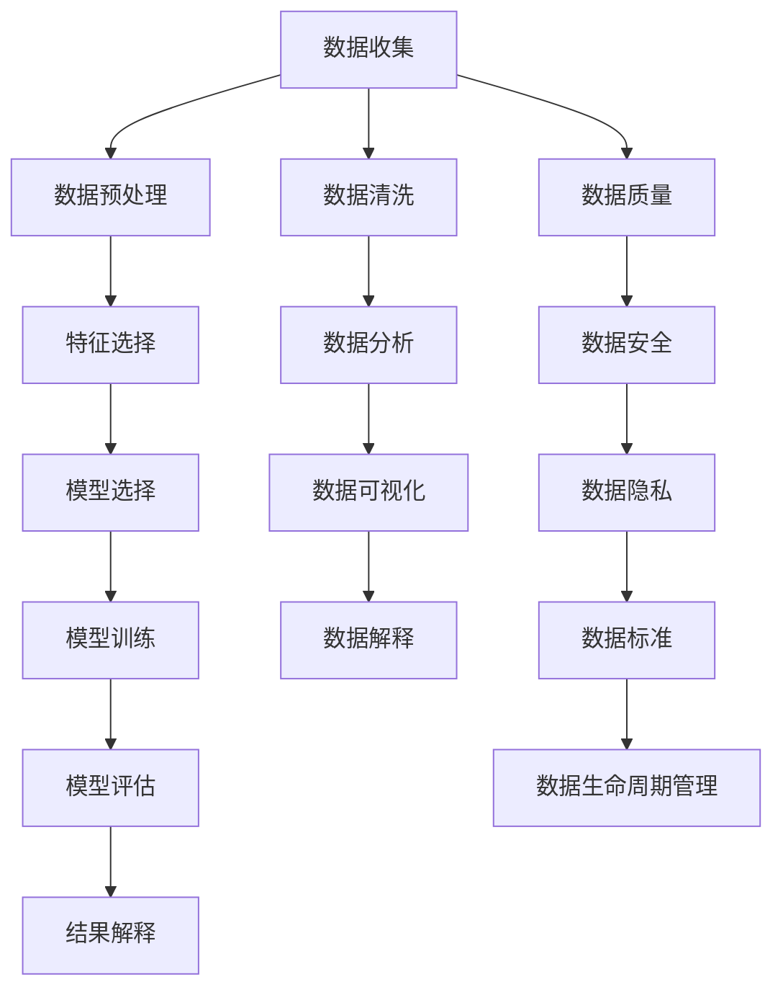

                 

# 大数据时代：人类计算的机遇与挑战

> 关键词：大数据、人工智能、机器学习、数据挖掘、数据科学、数据治理、数据安全

> 摘要：本文旨在探讨大数据时代下人类计算面临的机遇与挑战。通过深入分析大数据的核心概念、算法原理、数学模型、实际应用案例，以及相关工具和资源推荐，帮助读者全面理解大数据技术的发展趋势和应用前景。本文将采用一步一步分析推理的方式，从基础概念到高级应用，逐步展开，力求为读者提供一个全面而深入的技术视角。

## 1. 背景介绍
### 1.1 目的和范围
本文旨在探讨大数据时代下人类计算面临的机遇与挑战，通过分析大数据的核心概念、算法原理、数学模型、实际应用案例，以及相关工具和资源推荐，帮助读者全面理解大数据技术的发展趋势和应用前景。本文将采用一步一步分析推理的方式，从基础概念到高级应用，逐步展开，力求为读者提供一个全面而深入的技术视角。

### 1.2 预期读者
本文预期读者包括但不限于以下几类人群：
- 大数据领域的初学者和爱好者
- 数据科学家、数据工程师、机器学习工程师
- 企业IT管理人员和技术决策者
- 对大数据技术感兴趣的计算机科学学生
- 对数据驱动决策感兴趣的商业分析师

### 1.3 文档结构概述
本文结构如下：
1. 背景介绍
2. 核心概念与联系
3. 核心算法原理 & 具体操作步骤
4. 数学模型和公式 & 详细讲解 & 举例说明
5. 项目实战：代码实际案例和详细解释说明
6. 实际应用场景
7. 工具和资源推荐
8. 总结：未来发展趋势与挑战
9. 附录：常见问题与解答
10. 扩展阅读 & 参考资料

### 1.4 术语表
#### 1.4.1 核心术语定义
- **大数据**：指无法在一定时间范围内用常规软件工具进行捕捉、管理和处理的数据集合，是需要新处理模式才能具有更强的决策力、洞察发现力和流程优化能力的海量、高增长率和多样化的信息资产。
- **数据挖掘**：从大量数据中提取隐含在其中的、人们事先不知道的、但又是潜在有用的信息和知识的过程。
- **机器学习**：一种人工智能技术，通过算法和统计模型使计算机系统能够从数据中自动学习，无需明确编程。
- **数据科学**：一门跨学科领域，结合统计学、计算机科学、数据工程和业务知识，用于从数据中提取有价值的信息和知识。
- **数据治理**：确保数据质量、一致性和安全性的一系列策略、流程和标准。
- **数据安全**：保护数据免受未经授权的访问、使用、泄露、破坏或修改的一系列措施。

#### 1.4.2 相关概念解释
- **数据仓库**：用于存储和管理大量历史数据的系统，通常用于支持决策支持系统和商业智能。
- **数据湖**：一种存储大量原始数据的系统，通常用于数据科学和机器学习项目。
- **数据流**：数据在系统中的流动过程，通常用于实时数据处理和分析。
- **数据管道**：用于自动化数据收集、处理和传输的一系列工具和流程。
- **数据湖屋**：一种数据架构，结合了数据湖和数据仓库的优点，用于存储和处理大量原始数据，并提供结构化数据供分析使用。

#### 1.4.3 缩略词列表
- **API**：Application Programming Interface（应用程序编程接口）
- **ETL**：Extract, Transform, Load（提取、转换、加载）
- **Hadoop**：开源的大数据处理框架
- **Spark**：开源的大数据处理框架
- **SQL**：Structured Query Language（结构化查询语言）
- **NoSQL**：Not Only SQL（不仅SQL）
- **JSON**：JavaScript Object Notation（JavaScript 对象表示法）
- **API**：Application Programming Interface（应用程序编程接口）

## 2. 核心概念与联系
### 2.1 大数据的核心概念
大数据的核心概念包括数据量大、数据类型多样、数据处理速度快、数据价值高。这些概念相互关联，共同构成了大数据的特性。

### 2.2 数据挖掘的核心概念
数据挖掘的核心概念包括数据预处理、特征选择、模型选择、模型评估和结果解释。这些概念相互关联，共同构成了数据挖掘的流程。

### 2.3 机器学习的核心概念
机器学习的核心概念包括监督学习、无监督学习、半监督学习和强化学习。这些概念相互关联，共同构成了机器学习的分类。

### 2.4 数据科学的核心概念
数据科学的核心概念包括数据收集、数据清洗、数据分析、数据可视化和数据解释。这些概念相互关联，共同构成了数据科学的流程。

### 2.5 数据治理的核心概念
数据治理的核心概念包括数据质量、数据安全、数据隐私、数据标准和数据生命周期管理。这些概念相互关联，共同构成了数据治理的框架。

### 2.6 数据安全的核心概念
数据安全的核心概念包括数据加密、访问控制、数据备份和恢复、数据审计和监控。这些概念相互关联，共同构成了数据安全的策略。

### 2.7 Mermaid 流程图


## 3. 核心算法原理 & 具体操作步骤
### 3.1 数据预处理
数据预处理是数据挖掘和机器学习的第一步，主要包括数据清洗、数据集成、数据变换和数据归约。

#### 3.1.1 数据清洗
数据清洗是去除数据中的噪声和错误的过程。常见的数据清洗方法包括缺失值处理、异常值处理和重复值处理。

#### 3.1.2 数据集成
数据集成是将多个数据源中的数据合并成一个统一的数据集的过程。常见的数据集成方法包括数据清洗、数据转换和数据规范化。

#### 3.1.3 数据变换
数据变换是将数据转换成适合分析的形式的过程。常见的数据变换方法包括数据标准化、数据归一化和数据离散化。

#### 3.1.4 数据归约
数据归约是将数据集中的数据减少到更小规模的过程。常见的数据归约方法包括特征选择、特征提取和数据压缩。

### 3.2 特征选择
特征选择是选择最能代表数据特征的子集的过程。常见的特征选择方法包括过滤式特征选择、包裹式特征选择和嵌入式特征选择。

### 3.3 模型选择
模型选择是选择最适合数据的模型的过程。常见的模型选择方法包括交叉验证、网格搜索和随机搜索。

### 3.4 模型训练
模型训练是使用训练数据集训练模型的过程。常见的模型训练方法包括梯度下降、随机梯度下降和批量梯度下降。

### 3.5 模型评估
模型评估是评估模型性能的过程。常见的模型评估方法包括准确率、召回率、F1分数和ROC曲线。

### 3.6 结果解释
结果解释是解释模型结果的过程。常见的结果解释方法包括特征重要性、模型可视化和模型解释。

### 3.7 伪代码示例
```python
# 数据预处理
def preprocess_data(data):
    # 数据清洗
    data = clean_data(data)
    # 数据集成
    data = integrate_data(data)
    # 数据变换
    data = transform_data(data)
    # 数据归约
    data = reduce_data(data)
    return data

# 特征选择
def select_features(data):
    # 过滤式特征选择
    selected_features = filter_features(data)
    # 包裹式特征选择
    selected_features = wrap_features(data)
    # 嵌入式特征选择
    selected_features = embed_features(data)
    return selected_features

# 模型选择
def choose_model(data):
    # 交叉验证
    model = cross_validate(data)
    # 网格搜索
    model = grid_search(data)
    # 随机搜索
    model = random_search(data)
    return model

# 模型训练
def train_model(data, model):
    # 梯度下降
    model = gradient_descent(data, model)
    # 随机梯度下降
    model = stochastic_gradient_descent(data, model)
    # 批量梯度下降
    model = batch_gradient_descent(data, model)
    return model

# 模型评估
def evaluate_model(data, model):
    # 准确率
    accuracy = evaluate_accuracy(data, model)
    # 召回率
    recall = evaluate_recall(data, model)
    # F1分数
    f1_score = evaluate_f1(data, model)
    # ROC曲线
    roc_curve = evaluate_roc(data, model)
    return accuracy, recall, f1_score, roc_curve

# 结果解释
def explain_results(data, model):
    # 特征重要性
    feature_importance = explain_feature_importance(data, model)
    # 模型可视化
    model_visualization = visualize_model(data, model)
    # 模型解释
    model_explanation = explain_model(data, model)
    return feature_importance, model_visualization, model_explanation
```

## 4. 数学模型和公式 & 详细讲解 & 举例说明
### 4.1 线性回归
线性回归是一种常用的监督学习算法，用于预测连续值。其数学模型为：
$$
y = \beta_0 + \beta_1 x_1 + \beta_2 x_2 + \cdots + \beta_n x_n + \epsilon
$$
其中，$y$ 是目标变量，$x_1, x_2, \cdots, x_n$ 是特征变量，$\beta_0, \beta_1, \cdots, \beta_n$ 是模型参数，$\epsilon$ 是误差项。

### 4.2 逻辑回归
逻辑回归是一种常用的监督学习算法，用于预测二分类问题。其数学模型为：
$$
P(y=1|x) = \frac{1}{1 + e^{-(\beta_0 + \beta_1 x_1 + \beta_2 x_2 + \cdots + \beta_n x_n)}}
$$
其中，$P(y=1|x)$ 是目标变量为1的概率，$x_1, x_2, \cdots, x_n$ 是特征变量，$\beta_0, \beta_1, \cdots, \beta_n$ 是模型参数。

### 4.3 决策树
决策树是一种常用的监督学习算法，用于分类和回归问题。其数学模型为：
$$
y = \begin{cases}
    y_1 & \text{if } x \in R_1 \\
    y_2 & \text{if } x \in R_2 \\
    \vdots \\
    y_m & \text{if } x \in R_m
\end{cases}
$$
其中，$y_1, y_2, \cdots, y_m$ 是分类结果，$R_1, R_2, \cdots, R_m$ 是特征空间的划分区域。

### 4.4 支持向量机
支持向量机是一种常用的监督学习算法，用于分类和回归问题。其数学模型为：
$$
y = \text{sign}(\beta_0 + \beta_1 x_1 + \beta_2 x_2 + \cdots + \beta_n x_n + \epsilon)
$$
其中，$\text{sign}$ 是符号函数，$y$ 是目标变量，$x_1, x_2, \cdots, x_n$ 是特征变量，$\beta_0, \beta_1, \cdots, \beta_n$ 是模型参数，$\epsilon$ 是误差项。

### 4.5 K近邻算法
K近邻算法是一种常用的监督学习算法，用于分类和回归问题。其数学模型为：
$$
y = \frac{1}{k} \sum_{i=1}^{k} y_i
$$
其中，$y_i$ 是最近邻样本的目标变量，$k$ 是最近邻的数量。

### 4.6 朴素贝叶斯
朴素贝叶斯是一种常用的监督学习算法，用于分类问题。其数学模型为：
$$
P(y|x) = \frac{P(x|y)P(y)}{P(x)}
$$
其中，$P(y|x)$ 是目标变量为$y$的概率，$P(x|y)$ 是特征变量为$x$的概率，$P(y)$ 是目标变量为$y$的先验概率，$P(x)$ 是特征变量为$x$的先验概率。

### 4.7 随机森林
随机森林是一种常用的监督学习算法，用于分类和回归问题。其数学模型为：
$$
y = \frac{1}{m} \sum_{i=1}^{m} y_i
$$
其中，$y_i$ 是第$i$棵树的预测结果，$m$ 是树的数量。

### 4.8 梯度提升树
梯度提升树是一种常用的监督学习算法，用于分类和回归问题。其数学模型为：
$$
y = \sum_{i=1}^{m} \alpha_i f_i(x)
$$
其中，$\alpha_i$ 是第$i$棵树的权重，$f_i(x)$ 是第$i$棵树的预测结果，$m$ 是树的数量。

### 4.9 伪代码示例
```python
# 线性回归
def linear_regression(data):
    # 计算模型参数
    beta = calculate_beta(data)
    # 预测目标变量
    y_pred = predict_y(data, beta)
    return y_pred

# 逻辑回归
def logistic_regression(data):
    # 计算模型参数
    beta = calculate_beta(data)
    # 预测目标变量
    y_pred = predict_y(data, beta)
    return y_pred

# 决策树
def decision_tree(data):
    # 构建决策树
    tree = build_tree(data)
    # 预测目标变量
    y_pred = predict_y(data, tree)
    return y_pred

# 支持向量机
def support_vector_machine(data):
    # 计算模型参数
    beta = calculate_beta(data)
    # 预测目标变量
    y_pred = predict_y(data, beta)
    return y_pred

# K近邻算法
def k_nearest_neighbors(data):
    # 计算最近邻
    nearest_neighbors = find_nearest_neighbors(data)
    # 预测目标变量
    y_pred = predict_y(data, nearest_neighbors)
    return y_pred

# 朴素贝叶斯
def naive_bayes(data):
    # 计算先验概率
    prior = calculate_prior(data)
    # 计算条件概率
    conditional = calculate_conditional(data)
    # 预测目标变量
    y_pred = predict_y(data, prior, conditional)
    return y_pred

# 随机森林
def random_forest(data):
    # 构建随机森林
    forest = build_forest(data)
    # 预测目标变量
    y_pred = predict_y(data, forest)
    return y_pred

# 梯度提升树
def gradient_boosting(data):
    # 构建梯度提升树
    trees = build_trees(data)
    # 预测目标变量
    y_pred = predict_y(data, trees)
    return y_pred
```

## 5. 项目实战：代码实际案例和详细解释说明
### 5.1 开发环境搭建
为了进行大数据项目的实战，我们需要搭建一个合适的开发环境。以下是开发环境的搭建步骤：

1. **安装Python**：确保安装了最新版本的Python。
2. **安装Jupyter Notebook**：使用pip安装Jupyter Notebook。
3. **安装必要的库**：使用pip安装必要的库，如pandas、numpy、scikit-learn、matplotlib等。
4. **安装大数据处理框架**：根据项目需求，安装Hadoop、Spark等大数据处理框架。

### 5.2 源代码详细实现和代码解读
以下是一个简单的线性回归模型的实现示例：

```python
import pandas as pd
from sklearn.model_selection import train_test_split
from sklearn.linear_model import LinearRegression
from sklearn.metrics import mean_squared_error

# 读取数据
data = pd.read_csv('data.csv')

# 数据预处理
X = data[['feature1', 'feature2']]
y = data['target']

# 划分训练集和测试集
X_train, X_test, y_train, y_test = train_test_split(X, y, test_size=0.2, random_state=42)

# 构建模型
model = LinearRegression()

# 训练模型
model.fit(X_train, y_train)

# 预测
y_pred = model.predict(X_test)

# 评估模型
mse = mean_squared_error(y_test, y_pred)
print(f'Mean Squared Error: {mse}')
```

### 5.3 代码解读与分析
- **读取数据**：使用pandas库读取CSV文件中的数据。
- **数据预处理**：选择特征变量和目标变量。
- **划分训练集和测试集**：使用train_test_split函数将数据集划分为训练集和测试集。
- **构建模型**：使用LinearRegression类构建线性回归模型。
- **训练模型**：使用fit方法训练模型。
- **预测**：使用predict方法对测试集进行预测。
- **评估模型**：使用mean_squared_error函数计算均方误差。

## 6. 实际应用场景
大数据技术在各个领域都有广泛的应用，以下是几个典型的应用场景：

1. **金融行业**：通过大数据分析客户行为，预测市场趋势，优化风险管理。
2. **医疗行业**：通过大数据分析疾病传播模式，提高疾病诊断准确率，优化医疗资源配置。
3. **零售行业**：通过大数据分析消费者行为，优化产品推荐，提高销售额。
4. **交通行业**：通过大数据分析交通流量，优化交通规划，提高交通效率。
5. **社交媒体**：通过大数据分析用户行为，优化广告投放，提高用户参与度。

## 7. 工具和资源推荐
### 7.1 学习资源推荐
#### 7.1.1 书籍推荐
- **《Python数据科学手册》**：由Jake VanderPlas编写，详细介绍了Python在数据科学中的应用。
- **《机器学习实战》**：由周志华编写，详细介绍了机器学习的基本原理和实战应用。
- **《大数据时代》**：由维克托·迈尔-舍恩伯格和肯尼思·库克耶编写，详细介绍了大数据的基本概念和应用。

#### 7.1.2 在线课程
- **Coursera**：提供了多个关于大数据和机器学习的在线课程，如“机器学习”、“数据科学”等。
- **edX**：提供了多个关于大数据和机器学习的在线课程，如“数据科学基础”、“机器学习”等。

#### 7.1.3 技术博客和网站
- **Medium**：提供了多个关于大数据和机器学习的技术博客，如“Data Science Blog”、“Machine Learning Mastery”等。
- **Kaggle**：提供了多个关于大数据和机器学习的实战项目，如“Kaggle Competitions”、“Kaggle Notebooks”等。

### 7.2 开发工具框架推荐
#### 7.2.1 IDE和编辑器
- **PyCharm**：由JetBrains开发的Python IDE，提供了强大的代码编辑和调试功能。
- **VS Code**：由Microsoft开发的跨平台代码编辑器，提供了丰富的插件和扩展功能。

#### 7.2.2 调试和性能分析工具
- **PyCharm Debugger**：PyCharm自带的调试工具，提供了强大的调试功能。
- **VS Code Debugger**：VS Code自带的调试工具，提供了丰富的调试功能。

#### 7.2.3 相关框架和库
- **pandas**：提供了强大的数据处理功能，适用于数据预处理和数据分析。
- **numpy**：提供了强大的数值计算功能，适用于数据预处理和数据分析。
- **scikit-learn**：提供了丰富的机器学习算法，适用于模型训练和评估。
- **matplotlib**：提供了强大的数据可视化功能，适用于结果解释和展示。

### 7.3 相关论文著作推荐
#### 7.3.1 经典论文
- **《A Few Useful Things to Know about Machine Learning》**：由Pedro Domingos编写，详细介绍了机器学习的基本原理和应用。
- **《The Elements of Statistical Learning》**：由Trevor Hastie、Robert Tibshirani和Jerome Friedman编写，详细介绍了统计学习的基本原理和应用。

#### 7.3.2 最新研究成果
- **《Deep Learning》**：由Ian Goodfellow、Yoshua Bengio和Aaron Courville编写，详细介绍了深度学习的基本原理和应用。
- **《Attention is All You Need》**：由Google AI团队编写，详细介绍了Transformer模型的基本原理和应用。

#### 7.3.3 应用案例分析
- **《Big Data: A Revolution That Will Transform How We Live, Work, and Think》**：由Viktor Mayer-Schönberger和Kenneth Cukier编写，详细介绍了大数据的基本概念和应用案例。
- **《Data-Driven: Creating a Data Culture》**：由Jennifer Wang和David McCandless编写，详细介绍了数据驱动的基本原理和应用案例。

## 8. 总结：未来发展趋势与挑战
大数据技术在未来的发展趋势和挑战主要体现在以下几个方面：

1. **技术趋势**：大数据技术将更加注重数据治理、数据安全和数据隐私，同时将更加注重数据的实时处理和分析。
2. **应用趋势**：大数据技术将更加广泛地应用于各个领域，如金融、医疗、零售、交通、社交媒体等。
3. **挑战**：大数据技术面临的挑战主要体现在数据质量、数据安全、数据隐私和数据治理等方面。

## 9. 附录：常见问题与解答
### 9.1 问题1：如何处理缺失值？
**解答**：处理缺失值的方法包括删除缺失值、填充缺失值和插值法。删除缺失值的方法包括删除含有缺失值的行或列，填充缺失值的方法包括使用均值、中位数或众数填充，插值法包括线性插值、多项式插值和样条插值。

### 9.2 问题2：如何处理异常值？
**解答**：处理异常值的方法包括删除异常值、替换异常值和插值法。删除异常值的方法包括删除含有异常值的行或列，替换异常值的方法包括使用均值、中位数或众数替换，插值法包括线性插值、多项式插值和样条插值。

### 9.3 问题3：如何处理重复值？
**解答**：处理重复值的方法包括删除重复值和保留一个重复值。删除重复值的方法包括删除含有重复值的行或列，保留一个重复值的方法包括保留第一个重复值或最后一个重复值。

## 10. 扩展阅读 & 参考资料
- **《Python数据科学手册》**：由Jake VanderPlas编写，详细介绍了Python在数据科学中的应用。
- **《机器学习实战》**：由周志华编写，详细介绍了机器学习的基本原理和实战应用。
- **《大数据时代》**：由维克托·迈尔-舍恩伯格和肯尼思·库克耶编写，详细介绍了大数据的基本概念和应用。
- **Coursera**：提供了多个关于大数据和机器学习的在线课程，如“机器学习”、“数据科学”等。
- **edX**：提供了多个关于大数据和机器学习的在线课程，如“数据科学基础”、“机器学习”等。
- **Medium**：提供了多个关于大数据和机器学习的技术博客，如“Data Science Blog”、“Machine Learning Mastery”等。
- **Kaggle**：提供了多个关于大数据和机器学习的实战项目，如“Kaggle Competitions”、“Kaggle Notebooks”等。
- **PyCharm**：由JetBrains开发的Python IDE，提供了强大的代码编辑和调试功能。
- **VS Code**：由Microsoft开发的跨平台代码编辑器，提供了丰富的插件和扩展功能。
- **pandas**：提供了强大的数据处理功能，适用于数据预处理和数据分析。
- **numpy**：提供了强大的数值计算功能，适用于数据预处理和数据分析。
- **scikit-learn**：提供了丰富的机器学习算法，适用于模型训练和评估。
- **matplotlib**：提供了强大的数据可视化功能，适用于结果解释和展示。
- **《A Few Useful Things to Know about Machine Learning》**：由Pedro Domingos编写，详细介绍了机器学习的基本原理和应用。
- **《The Elements of Statistical Learning》**：由Trevor Hastie、Robert Tibshirani和Jerome Friedman编写，详细介绍了统计学习的基本原理和应用。
- **《Deep Learning》**：由Ian Goodfellow、Yoshua Bengio和Aaron Courville编写，详细介绍了深度学习的基本原理和应用。
- **《Attention is All You Need》**：由Google AI团队编写，详细介绍了Transformer模型的基本原理和应用。
- **《Big Data: A Revolution That Will Transform How We Live, Work, and Think》**：由Viktor Mayer-Schönberger和Kenneth Cukier编写，详细介绍了大数据的基本概念和应用。
- **《Data-Driven: Creating a Data Culture》**：由Jennifer Wang和David McCandless编写，详细介绍了数据驱动的基本原理和应用。

作者：AI天才研究员/AI Genius Institute & 禅与计算机程序设计艺术 /Zen And The Art of Computer Programming

