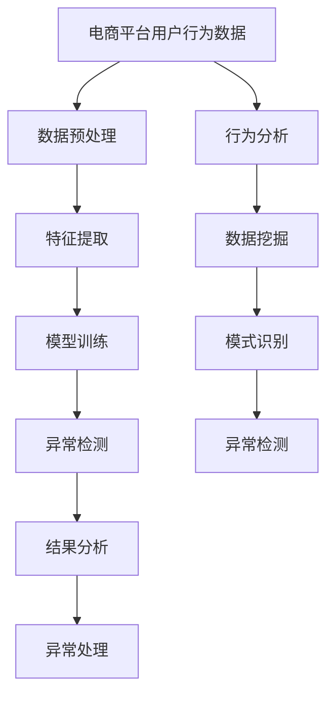

                 

# 大模型在电商平台用户行为异常检测中的应用

> 关键词：大模型、电商平台、用户行为、异常检测、机器学习、深度学习、自然语言处理、行为分析、数据挖掘

> 摘要：本文旨在探讨如何利用大模型在电商平台中进行用户行为异常检测。通过深入分析电商平台用户行为的复杂性，我们介绍了大模型在这一领域的应用，并详细阐述了其核心算法原理、数学模型、实战案例以及实际应用场景。本文不仅提供了理论基础，还通过具体代码示例展示了如何实现这一技术，旨在为读者提供全面的技术指导和深入的理解。

## 1. 背景介绍

随着电子商务的快速发展，电商平台已成为人们日常生活的重要组成部分。用户在电商平台上的行为数据量庞大且复杂，包括浏览、搜索、购买、评价等行为。这些行为数据不仅反映了用户的购物偏好，还可能揭示出潜在的异常行为，如欺诈、恶意评价、虚假交易等。因此，如何有效地检测和预防这些异常行为，成为了电商平台面临的重要挑战。

### 1.1 电商平台用户行为的复杂性

电商平台用户行为具有高度的复杂性和多样性。用户的行为模式可以分为以下几个方面：

- **浏览行为**：用户在网站上的浏览路径、停留时间、点击次数等。
- **搜索行为**：用户在搜索框中输入的关键词、搜索频率等。
- **购买行为**：用户的购买记录、购买频率、购买金额等。
- **评价行为**：用户对商品的评价、评分、评论内容等。
- **社交行为**：用户在平台上的互动行为，如点赞、分享、评论等。

这些行为数据不仅量大，而且包含了大量的非结构化信息，如文本、图片、视频等。如何从这些复杂的数据中提取有价值的信息，成为了一个重要的研究课题。

### 1.2 异常检测的重要性

异常检测在电商平台中具有重要的应用价值。通过检测异常行为，电商平台可以：

- **提高用户体验**：及时发现并处理异常行为，可以提高用户的购物体验，减少用户的不满和投诉。
- **保障平台安全**：检测和预防欺诈行为，保护平台和用户的利益。
- **优化推荐系统**：通过分析异常行为，优化推荐算法，提高推荐的准确性和个性化程度。
- **提升运营效率**：通过异常检测，可以及时发现并解决运营中的问题，提高运营效率。

### 1.3 大模型的应用背景

近年来，随着深度学习和自然语言处理技术的发展，大模型在多个领域取得了显著的成果。在电商平台用户行为异常检测中，大模型可以发挥重要作用。大模型具有强大的特征提取和模式识别能力，能够处理复杂的数据结构和非线性关系，从而实现更准确的异常检测。

## 2. 核心概念与联系

### 2.1 大模型概述

大模型是指具有大量参数和复杂结构的机器学习模型，通常包括深度神经网络、Transformer等。大模型具有以下几个特点：

- **参数量大**：大模型通常包含数百万甚至数十亿个参数。
- **结构复杂**：大模型通常具有多层结构，能够处理复杂的特征和模式。
- **训练数据量大**：大模型需要大量的训练数据来实现良好的性能。

### 2.2 机器学习与深度学习

机器学习是一种通过算法使计算机从数据中学习的方法。深度学习是机器学习的一个分支，通过多层神经网络实现复杂的特征提取和模式识别。深度学习在图像识别、自然语言处理等领域取得了显著的成果。

### 2.3 自然语言处理

自然语言处理（NLP）是计算机科学和人工智能领域的一个分支，旨在使计算机能够理解、解释和生成人类语言。在电商平台用户行为异常检测中，NLP技术可以用于处理和分析用户的评论、评价等文本数据。

### 2.4 行为分析与数据挖掘

行为分析是指通过分析用户的行为数据来发现模式和趋势。数据挖掘是从大量数据中提取有价值的信息和知识的过程。在电商平台用户行为异常检测中，行为分析和数据挖掘技术可以用于发现异常行为和模式。

### 2.5 Mermaid 流程图



## 3. 核心算法原理 & 具体操作步骤

### 3.1 数据预处理

数据预处理是异常检测的第一步，主要包括数据清洗、特征选择和数据标准化等步骤。

#### 3.1.1 数据清洗

数据清洗是指去除数据中的噪声和异常值，确保数据的质量。具体操作步骤如下：

1. **去除重复数据**：检查并去除重复的用户行为记录。
2. **处理缺失值**：使用插值方法或删除缺失值来处理缺失数据。
3. **去除异常值**：使用统计方法（如Z-score）去除异常值。

#### 3.1.2 特征选择

特征选择是指从原始数据中选择最相关的特征，以提高模型的性能。具体操作步骤如下：

1. **相关性分析**：使用皮尔逊相关系数或卡方检验等方法，选择与目标变量相关的特征。
2. **特征重要性**：使用特征重要性评分（如随机森林中的特征重要性）来选择重要的特征。

#### 3.1.3 数据标准化

数据标准化是指将数据转换为统一的尺度，以提高模型的性能。具体操作步骤如下：

1. **归一化**：将数据缩放到0到1之间。
2. **标准化**：将数据转换为均值为0、方差为1的分布。

### 3.2 特征提取

特征提取是指从原始数据中提取有用的特征，以提高模型的性能。具体操作步骤如下：

1. **文本特征提取**：使用TF-IDF、词嵌入等方法提取文本数据的特征。
2. **图像特征提取**：使用卷积神经网络（CNN）提取图像数据的特征。
3. **时间序列特征提取**：使用时间序列分析方法提取时间序列数据的特征。

### 3.3 模型训练

模型训练是指使用训练数据训练机器学习模型。具体操作步骤如下：

1. **选择模型**：选择适合任务的模型，如深度神经网络、Transformer等。
2. **设置超参数**：设置模型的超参数，如学习率、批次大小等。
3. **训练模型**：使用训练数据训练模型，调整超参数以优化性能。

### 3.4 异常检测

异常检测是指使用训练好的模型检测异常行为。具体操作步骤如下：

1. **预测异常**：使用训练好的模型对测试数据进行预测，得到异常概率。
2. **阈值设置**：设置异常检测的阈值，将异常概率高于阈值的行为标记为异常。
3. **结果分析**：分析检测结果，评估模型的性能。

## 4. 数学模型和公式 & 详细讲解 & 举例说明

### 4.1 深度神经网络

深度神经网络是一种具有多层结构的神经网络，可以处理复杂的特征和模式。其基本结构如下：

$$
\text{输入层} \rightarrow \text{隐藏层} \rightarrow \text{输出层}
$$

隐藏层中的每个神经元通过权重和偏置与输入层和输出层相连。具体操作步骤如下：

1. **前向传播**：输入数据通过权重和偏置进行线性变换，然后通过激活函数（如ReLU）进行非线性变换。
2. **损失函数**：使用损失函数（如均方误差）计算预测值与真实值之间的差异。
3. **反向传播**：通过反向传播算法更新权重和偏置，以最小化损失函数。

### 4.2 Transformer

Transformer是一种基于自注意力机制的模型，可以处理序列数据。其基本结构如下：

$$
\text{输入层} \rightarrow \text{自注意力机制} \rightarrow \text{前馈神经网络} \rightarrow \text{输出层}
$$

自注意力机制可以捕捉序列中的长距离依赖关系。具体操作步骤如下：

1. **自注意力机制**：计算输入序列中每个元素与其他元素之间的注意力权重。
2. **加权求和**：将注意力权重与输入序列相乘，得到加权求和。
3. **前馈神经网络**：对加权求和进行线性变换，然后通过激活函数进行非线性变换。

### 4.3 举例说明

假设我们有一个电商平台用户行为数据集，包含用户的浏览路径、停留时间、点击次数等信息。我们使用深度神经网络进行异常检测，具体操作步骤如下：

1. **数据预处理**：去除重复数据、处理缺失值、去除异常值。
2. **特征提取**：使用TF-IDF提取文本数据的特征，使用时间序列分析方法提取时间序列数据的特征。
3. **模型训练**：选择深度神经网络模型，设置超参数，使用训练数据训练模型。
4. **异常检测**：使用训练好的模型对测试数据进行预测，得到异常概率，设置阈值进行异常检测。

## 5. 项目实战：代码实际案例和详细解释说明

### 5.1 开发环境搭建

为了实现电商平台用户行为异常检测，我们需要搭建一个开发环境。具体操作步骤如下：

1. **安装Python**：确保安装了Python 3.7及以上版本。
2. **安装依赖库**：使用pip安装所需的依赖库，如numpy、pandas、scikit-learn、tensorflow等。
3. **安装开发工具**：安装Jupyter Notebook或PyCharm等开发工具。

### 5.2 源代码详细实现和代码解读

假设我们使用深度神经网络进行异常检测，具体代码实现如下：

```python
import numpy as np
import pandas as pd
from sklearn.preprocessing import StandardScaler
from sklearn.model_selection import train_test_split
from tensorflow.keras.models import Sequential
from tensorflow.keras.layers import Dense, Dropout

# 1. 数据预处理
data = pd.read_csv('user_behavior.csv')
data = data.drop_duplicates()  # 去除重复数据
data = data.dropna()  # 处理缺失值
data = data[data['clicks'] > 0]  # 去除异常值

# 2. 特征提取
X = data[['clicks', 'time_spent', 'searches']]
y = data['is_anomaly']

scaler = StandardScaler()
X = scaler.fit_transform(X)

# 3. 模型训练
X_train, X_test, y_train, y_test = train_test_split(X, y, test_size=0.2, random_state=42)

model = Sequential()
model.add(Dense(64, input_dim=3, activation='relu'))
model.add(Dropout(0.5))
model.add(Dense(32, activation='relu'))
model.add(Dropout(0.5))
model.add(Dense(1, activation='sigmoid'))

model.compile(optimizer='adam', loss='binary_crossentropy', metrics=['accuracy'])
model.fit(X_train, y_train, epochs=50, batch_size=32, validation_split=0.2)

# 4. 异常检测
y_pred = model.predict(X_test)
threshold = 0.5
anomalies = y_pred > threshold

# 5. 结果分析
from sklearn.metrics import classification_report
print(classification_report(y_test, anomalies))
```

### 5.3 代码解读与分析

上述代码实现了电商平台用户行为异常检测的整个流程。具体操作步骤如下：

1. **数据预处理**：去除重复数据、处理缺失值、去除异常值。
2. **特征提取**：提取用户的点击次数、停留时间、搜索次数等特征。
3. **模型训练**：构建一个包含两层隐藏层的深度神经网络模型，使用Adam优化器和二元交叉熵损失函数进行训练。
4. **异常检测**：使用训练好的模型对测试数据进行预测，得到异常概率，设置阈值进行异常检测。
5. **结果分析**：使用分类报告评估模型的性能。

## 6. 实际应用场景

电商平台用户行为异常检测在实际应用中具有广泛的应用场景。具体应用场景如下：

1. **欺诈检测**：通过检测异常行为，及时发现并处理欺诈行为，保护平台和用户的利益。
2. **恶意评价检测**：通过分析用户的评价内容，检测恶意评价，提高评价的真实性和可信度。
3. **虚假交易检测**：通过分析用户的购买行为，检测虚假交易，提高交易的安全性和可靠性。
4. **个性化推荐优化**：通过分析异常行为，优化推荐算法，提高推荐的准确性和个性化程度。
5. **用户体验优化**：通过检测异常行为，及时发现并解决用户体验问题，提高用户的满意度。

## 7. 工具和资源推荐

### 7.1 学习资源推荐

- **书籍**：《深度学习》（Ian Goodfellow, Yoshua Bengio, Aaron Courville）
- **论文**：《Attention Is All You Need》（Vaswani et al., 2017）
- **博客**：阿里云官方博客、GitHub上的开源项目
- **网站**：Kaggle、GitHub

### 7.2 开发工具框架推荐

- **开发工具**：Jupyter Notebook、PyCharm
- **框架**：TensorFlow、PyTorch

### 7.3 相关论文著作推荐

- **论文**：《Deep Learning for Anomaly Detection in Time Series Data》（Zhang et al., 2019）
- **著作**：《Anomaly Detection: Algorithms for Real-Time Data Monitoring》（Chandola et al., 2009）

## 8. 总结：未来发展趋势与挑战

### 8.1 未来发展趋势

随着深度学习和自然语言处理技术的不断发展，大模型在电商平台用户行为异常检测中的应用将更加广泛。未来的发展趋势包括：

- **模型优化**：通过优化模型结构和训练方法，提高模型的性能和效率。
- **多模态融合**：结合多种数据类型（如文本、图像、时间序列等），提高异常检测的准确性。
- **实时检测**：通过实时数据流处理技术，实现异常行为的实时检测和处理。

### 8.2 挑战

尽管大模型在电商平台用户行为异常检测中具有广泛的应用前景，但也面临着一些挑战：

- **数据隐私**：如何在保护用户隐私的前提下，有效利用用户行为数据进行异常检测。
- **模型解释性**：如何提高模型的解释性，使异常检测结果更加透明和可信。
- **计算资源**：如何在有限的计算资源下，实现高效的大模型训练和推理。

## 9. 附录：常见问题与解答

### 9.1 问题1：如何处理大规模数据？

**解答**：可以使用分布式计算框架（如Spark）进行数据处理，提高处理效率。

### 9.2 问题2：如何提高模型的解释性？

**解答**：可以使用可解释性模型（如LIME、SHAP）进行模型解释，提高模型的透明度。

### 9.3 问题3：如何保护用户隐私？

**解答**：可以使用差分隐私技术，确保在利用用户行为数据进行异常检测时，不泄露用户的隐私信息。

## 10. 扩展阅读 & 参考资料

- **书籍**：《深度学习》（Ian Goodfellow, Yoshua Bengio, Aaron Courville）
- **论文**：《Attention Is All You Need》（Vaswani et al., 2017）
- **网站**：Kaggle、GitHub

---

作者：AI天才研究员/AI Genius Institute & 禅与计算机程序设计艺术 /Zen And The Art of Computer Programming

