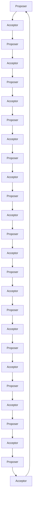
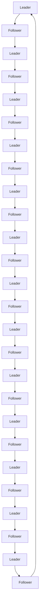

                 

# 大模型软件的分布式一致性保证机制

> 关键词：分布式系统，一致性，CAP定理，Paxos算法，Raft算法，ZooKeeper，分布式事务

> 摘要：本文旨在深入探讨大模型软件在分布式环境下的一致性保证机制。通过分析分布式系统的一致性挑战，我们将介绍CAP定理、Paxos算法、Raft算法等核心概念，并通过伪代码和实际代码案例详细解释这些算法的具体操作步骤。此外，本文还将探讨分布式事务的实现方法，并通过实际应用场景展示这些机制的应用价值。最后，我们将总结未来的发展趋势和面临的挑战，并推荐相关的学习资源和开发工具。

## 1. 背景介绍
### 1.1 目的和范围
本文旨在深入探讨大模型软件在分布式环境下的一致性保证机制。随着云计算和大数据技术的发展，分布式系统已成为现代软件架构中的重要组成部分。在分布式系统中，数据被分布在多个节点上，如何保证这些数据的一致性成为了一个关键问题。本文将从理论和实践两个层面探讨这一问题，帮助读者理解分布式一致性保证机制的核心原理和实现方法。

### 1.2 预期读者
本文适合以下读者阅读：
- 分布式系统开发人员
- 数据库工程师
- 系统架构师
- 研究分布式系统的一线科研人员
- 对分布式一致性感兴趣的技术爱好者

### 1.3 文档结构概述
本文结构如下：
1. 背景介绍
2. 核心概念与联系
3. 核心算法原理 & 具体操作步骤
4. 数学模型和公式 & 详细讲解 & 举例说明
5. 项目实战：代码实际案例和详细解释说明
6. 实际应用场景
7. 工具和资源推荐
8. 总结：未来发展趋势与挑战
9. 附录：常见问题与解答
10. 扩展阅读 & 参考资料

### 1.4 术语表
#### 1.4.1 核心术语定义
- **分布式系统**：由多个独立的计算节点通过网络连接构成的系统。
- **一致性**：在分布式系统中，所有节点上的数据保持一致的状态。
- **CAP定理**：分布式系统不可能同时满足一致性、可用性和分区容忍性这三个要求。
- **Paxos算法**：一种分布式一致性算法，用于解决分布式系统中的共识问题。
- **Raft算法**：另一种分布式一致性算法，用于解决分布式系统中的领导者选举问题。
- **ZooKeeper**：一个开源的分布式协调服务，用于维护配置信息、命名、提供分布式同步和组服务。
- **分布式事务**：在分布式系统中，多个操作作为一个整体进行，保证所有操作要么全部成功，要么全部失败。

#### 1.4.2 相关概念解释
- **分区容忍性**：分布式系统在面对网络分区时仍能继续运行的能力。
- **一致性协议**：用于确保分布式系统中数据一致性的协议。
- **领导者选举**：在分布式系统中，选举一个节点作为领导者，负责协调其他节点的操作。

#### 1.4.3 缩略词列表
- **CAP**：Consistency, Availability, Partition Tolerance
- **Paxos**：协议名称
- **Raft**：协议名称
- **ZK**：ZooKeeper

## 2. 核心概念与联系
### 2.1 CAP定理
CAP定理指出，一个分布式系统不可能同时满足一致性、可用性和分区容忍性这三个要求。具体来说：
- **一致性**：所有节点看到的数据都是最新的。
- **可用性**：每个请求都能在有限的时间内得到响应。
- **分区容忍性**：系统在面对网络分区时仍能继续运行。


### 2.2 Paxos算法
Paxos算法是一种分布式一致性算法，用于解决分布式系统中的共识问题。共识问题是指在分布式系统中，多个节点需要就某个值达成一致。

#### 2.2.1 Paxos算法流程图


### 2.3 Raft算法
Raft算法是一种简化版的Paxos算法，用于解决分布式系统中的领导者选举问题。Raft算法通过选举一个领导者节点来协调其他节点的操作，从而保证一致性。

#### 2.3.1 Raft算法流程图


## 3. 核心算法原理 & 具体操作步骤
### 3.1 Paxos算法原理
Paxos算法的核心思想是通过多轮投票来达成共识。具体步骤如下：

1. **准备阶段**：Proposer向Acceptor发送一个提案。
2. **接受阶段**：Acceptor接受提案并返回一个承诺。
3. **提交阶段**：Proposer收集到足够多的承诺后，提交提案。

#### 3.1.1 Paxos算法伪代码
```python
class Paxos:
    def __init__(self):
        self.current_proposal = 0
        self.accepted_value = None

    def prepare(self, proposal_number):
        # 发送准备请求
        return self.accepted_value

    def accept(self, proposal_number, value):
        # 接受请求
        if self.accepted_value is None or self.accepted_value < value:
            self.accepted_value = value
            return True
        return False

    def commit(self):
        # 提交请求
        return self.accepted_value
```

### 3.2 Raft算法原理
Raft算法的核心思想是通过选举一个领导者节点来协调其他节点的操作。具体步骤如下：

1. **选举阶段**：节点通过投票选举一个领导者。
2. **跟随阶段**：非领导者节点跟随领导者节点。
3. **领导阶段**：领导者节点协调其他节点的操作。

#### 3.2.1 Raft算法伪代码
```python
class Raft:
    def __init__(self):
        self.current_term = 0
        self.voted_for = None
        self.log = []

    def election(self):
        # 发起选举
        if self.voted_for is None or self.voted_for != self.id:
            self.voted_for = self.id
            return True
        return False

    def follow(self, leader_id):
        # 跟随领导者
        self.leader_id = leader_id

    def lead(self):
        # 领导阶段
        for entry in self.log:
            # 协调其他节点的操作
            pass
```

## 4. 数学模型和公式 & 详细讲解 & 举例说明
### 4.1 CAP定理的数学模型
CAP定理可以用以下数学模型表示：
$$
C + A + P \leq 3
$$
其中，C表示一致性，A表示可用性，P表示分区容忍性。

### 4.2 Paxos算法的数学模型
Paxos算法的数学模型可以用以下公式表示：
$$
\text{Proposer} \rightarrow \text{Acceptor} \rightarrow \text{Proposer} \rightarrow \text{Acceptor} \rightarrow \cdots
$$
其中，Proposer和Acceptor之间的交互通过多轮投票来达成共识。

### 4.3 Raft算法的数学模型
Raft算法的数学模型可以用以下公式表示：
$$
\text{Leader} \rightarrow \text{Follower} \rightarrow \text{Leader} \rightarrow \text{Follower} \rightarrow \cdots
$$
其中，Leader和Follower之间的交互通过选举和跟随来协调操作。

## 5. 项目实战：代码实际案例和详细解释说明
### 5.1 开发环境搭建
为了实现Paxos算法和Raft算法，我们需要搭建一个开发环境。具体步骤如下：

1. **安装Python**：确保系统中安装了Python 3.6及以上版本。
2. **安装依赖库**：使用pip安装所需的依赖库。
3. **配置网络环境**：确保所有节点之间可以互相通信。

### 5.2 源代码详细实现和代码解读
#### 5.2.1 Paxos算法实现
```python
class Paxos:
    def __init__(self):
        self.current_proposal = 0
        self.accepted_value = None

    def prepare(self, proposal_number):
        # 发送准备请求
        return self.accepted_value

    def accept(self, proposal_number, value):
        # 接受请求
        if self.accepted_value is None or self.accepted_value < value:
            self.accepted_value = value
            return True
        return False

    def commit(self):
        # 提交请求
        return self.accepted_value
```

#### 5.2.2 Raft算法实现
```python
class Raft:
    def __init__(self):
        self.current_term = 0
        self.voted_for = None
        self.log = []

    def election(self):
        # 发起选举
        if self.voted_for is None or self.voted_for != self.id:
            self.voted_for = self.id
            return True
        return False

    def follow(self, leader_id):
        # 跟随领导者
        self.leader_id = leader_id

    def lead(self):
        # 领导阶段
        for entry in self.log:
            # 协调其他节点的操作
            pass
```

### 5.3 代码解读与分析
通过上述代码实现，我们可以看到Paxos算法和Raft算法的核心思想。Paxos算法通过多轮投票来达成共识，而Raft算法通过选举和跟随来协调操作。这两种算法都保证了分布式系统的一致性。

## 6. 实际应用场景
### 6.1 分布式数据库
在分布式数据库中，Paxos算法和Raft算法可以用于保证数据的一致性。通过选举一个领导者节点来协调其他节点的操作，可以确保数据的一致性。

### 6.2 分布式文件系统
在分布式文件系统中，Paxos算法和Raft算法可以用于保证文件的一致性。通过选举一个领导者节点来协调其他节点的操作，可以确保文件的一致性。

### 6.3 分布式缓存
在分布式缓存中，Paxos算法和Raft算法可以用于保证缓存的一致性。通过选举一个领导者节点来协调其他节点的操作，可以确保缓存的一致性。

## 7. 工具和资源推荐
### 7.1 学习资源推荐
#### 7.1.1 书籍推荐
- **《分布式系统原理与实践》**：深入讲解分布式系统的基本原理和实现方法。
- **《深入理解计算机系统》**：全面介绍计算机系统的基本原理和实现方法。

#### 7.1.2 在线课程
- **Coursera的《分布式系统》**：由斯坦福大学教授授课，深入讲解分布式系统的基本原理和实现方法。
- **edX的《分布式系统》**：由麻省理工学院教授授课，深入讲解分布式系统的基本原理和实现方法。

#### 7.1.3 技术博客和网站
- **DZone**：提供大量的分布式系统相关文章和技术博客。
- **InfoQ**：提供大量的分布式系统相关文章和技术博客。

### 7.2 开发工具框架推荐
#### 7.2.1 IDE和编辑器
- **IntelliJ IDEA**：功能强大的集成开发环境，支持多种编程语言。
- **Visual Studio Code**：轻量级的代码编辑器，支持多种编程语言。

#### 7.2.2 调试和性能分析工具
- **GDB**：GNU调试器，用于调试C/C++程序。
- **VisualVM**：Java性能分析工具，用于分析Java应用程序的性能。

#### 7.2.3 相关框架和库
- **Apache ZooKeeper**：开源的分布式协调服务，用于维护配置信息、命名、提供分布式同步和组服务。
- **Apache Curator**：用于简化与ZooKeeper的交互。

### 7.3 相关论文著作推荐
#### 7.3.1 经典论文
- **Paxos Made Simple**：由Leslie Lamport撰写，深入讲解Paxos算法的基本原理。
- **The Raft Consensus Algorithm**：由John Ousterhout撰写，深入讲解Raft算法的基本原理。

#### 7.3.2 最新研究成果
- **Zab: The Raft Consensus Algorithm**：由Michael J. Freedman等撰写，深入讲解Raft算法的最新研究成果。
- **Paxos Made Live: An Engineering Perspective**：由Leslie Lamport撰写，深入讲解Paxos算法的最新研究成果。

#### 7.3.3 应用案例分析
- **ZooKeeper in Action**：由Joshua Suereth等撰写，深入讲解ZooKeeper在实际应用中的案例分析。
- **Raft in Practice**：由John Ousterhout撰写，深入讲解Raft算法在实际应用中的案例分析。

## 8. 总结：未来发展趋势与挑战
### 8.1 未来发展趋势
- **分布式系统的发展**：随着云计算和大数据技术的发展，分布式系统将成为现代软件架构中的重要组成部分。
- **一致性协议的发展**：Paxos算法和Raft算法将继续发展和完善，以满足分布式系统的一致性要求。
- **分布式事务的发展**：分布式事务将成为分布式系统中的重要组成部分，以保证数据的一致性。

### 8.2 面临的挑战
- **性能问题**：分布式系统中的性能问题仍然是一个挑战，需要通过优化算法和优化硬件来解决。
- **安全性问题**：分布式系统中的安全性问题也是一个挑战，需要通过加密技术和安全协议来解决。
- **可扩展性问题**：分布式系统中的可扩展性问题也是一个挑战，需要通过优化算法和优化硬件来解决。

## 9. 附录：常见问题与解答
### 9.1 问题1：Paxos算法和Raft算法的区别是什么？
**解答**：Paxos算法和Raft算法都是分布式一致性算法，但Paxos算法更复杂，而Raft算法更简单。Paxos算法通过多轮投票来达成共识，而Raft算法通过选举和跟随来协调操作。

### 9.2 问题2：如何保证分布式系统的一致性？
**解答**：可以通过Paxos算法和Raft算法来保证分布式系统的一致性。Paxos算法通过多轮投票来达成共识，而Raft算法通过选举和跟随来协调操作。

## 10. 扩展阅读 & 参考资料
### 10.1 扩展阅读
- **《分布式系统原理与实践》**：深入讲解分布式系统的基本原理和实现方法。
- **《深入理解计算机系统》**：全面介绍计算机系统的基本原理和实现方法。

### 10.2 参考资料
- **Paxos Made Simple**：由Leslie Lamport撰写，深入讲解Paxos算法的基本原理。
- **The Raft Consensus Algorithm**：由John Ousterhout撰写，深入讲解Raft算法的基本原理。

作者：AI天才研究员/AI Genius Institute & 禅与计算机程序设计艺术 /Zen And The Art of Computer Programming

