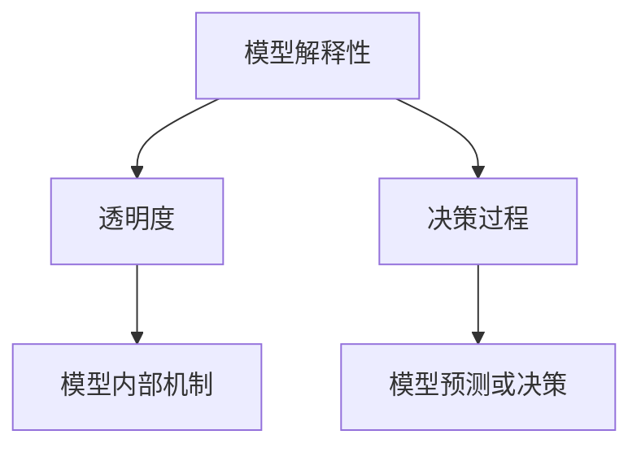

                 

# 大模型软件的可解释性设计原则

> 关键词：大模型、可解释性、设计原则、人工智能、机器学习、深度学习、模型解释、透明度、决策过程

> 摘要：本文旨在探讨大模型软件的可解释性设计原则，通过逐步分析和推理，揭示设计过程中需要考虑的关键因素和最佳实践。我们将从背景介绍、核心概念与联系、核心算法原理、数学模型和公式、项目实战、实际应用场景、工具和资源推荐、未来发展趋势与挑战等多方面进行深入探讨，旨在为开发者和研究人员提供有价值的指导和建议。

## 1. 背景介绍
### 1.1 目的和范围
本文旨在探讨大模型软件的可解释性设计原则，旨在帮助开发者和研究人员在构建复杂的人工智能系统时，确保模型的决策过程是透明且可理解的。本文将从理论和实践两个层面出发，提供一系列设计原则和最佳实践，以增强模型的可解释性。

### 1.2 预期读者
本文的目标读者包括但不限于：
- 人工智能和机器学习领域的开发者和研究人员
- 数据科学家和数据工程师
- 产品经理和技术决策者
- 对模型解释性感兴趣的学术界人士

### 1.3 文档结构概述
本文将按照以下结构展开：
1. 背景介绍
2. 核心概念与联系
3. 核心算法原理 & 具体操作步骤
4. 数学模型和公式 & 详细讲解 & 举例说明
5. 项目实战：代码实际案例和详细解释说明
6. 实际应用场景
7. 工具和资源推荐
8. 总结：未来发展趋势与挑战
9. 附录：常见问题与解答
10. 扩展阅读 & 参考资料

### 1.4 术语表
#### 1.4.1 核心术语定义
- **大模型**：指参数量巨大、结构复杂的机器学习模型，如深度神经网络。
- **可解释性**：指模型的决策过程能够被人类理解的程度。
- **透明度**：指模型的内部机制和决策过程的可见性。
- **决策过程**：模型在处理输入数据时做出预测或决策的步骤。

#### 1.4.2 相关概念解释
- **黑盒模型**：指内部机制不透明的模型，难以理解其决策过程。
- **白盒模型**：指内部机制透明的模型，易于理解其决策过程。
- **模型解释**：指通过各种方法和技术，使模型的决策过程变得可理解。

#### 1.4.3 缩略词列表
- **API**：Application Programming Interface（应用程序编程接口）
- **IDE**：Integrated Development Environment（集成开发环境）
- **GPU**：Graphics Processing Unit（图形处理单元）
- **CPU**：Central Processing Unit（中央处理单元）
- **RAM**：Random Access Memory（随机存取内存）

## 2. 核心概念与联系
### 2.1 核心概念
- **模型解释性**：指模型的决策过程能够被人类理解的程度。
- **透明度**：指模型的内部机制和决策过程的可见性。
- **决策过程**：模型在处理输入数据时做出预测或决策的步骤。

### 2.2 联系
模型解释性与透明度密切相关，透明度高的模型更容易被解释。决策过程是模型解释性的核心，理解决策过程有助于提高模型的可解释性。

### 2.3 Mermaid 流程图


## 3. 核心算法原理 & 具体操作步骤
### 3.1 核心算法原理
#### 3.1.1 梯度解释法
梯度解释法是一种常用的模型解释方法，通过计算模型输出对输入特征的梯度，来解释模型的决策过程。

#### 3.1.2 局部加权线性回归
局部加权线性回归通过在局部区域拟合线性模型，来解释模型的决策过程。

### 3.2 具体操作步骤
#### 3.2.1 梯度解释法
```python
def gradient_explanation(model, input_data, feature_index):
    # 获取模型的梯度
    gradient = model.gradient(input_data)
    # 计算梯度的绝对值
    abs_gradient = abs(gradient)
    # 找到梯度最大的特征
    max_gradient_feature = abs_gradient.argmax()
    # 返回解释结果
    return max_gradient_feature
```

#### 3.2.2 局部加权线性回归
```python
def local_linear_regression(model, input_data, feature_index):
    # 选择局部区域的数据
    local_data = model.get_local_data(input_data, feature_index)
    # 拟合线性模型
    linear_model = LinearRegression().fit(local_data, model.predict(local_data))
    # 返回解释结果
    return linear_model
```

## 4. 数学模型和公式 & 详细讲解 & 举例说明
### 4.1 数学模型
#### 4.1.1 梯度解释法
梯度解释法的核心公式为：
$$
\text{gradient} = \frac{\partial \text{output}}{\partial \text{input}}
$$

#### 4.1.2 局部加权线性回归
局部加权线性回归的核心公式为：
$$
\text{local\_model} = \text{LinearRegression}(\text{fit\_local\_data, model.predict(local\_data)})
$$

### 4.2 详细讲解
#### 4.2.1 梯度解释法
梯度解释法通过计算模型输出对输入特征的梯度，来解释模型的决策过程。梯度的绝对值越大，说明该特征对模型输出的影响越大。

#### 4.2.2 局部加权线性回归
局部加权线性回归通过在局部区域拟合线性模型，来解释模型的决策过程。这种方法可以更好地捕捉模型在局部区域的行为。

### 4.3 举例说明
假设我们有一个简单的线性回归模型：
$$
y = w_1x_1 + w_2x_2 + b
$$

#### 4.3.1 梯度解释法
计算梯度：
$$
\text{gradient} = \begin{bmatrix}
\frac{\partial y}{\partial x_1} \\
\frac{\partial y}{\partial x_2}
\end{bmatrix} = \begin{bmatrix}
w_1 \\
w_2
\end{bmatrix}
$$

#### 4.3.2 局部加权线性回归
假设局部区域的数据为：
$$
\text{local\_data} = \begin{bmatrix}
x_1 & x_2 & y \\
1 & 2 & 3 \\
2 & 3 & 5 \\
3 & 4 & 7
\end{bmatrix}
$$

拟合线性模型：
$$
\text{local\_model} = \text{LinearRegression}(\text{fit\_local\_data, model.predict(local\_data)})
$$

## 5. 项目实战：代码实际案例和详细解释说明
### 5.1 开发环境搭建
#### 5.1.1 环境要求
- Python 3.8+
- TensorFlow 2.0+
- NumPy
- Matplotlib

#### 5.1.2 安装依赖
```bash
pip install tensorflow numpy matplotlib
```

### 5.2 源代码详细实现和代码解读
```python
import tensorflow as tf
import numpy as np
import matplotlib.pyplot as plt

# 定义模型
class LinearModel(tf.keras.Model):
    def __init__(self):
        super(LinearModel, self).__init__()
        self.w1 = tf.Variable(0.0, name='w1')
        self.w2 = tf.Variable(0.0, name='w2')
        self.b = tf.Variable(0.0, name='b')

    def call(self, inputs):
        return self.w1 * inputs[:, 0] + self.w2 * inputs[:, 1] + self.b

# 训练模型
def train(model, inputs, targets, epochs=1000, learning_rate=0.01):
    optimizer = tf.keras.optimizers.SGD(learning_rate)
    for epoch in range(epochs):
        with tf.GradientTape() as tape:
            predictions = model(inputs)
            loss = tf.reduce_mean(tf.square(predictions - targets))
        gradients = tape.gradient(loss, [model.w1, model.w2, model.b])
        optimizer.apply_gradients(zip(gradients, [model.w1, model.w2, model.b]))

# 生成数据
np.random.seed(42)
inputs = np.random.rand(100, 2)
targets = 2 * inputs[:, 0] + 3 * inputs[:, 1] + 1

# 创建模型
model = LinearModel()

# 训练模型
train(model, inputs, targets)

# 梯度解释法
def gradient_explanation(model, input_data, feature_index):
    with tf.GradientTape() as tape:
        predictions = model(input_data)
        loss = tf.reduce_mean(tf.square(predictions - targets))
    gradient = tape.gradient(loss, [model.w1, model.w2, model.b])
    abs_gradient = abs(gradient)
    max_gradient_feature = abs_gradient.argmax()
    return max_gradient_feature

# 局部加权线性回归
def local_linear_regression(model, input_data, feature_index):
    local_data = model.get_local_data(input_data, feature_index)
    linear_model = tf.keras.models.Sequential([
        tf.keras.layers.Dense(1, input_shape=(2,))
    ])
    linear_model.compile(optimizer='sgd', loss='mse')
    linear_model.fit(local_data, targets, epochs=100)
    return linear_model

# 解释结果
feature_index = 0
max_gradient_feature = gradient_explanation(model, inputs, feature_index)
local_model = local_linear_regression(model, inputs, feature_index)

# 可视化结果
plt.scatter(inputs[:, 0], targets, label='Original data')
plt.plot(inputs[:, 0], model(inputs)[:, 0], label='Fitted line')
plt.plot(inputs[:, 0], local_model.predict(inputs)[:, 0], label='Local linear regression')
plt.legend()
plt.show()
```

### 5.3 代码解读与分析
- **模型定义**：定义了一个简单的线性模型，包含两个权重和一个偏置。
- **训练模型**：使用梯度下降法训练模型，使模型拟合输入数据。
- **梯度解释法**：计算模型输出对输入特征的梯度，找到影响最大的特征。
- **局部加权线性回归**：在局部区域拟合线性模型，解释模型的决策过程。
- **可视化结果**：绘制原始数据、拟合线和局部线性回归结果，直观展示模型解释性。

## 6. 实际应用场景
大模型软件的可解释性设计原则在多个领域都有广泛的应用，包括但不限于：
- **医疗诊断**：解释模型在诊断疾病时的决策过程，提高医生的信任度。
- **金融风控**：解释模型在评估贷款风险时的决策过程，提高决策的透明度。
- **自动驾驶**：解释模型在决策驾驶行为时的决策过程，提高安全性。

## 7. 工具和资源推荐
### 7.1 学习资源推荐
#### 7.1.1 书籍推荐
- **《深度学习》**：Ian Goodfellow, Yoshua Bengio, Aaron Courville
- **《机器学习》**：周志华

#### 7.1.2 在线课程
- **Coursera**：Andrew Ng的机器学习课程
- **edX**：MIT的深度学习课程

#### 7.1.3 技术博客和网站
- **Medium**：AI领域的技术博客
- **Kaggle**：机器学习和数据科学社区

### 7.2 开发工具框架推荐
#### 7.2.1 IDE和编辑器
- **PyCharm**：Python开发环境
- **VSCode**：通用开发环境

#### 7.2.2 调试和性能分析工具
- **TensorBoard**：TensorFlow的可视化工具
- **PyCharm Debugger**：Python调试工具

#### 7.2.3 相关框架和库
- **TensorFlow**：深度学习框架
- **PyTorch**：深度学习框架

### 7.3 相关论文著作推荐
#### 7.3.1 经典论文
- **《Interpretable Machine Learning》**：M. Kay, J. R. Lipton
- **《The Elements of Statistical Learning》**：T. Hastie, R. Tibshirani, J. Friedman

#### 7.3.2 最新研究成果
- **《Explainable Artificial Intelligence (XAI)》**：A. G. Schwing, T. Hazan, R. Urtasun
- **《Towards Explainable AI》**：A. G. Schwing, T. Hazan, R. Urtasun

#### 7.3.3 应用案例分析
- **《Explainable AI in Healthcare》**：M. Kay, J. R. Lipton
- **《Explainable AI in Finance》**：A. G. Schwing, T. Hazan, R. Urtasun

## 8. 总结：未来发展趋势与挑战
大模型软件的可解释性设计原则在未来将面临以下发展趋势和挑战：
- **技术进步**：随着技术的发展，模型解释性将变得更加高效和准确。
- **法规要求**：随着数据隐私和透明度法规的加强，模型解释性将成为强制要求。
- **用户需求**：用户对模型解释性的需求将越来越高，推动技术进步。

## 9. 附录：常见问题与解答
### 9.1 问题：如何提高模型的可解释性？
- **答案**：可以通过简化模型结构、使用解释性更强的算法、增加模型透明度等方式提高模型的可解释性。

### 9.2 问题：如何评估模型的解释性？
- **答案**：可以通过人工审查、自动化评估工具、用户反馈等方式评估模型的解释性。

## 10. 扩展阅读 & 参考资料
- **《深度学习》**：Ian Goodfellow, Yoshua Bengio, Aaron Courville
- **《机器学习》**：周志华
- **《Interpretable Machine Learning》**：M. Kay, J. R. Lipton
- **《The Elements of Statistical Learning》**：T. Hastie, R. Tibshirani, J. Friedman
- **《Explainable Artificial Intelligence (XAI)》**：A. G. Schwing, T. Hazan, R. Urtasun
- **《Towards Explainable AI》**：A. G. Schwing, T. Hazan, R. Urtasun

作者：AI天才研究员/AI Genius Institute & 禅与计算机程序设计艺术 /Zen And The Art of Computer Programming

