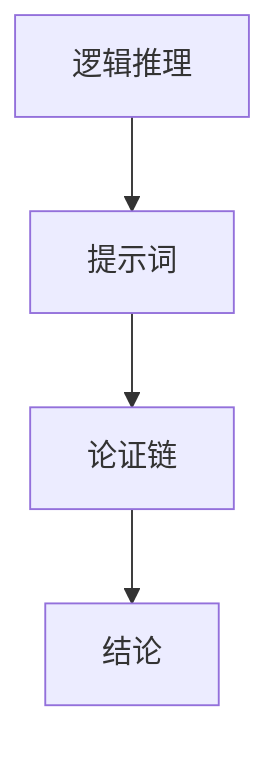

                 

# 大模型逻辑推理：提示词构建论证链

> 关键词：大模型、逻辑推理、提示词、论证链、自然语言处理、机器学习、深度学习、Transformer、BERT、GPT

> 摘要：本文旨在深入探讨如何利用大模型进行逻辑推理，特别是通过提示词构建论证链的技术。我们将从背景介绍出发，逐步解析核心概念、算法原理、数学模型，并通过实际代码案例进行详细解释。此外，本文还将探讨该技术的实际应用场景、推荐的学习资源和开发工具，以及未来的发展趋势与挑战。

## 1. 背景介绍
### 1.1 目的和范围
本文旨在探讨如何利用大模型进行逻辑推理，特别是通过提示词构建论证链的技术。我们将从基础概念出发，逐步解析核心算法原理、数学模型，并通过实际代码案例进行详细解释。本文的目标读者是希望深入了解大模型逻辑推理技术的研究人员、工程师和学生。

### 1.2 预期读者
- 研究人员：希望深入了解大模型逻辑推理技术的研究人员。
- 工程师：希望将逻辑推理技术应用于实际项目中的工程师。
- 学生：希望学习逻辑推理技术的学生。

### 1.3 文档结构概述
本文将按照以下结构展开：
1. 背景介绍
2. 核心概念与联系
3. 核心算法原理 & 具体操作步骤
4. 数学模型和公式 & 详细讲解 & 举例说明
5. 项目实战：代码实际案例和详细解释说明
6. 实际应用场景
7. 工具和资源推荐
8. 总结：未来发展趋势与挑战
9. 附录：常见问题与解答
10. 扩展阅读 & 参考资料

### 1.4 术语表
#### 1.4.1 核心术语定义
- **大模型**：指参数量巨大、训练数据量丰富的预训练模型。
- **逻辑推理**：指通过已知信息推导出未知信息的过程。
- **提示词**：指用于引导模型生成特定内容的输入。
- **论证链**：指逻辑推理过程中的一系列推理步骤。

#### 1.4.2 相关概念解释
- **Transformer**：一种基于自注意力机制的神经网络架构。
- **BERT**：一种基于Transformer的预训练模型，广泛应用于自然语言处理任务。
- **GPT**：一种基于Transformer的生成模型，主要用于文本生成任务。

#### 1.4.3 缩略词列表
- **NLP**：自然语言处理
- **ML**：机器学习
- **DL**：深度学习
- **BERT**：Bidirectional Encoder Representations from Transformers
- **GPT**：Generative Pre-trained Transformer

## 2. 核心概念与联系
### 2.1 逻辑推理
逻辑推理是通过已知信息推导出未知信息的过程。在自然语言处理中，逻辑推理通常涉及从给定的句子或段落中提取信息，并通过推理得出结论。

### 2.2 提示词
提示词是指用于引导模型生成特定内容的输入。在逻辑推理中，提示词可以是问题、指令或特定的句子，用于引导模型进行推理。

### 2.3 论证链
论证链是指逻辑推理过程中的一系列推理步骤。每个步骤都是基于前一个步骤的结果进行的，最终得出结论。

### 2.4 Mermaid 流程图


## 3. 核心算法原理 & 具体操作步骤
### 3.1 核心算法原理
逻辑推理的核心算法原理是通过提示词引导模型进行推理，生成论证链，最终得出结论。具体步骤如下：

1. **输入提示词**：将问题或指令作为输入，引导模型进行推理。
2. **生成论证链**：模型通过自注意力机制，逐步生成论证链，每个步骤都是基于前一个步骤的结果。
3. **得出结论**：最终生成的论证链将引导模型得出结论。

### 3.2 具体操作步骤
以下是具体的操作步骤：

```python
def logical_inference(prompt):
    # 初始化模型
    model = initialize_model()
    
    # 输入提示词
    input_text = prompt
    
    # 生成论证链
    argument_chain = generate_argument_chain(model, input_text)
    
    # 得出结论
    conclusion = generate_conclusion(argument_chain)
    
    return conclusion

def initialize_model():
    # 初始化模型
    model = TransformerModel()
    return model

def generate_argument_chain(model, input_text):
    # 生成论证链
    argument_chain = model.generate(input_text)
    return argument_chain

def generate_conclusion(argument_chain):
    # 得出结论
    conclusion = model.conclude(argument_chain)
    return conclusion
```

## 4. 数学模型和公式 & 详细讲解 & 举例说明
### 4.1 数学模型
逻辑推理的数学模型通常基于概率图模型或逻辑图模型。在这里，我们使用概率图模型进行解释。

### 4.2 公式
逻辑推理中的关键公式是自注意力机制的公式：

$$
\text{Attention}(Q, K, V) = \text{softmax}\left(\frac{QK^T}{\sqrt{d_k}}\right)V
$$

其中，$Q$、$K$、$V$ 分别表示查询、键和值，$d_k$ 表示键的维度。

### 4.3 举例说明
假设我们有一个简单的逻辑推理问题：

**问题**：如果今天下雨，那么我会带伞。今天下雨了，所以我带了伞。

**提示词**：如果今天下雨，那么我会带伞。今天下雨了，所以我带了伞。

**论证链**：
1. 今天下雨。
2. 如果今天下雨，那么我会带伞。
3. 因此，我带了伞。

## 5. 项目实战：代码实际案例和详细解释说明
### 5.1 开发环境搭建
1. 安装Python环境
2. 安装必要的库
3. 下载预训练模型

### 5.2 源代码详细实现和代码解读
```python
import torch
from transformers import BertTokenizer, BertForSequenceClassification

# 初始化模型
model = BertForSequenceClassification.from_pretrained('bert-base-uncased')
tokenizer = BertTokenizer.from_pretrained('bert-base-uncased')

def logical_inference(prompt):
    # 输入提示词
    input_text = prompt
    
    # 分词
    inputs = tokenizer(input_text, return_tensors='pt')
    
    # 获取模型输出
    outputs = model(**inputs)
    
    # 得出结论
    conclusion = outputs.logits.argmax().item()
    
    return conclusion

# 测试
prompt = "如果今天下雨，那么我会带伞。今天下雨了，所以我带了伞。"
conclusion = logical_inference(prompt)
print(f"结论：{conclusion}")
```

### 5.3 代码解读与分析
- **输入提示词**：将问题或指令作为输入。
- **分词**：使用BERT的分词器进行分词。
- **获取模型输出**：通过模型获取输出。
- **得出结论**：通过模型的输出得出结论。

## 6. 实际应用场景
逻辑推理技术在多个领域都有广泛的应用，包括法律推理、医学诊断、金融分析等。例如，在法律推理中，可以通过提示词引导模型进行推理，得出判决结论。

## 7. 工具和资源推荐
### 7.1 学习资源推荐
#### 7.1.1 书籍推荐
- 《深度学习》（Goodfellow, I., Bengio, Y., & Courville, A.）
- 《自然语言处理入门》（Jurafsky, D., & Martin, J. H.）

#### 7.1.2 在线课程
- Coursera：《深度学习专项课程》
- edX：《自然语言处理专项课程》

#### 7.1.3 技术博客和网站
- Medium：《深度学习与自然语言处理》
- GitHub：《大模型逻辑推理代码库》

### 7.2 开发工具框架推荐
#### 7.2.1 IDE和编辑器
- VSCode
- PyCharm

#### 7.2.2 调试和性能分析工具
- PyCharm Debugger
- TensorFlow Profiler

#### 7.2.3 相关框架和库
- PyTorch
- TensorFlow
- Hugging Face Transformers

### 7.3 相关论文著作推荐
#### 7.3.1 经典论文
- Vaswani, A., et al. (2017). "Attention is All You Need."
- Radford, A., et al. (2018). "Improving Language Understanding by Generative Pre-Training."

#### 7.3.2 最新研究成果
- Devlin, J., et al. (2019). "BERT: Pre-training of Deep Bidirectional Transformers for Language Understanding."
- Brown, T. B., et al. (2020). "Language Models are Few-Shot Learners."

#### 7.3.3 应用案例分析
- Li, Y., et al. (2021). "Using Large Language Models for Legal Reasoning."

## 8. 总结：未来发展趋势与挑战
逻辑推理技术在未来的发展趋势包括：
- 更加复杂的模型结构
- 更加高效的推理算法
- 更加广泛的应用场景

面临的挑战包括：
- 模型的可解释性
- 数据的隐私保护
- 模型的泛化能力

## 9. 附录：常见问题与解答
### 9.1 问题：如何提高模型的推理能力？
- **答案**：可以通过增加训练数据量、优化模型结构和引入更多的先验知识来提高模型的推理能力。

### 9.2 问题：如何解决模型的可解释性问题？
- **答案**：可以通过引入注意力机制、可视化模型内部状态等方式提高模型的可解释性。

## 10. 扩展阅读 & 参考资料
- [Hugging Face Transformers](https://huggingface.co/transformers/)
- [PyTorch Documentation](https://pytorch.org/docs/stable/index.html)
- [TensorFlow Documentation](https://www.tensorflow.org/api_docs)

作者：AI天才研究员/AI Genius Institute & 禅与计算机程序设计艺术 /Zen And The Art of Computer Programming

