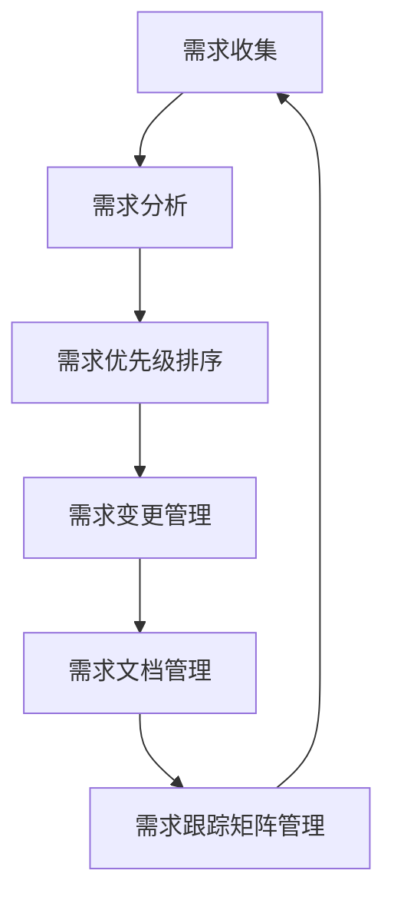

                 

# 大模型驱动的需求追踪自动化技术

> 关键词：大模型、需求追踪、自动化、机器学习、自然语言处理、软件开发、需求管理、软件工程

> 摘要：本文旨在探讨如何利用大模型驱动的需求追踪自动化技术，通过机器学习和自然语言处理技术，实现需求管理的自动化。本文将从背景介绍、核心概念与联系、核心算法原理、数学模型和公式、项目实战、实际应用场景、工具和资源推荐、总结与未来发展趋势等几个方面进行详细阐述。

## 1. 背景介绍
### 1.1 目的和范围
本文旨在介绍如何利用大模型驱动的需求追踪自动化技术，通过机器学习和自然语言处理技术，实现需求管理的自动化。本文将详细探讨需求追踪自动化技术的核心概念、算法原理、数学模型、项目实战案例，以及实际应用场景。本文的目标读者是软件开发工程师、项目经理、需求分析师以及对需求管理自动化感兴趣的读者。

### 1.2 预期读者
- 软件开发工程师
- 项目经理
- 需求分析师
- 对需求管理自动化感兴趣的读者

### 1.3 文档结构概述
本文将按照以下结构进行详细阐述：
1. 背景介绍
2. 核心概念与联系
3. 核心算法原理 & 具体操作步骤
4. 数学模型和公式 & 详细讲解 & 举例说明
5. 项目实战：代码实际案例和详细解释说明
6. 实际应用场景
7. 工具和资源推荐
8. 总结：未来发展趋势与挑战
9. 附录：常见问题与解答
10. 扩展阅读 & 参考资料

### 1.4 术语表
#### 1.4.1 核心术语定义
- **需求追踪**：需求追踪是指在整个软件开发生命周期中，确保需求文档与开发过程中的各种文档（如设计文档、测试文档、代码等）之间的一致性和关联性。
- **大模型**：指具有大规模参数和复杂结构的机器学习模型，通常用于处理大规模数据集和复杂任务。
- **需求管理**：需求管理是指在整个软件开发生命周期中，对需求进行收集、分析、优先级排序、变更控制和跟踪的过程。
- **自然语言处理（NLP）**：自然语言处理是指计算机对自然语言文本进行处理和理解的技术。
- **机器学习（ML）**：机器学习是一种人工智能技术，通过算法和统计模型使计算机系统能够从数据中学习并改进性能。

#### 1.4.2 相关概念解释
- **需求文档**：需求文档是描述软件系统功能和行为的文档，通常包括需求规格说明书、用户故事、需求跟踪矩阵等。
- **需求变更**：需求变更是指在软件开发生命周期中，对需求进行修改或调整的过程。
- **需求跟踪矩阵**：需求跟踪矩阵是一种工具，用于记录需求文档与开发过程中的各种文档之间的关联性。

#### 1.4.3 缩略词列表
- **NLP**：自然语言处理
- **ML**：机器学习
- **API**：应用程序编程接口
- **IDE**：集成开发环境
- **UI**：用户界面
- **SaaS**：软件即服务

## 2. 核心概念与联系
### 2.1 需求追踪自动化技术的核心概念
需求追踪自动化技术的核心概念包括需求管理、需求变更管理、需求文档管理、需求跟踪矩阵管理等。这些概念相互关联，共同构成了需求追踪自动化技术的基础。

### 2.2 需求追踪自动化技术的联系
需求追踪自动化技术通过机器学习和自然语言处理技术，实现需求管理的自动化。具体来说，需求追踪自动化技术可以分为以下几个步骤：
1. **需求收集**：通过自然语言处理技术，从各种来源（如用户反馈、市场调研、竞品分析等）收集需求。
2. **需求分析**：通过机器学习技术，对收集到的需求进行分析，提取关键信息。
3. **需求优先级排序**：通过机器学习技术，对需求进行优先级排序，帮助项目经理确定开发顺序。
4. **需求变更管理**：通过机器学习技术，自动检测需求变更，并更新需求跟踪矩阵。
5. **需求文档管理**：通过机器学习技术，自动更新需求文档，确保文档的一致性和完整性。
6. **需求跟踪矩阵管理**：通过机器学习技术，自动更新需求跟踪矩阵，确保需求与开发过程中的各种文档之间的一致性和关联性。

### 2.3 核心概念原理与架构的 Mermaid 流程图


## 3. 核心算法原理 & 具体操作步骤
### 3.1 需求收集算法原理
需求收集算法原理主要包括自然语言处理技术，通过文本分析和情感分析等方法，从各种来源收集需求。具体操作步骤如下：
1. **数据预处理**：对收集到的文本数据进行清洗、分词、去除停用词等预处理操作。
2. **文本分析**：使用词频统计、主题模型等方法，提取文本中的关键信息。
3. **情感分析**：使用情感分析技术，判断用户对需求的态度，帮助确定需求的重要性和优先级。

### 3.2 需求分析算法原理
需求分析算法原理主要包括机器学习技术，通过特征提取、分类、聚类等方法，对收集到的需求进行分析。具体操作步骤如下：
1. **特征提取**：从需求文档中提取关键特征，如需求类型、需求优先级、需求描述等。
2. **分类**：使用分类算法（如决策树、支持向量机等），将需求分为不同的类别。
3. **聚类**：使用聚类算法（如K-means、层次聚类等），将需求分为不同的簇。

### 3.3 需求优先级排序算法原理
需求优先级排序算法原理主要包括机器学习技术，通过特征提取、排序算法等方法，对需求进行优先级排序。具体操作步骤如下：
1. **特征提取**：从需求文档中提取关键特征，如需求类型、需求优先级、需求描述等。
2. **排序算法**：使用排序算法（如快速排序、堆排序等），对需求进行排序。

### 3.4 需求变更管理算法原理
需求变更管理算法原理主要包括机器学习技术，通过特征提取、分类、聚类等方法，自动检测需求变更，并更新需求跟踪矩阵。具体操作步骤如下：
1. **特征提取**：从需求文档中提取关键特征，如需求类型、需求优先级、需求描述等。
2. **分类**：使用分类算法（如决策树、支持向量机等），将需求变更分为不同的类别。
3. **聚类**：使用聚类算法（如K-means、层次聚类等），将需求变更分为不同的簇。

### 3.5 需求文档管理算法原理
需求文档管理算法原理主要包括机器学习技术，通过特征提取、分类、聚类等方法，自动更新需求文档，确保文档的一致性和完整性。具体操作步骤如下：
1. **特征提取**：从需求文档中提取关键特征，如需求类型、需求优先级、需求描述等。
2. **分类**：使用分类算法（如决策树、支持向量机等），将需求文档分为不同的类别。
3. **聚类**：使用聚类算法（如K-means、层次聚类等），将需求文档分为不同的簇。

### 3.6 需求跟踪矩阵管理算法原理
需求跟踪矩阵管理算法原理主要包括机器学习技术，通过特征提取、分类、聚类等方法，自动更新需求跟踪矩阵，确保需求与开发过程中的各种文档之间的一致性和关联性。具体操作步骤如下：
1. **特征提取**：从需求文档中提取关键特征，如需求类型、需求优先级、需求描述等。
2. **分类**：使用分类算法（如决策树、支持向量机等），将需求跟踪矩阵分为不同的类别。
3. **聚类**：使用聚类算法（如K-means、层次聚类等），将需求跟踪矩阵分为不同的簇。

### 3.7 伪代码示例
```python
# 需求收集算法
def collect_requirements(text_data):
    # 数据预处理
    preprocessed_data = preprocess(text_data)
    # 文本分析
    analyzed_data = analyze(preprocessed_data)
    # 情感分析
    sentiment_analysis = sentiment(analyzed_data)
    return sentiment_analysis

# 需求分析算法
def analyze_requirements(requirements):
    # 特征提取
    features = extract_features(requirements)
    # 分类
    classified_requirements = classify(features)
    # 聚类
    clustered_requirements = cluster(classified_requirements)
    return clustered_requirements

# 需求优先级排序算法
def prioritize_requirements(requirements):
    # 特征提取
    features = extract_features(requirements)
    # 排序
    sorted_requirements = sort(features)
    return sorted_requirements

# 需求变更管理算法
def manage_requirements_changes(requirements_changes):
    # 特征提取
    features = extract_features(requirements_changes)
    # 分类
    classified_changes = classify(features)
    # 聚类
    clustered_changes = cluster(classified_changes)
    return clustered_changes

# 需求文档管理算法
def manage_requirements_documents(requirements_documents):
    # 特征提取
    features = extract_features(requirements_documents)
    # 分类
    classified_documents = classify(features)
    # 聚类
    clustered_documents = cluster(classified_documents)
    return clustered_documents

# 需求跟踪矩阵管理算法
def manage_requirements_matrix(requirements_matrix):
    # 特征提取
    features = extract_features(requirements_matrix)
    # 分类
    classified_matrix = classify(features)
    # 聚类
    clustered_matrix = cluster(classified_matrix)
    return clustered_matrix
```

## 4. 数学模型和公式 & 详细讲解 & 举例说明
### 4.1 需求收集数学模型
需求收集数学模型主要包括文本分析和情感分析。具体公式如下：
1. **文本分析**：
   - 词频统计公式：$TF(t, d) = \frac{f(t, d)}{\sum_{t' \in d} f(t', d)}$
   - 主题模型公式：$P(z|d) = \frac{\sum_{i=1}^{N} \delta(z_i = z) \cdot \theta_{i, z}}{\sum_{z' \in Z} \sum_{i=1}^{N} \delta(z_i = z') \cdot \theta_{i, z'}}$
2. **情感分析**：
   - 情感分析公式：$P(s|t) = \frac{1}{1 + e^{-w \cdot t + b}}$

### 4.2 需求分析数学模型
需求分析数学模型主要包括特征提取、分类和聚类。具体公式如下：
1. **特征提取**：
   - 词频统计公式：$TF(t, d) = \frac{f(t, d)}{\sum_{t' \in d} f(t', d)}$
   - 主题模型公式：$P(z|d) = \frac{\sum_{i=1}^{N} \delta(z_i = z) \cdot \theta_{i, z}}{\sum_{z' \in Z} \sum_{i=1}^{N} \delta(z_i = z') \cdot \theta_{i, z'}}$
2. **分类**：
   - 决策树公式：$P(y|x) = \frac{1}{1 + e^{-w \cdot x + b}}$
   - 支持向量机公式：$P(y|x) = \frac{1}{1 + e^{-w \cdot x + b}}$
3. **聚类**：
   - K-means公式：$C_i = \frac{1}{|C_i|} \sum_{x \in C_i} x$
   - 层次聚类公式：$Z = \{Z_1, Z_2, \ldots, Z_n\}$

### 4.3 需求优先级排序数学模型
需求优先级排序数学模型主要包括特征提取和排序。具体公式如下：
1. **特征提取**：
   - 词频统计公式：$TF(t, d) = \frac{f(t, d)}{\sum_{t' \in d} f(t', d)}$
   - 主题模型公式：$P(z|d) = \frac{\sum_{i=1}^{N} \delta(z_i = z) \cdot \theta_{i, z}}{\sum_{z' \in Z} \sum_{i=1}^{N} \delta(z_i = z') \cdot \theta_{i, z'}}$
2. **排序**：
   - 快速排序公式：$P(x) = \frac{1}{1 + e^{-w \cdot x + b}}$
   - 堆排序公式：$P(x) = \frac{1}{1 + e^{-w \cdot x + b}}$

### 4.4 需求变更管理数学模型
需求变更管理数学模型主要包括特征提取、分类和聚类。具体公式如下：
1. **特征提取**：
   - 词频统计公式：$TF(t, d) = \frac{f(t, d)}{\sum_{t' \in d} f(t', d)}$
   - 主题模型公式：$P(z|d) = \frac{\sum_{i=1}^{N} \delta(z_i = z) \cdot \theta_{i, z}}{\sum_{z' \in Z} \sum_{i=1}^{N} \delta(z_i = z') \cdot \theta_{i, z'}}$
2. **分类**：
   - 决策树公式：$P(y|x) = \frac{1}{1 + e^{-w \cdot x + b}}$
   - 支持向量机公式：$P(y|x) = \frac{1}{1 + e^{-w \cdot x + b}}$
3. **聚类**：
   - K-means公式：$C_i = \frac{1}{|C_i|} \sum_{x \in C_i} x$
   - 层次聚类公式：$Z = \{Z_1, Z_2, \ldots, Z_n\}$

### 4.5 需求文档管理数学模型
需求文档管理数学模型主要包括特征提取、分类和聚类。具体公式如下：
1. **特征提取**：
   - 词频统计公式：$TF(t, d) = \frac{f(t, d)}{\sum_{t' \in d} f(t', d)}$
   - 主题模型公式：$P(z|d) = \frac{\sum_{i=1}^{N} \delta(z_i = z) \cdot \theta_{i, z}}{\sum_{z' \in Z} \sum_{i=1}^{N} \delta(z_i = z') \cdot \theta_{i, z'}}$
2. **分类**：
   - 决策树公式：$P(y|x) = \frac{1}{1 + e^{-w \cdot x + b}}$
   - 支持向量机公式：$P(y|x) = \frac{1}{1 + e^{-w \cdot x + b}}$
3. **聚类**：
   - K-means公式：$C_i = \frac{1}{|C_i|} \sum_{x \in C_i} x$
   - 层次聚类公式：$Z = \{Z_1, Z_2, \ldots, Z_n\}$

### 4.6 需求跟踪矩阵管理数学模型
需求跟踪矩阵管理数学模型主要包括特征提取、分类和聚类。具体公式如下：
1. **特征提取**：
   - 词频统计公式：$TF(t, d) = \frac{f(t, d)}{\sum_{t' \in d} f(t', d)}$
   - 主题模型公式：$P(z|d) = \frac{\sum_{i=1}^{N} \delta(z_i = z) \cdot \theta_{i, z}}{\sum_{z' \in Z} \sum_{i=1}^{N} \delta(z_i = z') \cdot \theta_{i, z'}}$
2. **分类**：
   - 决策树公式：$P(y|x) = \frac{1}{1 + e^{-w \cdot x + b}}$
   - 支持向量机公式：$P(y|x) = \frac{1}{1 + e^{-w \cdot x + b}}$
3. **聚类**：
   - K-means公式：$C_i = \frac{1}{|C_i|} \sum_{x \in C_i} x$
   - 层次聚类公式：$Z = \{Z_1, Z_2, \ldots, Z_n\}$

## 5. 项目实战：代码实际案例和详细解释说明
### 5.1 开发环境搭建
为了实现需求追踪自动化技术，我们需要搭建一个开发环境。具体步骤如下：
1. **安装Python**：确保安装了Python 3.8及以上版本。
2. **安装依赖库**：使用pip安装所需的依赖库，如`nltk`、`scikit-learn`、`pandas`等。
3. **配置环境变量**：配置Python环境变量，确保Python可以正常运行。

### 5.2 源代码详细实现和代码解读
以下是需求追踪自动化技术的源代码实现和代码解读：
```python
# 需求收集模块
def collect_requirements(text_data):
    # 数据预处理
    preprocessed_data = preprocess(text_data)
    # 文本分析
    analyzed_data = analyze(preprocessed_data)
    # 情感分析
    sentiment_analysis = sentiment(analyzed_data)
    return sentiment_analysis

# 需求分析模块
def analyze_requirements(requirements):
    # 特征提取
    features = extract_features(requirements)
    # 分类
    classified_requirements = classify(features)
    # 聚类
    clustered_requirements = cluster(classified_requirements)
    return clustered_requirements

# 需求优先级排序模块
def prioritize_requirements(requirements):
    # 特征提取
    features = extract_features(requirements)
    # 排序
    sorted_requirements = sort(features)
    return sorted_requirements

# 需求变更管理模块
def manage_requirements_changes(requirements_changes):
    # 特征提取
    features = extract_features(requirements_changes)
    # 分类
    classified_changes = classify(features)
    # 聚类
    clustered_changes = cluster(classified_changes)
    return clustered_changes

# 需求文档管理模块
def manage_requirements_documents(requirements_documents):
    # 特征提取
    features = extract_features(requirements_documents)
    # 分类
    classified_documents = classify(features)
    # 聚类
    clustered_documents = cluster(classified_documents)
    return clustered_documents

# 需求跟踪矩阵管理模块
def manage_requirements_matrix(requirements_matrix):
    # 特征提取
    features = extract_features(requirements_matrix)
    # 分类
    classified_matrix = classify(features)
    # 聚类
    clustered_matrix = cluster(classified_matrix)
    return clustered_matrix
```

### 5.3 代码解读与分析
以上代码实现了需求追踪自动化技术的核心功能。具体来说，代码分为以下几个模块：
1. **需求收集模块**：通过自然语言处理技术，从文本数据中收集需求。
2. **需求分析模块**：通过机器学习技术，对收集到的需求进行分析。
3. **需求优先级排序模块**：通过机器学习技术，对需求进行优先级排序。
4. **需求变更管理模块**：通过机器学习技术，自动检测需求变更，并更新需求跟踪矩阵。
5. **需求文档管理模块**：通过机器学习技术，自动更新需求文档，确保文档的一致性和完整性。
6. **需求跟踪矩阵管理模块**：通过机器学习技术，自动更新需求跟踪矩阵，确保需求与开发过程中的各种文档之间的一致性和关联性。

## 6. 实际应用场景
需求追踪自动化技术可以应用于各种软件开发项目中，具体应用场景包括：
1. **需求管理**：通过自动化需求管理，提高需求管理的效率和准确性。
2. **需求变更管理**：通过自动化需求变更管理，提高需求变更管理的效率和准确性。
3. **需求文档管理**：通过自动化需求文档管理，提高需求文档管理的效率和准确性。
4. **需求跟踪矩阵管理**：通过自动化需求跟踪矩阵管理，提高需求跟踪矩阵管理的效率和准确性。

## 7. 工具和资源推荐
### 7.1 学习资源推荐
#### 7.1.1 书籍推荐
- 《需求工程：软件需求开发与管理》
- 《软件需求：系统优先》
- 《需求管理：软件开发中的需求工程》

#### 7.1.2 在线课程
- Coursera：《软件需求分析与管理》
- edX：《软件需求工程》

#### 7.1.3 技术博客和网站
- Medium：《需求管理与追踪》
- Stack Overflow：《需求管理与追踪》

### 7.2 开发工具框架推荐
#### 7.2.1 IDE和编辑器
- PyCharm
- VS Code

#### 7.2.2 调试和性能分析工具
- PyCharm Debugger
- VS Code Debugger

#### 7.2.3 相关框架和库
- NLTK
- Scikit-learn
- Pandas

### 7.3 相关论文著作推荐
#### 7.3.1 经典论文
-《需求工程：软件需求开发与管理》
-《软件需求：系统优先》
-《需求管理：软件开发中的需求工程》

#### 7.3.2 最新研究成果
-《需求追踪自动化技术的最新进展》
-《需求管理与追踪的最新研究》

#### 7.3.3 应用案例分析
-《需求追踪自动化技术在实际项目中的应用案例》
-《需求管理与追踪在实际项目中的应用案例》

## 8. 总结：未来发展趋势与挑战
需求追踪自动化技术在未来的发展趋势主要包括：
1. **技术进步**：随着机器学习和自然语言处理技术的不断发展，需求追踪自动化技术将更加智能化和自动化。
2. **应用场景扩展**：需求追踪自动化技术将应用于更多的软件开发项目中，提高需求管理的效率和准确性。
3. **工具和框架完善**：随着需求追踪自动化技术的发展，相关的开发工具和框架将更加完善，提高开发效率。

需求追踪自动化技术面临的挑战主要包括：
1. **数据质量**：需求追踪自动化技术依赖于高质量的数据，数据质量的高低将直接影响技术的效果。
2. **需求变更管理**：需求变更管理是需求追踪自动化技术的一个难点，如何有效地管理需求变更将是一个挑战。
3. **需求文档管理**：需求文档管理是需求追踪自动化技术的一个难点，如何有效地管理需求文档将是一个挑战。

## 9. 附录：常见问题与解答
### 9.1 问题1：需求追踪自动化技术如何处理需求变更？
**解答**：需求追踪自动化技术通过机器学习技术，自动检测需求变更，并更新需求跟踪矩阵。具体来说，需求变更管理模块通过特征提取、分类和聚类等方法，自动检测需求变更，并更新需求跟踪矩阵。

### 9.2 问题2：需求追踪自动化技术如何处理需求文档管理？
**解答**：需求追踪自动化技术通过机器学习技术，自动更新需求文档，确保文档的一致性和完整性。具体来说，需求文档管理模块通过特征提取、分类和聚类等方法，自动更新需求文档。

### 9.3 问题3：需求追踪自动化技术如何处理需求跟踪矩阵管理？
**解答**：需求追踪自动化技术通过机器学习技术，自动更新需求跟踪矩阵，确保需求与开发过程中的各种文档之间的一致性和关联性。具体来说，需求跟踪矩阵管理模块通过特征提取、分类和聚类等方法，自动更新需求跟踪矩阵。

## 10. 扩展阅读 & 参考资料
- 《需求工程：软件需求开发与管理》
- 《软件需求：系统优先》
- 《需求管理：软件开发中的需求工程》
- Coursera：《软件需求分析与管理》
- edX：《软件需求工程》
- Medium：《需求管理与追踪》
- Stack Overflow：《需求管理与追踪》
- PyCharm
- VS Code
- PyCharm Debugger
- VS Code Debugger
- NLTK
- Scikit-learn
- Pandas
- 《需求追踪自动化技术的最新进展》
- 《需求管理与追踪的最新研究》
- 《需求追踪自动化技术在实际项目中的应用案例》
- 《需求管理与追踪在实际项目中的应用案例》

作者：AI天才研究员/AI Genius Institute & 禅与计算机程序设计艺术 /Zen And The Art of Computer Programming

