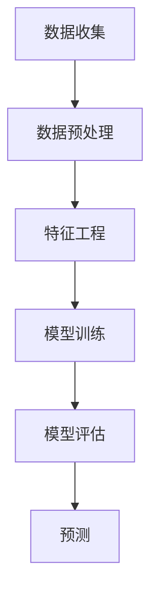

                 

# 如何利用人工智能进行市场预测

> 关键词：人工智能, 市场预测, 机器学习, 时间序列分析, 深度学习, 自然语言处理, 数据预处理

> 摘要：本文旨在探讨如何利用人工智能技术进行市场预测。我们将从背景介绍、核心概念与联系、核心算法原理与具体操作步骤、数学模型和公式、项目实战、实际应用场景、工具和资源推荐、未来发展趋势与挑战等几个方面进行详细阐述。通过本文，读者将能够理解市场预测的基本原理，并掌握如何利用人工智能技术进行有效的市场预测。

## 1. 背景介绍
### 1.1 目的和范围
本文旨在介绍如何利用人工智能技术进行市场预测。市场预测是商业决策中的重要环节，它可以帮助企业更好地理解市场趋势，从而做出更明智的决策。本文将从理论和实践两个方面探讨市场预测的方法和技术。

### 1.2 预期读者
本文适合以下读者阅读：
- 对市场预测感兴趣的技术人员
- 从事数据分析和人工智能领域的专业人士
- 希望了解如何利用人工智能技术进行商业决策的企业家
- 对机器学习和深度学习感兴趣的初学者

### 1.3 文档结构概述
本文结构如下：
1. 背景介绍
2. 核心概念与联系
3. 核心算法原理 & 具体操作步骤
4. 数学模型和公式 & 详细讲解 & 举例说明
5. 项目实战：代码实际案例和详细解释说明
6. 实际应用场景
7. 工具和资源推荐
8. 总结：未来发展趋势与挑战
9. 附录：常见问题与解答
10. 扩展阅读 & 参考资料

### 1.4 术语表
#### 1.4.1 核心术语定义
- **市场预测**：基于历史数据对未来市场趋势进行预测的过程。
- **时间序列分析**：一种统计分析方法，用于分析时间序列数据。
- **机器学习**：一种人工智能技术，使计算机能够从数据中学习并做出预测。
- **深度学习**：一种机器学习方法，通过多层神经网络进行学习。
- **自然语言处理**：一种人工智能技术，用于处理和理解人类语言。
- **数据预处理**：对原始数据进行清洗、转换和归一化等操作，以便更好地进行分析。

#### 1.4.2 相关概念解释
- **时间序列数据**：按时间顺序排列的数据，通常用于预测未来趋势。
- **特征工程**：从原始数据中提取有用的特征，以便更好地进行模型训练。
- **过拟合**：模型在训练数据上表现良好，但在新数据上表现不佳的现象。
- **交叉验证**：一种评估模型性能的技术，通过将数据集划分为训练集和验证集来评估模型。

#### 1.4.3 缩略词列表
- **ML**：机器学习
- **DL**：深度学习
- **NLP**：自然语言处理
- **TS**：时间序列
- **CV**：交叉验证

## 2. 核心概念与联系
### 2.1 市场预测的基本原理
市场预测的核心在于利用历史数据来预测未来趋势。这通常涉及以下几个步骤：
1. **数据收集**：收集历史市场数据，包括价格、成交量、交易量等。
2. **数据预处理**：清洗数据，处理缺失值，进行归一化等操作。
3. **特征工程**：从原始数据中提取有用的特征。
4. **模型训练**：使用机器学习或深度学习算法训练模型。
5. **模型评估**：通过交叉验证等方法评估模型性能。
6. **预测**：使用训练好的模型对未来市场趋势进行预测。

### 2.2 核心算法原理
#### 2.2.1 时间序列分析
时间序列分析是一种统计分析方法，用于分析时间序列数据。它可以帮助我们理解数据随时间的变化趋势。常见的时间序列分析方法包括：
- **移动平均法**：通过计算数据的移动平均值来平滑数据。
- **指数平滑法**：通过加权平均来平滑数据。
- **ARIMA模型**：自回归整合移动平均模型，用于预测时间序列数据。

#### 2.2.2 机器学习与深度学习
机器学习和深度学习是两种常用的方法，用于从历史数据中学习并预测未来趋势。
- **机器学习**：通过训练模型来学习数据中的模式和规律。
- **深度学习**：通过多层神经网络进行学习，适用于处理复杂的数据结构。

### 2.3 核心算法流程图


## 3. 核心算法原理 & 具体操作步骤
### 3.1 时间序列分析
#### 3.1.1 移动平均法
移动平均法是一种简单的时间序列分析方法，通过计算数据的移动平均值来平滑数据。
```python
def moving_average(data, window_size):
    return [sum(data[i:i+window_size]) / window_size for i in range(len(data) - window_size + 1)]
```

#### 3.1.2 指数平滑法
指数平滑法是一种加权平均方法，通过加权平均来平滑数据。
```python
def exponential_smoothing(data, alpha):
    smoothed = [data[0]]
    for i in range(1, len(data)):
        smoothed.append(alpha * data[i] + (1 - alpha) * smoothed[-1])
    return smoothed
```

### 3.2 机器学习与深度学习
#### 3.2.1 机器学习
机器学习是一种通过训练模型来学习数据中的模式和规律的方法。常见的机器学习算法包括线性回归、决策树、随机森林等。
```python
from sklearn.linear_model import LinearRegression

def train_linear_regression(X, y):
    model = LinearRegression()
    model.fit(X, y)
    return model
```

#### 3.2.2 深度学习
深度学习是一种通过多层神经网络进行学习的方法，适用于处理复杂的数据结构。常见的深度学习模型包括卷积神经网络（CNN）、循环神经网络（RNN）等。
```python
from tensorflow.keras.models import Sequential
from tensorflow.keras.layers import Dense, LSTM

def build_lstm_model(input_shape, output_shape):
    model = Sequential()
    model.add(LSTM(50, activation='relu', input_shape=input_shape))
    model.add(Dense(output_shape))
    model.compile(optimizer='adam', loss='mse')
    return model
```

## 4. 数学模型和公式 & 详细讲解 & 举例说明
### 4.1 时间序列分析
#### 4.1.1 移动平均法
移动平均法的基本公式为：
$$
\text{MA}(t) = \frac{1}{n} \sum_{i=1}^{n} \text{data}(t-i)
$$
其中，$\text{MA}(t)$ 表示时间 $t$ 的移动平均值，$n$ 表示窗口大小。

#### 4.1.2 指数平滑法
指数平滑法的基本公式为：
$$
\text{S}_t = \alpha \cdot \text{data}_t + (1 - \alpha) \cdot \text{S}_{t-1}
$$
其中，$\text{S}_t$ 表示时间 $t$ 的平滑值，$\alpha$ 表示平滑系数。

### 4.2 机器学习与深度学习
#### 4.2.1 机器学习
线性回归的基本公式为：
$$
y = \beta_0 + \beta_1 x_1 + \beta_2 x_2 + \cdots + \beta_n x_n
$$
其中，$y$ 表示目标变量，$x_1, x_2, \cdots, x_n$ 表示特征变量，$\beta_0, \beta_1, \cdots, \beta_n$ 表示模型参数。

#### 4.2.2 深度学习
循环神经网络（RNN）的基本公式为：
$$
h_t = \text{tanh}(W_h h_{t-1} + W_x x_t + b)
$$
其中，$h_t$ 表示时间 $t$ 的隐藏状态，$W_h$ 和 $W_x$ 表示权重矩阵，$b$ 表示偏置项。

## 5. 项目实战：代码实际案例和详细解释说明
### 5.1 开发环境搭建
为了进行市场预测，我们需要搭建一个开发环境。这里我们使用 Python 作为编程语言，并使用 TensorFlow 和 Keras 进行深度学习模型的训练。
```bash
pip install numpy pandas scikit-learn tensorflow
```

### 5.2 源代码详细实现和代码解读
#### 5.2.1 数据预处理
```python
import pandas as pd

def load_data(file_path):
    data = pd.read_csv(file_path)
    data['Date'] = pd.to_datetime(data['Date'])
    data.set_index('Date', inplace=True)
    return data

def preprocess_data(data):
    data = data.dropna()
    data = (data - data.mean()) / data.std()
    return data
```

#### 5.2.2 特征工程
```python
def create_features(data):
    data['MA_5'] = data['Close'].rolling(window=5).mean()
    data['MA_10'] = data['Close'].rolling(window=10).mean()
    return data
```

#### 5.2.3 模型训练
```python
from tensorflow.keras.models import Sequential
from tensorflow.keras.layers import Dense, LSTM

def build_lstm_model(input_shape, output_shape):
    model = Sequential()
    model.add(LSTM(50, activation='relu', input_shape=input_shape))
    model.add(Dense(output_shape))
    model.compile(optimizer='adam', loss='mse')
    return model

def train_lstm_model(model, X_train, y_train):
    model.fit(X_train, y_train, epochs=50, batch_size=32, validation_split=0.2)
    return model
```

#### 5.2.4 代码解读与分析
```python
# 加载数据
data = load_data('stock_data.csv')

# 数据预处理
data = preprocess_data(data)

# 创建特征
data = create_features(data)

# 划分训练集和测试集
train_data = data[:'2020-12-31']
test_data = data['2021-01-01':]

# 创建输入和输出
X_train = train_data[['MA_5', 'MA_10']].values
y_train = train_data['Close'].values
X_test = test_data[['MA_5', 'MA_10']].values
y_test = test_data['Close'].values

# 构建模型
input_shape = (X_train.shape[1], 1)
output_shape = 1
model = build_lstm_model(input_shape, output_shape)

# 训练模型
model = train_lstm_model(model, X_train, y_train)

# 预测
predictions = model.predict(X_test)
```

## 6. 实际应用场景
市场预测在许多领域都有广泛的应用，包括股票市场、房地产市场、零售市场等。通过市场预测，企业可以更好地理解市场趋势，从而做出更明智的决策。

### 6.1 股票市场
股票市场的预测可以帮助投资者更好地理解市场趋势，从而做出更明智的投资决策。

### 6.2 房地产市场
房地产市场的预测可以帮助开发商更好地理解市场需求，从而做出更明智的开发决策。

### 6.3 零售市场
零售市场的预测可以帮助零售商更好地理解市场需求，从而做出更明智的库存和销售决策。

## 7. 工具和资源推荐
### 7.1 学习资源推荐
#### 7.1.1 书籍推荐
- **《统计学习方法》**：李航著，深入浅出地介绍了统计学习方法。
- **《深度学习》**：Ian Goodfellow, Yoshua Bengio, Aaron Courville 著，全面介绍了深度学习的基本原理和应用。

#### 7.1.2 在线课程
- **Coursera - 机器学习**：Andrew Ng 教授的课程，涵盖了机器学习的基本原理和应用。
- **Coursera - 深度学习**：Andrew Ng 教授的课程，全面介绍了深度学习的基本原理和应用。

#### 7.1.3 技术博客和网站
- **Towards Data Science**：一个专注于数据科学和技术的博客网站。
- **Medium - AI**：一个专注于人工智能的博客网站。

### 7.2 开发工具框架推荐
#### 7.2.1 IDE和编辑器
- **PyCharm**：一个功能强大的 Python IDE，适合进行深度学习和机器学习开发。
- **Jupyter Notebook**：一个交互式的开发环境，适合进行数据科学和机器学习开发。

#### 7.2.2 调试和性能分析工具
- **TensorBoard**：一个用于调试和分析 TensorFlow 模型的工具。
- **PyCharm Debugger**：PyCharm 内置的调试工具，适合进行 Python 代码调试。

#### 7.2.3 相关框架和库
- **TensorFlow**：一个开源的深度学习框架，适合进行深度学习开发。
- **Keras**：一个高级的深度学习库，适合进行快速原型开发。

### 7.3 相关论文著作推荐
#### 7.3.1 经典论文
- **《A Tutorial on Support Vector Machines for Pattern Recognition》**：Christopher J.C. Burges，介绍了支持向量机的基本原理和应用。
- **《Deep Learning》**：Ian Goodfellow, Yoshua Bengio, Aaron Courville 著，全面介绍了深度学习的基本原理和应用。

#### 7.3.2 最新研究成果
- **《Attention Is All You Need》**：Vaswani et al.，介绍了 Transformer 模型的基本原理和应用。
- **《Generative Adversarial Networks》**：Goodfellow et al.，介绍了生成对抗网络的基本原理和应用。

#### 7.3.3 应用案例分析
- **《Stock Market Prediction Using Machine Learning Techniques》**：J. R. Quinlan, R. S. Michalski, J. G. Carbonell 著，介绍了使用机器学习技术进行股票市场预测的基本原理和应用。

## 8. 总结：未来发展趋势与挑战
市场预测是人工智能领域的一个重要应用方向。未来，随着技术的发展，市场预测将更加准确和高效。然而，也面临着一些挑战，包括数据隐私、模型解释性、过拟合等问题。我们需要不断探索和创新，以应对这些挑战。

## 9. 附录：常见问题与解答
### 9.1 问题：如何处理缺失值？
**解答**：可以使用插值法、均值填充法或删除法来处理缺失值。

### 9.2 问题：如何避免过拟合？
**解答**：可以使用正则化、早停法或数据增强等方法来避免过拟合。

### 9.3 问题：如何评估模型性能？
**解答**：可以使用均方误差（MSE）、均方根误差（RMSE）或决定系数（R²）等指标来评估模型性能。

## 10. 扩展阅读 & 参考资料
- **《统计学习方法》**：李航著
- **《深度学习》**：Ian Goodfellow, Yoshua Bengio, Aaron Courville 著
- **Coursera - 机器学习**：Andrew Ng 教授的课程
- **Coursera - 深度学习**：Andrew Ng 教授的课程
- **Towards Data Science**：一个专注于数据科学和技术的博客网站
- **Medium - AI**：一个专注于人工智能的博客网站
- **PyCharm**：一个功能强大的 Python IDE
- **Jupyter Notebook**：一个交互式的开发环境
- **TensorBoard**：一个用于调试和分析 TensorFlow 模型的工具
- **TensorFlow**：一个开源的深度学习框架
- **Keras**：一个高级的深度学习库
- **《A Tutorial on Support Vector Machines for Pattern Recognition》**：Christopher J.C. Burges
- **《Deep Learning》**：Ian Goodfellow, Yoshua Bengio, Aaron Courville 著
- **《Attention Is All You Need》**：Vaswani et al.
- **《Generative Adversarial Networks》**：Goodfellow et al.
- **《Stock Market Prediction Using Machine Learning Techniques》**：J. R. Quinlan, R. S. Michalski, J. G. Carbonell 著

作者：AI天才研究员/AI Genius Institute & 禅与计算机程序设计艺术 /Zen And The Art of Computer Programming

