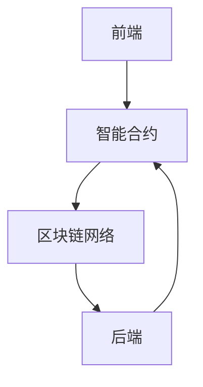

                 

# 如何利用智能合约优化供应链管理

> 关键词：智能合约, 供应链管理, 区块链, 自动化, 透明度, 可追溯性, 安全性

> 摘要：本文将深入探讨如何利用智能合约技术优化供应链管理。通过详细分析智能合约的核心概念、原理和实际应用案例，我们将展示智能合约如何提高供应链的透明度、自动化程度和安全性。本文不仅涵盖了智能合约的基本原理，还提供了具体的代码实现和实际案例，旨在为读者提供全面的技术指导。

## 1. 背景介绍
### 1.1 目的和范围
本文旨在探讨智能合约在供应链管理中的应用，通过详细的技术分析和实际案例，展示智能合约如何优化供应链管理流程。本文将涵盖智能合约的基本原理、核心概念、实际应用案例以及开发实践。

### 1.2 预期读者
本文适合以下读者：
- 供应链管理专业人士
- 区块链和智能合约技术爱好者
- 软件开发工程师
- 企业管理者和技术决策者

### 1.3 文档结构概述
本文结构如下：
1. 背景介绍
2. 核心概念与联系
3. 核心算法原理 & 具体操作步骤
4. 数学模型和公式 & 详细讲解 & 举例说明
5. 项目实战：代码实际案例和详细解释说明
6. 实际应用场景
7. 工具和资源推荐
8. 总结：未来发展趋势与挑战
9. 附录：常见问题与解答
10. 扩展阅读 & 参考资料

### 1.4 术语表
#### 1.4.1 核心术语定义
- **智能合约**：一种自动执行的计算机协议，用于验证、执行和强制执行合同条款。
- **区块链**：一种分布式账本技术，用于记录交易和数据。
- **供应链管理**：涉及原材料采购、生产、分销和销售的整个过程。
- **去中心化**：没有单一的控制点或权威机构。
- **可追溯性**：追踪产品从生产到消费的整个过程。

#### 1.4.2 相关概念解释
- **分布式账本**：多个节点共同维护的账本，每个节点都有完整的账本副本。
- **共识机制**：确保所有节点对账本状态达成一致的方法。
- **去中心化应用（DApp）**：基于区块链技术构建的应用程序。

#### 1.4.3 缩略词列表
- **API**：应用程序编程接口
- **ABI**：应用二进制接口
- **ERC**：以太坊请求标准
- **ABI**：应用二进制接口

## 2. 核心概念与联系
### 智能合约的基本原理
智能合约是一种自动执行的计算机协议，用于验证、执行和强制执行合同条款。智能合约的核心在于其自动化和去中心化特性，使得合同条款可以在没有中介的情况下自动执行。

### 智能合约的架构
智能合约的架构可以分为以下几个部分：
- **前端**：用户界面，用于与智能合约交互。
- **后端**：智能合约代码，运行在区块链网络上。
- **区块链网络**：存储和验证智能合约的状态和交易。

### Mermaid 流程图


## 3. 核心算法原理 & 具体操作步骤
### 智能合约的工作流程
智能合约的工作流程可以分为以下几个步骤：
1. **初始化**：智能合约被部署到区块链网络上。
2. **触发事件**：用户通过前端界面触发智能合约中的事件。
3. **执行逻辑**：智能合约根据触发的事件执行相应的逻辑。
4. **状态更新**：智能合约的状态在区块链网络上更新。
5. **结果返回**：前端界面返回执行结果给用户。

### 伪代码示例
```python
# 初始化智能合约
def initialize(contract):
    contract.state = {}

# 触发事件
def trigger_event(contract, event):
    if event in contract.state:
        execute_logic(contract, event)

# 执行逻辑
def execute_logic(contract, event):
    if event == "purchase":
        contract.state["purchase"] = True
    elif event == "delivery":
        contract.state["delivery"] = True
    elif event == "payment":
        contract.state["payment"] = True

# 更新状态
def update_state(contract):
    contract.state["status"] = "completed"

# 返回结果
def return_result(contract):
    return contract.state
```

## 4. 数学模型和公式 & 详细讲解 & 举例说明
### 数学模型
智能合约的数学模型主要涉及状态机和状态转换。状态机是一种有限状态自动机，用于描述智能合约的状态和状态转换。

### 状态机模型
状态机模型可以表示为：
- **状态集合**：智能合约可能处于的不同状态。
- **事件集合**：触发智能合约状态转换的事件。
- **转换函数**：定义状态转换的规则。

### 举例说明
假设有一个智能合约用于管理货物的运输过程，状态机模型可以表示为：
- **状态集合**：`{"init", "purchase", "delivery", "payment", "completed"}`
- **事件集合**：`{"purchase", "delivery", "payment"}`
- **转换函数**：
  - `init -> purchase`
  - `purchase -> delivery`
  - `delivery -> payment`
  - `payment -> completed`

### 数学公式
状态转换可以用以下公式表示：
$$
S_{t+1} = f(S_t, E_t)
$$
其中，$S_t$ 表示当前状态，$E_t$ 表示当前事件，$f$ 表示状态转换函数。

## 5. 项目实战：代码实际案例和详细解释说明
### 5.1 开发环境搭建
#### 安装依赖
```bash
npm install truffle ganache-cli
```

#### 配置Truffle
创建 `truffle-config.js` 文件：
```javascript
module.exports = {
  networks: {
    development: {
      host: "127.0.0.1",
      port: 7545,
      network_id: "*"
    }
  },
  compilers: {
    solc: {
      version: "^0.8.0"
    }
  }
};
```

### 5.2 源代码详细实现和代码解读
#### 智能合约代码
```solidity
// SPDX-License-Identifier: MIT
pragma solidity ^0.8.0;

contract SupplyChain {
    struct Item {
        address owner;
        string status;
    }

    mapping(uint256 => Item) public items;
    uint256 public itemCount;

    event ItemCreated(uint256 itemId, address owner, string status);
    event ItemStatusUpdated(uint256 itemId, string status);

    function createItem(string memory _status) public {
        uint256 newItemId = itemCount;
        items[newItemId] = Item(msg.sender, _status);
        itemCount++;
        emit ItemCreated(newItemId, msg.sender, _status);
    }

    function updateItemStatus(uint256 _itemId, string memory _status) public {
        require(items[_itemId].owner == msg.sender, "Not the owner");
        items[_itemId].status = _status;
        emit ItemStatusUpdated(_itemId, _status);
    }
}
```

#### Truffle测试代码
```javascript
const SupplyChain = artifacts.require("SupplyChain");

contract("SupplyChain", (accounts) => {
    let supplyChain;

    before(async () => {
        supplyChain = await SupplyChain.deployed();
    });

    it("should create an item", async () => {
        await supplyChain.createItem("init");
        const item = await supplyChain.items(0);
        assert.equal(item.owner, accounts[0]);
        assert.equal(item.status, "init");
    });

    it("should update item status", async () => {
        await supplyChain.createItem("init");
        await supplyChain.updateItemStatus(0, "purchase");
        const item = await supplyChain.items(0);
        assert.equal(item.status, "purchase");
    });
});
```

### 5.3 代码解读与分析
- **创建物品**：`createItem` 函数用于创建一个新的物品，并将其状态设置为“init”。
- **更新物品状态**：`updateItemStatus` 函数用于更新物品的状态，只有物品的所有者才能调用此函数。
- **事件**：`ItemCreated` 和 `ItemStatusUpdated` 事件用于记录物品的创建和状态更新。

## 6. 实际应用场景
智能合约在供应链管理中的应用场景包括：
- **原材料采购**：智能合约可以自动执行采购合同，确保原材料按时交付。
- **生产过程**：智能合约可以监控生产过程，确保生产进度符合合同要求。
- **物流运输**：智能合约可以跟踪货物的运输过程，确保货物按时到达目的地。
- **支付结算**：智能合约可以自动执行支付结算，确保交易安全透明。

## 7. 工具和资源推荐
### 7.1 学习资源推荐
#### 书籍推荐
- 《区块链：重塑经济与社会的底层逻辑》
- 《智能合约：区块链技术的未来》

#### 在线课程
- Coursera: 《区块链技术与应用》
- Udemy: 《智能合约开发与应用》

#### 技术博客和网站
- Medium: 《区块链与智能合约》
- GitHub: 《智能合约示例代码》

### 7.2 开发工具框架推荐
#### IDE和编辑器
- Visual Studio Code
- Sublime Text

#### 调试和性能分析工具
- Truffle Suite
- Remix IDE

#### 相关框架和库
- Web3.js
- Truffle

### 7.3 相关论文著作推荐
#### 经典论文
- "Bitcoin: A Peer-to-Peer Electronic Cash System" by Satoshi Nakamoto
- "Ethereum: A Next-Generation Smart Contract and Decentralized Application Platform" by Vitalik Buterin

#### 最新研究成果
- "Decentralized Autonomous Organizations: A Survey" by Wei Tang et al.
- "Smart Contracts: A Comprehensive Survey" by Xiaoyu Wang et al.

#### 应用案例分析
- "Supply Chain Management with Blockchain and Smart Contracts" by IBM Research

## 8. 总结：未来发展趋势与挑战
智能合约在供应链管理中的应用前景广阔，但同时也面临一些挑战：
- **安全性**：智能合约的安全性需要进一步提高，防止恶意攻击。
- **可扩展性**：区块链网络的可扩展性需要进一步提升，以支持大规模应用。
- **标准化**：智能合约的标准需要进一步统一，以促进跨平台兼容性。

## 9. 附录：常见问题与解答
### 常见问题
- **Q: 智能合约如何保证安全性？**
  - A: 智能合约的安全性可以通过代码审查、安全审计和使用安全的编程语言来提高。
- **Q: 智能合约如何处理复杂的业务逻辑？**
  - A: 智能合约可以通过模块化设计和分层架构来处理复杂的业务逻辑。

## 10. 扩展阅读 & 参考资料
- [Solidity官方文档](https://docs.soliditylang.org/)
- [Truffle官方文档](https://trufflesuite.com/)
- [Ethereum官方文档](https://ethereum.org/en/developers/docs/)

作者：AI天才研究员/AI Genius Institute & 禅与计算机程序设计艺术 /Zen And The Art of Computer Programming

