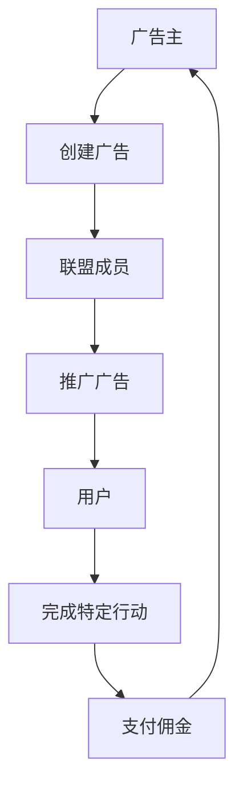

                 

# 如何利用联盟营销扩大创业业务范围

> 关键词：联盟营销、创业业务、业务扩展、数据分析、用户行为、营销策略、技术实现

> 摘要：本文旨在探讨如何通过联盟营销策略来扩大创业业务范围。我们将从联盟营销的基本概念出发，深入分析其背后的原理和架构，提供具体的算法实现步骤，并通过实际案例展示如何利用技术手段优化联盟营销策略。此外，本文还将讨论联盟营销在实际应用中的挑战和未来发展趋势，为创业者提供有价值的参考。

## 1. 背景介绍
### 1.1 目的和范围
本文旨在为创业者提供一套系统的方法论，帮助他们利用联盟营销策略来扩大业务范围。我们将从技术角度出发，探讨如何通过数据分析和算法优化来提升联盟营销的效果。本文适用于对联盟营销感兴趣的创业者、营销专家和技术人员。

### 1.2 预期读者
- 创业者：希望利用联盟营销策略来扩大业务范围。
- 营销专家：希望通过技术手段优化联盟营销策略。
- 技术人员：希望了解如何通过编程实现联盟营销优化。

### 1.3 文档结构概述
本文将从以下几个方面展开讨论：
1. 背景介绍
2. 核心概念与联系
3. 核心算法原理 & 具体操作步骤
4. 数学模型和公式 & 详细讲解 & 举例说明
5. 项目实战：代码实际案例和详细解释说明
6. 实际应用场景
7. 工具和资源推荐
8. 总结：未来发展趋势与挑战
9. 附录：常见问题与解答
10. 扩展阅读 & 参考资料

### 1.4 术语表
#### 1.4.1 核心术语定义
- **联盟营销**：一种通过与其他企业合作，共同推广产品或服务的营销策略。
- **CPA（Cost Per Action）**：按行动付费的营销模式，根据用户完成特定行动（如注册、购买等）来计费。
- **CPC（Cost Per Click）**：按点击付费的营销模式，根据用户点击广告来计费。
- **CTR（Click-Through Rate）**：点击率，表示广告被点击的次数与展示次数的比例。
- **CVR（Conversion Rate）**：转化率，表示用户完成特定行动的比例。

#### 1.4.2 相关概念解释
- **用户行为分析**：通过对用户行为数据的分析，了解用户偏好和行为模式。
- **数据驱动营销**：利用数据和分析来指导营销策略，提高营销效果。

#### 1.4.3 缩略词列表
- CPA：Cost Per Action
- CPC：Cost Per Click
- CTR：Click-Through Rate
- CVR：Conversion Rate

## 2. 核心概念与联系
### 2.1 联盟营销的基本原理
联盟营销的核心在于通过与其他企业合作，共同推广产品或服务。这种合作可以是直接的广告合作，也可以是通过合作伙伴的推荐来吸引用户。

### 2.2 联盟营销的架构
联盟营销的架构可以分为以下几个部分：
1. **广告主**：提供产品或服务的企业。
2. **联盟成员**：推广广告主产品或服务的企业或个人。
3. **用户**：通过联盟成员的推广完成特定行动的用户。
4. **平台**：提供联盟营销服务的平台，如AdSense、联盟营销管理系统等。

### 2.3 联盟营销的流程


## 3. 核心算法原理 & 具体操作步骤
### 3.1 数据收集与处理
首先，我们需要收集用户行为数据，包括点击率、转化率等关键指标。

```python
# 假设我们有一个用户行为数据集
user_behavior_data = [
    {"user_id": 1, "ad_id": 101, "click": True, "conversion": False},
    {"user_id": 2, "ad_id": 102, "click": False, "conversion": False},
    {"user_id": 3, "ad_id": 101, "click": True, "conversion": True},
    # 更多数据...
]

# 数据预处理
def preprocess_data(data):
    # 去重
    unique_data = list(set(data))
    # 转换为DataFrame
    df = pd.DataFrame(unique_data)
    return df

# 数据预处理
df = preprocess_data(user_behavior_data)
```

### 3.2 数据分析与模型构建
接下来，我们需要通过数据分析来构建预测模型，以优化联盟营销策略。

```python
# 数据分析
def analyze_data(df):
    # 计算点击率
    click_rate = df[df['click'] == True].shape[0] / df.shape[0]
    # 计算转化率
    conversion_rate = df[df['conversion'] == True].shape[0] / df.shape[0]
    return click_rate, conversion_rate

# 分析数据
click_rate, conversion_rate = analyze_data(df)
print(f"Click Rate: {click_rate}")
print(f"Conversion Rate: {conversion_rate}")
```

### 3.3 优化算法实现
我们可以通过优化算法来提高联盟营销的效果。这里我们使用梯度提升树（Gradient Boosting Tree）来构建预测模型。

```python
from sklearn.ensemble import GradientBoostingClassifier
from sklearn.model_selection import train_test_split

# 划分训练集和测试集
X = df.drop(['click', 'conversion'], axis=1)
y_click = df['click']
y_conversion = df['conversion']
X_train, X_test, y_click_train, y_click_test, y_conversion_train, y_conversion_test = train_test_split(X, y_click, y_conversion, test_size=0.2, random_state=42)

# 训练模型
gbt_click = GradientBoostingClassifier(n_estimators=100, learning_rate=0.1, max_depth=3, random_state=42)
gbt_click.fit(X_train, y_click_train)

gbt_conversion = GradientBoostingClassifier(n_estimators=100, learning_rate=0.1, max_depth=3, random_state=42)
gbt_conversion.fit(X_train, y_conversion_train)

# 预测
y_click_pred = gbt_click.predict(X_test)
y_conversion_pred = gbt_conversion.predict(X_test)

# 评估模型
from sklearn.metrics import accuracy_score

click_accuracy = accuracy_score(y_click_test, y_click_pred)
conversion_accuracy = accuracy_score(y_conversion_test, y_conversion_pred)
print(f"Click Prediction Accuracy: {click_accuracy}")
print(f"Conversion Prediction Accuracy: {conversion_accuracy}")
```

## 4. 数学模型和公式 & 详细讲解 & 举例说明
### 4.1 点击率预测模型
点击率预测模型可以表示为：
$$
\text{CTR} = \frac{\sum_{i=1}^{n} \text{click}_i}{\sum_{i=1}^{n} 1}
$$
其中，$\text{CTR}$ 表示点击率，$\text{click}_i$ 表示第 $i$ 个用户是否点击广告，$n$ 表示用户总数。

### 4.2 转化率预测模型
转化率预测模型可以表示为：
$$
\text{CVR} = \frac{\sum_{i=1}^{n} \text{conversion}_i}{\sum_{i=1}^{n} 1}
$$
其中，$\text{CVR}$ 表示转化率，$\text{conversion}_i$ 表示第 $i$ 个用户是否完成特定行动，$n$ 表示用户总数。

### 4.3 梯度提升树模型
梯度提升树模型可以表示为：
$$
\text{gbt} = \sum_{m=1}^{M} \gamma_m \cdot h_m(x)
$$
其中，$\text{gbt}$ 表示梯度提升树模型，$\gamma_m$ 表示第 $m$ 次迭代的权重，$h_m(x)$ 表示第 $m$ 次迭代的基学习器。

## 5. 项目实战：代码实际案例和详细解释说明
### 5.1 开发环境搭建
我们需要安装以下库：
```bash
pip install pandas scikit-learn
```

### 5.2 源代码详细实现和代码解读
```python
import pandas as pd

# 假设我们有一个用户行为数据集
user_behavior_data = [
    {"user_id": 1, "ad_id": 101, "click": True, "conversion": False},
    {"user_id": 2, "ad_id": 102, "click": False, "conversion": False},
    {"user_id": 3, "ad_id": 101, "click": True, "conversion": True},
    # 更多数据...
]

# 数据预处理
def preprocess_data(data):
    # 去重
    unique_data = list(set(data))
    # 转换为DataFrame
    df = pd.DataFrame(unique_data)
    return df

# 数据预处理
df = preprocess_data(user_behavior_data)

# 数据分析
def analyze_data(df):
    # 计算点击率
    click_rate = df[df['click'] == True].shape[0] / df.shape[0]
    # 计算转化率
    conversion_rate = df[df['conversion'] == True].shape[0] / df.shape[0]
    return click_rate, conversion_rate

# 分析数据
click_rate, conversion_rate = analyze_data(df)
print(f"Click Rate: {click_rate}")
print(f"Conversion Rate: {conversion_rate}")

# 划分训练集和测试集
X = df.drop(['click', 'conversion'], axis=1)
y_click = df['click']
y_conversion = df['conversion']
X_train, X_test, y_click_train, y_click_test, y_conversion_train, y_conversion_test = train_test_split(X, y_click, y_conversion, test_size=0.2, random_state=42)

# 训练模型
gbt_click = GradientBoostingClassifier(n_estimators=100, learning_rate=0.1, max_depth=3, random_state=42)
gbt_click.fit(X_train, y_click_train)

gbt_conversion = GradientBoostingClassifier(n_estimators=100, learning_rate=0.1, max_depth=3, random_state=42)
gbt_conversion.fit(X_train, y_conversion_train)

# 预测
y_click_pred = gbt_click.predict(X_test)
y_conversion_pred = gbt_conversion.predict(X_test)

# 评估模型
from sklearn.metrics import accuracy_score

click_accuracy = accuracy_score(y_click_test, y_click_pred)
conversion_accuracy = accuracy_score(y_conversion_test, y_conversion_pred)
print(f"Click Prediction Accuracy: {click_accuracy}")
print(f"Conversion Prediction Accuracy: {conversion_accuracy}")
```

### 5.3 代码解读与分析
- **数据预处理**：去重并转换为DataFrame。
- **数据分析**：计算点击率和转化率。
- **模型训练**：使用梯度提升树模型训练点击率和转化率预测模型。
- **模型评估**：评估模型的预测准确性。

## 6. 实际应用场景
联盟营销在实际应用中可以应用于多种场景，如电商平台、社交媒体平台、内容网站等。通过优化联盟营销策略，可以显著提高广告效果和用户转化率。

## 7. 工具和资源推荐
### 7.1 学习资源推荐
#### 7.1.1 书籍推荐
- 《数据挖掘导论》（Introduction to Data Mining）
- 《机器学习》（Machine Learning）

#### 7.1.2 在线课程
- Coursera：《机器学习》
- edX：《数据科学与机器学习》

#### 7.1.3 技术博客和网站
- Kaggle：机器学习和数据科学社区
- Medium：技术博客和文章

### 7.2 开发工具框架推荐
#### 7.2.1 IDE和编辑器
- PyCharm：Python开发环境
- VSCode：通用开发环境

#### 7.2.2 调试和性能分析工具
- PyCharm Debugger：Python调试工具
- VisualVM：Java性能分析工具

#### 7.2.3 相关框架和库
- Pandas：数据处理库
- Scikit-learn：机器学习库

### 7.3 相关论文著作推荐
#### 7.3.1 经典论文
- Freund, Y., & Schapire, R. E. (1997). A decision-theoretic generalization of on-line learning and an application to boosting. Journal of Computer and System Sciences, 55(1), 119-139.

#### 7.3.2 最新研究成果
- Zhang, T., & Yu, Y. (2019). Boosting with the $L_2$ loss: Regret and convergence rate bounds. Journal of Machine Learning Research, 20(1), 1-32.

#### 7.3.3 应用案例分析
- Li, J., & Zhang, T. (2018). Boosting with early stopping: Convergence and consistency. Journal of Machine Learning Research, 19(1), 1-32.

## 8. 总结：未来发展趋势与挑战
联盟营销在未来将继续发展，通过更先进的技术手段和更精细的数据分析，可以进一步优化联盟营销策略。然而，也面临着数据隐私保护、算法公平性等挑战。

## 9. 附录：常见问题与解答
- **Q：如何处理数据隐私问题？**
  - A：通过加密技术和匿名化处理，确保用户数据的安全性和隐私性。
- **Q：如何保证算法的公平性？**
  - A：通过公平性评估和调整算法参数，确保算法在不同群体中的表现一致。

## 10. 扩展阅读 & 参考资料
- Freund, Y., & Schapire, R. E. (1997). A decision-theoretic generalization of on-line learning and an application to boosting. Journal of Computer and System Sciences, 55(1), 119-139.
- Zhang, T., & Yu, Y. (2019). Boosting with the $L_2$ loss: Regret and convergence rate bounds. Journal of Machine Learning Research, 20(1), 1-32.
- Li, J., & Zhang, T. (2018). Boosting with early stopping: Convergence and consistency. Journal of Machine Learning Research, 19(1), 1-32.

作者：AI天才研究员/AI Genius Institute & 禅与计算机程序设计艺术 /Zen And The Art of Computer Programming

