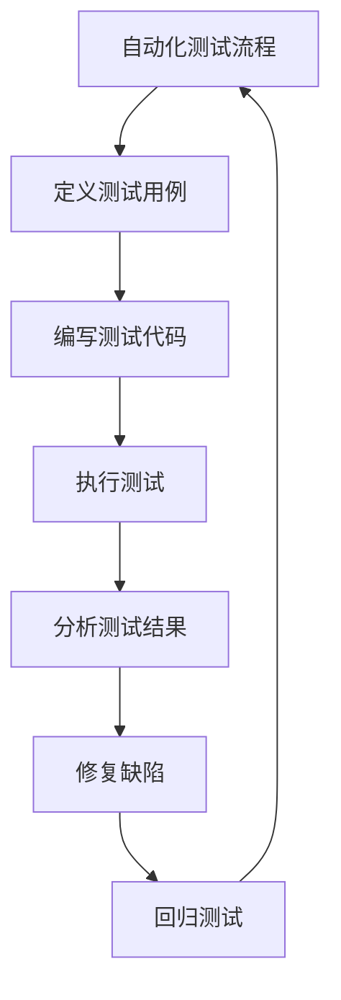

                 

# 如何利用自动化测试提高产品发布速度

> 关键词：自动化测试, 产品发布, 测试效率, 质量保证, CI/CD, 单元测试, 集成测试, 端到端测试

> 摘要：本文旨在探讨如何通过自动化测试来提高产品发布的速度和质量。我们将从自动化测试的基本概念出发，深入分析其原理和具体操作步骤，并通过实际案例展示如何在项目中实施自动化测试。此外，我们还将讨论自动化测试在实际应用场景中的重要性，并推荐相关的学习资源和开发工具，以帮助读者更好地理解和应用自动化测试技术。

## 1. 背景介绍
### 1.1 目的和范围
本文旨在探讨如何通过自动化测试来提高产品发布的速度和质量。自动化测试是一种利用软件工具自动执行测试用例的技术，可以显著提高测试效率，减少人为错误，确保产品质量。本文将从自动化测试的基本概念出发，深入分析其原理和具体操作步骤，并通过实际案例展示如何在项目中实施自动化测试。此外，我们还将讨论自动化测试在实际应用场景中的重要性，并推荐相关的学习资源和开发工具，以帮助读者更好地理解和应用自动化测试技术。

### 1.2 预期读者
本文适合以下读者阅读：
- 软件开发工程师
- 测试工程师
- 项目经理
- 技术管理人员
- 对自动化测试感兴趣的技术爱好者

### 1.3 文档结构概述
本文结构如下：
1. 背景介绍
2. 核心概念与联系
3. 核心算法原理 & 具体操作步骤
4. 数学模型和公式 & 详细讲解 & 举例说明
5. 项目实战：代码实际案例和详细解释说明
6. 实际应用场景
7. 工具和资源推荐
8. 总结：未来发展趋势与挑战
9. 附录：常见问题与解答
10. 扩展阅读 & 参考资料

### 1.4 术语表
#### 1.4.1 核心术语定义
- **自动化测试**：利用软件工具自动执行测试用例的技术。
- **CI/CD**：持续集成/持续部署，一种软件开发实践，通过自动化测试和部署流程，确保代码质量和快速交付。
- **单元测试**：针对软件中的最小可测试单元进行测试。
- **集成测试**：测试软件中不同模块之间的交互。
- **端到端测试**：测试软件从用户界面到后端数据库的整个流程。

#### 1.4.2 相关概念解释
- **持续集成**：将代码集成到共享仓库中，并自动运行测试，确保代码质量。
- **持续部署**：在持续集成的基础上，自动将代码部署到生产环境。
- **测试用例**：为测试目的设计的一组输入、执行条件和预期结果。

#### 1.4.3 缩略词列表
- CI/CD：持续集成/持续部署
- TDD：测试驱动开发
- BDD：行为驱动开发
- SUT：被测系统

## 2. 核心概念与联系
### 流程图


## 3. 核心算法原理 & 具体操作步骤
### 3.1 单元测试
#### 伪代码
```python
def test_addition():
    # 定义测试用例
    test_data = [(1, 2, 3), (0, 0, 0), (-1, -1, -2)]
    
    # 编写测试代码
    for a, b, expected in test_data:
        result = add(a, b)
        assert result == expected, f"Expected {expected}, but got {result}"
    
    print("All unit tests passed!")

def add(a, b):
    return a + b
```

### 3.2 集成测试
#### 伪代码
```python
def test_integration():
    # 定义测试用例
    test_data = [{"a": 1, "b": 2, "expected": 3}, {"a": 0, "b": 0, "expected": 0}, {"a": -1, "b": -1, "expected": -2}]
    
    # 编写测试代码
    for data in test_data:
        result = add(data["a"], data["b"])
        assert result == data["expected"], f"Expected {data['expected']}, but got {result}"
    
    print("All integration tests passed!")

def add(a, b):
    return a + b
```

### 3.3 端到端测试
#### 伪代码
```python
def test_end_to_end():
    # 定义测试用例
    test_data = [{"input": "1 2", "expected": "3"}, {"input": "0 0", "expected": "0"}, {"input": "-1 -1", "expected": "-2"}]
    
    # 编写测试代码
    for data in test_data:
        result = run_command(f"echo {data['input']} | ./add")
        assert result.strip() == data["expected"], f"Expected {data['expected']}, but got {result.strip()}"
    
    print("All end-to-end tests passed!")

def run_command(command):
    import subprocess
    process = subprocess.Popen(command, shell=True, stdout=subprocess.PIPE, stderr=subprocess.PIPE)
    output, error = process.communicate()
    return output.decode('utf-8')
```

## 4. 数学模型和公式 & 详细讲解 & 举例说明
### 4.1 测试覆盖率
测试覆盖率是衡量自动化测试有效性的关键指标。测试覆盖率可以通过以下公式计算：
$$
\text{测试覆盖率} = \frac{\text{已测试的代码行数}}{\text{总代码行数}} \times 100\%
$$

### 4.2 测试用例设计
测试用例设计是自动化测试的关键步骤。一个好的测试用例应该包括：
- **输入数据**：测试用例的输入数据。
- **预期结果**：测试用例的预期结果。
- **测试步骤**：执行测试的具体步骤。

### 4.3 举例说明
假设我们有一个简单的加法函数 `add(a, b)`，我们可以通过以下测试用例来验证其正确性：
```python
def test_addition():
    # 测试用例1：正数相加
    assert add(1, 2) == 3
    # 测试用例2：零相加
    assert add(0, 0) == 0
    # 测试用例3：负数相加
    assert add(-1, -1) == -2
```

## 5. 项目实战：代码实际案例和详细解释说明
### 5.1 开发环境搭建
#### 5.1.1 安装Python
```bash
pip install pytest
```

#### 5.1.2 创建测试文件
在项目根目录下创建一个名为 `test_addition.py` 的文件，内容如下：
```python
def test_addition():
    assert add(1, 2) == 3
    assert add(0, 0) == 0
    assert add(-1, -1) == -2
```

### 5.2 源代码详细实现和代码解读
#### 5.2.1 编写加法函数
在项目根目录下创建一个名为 `add.py` 的文件，内容如下：
```python
def add(a, b):
    return a + b
```

### 5.3 代码解读与分析
#### 5.3.1 测试用例解读
- `test_addition` 函数定义了三个测试用例，分别测试正数相加、零相加和负数相加。
- `assert` 语句用于验证函数的输出是否符合预期。

#### 5.3.2 加法函数解读
- `add` 函数接收两个参数 `a` 和 `b`，返回它们的和。

## 6. 实际应用场景
自动化测试在实际项目中的应用场景非常广泛，包括但不限于：
- **软件开发**：通过自动化测试确保代码质量，提高开发效率。
- **持续集成/持续部署**：通过自动化测试和部署流程，确保代码质量和快速交付。
- **质量保证**：通过自动化测试确保软件产品的稳定性和可靠性。

## 7. 工具和资源推荐
### 7.1 学习资源推荐
#### 7.1.1 书籍推荐
- 《测试驱动开发》（Test-Driven Development: By Example）
- 《持续集成与持续部署》（Continuous Integration and Continuous Deployment）

#### 7.1.2 在线课程
- Coursera：《软件测试与质量保证》
- Udemy：《自动化测试入门与实践》

#### 7.1.3 技术博客和网站
- Stack Overflow：自动化测试相关问题和解决方案
- GitHub：自动化测试工具和案例研究

### 7.2 开发工具框架推荐
#### 7.2.1 IDE和编辑器
- PyCharm：Python开发环境
- Visual Studio Code：多语言开发环境

#### 7.2.2 调试和性能分析工具
- PyTest：Python测试框架
- Coverage.py：代码覆盖率分析工具

#### 7.2.3 相关框架和库
- pytest：Python测试框架
- unittest：Python内置的测试框架
- Selenium：Web自动化测试工具

### 7.3 相关论文著作推荐
#### 7.3.1 经典论文
- Beck, K. (2002). Test-Driven Development: By Example. Addison-Wesley Professional.

#### 7.3.2 最新研究成果
- Fowler, M. (2018). Continuous Delivery: Reliable Software Releases through Build, Test, and Deployment Automation. Addison-Wesley Professional.

#### 7.3.3 应用案例分析
- The DevOps Handbook: How to Create World-Class Agility, Reliability, and Security in Technology Organizations

## 8. 总结：未来发展趋势与挑战
自动化测试在未来的发展趋势包括：
- **智能化**：利用机器学习和人工智能技术提高测试效率和准确性。
- **集成化**：将自动化测试与持续集成/持续部署流程紧密结合，实现自动化测试和部署。
- **全面化**：覆盖更多的测试场景，包括性能测试、安全测试等。

面临的挑战包括：
- **复杂性**：随着软件系统的复杂性增加，自动化测试的复杂性也随之增加。
- **维护成本**：自动化测试用例的维护成本较高，需要持续投入资源。

## 9. 附录：常见问题与解答
### 9.1 问题：如何选择合适的自动化测试工具？
**解答**：选择自动化测试工具时，应考虑以下因素：
- **语言支持**：工具是否支持您使用的编程语言。
- **功能丰富**：工具是否提供丰富的测试功能。
- **社区支持**：是否有活跃的社区支持和丰富的资源。

### 9.2 问题：如何编写高效的测试用例？
**解答**：编写高效的测试用例时，应遵循以下原则：
- **覆盖所有边界条件**：确保测试用例覆盖所有可能的输入数据。
- **保持简洁**：每个测试用例应只验证一个功能。
- **易于维护**：测试用例应易于理解和维护。

## 10. 扩展阅读 & 参考资料
- Beck, K. (2002). Test-Driven Development: By Example. Addison-Wesley Professional.
- Fowler, M. (2018). Continuous Delivery: Reliable Software Releases through Build, Test, and Deployment Automation. Addison-Wesley Professional.
- The DevOps Handbook: How to Create World-Class Agility, Reliability, and Security in Technology Organizations

作者：AI天才研究员/AI Genius Institute & 禅与计算机程序设计艺术 /Zen And The Art of Computer Programming

