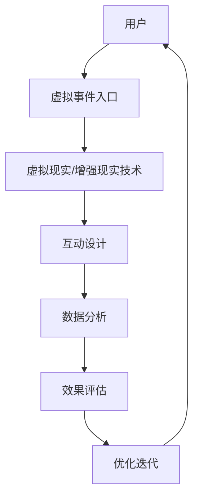

                 

# 如何利用虚拟事件扩大品牌影响力

> 关键词：虚拟事件、品牌影响力、营销策略、用户参与度、数据分析

> 摘要：在数字化时代，虚拟事件已成为品牌营销的重要手段。本文将深入探讨如何利用虚拟事件来扩大品牌影响力，通过分析虚拟事件的核心概念、设计原理、具体操作步骤、数学模型和实际案例，为读者提供一套完整的解决方案。我们将从技术角度出发，结合实际案例，帮助品牌主更好地理解和应用虚拟事件营销策略。

## 1. 背景介绍
### 1.1 目的和范围
本文旨在探讨如何利用虚拟事件来扩大品牌影响力。虚拟事件是指通过数字平台举办的线上活动，如虚拟发布会、线上研讨会、虚拟展览等。本文将从技术角度出发，详细解析虚拟事件的设计原理、操作步骤、数学模型，并通过实际案例展示如何实施虚拟事件营销策略。

### 1.2 预期读者
本文面向品牌营销人员、数字营销专家、技术架构师以及对虚拟事件营销感兴趣的读者。无论您是初学者还是有经验的专业人士，本文都将为您提供有价值的见解和实用建议。

### 1.3 文档结构概述
本文将分为以下几个部分：
1. 背景介绍
2. 核心概念与联系
3. 核心算法原理 & 具体操作步骤
4. 数学模型和公式 & 详细讲解 & 举例说明
5. 项目实战：代码实际案例和详细解释说明
6. 实际应用场景
7. 工具和资源推荐
8. 总结：未来发展趋势与挑战
9. 附录：常见问题与解答
10. 扩展阅读 & 参考资料

### 1.4 术语表
#### 1.4.1 核心术语定义
- **虚拟事件**：通过数字平台举办的线上活动。
- **品牌影响力**：品牌在目标受众中的认知度和好感度。
- **用户参与度**：用户对虚拟事件的互动程度。
- **数据分析**：通过数据收集和分析来评估虚拟事件的效果。

#### 1.4.2 相关概念解释
- **虚拟现实（VR）**：一种模拟环境的技术，让用户感觉仿佛置身于虚拟世界中。
- **增强现实（AR）**：在现实世界的基础上叠加虚拟信息，增强用户的体验。
- **互动性**：用户与虚拟事件之间的互动程度。

#### 1.4.3 缩略词列表
- **API**：应用程序编程接口
- **SDK**：软件开发工具包
- **UI/UX**：用户界面/用户体验
- **CRM**：客户关系管理

## 2. 核心概念与联系
### 2.1 虚拟事件的核心概念
虚拟事件的核心概念包括虚拟现实、增强现实、互动性、用户参与度和数据分析。这些概念相互关联，共同构成了虚拟事件的设计基础。

### 2.2 虚拟事件的设计原理
虚拟事件的设计原理主要包括以下几个方面：
- **用户体验设计**：确保用户在虚拟事件中的体验流畅、自然。
- **互动设计**：通过互动元素增加用户的参与度。
- **数据分析**：通过数据收集和分析来评估虚拟事件的效果。
- **技术实现**：利用虚拟现实、增强现实等技术实现虚拟事件。

### 2.3 虚拟事件的架构
虚拟事件的架构可以使用Mermaid流程图来表示：



## 3. 核心算法原理 & 具体操作步骤
### 3.1 核心算法原理
虚拟事件的核心算法原理主要包括以下几个方面：
- **用户行为分析**：通过分析用户的行为数据来优化虚拟事件的设计。
- **互动设计算法**：通过算法设计互动元素，提高用户的参与度。
- **数据分析算法**：通过数据分析算法来评估虚拟事件的效果。

### 3.2 具体操作步骤
虚拟事件的具体操作步骤包括以下几个方面：
1. **需求分析**：明确虚拟事件的目标和需求。
2. **设计规划**：设计虚拟事件的架构和流程。
3. **技术选型**：选择合适的虚拟现实和增强现实技术。
4. **开发实现**：实现虚拟事件的设计。
5. **测试优化**：进行测试和优化，确保虚拟事件的稳定性和用户体验。
6. **数据分析**：通过数据分析来评估虚拟事件的效果。

### 3.3 伪代码示例
以下是一个简单的伪代码示例，用于实现虚拟事件的互动设计：

```pseudo
function interactiveDesign(userInput):
    if userInput == "点赞":
        increaseLikeCount()
        displayThankYouMessage()
    elif userInput == "评论":
        openCommentBox()
        displayCommentPrompt()
    else:
        displayErrorMessage()
```

## 4. 数学模型和公式 & 详细讲解 & 举例说明
### 4.1 数学模型
虚拟事件的数学模型主要包括以下几个方面：
- **用户参与度模型**：通过用户参与度模型来评估虚拟事件的效果。
- **数据分析模型**：通过数据分析模型来优化虚拟事件的设计。

### 4.2 公式
以下是一些常用的公式：
- **用户参与度公式**：$$ \text{参与度} = \frac{\text{互动次数}}{\text{总访问次数}} $$
- **数据分析公式**：$$ \text{效果} = \frac{\text{目标达成次数}}{\text{总参与次数}} $$

### 4.3 举例说明
以下是一个具体的例子，展示如何使用用户参与度模型来评估虚拟事件的效果：

```pseudo
function evaluateEventEffectiveness(likes, comments, totalVisits):
    participationRate = likes / totalVisits
    effect = comments / totalVisits
    return participationRate, effect
```

## 5. 项目实战：代码实际案例和详细解释说明
### 5.1 开发环境搭建
为了实现虚拟事件，我们需要搭建一个开发环境。以下是一些必要的工具和库：
- **编程语言**：Python
- **框架**：Django或Flask
- **虚拟现实库**：A-Frame
- **增强现实库**：AR.js

### 5.2 源代码详细实现和代码解读
以下是一个简单的虚拟事件代码示例：

```python
from django.shortcuts import render
from django.http import JsonResponse

def virtual_event(request):
    if request.method == 'POST':
        userInput = request.POST.get('userInput')
        if userInput == "点赞":
            increaseLikeCount()
            return JsonResponse({'message': '点赞成功'})
        elif userInput == "评论":
            openCommentBox()
            return JsonResponse({'message': '评论成功'})
        else:
            return JsonResponse({'message': '无效输入'})
    else:
        return render(request, 'virtual_event.html')

def increaseLikeCount():
    # 增加点赞计数
    pass

def openCommentBox():
    # 打开评论框
    pass
```

### 5.3 代码解读与分析
以上代码实现了一个简单的虚拟事件，用户可以通过POST请求提交输入，系统根据输入进行相应的操作。代码中使用了Django框架来处理HTTP请求，并通过JSON响应来返回结果。

## 6. 实际应用场景
虚拟事件在实际应用中具有广泛的应用场景，包括：
- **产品发布会**：通过虚拟事件发布新产品，提高用户的参与度。
- **线上研讨会**：通过虚拟事件举办线上研讨会，扩大品牌影响力。
- **虚拟展览**：通过虚拟事件举办虚拟展览，展示品牌的产品和服务。

## 7. 工具和资源推荐
### 7.1 学习资源推荐
#### 7.1.1 书籍推荐
- **《虚拟现实与增强现实技术》**：深入讲解虚拟现实和增强现实技术。
- **《数据分析与数据挖掘》**：讲解数据分析和数据挖掘的基本原理。

#### 7.1.2 在线课程
- **Coursera**：提供虚拟现实和增强现实技术的在线课程。
- **edX**：提供数据分析和数据挖掘的在线课程。

#### 7.1.3 技术博客和网站
- **Medium**：提供虚拟现实和增强现实技术的文章。
- **DataCamp**：提供数据分析和数据挖掘的教程。

### 7.2 开发工具框架推荐
#### 7.2.1 IDE和编辑器
- **Visual Studio Code**：功能强大的代码编辑器。
- **PyCharm**：专业的Python开发环境。

#### 7.2.2 调试和性能分析工具
- **Chrome DevTools**：用于调试Web应用的工具。
- **PyCharm Debugger**：用于调试Python代码的工具。

#### 7.2.3 相关框架和库
- **Django**：用于Web开发的Python框架。
- **A-Frame**：用于构建虚拟现实应用的框架。
- **AR.js**：用于构建增强现实应用的库。

### 7.3 相关论文著作推荐
#### 7.3.1 经典论文
- **《虚拟现实技术的发展与应用》**：深入探讨虚拟现实技术的发展和应用。
- **《增强现实技术的研究与应用》**：探讨增强现实技术的研究和应用。

#### 7.3.2 最新研究成果
- **《虚拟事件营销策略的研究与实践》**：最新研究成果，探讨虚拟事件营销策略。
- **《数据分析在虚拟事件中的应用》**：最新研究成果，探讨数据分析在虚拟事件中的应用。

#### 7.3.3 应用案例分析
- **《虚拟事件营销案例分析》**：分析虚拟事件营销的实际案例。
- **《数据分析在虚拟事件中的应用案例》**：分析数据分析在虚拟事件中的应用案例。

## 8. 总结：未来发展趋势与挑战
虚拟事件在未来的发展趋势包括：
- **技术进步**：虚拟现实和增强现实技术的不断进步。
- **用户体验优化**：通过优化用户体验来提高用户参与度。
- **数据分析深化**：通过更深入的数据分析来优化虚拟事件的设计。

面临的挑战包括：
- **技术限制**：虚拟现实和增强现实技术的限制。
- **用户体验优化**：如何进一步优化用户体验。
- **数据分析深化**：如何更深入地进行数据分析。

## 9. 附录：常见问题与解答
### 9.1 问题1：如何提高虚拟事件的用户参与度？
**解答**：可以通过增加互动元素、优化用户体验和进行数据分析来提高用户参与度。

### 9.2 问题2：如何进行虚拟事件的数据分析？
**解答**：可以通过收集用户行为数据、互动数据和反馈数据来进行数据分析。

## 10. 扩展阅读 & 参考资料
- **《虚拟现实与增强现实技术》**：深入讲解虚拟现实和增强现实技术。
- **《数据分析与数据挖掘》**：讲解数据分析和数据挖掘的基本原理。
- **Coursera**：提供虚拟现实和增强现实技术的在线课程。
- **edX**：提供数据分析和数据挖掘的在线课程。
- **Medium**：提供虚拟现实和增强现实技术的文章。
- **DataCamp**：提供数据分析和数据挖掘的教程。
- **Visual Studio Code**：功能强大的代码编辑器。
- **PyCharm**：专业的Python开发环境。
- **Chrome DevTools**：用于调试Web应用的工具。
- **PyCharm Debugger**：用于调试Python代码的工具。
- **Django**：用于Web开发的Python框架。
- **A-Frame**：用于构建虚拟现实应用的框架。
- **AR.js**：用于构建增强现实应用的库。
- **《虚拟现实技术的发展与应用》**：深入探讨虚拟现实技术的发展和应用。
- **《增强现实技术的研究与应用》**：探讨增强现实技术的研究和应用。
- **《虚拟事件营销策略的研究与实践》**：最新研究成果，探讨虚拟事件营销策略。
- **《数据分析在虚拟事件中的应用》**：最新研究成果，探讨数据分析在虚拟事件中的应用。
- **《虚拟事件营销案例分析》**：分析虚拟事件营销的实际案例。
- **《数据分析在虚拟事件中的应用案例》**：分析数据分析在虚拟事件中的应用案例。

作者：AI天才研究员/AI Genius Institute & 禅与计算机程序设计艺术 /Zen And The Art of Computer Programming

