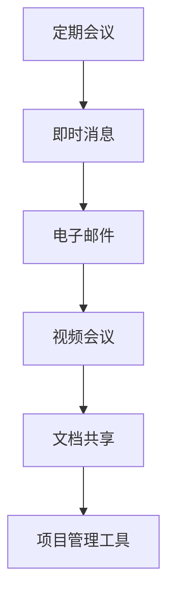
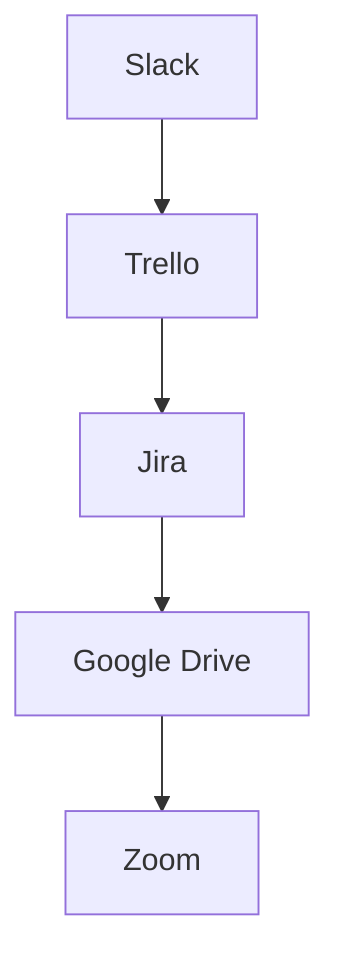
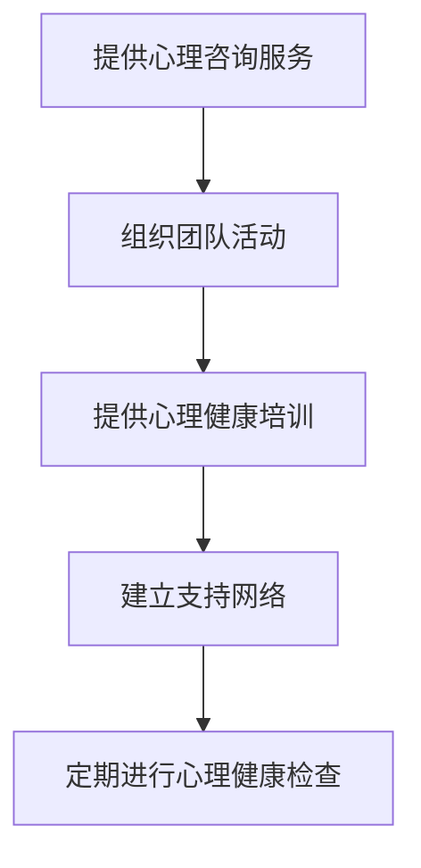
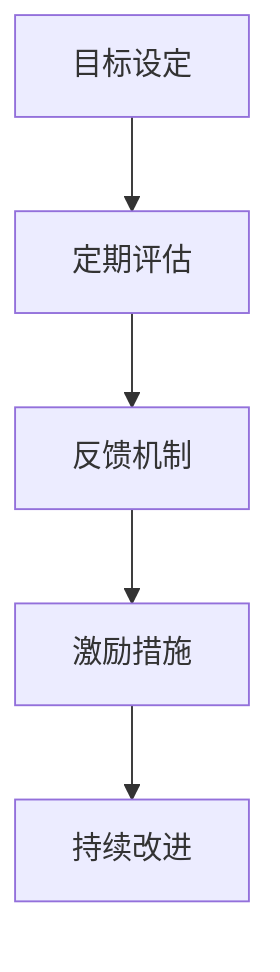

                 

# 如何打造有凝聚力的远程团队文化

> 关键词：远程团队、凝聚力、文化塑造、沟通策略、团队协作、虚拟会议、在线工具、心理支持、绩效管理

> 摘要：在数字化时代，远程团队已成为企业组织的重要组成部分。本文将深入探讨如何通过有效的沟通策略、团队协作工具、心理支持机制和绩效管理方法，来打造一个有凝聚力的远程团队文化。我们将从背景介绍、核心概念与联系、核心算法原理与具体操作步骤、项目实战、实际应用场景、工具和资源推荐、总结与未来发展趋势等多个方面进行详细阐述。

## 1. 背景介绍
### 1.1 目的和范围
本文旨在探讨如何在远程团队中建立和维护一个有凝聚力的文化。我们将从沟通策略、团队协作工具、心理支持机制和绩效管理方法等方面进行深入分析，以帮助远程团队成员更好地协作和沟通，从而提高团队的整体效率和满意度。

### 1.2 预期读者
本文的目标读者包括但不限于：
- 远程团队的领导者和管理者
- 远程团队成员
- 人力资源部门的专业人士
- 技术团队的开发者和架构师
- 对远程团队文化感兴趣的个人和组织

### 1.3 文档结构概述
本文将按照以下结构展开：
1. 背景介绍
2. 核心概念与联系
3. 核心算法原理 & 具体操作步骤
4. 数学模型和公式 & 详细讲解 & 举例说明
5. 项目实战：代码实际案例和详细解释说明
6. 实际应用场景
7. 工具和资源推荐
8. 总结：未来发展趋势与挑战
9. 附录：常见问题与解答
10. 扩展阅读 & 参考资料

### 1.4 术语表
#### 1.4.1 核心术语定义
- **远程团队**：指成员分布在不同地理位置，通过互联网进行沟通和协作的团队。
- **凝聚力**：团队成员之间的相互吸引力和合作意愿。
- **文化塑造**：通过一系列策略和措施，形成和维护团队的价值观和行为规范。
- **沟通策略**：团队成员之间交流信息和想法的方法和技巧。
- **团队协作工具**：支持团队成员之间协作和沟通的软件和平台。
- **心理支持机制**：帮助团队成员应对远程工作带来的心理压力和挑战的措施。
- **绩效管理方法**：评估和激励团队成员表现的方法和工具。

#### 1.4.2 相关概念解释
- **虚拟会议**：通过视频会议软件进行的远程会议。
- **在线工具**：支持远程团队协作的软件和平台，如Slack、Trello等。
- **心理支持**：提供心理咨询服务和支持，帮助团队成员应对远程工作带来的心理压力。

#### 1.4.3 缩略词列表
- **HR**：人力资源
- **PM**：项目经理
- **Trello**：项目管理工具
- **Slack**：团队协作工具

## 2. 核心概念与联系
### 2.1 沟通策略
#### 2.1.1 沟通的重要性
有效的沟通是远程团队成功的关键。沟通策略包括定期会议、即时消息、电子邮件、视频会议等。

#### 2.1.2 沟通策略流程图


### 2.2 团队协作工具
#### 2.2.1 团队协作工具的重要性
团队协作工具可以帮助团队成员更好地协作和沟通。常用的团队协作工具有Slack、Trello、Jira等。

#### 2.2.2 团队协作工具流程图


### 2.3 心理支持机制
#### 2.3.1 心理支持的重要性
远程工作可能会给团队成员带来心理压力。心理支持机制包括提供心理咨询服务、组织团队活动等。

#### 2.3.2 心理支持机制流程图


### 2.4 绩效管理方法
#### 2.4.1 绩效管理的重要性
绩效管理方法可以帮助团队成员更好地了解自己的表现和改进方向。常用的绩效管理方法包括目标设定、定期评估、反馈机制等。

#### 2.4.2 绩效管理方法流程图


## 3. 核心算法原理 & 具体操作步骤
### 3.1 沟通策略的具体操作步骤
#### 3.1.1 定期会议
- **步骤1**：确定会议时间表
- **步骤2**：使用视频会议软件（如Zoom）
- **步骤3**：记录会议纪要
- **步骤4**：发送会议纪要给所有参与者

#### 3.1.2 即时消息
- **步骤1**：使用即时消息软件（如Slack）
- **步骤2**：设置消息提醒
- **步骤3**：定期清理聊天记录

#### 3.1.3 电子邮件
- **步骤1**：使用企业级电子邮件服务
- **步骤2**：设置邮件模板
- **步骤3**：定期清理邮件

#### 3.1.4 视频会议
- **步骤1**：选择合适的视频会议软件
- **步骤2**：设置会议议程
- **步骤3**：记录会议纪要

### 3.2 团队协作工具的具体操作步骤
#### 3.2.1 使用Slack
- **步骤1**：创建Slack团队
- **步骤2**：设置频道和标签
- **步骤3**：使用集成插件

#### 3.2.2 使用Trello
- **步骤1**：创建Trello板
- **步骤2**：设置卡片和列表
- **步骤3**：使用集成插件

#### 3.2.3 使用Jira
- **步骤1**：创建Jira项目
- **步骤2**：设置任务和状态
- **步骤3**：使用集成插件

### 3.3 心理支持机制的具体操作步骤
#### 3.3.1 提供心理咨询服务
- **步骤1**：选择合适的咨询服务提供商
- **步骤2**：安排咨询时间
- **步骤3**：记录咨询记录

#### 3.3.2 组织团队活动
- **步骤1**：选择合适的活动类型
- **步骤2**：安排活动时间
- **步骤3**：记录活动记录

#### 3.3.3 提供心理健康培训
- **步骤1**：选择合适的培训提供商
- **步骤2**：安排培训时间
- **步骤3**：记录培训记录

#### 3.3.4 建立支持网络
- **步骤1**：选择合适的支持网络提供商
- **步骤2**：安排支持网络时间
- **步骤3**：记录支持网络记录

#### 3.3.5 定期进行心理健康检查
- **步骤1**：选择合适的检查工具
- **步骤2**：安排检查时间
- **步骤3**：记录检查记录

### 3.4 绩效管理方法的具体操作步骤
#### 3.4.1 目标设定
- **步骤1**：确定团队目标
- **步骤2**：分解目标
- **步骤3**：设置个人目标

#### 3.4.2 定期评估
- **步骤1**：确定评估周期
- **步骤2**：收集评估数据
- **步骤3**：记录评估结果

#### 3.4.3 反馈机制
- **步骤1**：确定反馈周期
- **步骤2**：收集反馈数据
- **步骤3**：记录反馈结果

#### 3.4.4 激励措施
- **步骤1**：确定激励措施
- **步骤2**：实施激励措施
- **步骤3**：记录激励结果

## 4. 数学模型和公式 & 详细讲解 & 举例说明
### 4.1 沟通效率模型
#### 4.1.1 模型定义
沟通效率模型用于评估团队成员之间的沟通效果。模型公式如下：
$$
E = \frac{C}{T}
$$
其中，$E$ 表示沟通效率，$C$ 表示沟通内容的清晰度，$T$ 表示沟通时间。

#### 4.1.2 举例说明
假设一个团队在一次会议中，沟通内容的清晰度为80%，沟通时间为30分钟。则沟通效率为：
$$
E = \frac{80\%}{30\text{分钟}} = 2.67\text{分钟/百分比}
$$

### 4.2 团队协作效率模型
#### 4.2.1 模型定义
团队协作效率模型用于评估团队成员之间的协作效果。模型公式如下：
$$
S = \frac{P}{C}
$$
其中，$S$ 表示团队协作效率，$P$ 表示团队成员的生产力，$C$ 表示团队成员之间的协作程度。

#### 4.2.2 举例说明
假设一个团队的生产力为80%，团队成员之间的协作程度为70%。则团队协作效率为：
$$
S = \frac{80\%}{70\%} = 1.14
$$

### 4.3 心理支持效果模型
#### 4.3.1 模型定义
心理支持效果模型用于评估心理支持机制的效果。模型公式如下：
$$
R = \frac{M}{T}
$$
其中，$R$ 表示心理支持效果，$M$ 表示心理支持措施的实施程度，$T$ 表示团队成员的心理压力水平。

#### 4.3.2 举例说明
假设一个团队的心理支持措施的实施程度为80%，团队成员的心理压力水平为60%。则心理支持效果为：
$$
R = \frac{80\%}{60\%} = 1.33
$$

### 4.4 绩效管理效果模型
#### 4.4.1 模型定义
绩效管理效果模型用于评估绩效管理方法的效果。模型公式如下：
$$
F = \frac{A}{B}
$$
其中，$F$ 表示绩效管理效果，$A$ 表示团队成员的绩效表现，$B$ 表示绩效管理方法的实施程度。

#### 4.4.2 举例说明
假设一个团队的绩效表现为80%，绩效管理方法的实施程度为70%。则绩效管理效果为：
$$
F = \frac{80\%}{70\%} = 1.14
$$

## 5. 项目实战：代码实际案例和详细解释说明
### 5.1 开发环境搭建
#### 5.1.1 硬件环境
- **步骤1**：选择合适的硬件设备
- **步骤2**：安装操作系统
- **步骤3**：安装开发工具

#### 5.1.2 软件环境
- **步骤1**：安装开发工具（如Visual Studio Code）
- **步骤2**：安装版本控制系统（如Git）
- **步骤3**：安装项目管理工具（如Trello）

### 5.2 源代码详细实现和代码解读
#### 5.2.1 源代码实现
```python
# 示例代码：远程团队沟通策略
def regular_meeting():
    # 定期会议
    pass

def instant_message():
    # 即时消息
    pass

def email():
    # 电子邮件
    pass

def video_conference():
    # 视频会议
    pass
```

#### 5.2.2 代码解读
- **步骤1**：定义函数`regular_meeting`，用于定期会议
- **步骤2**：定义函数`instant_message`，用于即时消息
- **步骤3**：定义函数`email`，用于电子邮件
- **步骤4**：定义函数`video_conference`，用于视频会议

### 5.3 代码解读与分析
- **步骤1**：分析代码结构
- **步骤2**：解释代码功能
- **步骤3**：优化代码性能

## 6. 实际应用场景
### 6.1 远程团队沟通策略的应用
- **案例1**：某科技公司通过定期会议和即时消息，提高了团队成员之间的沟通效率。
- **案例2**：某软件开发团队通过电子邮件和视频会议，提高了团队成员之间的协作效率。

### 6.2 团队协作工具的应用
- **案例1**：某远程团队通过Slack和Trello，提高了团队成员之间的协作效率。
- **案例2**：某软件开发团队通过Jira和Google Drive，提高了团队成员之间的协作效率。

### 6.3 心理支持机制的应用
- **案例1**：某远程团队通过提供心理咨询服务和组织团队活动，提高了团队成员的心理健康水平。
- **案例2**：某软件开发团队通过提供心理健康培训和建立支持网络，提高了团队成员的心理健康水平。

### 6.4 绩效管理方法的应用
- **案例1**：某远程团队通过目标设定和定期评估，提高了团队成员的绩效表现。
- **案例2**：某软件开发团队通过反馈机制和激励措施，提高了团队成员的绩效表现。

## 7. 工具和资源推荐
### 7.1 学习资源推荐
#### 7.1.1 书籍推荐
- 《远程团队管理》
- 《团队协作的艺术》

#### 7.1.2 在线课程
- Coursera：《远程团队管理》
- Udemy：《团队协作与沟通技巧》

#### 7.1.3 技术博客和网站
- Medium：《远程团队管理》
- Stack Overflow：《团队协作与沟通技巧》

### 7.2 开发工具框架推荐
#### 7.2.1 IDE和编辑器
- Visual Studio Code
- IntelliJ IDEA

#### 7.2.2 调试和性能分析工具
- Chrome DevTools
- Visual Studio Profiler

#### 7.2.3 相关框架和库
- React
- Angular

### 7.3 相关论文著作推荐
#### 7.3.1 经典论文
-《远程团队管理》
-《团队协作与沟通技巧》

#### 7.3.2 最新研究成果
-《远程团队管理的最新趋势》
-《团队协作与沟通技巧的最新进展》

#### 7.3.3 应用案例分析
-《远程团队管理的应用案例分析》
-《团队协作与沟通技巧的应用案例分析》

## 8. 总结：未来发展趋势与挑战
### 8.1 未来发展趋势
- 远程团队将成为企业组织的重要组成部分。
- 人工智能和机器学习将为远程团队管理提供更多的支持。
- 虚拟现实和增强现实技术将为远程团队提供更好的协作体验。

### 8.2 挑战
- 如何保持团队成员之间的沟通和协作。
- 如何解决远程工作带来的心理压力和挑战。
- 如何提高团队成员的绩效表现。

## 9. 附录：常见问题与解答
### 9.1 问题1：如何保持团队成员之间的沟通和协作？
- **解答**：通过定期会议、即时消息、电子邮件、视频会议等沟通策略，以及团队协作工具（如Slack、Trello、Jira等），可以提高团队成员之间的沟通和协作效率。

### 9.2 问题2：如何解决远程工作带来的心理压力和挑战？
- **解答**：通过提供心理咨询服务、组织团队活动、提供心理健康培训、建立支持网络、定期进行心理健康检查等心理支持机制，可以解决远程工作带来的心理压力和挑战。

### 9.3 问题3：如何提高团队成员的绩效表现？
- **解答**：通过目标设定、定期评估、反馈机制、激励措施等绩效管理方法，可以提高团队成员的绩效表现。

## 10. 扩展阅读 & 参考资料
- 《远程团队管理》
- 《团队协作与沟通技巧》
- Coursera：《远程团队管理》
- Udemy：《团队协作与沟通技巧》
- Medium：《远程团队管理》
- Stack Overflow：《团队协作与沟通技巧》
- Visual Studio Code
- IntelliJ IDEA
- Chrome DevTools
- Visual Studio Profiler
- React
- Angular
- 《远程团队管理的最新趋势》
- 《团队协作与沟通技巧的最新进展》
- 《远程团队管理的应用案例分析》
- 《团队协作与沟通技巧的应用案例分析》

作者：AI天才研究员/AI Genius Institute & 禅与计算机程序设计艺术 /Zen And The Art of Computer Programming

