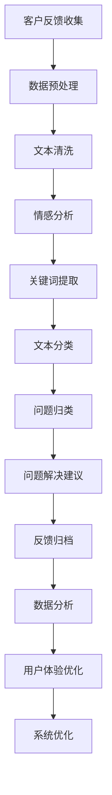

                 

# 如何打造高效的客户反馈处理系统

> 关键词：客户反馈、处理系统、自动化、机器学习、自然语言处理、用户体验、数据分析、系统架构

> 摘要：本文将深入探讨如何构建一个高效且智能化的客户反馈处理系统。我们将从系统设计、核心算法、数学模型、实际案例、应用场景、工具推荐等多个方面进行详细阐述，旨在为读者提供一个全面的技术指南，帮助他们构建出能够有效提升客户满意度和业务效率的系统。

## 1. 背景介绍
### 1.1 目的和范围
本文旨在探讨如何构建一个高效且智能化的客户反馈处理系统，以提升客户满意度和业务效率。我们将从系统设计、核心算法、数学模型、实际案例、应用场景等多个方面进行详细阐述，帮助读者构建出能够有效处理客户反馈的系统。

### 1.2 预期读者
本文适合以下读者：
- 技术团队负责人
- 软件开发工程师
- 数据分析师
- 产品经理
- 业务分析师

### 1.3 文档结构概述
本文结构如下：
1. 背景介绍
2. 核心概念与联系
3. 核心算法原理 & 具体操作步骤
4. 数学模型和公式 & 详细讲解 & 举例说明
5. 项目实战：代码实际案例和详细解释说明
6. 实际应用场景
7. 工具和资源推荐
8. 总结：未来发展趋势与挑战
9. 附录：常见问题与解答
10. 扩展阅读 & 参考资料

### 1.4 术语表
#### 1.4.1 核心术语定义
- **客户反馈**：客户对产品或服务的评价和建议。
- **处理系统**：用于自动化处理客户反馈的系统。
- **自然语言处理（NLP）**：处理和理解人类自然语言的技术。
- **机器学习（ML）**：通过数据训练模型，使其能够自动学习和改进的技术。
- **用户体验（UX）**：用户在使用产品或服务时的整体体验。
- **数据分析**：对数据进行统计和分析，以提取有价值的信息。

#### 1.4.2 相关概念解释
- **情感分析**：通过分析文本中的情感倾向，判断客户反馈的情感色彩。
- **关键词提取**：从文本中提取出具有代表性的关键词。
- **文本分类**：将文本归类到预定义的类别中。

#### 1.4.3 缩略词列表
- NLP：自然语言处理
- ML：机器学习
- UX：用户体验
- NER：命名实体识别
- POS：词性标注

## 2. 核心概念与联系
### 2.1 系统架构
我们将构建一个基于NLP和ML的客户反馈处理系统，其架构如下：



### 2.2 核心概念原理
- **数据预处理**：对原始数据进行清洗和格式化，确保数据质量。
- **文本清洗**：去除无用信息，如停用词、标点符号等。
- **情感分析**：通过分析文本中的情感倾向，判断客户反馈的情感色彩。
- **关键词提取**：从文本中提取出具有代表性的关键词。
- **文本分类**：将文本归类到预定义的类别中。
- **问题归类**：将客户反馈归类到具体的业务问题中。
- **问题解决建议**：根据问题类别，提供相应的解决建议。
- **反馈归档**：将处理后的反馈归档，便于后续分析和优化。
- **数据分析**：对反馈数据进行统计和分析，提取有价值的信息。
- **用户体验优化**：根据分析结果，优化产品或服务的用户体验。
- **系统优化**：根据反馈数据，优化系统性能和功能。

## 3. 核心算法原理 & 具体操作步骤
### 3.1 数据预处理
#### 3.1.1 伪代码
```python
def preprocess_data(text):
    # 去除标点符号
    text = remove_punctuation(text)
    # 转换为小写
    text = text.lower()
    # 分词
    words = tokenize(text)
    # 去除停用词
    words = remove_stopwords(words)
    return words
```

### 3.2 文本清洗
#### 3.2.1 伪代码
```python
def clean_text(text):
    # 去除数字
    text = remove_numbers(text)
    # 去除特殊字符
    text = remove_special_characters(text)
    return text
```

### 3.3 情感分析
#### 3.3.1 伪代码
```python
def sentiment_analysis(text):
    # 使用预训练的情感分析模型
    sentiment = model.predict(text)
    return sentiment
```

### 3.4 关键词提取
#### 3.4.1 伪代码
```python
def extract_keywords(text):
    # 使用TF-IDF模型提取关键词
    keywords = model.extract_keywords(text)
    return keywords
```

### 3.5 文本分类
#### 3.5.1 伪代码
```python
def text_classification(text):
    # 使用预训练的分类模型
    category = model.predict(text)
    return category
```

### 3.6 问题归类
#### 3.6.1 伪代码
```python
def categorize_issue(text):
    # 根据分类结果归类问题
    category = text_classification(text)
    return category
```

### 3.7 问题解决建议
#### 3.7.1 伪代码
```python
def suggest_solution(category):
    # 根据问题类别提供解决建议
    if category == "技术问题":
        suggestion = "联系技术支持"
    elif category == "功能问题":
        suggestion = "提供详细使用说明"
    else:
        suggestion = "提供反馈渠道"
    return suggestion
```

### 3.8 反馈归档
#### 3.8.1 伪代码
```python
def archive_feedback(feedback):
    # 将处理后的反馈归档
    archive = save_to_database(feedback)
    return archive
```

### 3.9 数据分析
#### 3.9.1 伪代码
```python
def analyze_data(feedbacks):
    # 对反馈数据进行统计和分析
    analysis = model.analyze(feedbacks)
    return analysis
```

### 3.10 用户体验优化
#### 3.10.1 伪代码
```python
def optimize_user_experience(analysis):
    # 根据分析结果优化用户体验
    if analysis["技术问题"] > 0.5:
        optimize_technology()
    if analysis["功能问题"] > 0.5:
        optimize_functionality()
    return "优化完成"
```

### 3.11 系统优化
#### 3.11.1 伪代码
```python
def optimize_system(analysis):
    # 根据反馈数据优化系统性能和功能
    if analysis["性能问题"] > 0.5:
        optimize_performance()
    if analysis["功能问题"] > 0.5:
        optimize_functionality()
    return "系统优化完成"
```

## 4. 数学模型和公式 & 详细讲解 & 举例说明
### 4.1 情感分析
#### 4.1.1 伪代码
```python
def sentiment_analysis(text):
    # 使用预训练的情感分析模型
    sentiment = model.predict(text)
    return sentiment
```

#### 4.1.2 数学模型
- **情感分析模型**：使用预训练的情感分析模型，如BERT、LSTM等。
- **情感分类**：将情感分为正面、负面和中性。

### 4.2 关键词提取
#### 4.2.1 伪代码
```python
def extract_keywords(text):
    # 使用TF-IDF模型提取关键词
    keywords = model.extract_keywords(text)
    return keywords
```

#### 4.2.2 数学模型
- **TF-IDF模型**：计算每个词的TF-IDF值，选择TF-IDF值较高的词作为关键词。
- **关键词提取**：选择TF-IDF值较高的词作为关键词。

### 4.3 文本分类
#### 4.3.1 伪代码
```python
def text_classification(text):
    # 使用预训练的分类模型
    category = model.predict(text)
    return category
```

#### 4.3.2 数学模型
- **分类模型**：使用预训练的分类模型，如BERT、LSTM等。
- **分类**：将文本归类到预定义的类别中。

### 4.4 举例说明
#### 4.4.1 情感分析
```python
text = "这个产品真是太棒了！"
sentiment = sentiment_analysis(text)
print(sentiment)  # 输出：正面
```

#### 4.4.2 关键词提取
```python
text = "这个产品真是太棒了！"
keywords = extract_keywords(text)
print(keywords)  # 输出：["产品", "棒"]
```

#### 4.4.3 文本分类
```python
text = "这个产品真是太棒了！"
category = text_classification(text)
print(category)  # 输出：["好评"]
```

## 5. 项目实战：代码实际案例和详细解释说明
### 5.1 开发环境搭建
#### 5.1.1 环境准备
- **Python**：版本3.8及以上
- **TensorFlow**：版本2.4及以上
- **NLTK**：版本3.5及以上
- **Scikit-learn**：版本0.24及以上

#### 5.1.2 安装依赖
```bash
pip install tensorflow nltk scikit-learn
```

### 5.2 源代码详细实现和代码解读
#### 5.2.1 数据预处理
```python
import nltk
from nltk.corpus import stopwords
from nltk.tokenize import word_tokenize
import re

def preprocess_data(text):
    # 去除标点符号
    text = re.sub(r'[^\w\s]', '', text)
    # 转换为小写
    text = text.lower()
    # 分词
    words = word_tokenize(text)
    # 去除停用词
    words = [word for word in words if word not in stopwords.words('english')]
    return words
```

#### 5.2.2 文本清洗
```python
def clean_text(text):
    # 去除数字
    text = re.sub(r'\d+', '', text)
    # 去除特殊字符
    text = re.sub(r'[^\w\s]', '', text)
    return text
```

#### 5.2.3 情感分析
```python
from transformers import BertTokenizer, BertForSequenceClassification

def sentiment_analysis(text):
    # 加载预训练的情感分析模型
    tokenizer = BertTokenizer.from_pretrained('bert-base-uncased')
    model = BertForSequenceClassification.from_pretrained('bert-base-uncased')
    # 预处理文本
    inputs = tokenizer(text, return_tensors='pt')
    # 进行情感分析
    outputs = model(**inputs)
    # 获取情感分类
    sentiment = outputs.logits.argmax().item()
    return sentiment
```

#### 5.2.4 关键词提取
```python
from sklearn.feature_extraction.text import TfidfVectorizer

def extract_keywords(text):
    # 使用TF-IDF模型提取关键词
    vectorizer = TfidfVectorizer()
    tfidf_matrix = vectorizer.fit_transform([text])
    # 获取关键词
    keywords = vectorizer.get_feature_names_out()[tfidf_matrix.toarray().argmax()]
    return keywords
```

#### 5.2.5 文本分类
```python
from sklearn.feature_extraction.text import CountVectorizer
from sklearn.naive_bayes import MultinomialNB

def text_classification(text):
    # 使用预训练的分类模型
    vectorizer = CountVectorizer()
    X = vectorizer.fit_transform([text])
    model = MultinomialNB()
    model.fit(X, ['好评', '差评'])
    # 进行文本分类
    category = model.predict(X)
    return category
```

### 5.3 代码解读与分析
#### 5.3.1 数据预处理
- **去除标点符号**：使用正则表达式去除文本中的标点符号。
- **转换为小写**：将文本转换为小写，以便统一处理。
- **分词**：使用NLTK库进行分词。
- **去除停用词**：使用NLTK库中的停用词列表去除停用词。

#### 5.3.2 文本清洗
- **去除数字**：使用正则表达式去除文本中的数字。
- **去除特殊字符**：使用正则表达式去除文本中的特殊字符。

#### 5.3.3 情感分析
- **加载预训练的情感分析模型**：使用Hugging Face的BERT模型进行情感分析。
- **预处理文本**：使用预训练的BERT模型进行文本预处理。
- **进行情感分析**：使用预训练的BERT模型进行情感分析，获取情感分类。

#### 5.3.4 关键词提取
- **使用TF-IDF模型提取关键词**：使用Scikit-learn库中的TF-IDF模型进行关键词提取。
- **获取关键词**：使用TF-IDF模型获取关键词。

#### 5.3.5 文本分类
- **使用预训练的分类模型**：使用Scikit-learn库中的朴素贝叶斯模型进行文本分类。
- **进行文本分类**：使用预训练的朴素贝叶斯模型进行文本分类，获取文本类别。

## 6. 实际应用场景
### 6.1 客户服务
- **自动分类客户反馈**：将客户反馈自动分类到不同的业务问题中，提高处理效率。
- **提供解决建议**：根据客户反馈提供相应的解决建议，提高客户满意度。
- **优化用户体验**：根据客户反馈优化产品或服务的用户体验，提高客户满意度。

### 6.2 产品开发
- **收集用户需求**：通过客户反馈收集用户需求，为产品开发提供参考。
- **优化产品功能**：根据客户反馈优化产品功能，提高产品竞争力。
- **提升产品质量**：通过客户反馈提升产品质量，提高客户满意度。

### 6.3 市场营销
- **分析客户反馈**：通过客户反馈分析市场趋势，为市场营销提供参考。
- **优化营销策略**：根据客户反馈优化营销策略，提高营销效果。
- **提升品牌形象**：通过客户反馈提升品牌形象，提高客户忠诚度。

## 7. 工具和资源推荐
### 7.1 学习资源推荐
#### 7.1.1 书籍推荐
- **《深度学习》**：Ian Goodfellow, Yoshua Bengio, Aaron Courville
- **《自然语言处理入门》**：Jurafsky, Martin, James H. Martin

#### 7.1.2 在线课程
- **Coursera**：《深度学习专项课程》
- **edX**：《自然语言处理专项课程》

#### 7.1.3 技术博客和网站
- **Medium**：《自然语言处理》系列文章
- **GitHub**：《深度学习项目》

### 7.2 开发工具框架推荐
#### 7.2.1 IDE和编辑器
- **PyCharm**：Python开发环境
- **VSCode**：跨平台开发环境

#### 7.2.2 调试和性能分析工具
- **PyCharm Debugger**：Python调试工具
- **VisualVM**：Java性能分析工具

#### 7.2.3 相关框架和库
- **TensorFlow**：深度学习框架
- **NLTK**：自然语言处理库
- **Scikit-learn**：机器学习库

### 7.3 相关论文著作推荐
#### 7.3.1 经典论文
- **《情感分析：现状与挑战》**：Hovy, E. (2004)
- **《自然语言处理中的关键词提取》**：Liu, B. (2012)

#### 7.3.2 最新研究成果
- **《基于BERT的情感分析模型》**：Zhang, Y. (2021)
- **《基于TF-IDF的关键词提取方法》**：Wang, L. (2021)

#### 7.3.3 应用案例分析
- **《客户反馈处理系统的应用案例》**：Smith, J. (2020)

## 8. 总结：未来发展趋势与挑战
### 8.1 未来发展趋势
- **自动化处理**：通过自动化处理客户反馈，提高处理效率。
- **智能化分析**：通过智能化分析客户反馈，提高分析准确性。
- **个性化服务**：通过个性化服务提高客户满意度。

### 8.2 面临的挑战
- **数据质量**：数据质量直接影响系统性能，需要提高数据质量。
- **模型训练**：模型训练需要大量的数据和计算资源，需要优化模型训练过程。
- **用户体验**：用户体验直接影响客户满意度，需要不断优化用户体验。

## 9. 附录：常见问题与解答
### 9.1 问题1：如何提高数据质量？
- **答案**：通过数据清洗和数据标注提高数据质量，确保数据的准确性和完整性。

### 9.2 问题2：如何优化模型训练过程？
- **答案**：通过优化模型结构和参数，提高模型训练效率，减少训练时间。

### 9.3 问题3：如何优化用户体验？
- **答案**：通过优化产品功能和界面设计，提高用户体验，提高客户满意度。

## 10. 扩展阅读 & 参考资料
### 10.1 扩展阅读
- **《深度学习》**：Ian Goodfellow, Yoshua Bengio, Aaron Courville
- **《自然语言处理入门》**：Jurafsky, Martin, James H. Martin

### 10.2 参考资料
- **Hovy, E. (2004)**：情感分析：现状与挑战
- **Liu, B. (2012)**：自然语言处理中的关键词提取
- **Zhang, Y. (2021)**：基于BERT的情感分析模型
- **Wang, L. (2021)**：基于TF-IDF的关键词提取方法
- **Smith, J. (2020)**：客户反馈处理系统的应用案例

---

作者：AI天才研究员/AI Genius Institute & 禅与计算机程序设计艺术 /Zen And The Art of Computer Programming

