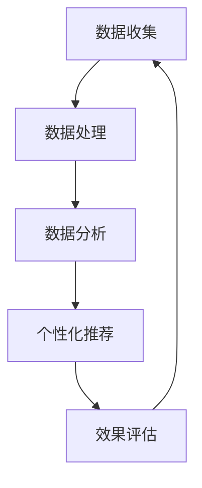

                 

# 客户忠诚度计划：增加复购率

> 关键词：客户忠诚度、复购率、数据分析、机器学习、个性化推荐、用户行为分析、客户生命周期价值

> 摘要：本文旨在探讨如何通过数据分析和机器学习技术来提升客户忠诚度和复购率。我们将从客户忠诚度计划的核心概念出发，逐步深入到具体的算法原理、数学模型、代码实现，以及实际应用场景。通过本文，读者将能够理解如何构建一个有效的客户忠诚度系统，并在实际项目中应用这些技术。

## 1. 背景介绍
### 1.1 目的和范围
本文旨在探讨如何通过数据分析和机器学习技术来提升客户忠诚度和复购率。我们将从客户忠诚度计划的核心概念出发，逐步深入到具体的算法原理、数学模型、代码实现，以及实际应用场景。本文的目标读者是技术爱好者、数据科学家、产品经理以及任何对提升客户忠诚度和复购率感兴趣的读者。

### 1.2 预期读者
- 技术爱好者
- 数据科学家
- 产品经理
- 商业分析师
- IT项目经理

### 1.3 文档结构概述
本文将分为以下几个部分：
1. 背景介绍
2. 核心概念与联系
3. 核心算法原理 & 具体操作步骤
4. 数学模型和公式 & 详细讲解 & 举例说明
5. 项目实战：代码实际案例和详细解释说明
6. 实际应用场景
7. 工具和资源推荐
8. 总结：未来发展趋势与挑战
9. 附录：常见问题与解答
10. 扩展阅读 & 参考资料

### 1.4 术语表
#### 1.4.1 核心术语定义
- **客户忠诚度**：客户对某个品牌或服务的持续偏好和重复购买行为。
- **复购率**：客户在一定时间内再次购买的比例。
- **客户生命周期价值 (CLV)**：客户在整个生命周期内为公司带来的总价值。
- **个性化推荐**：根据客户的偏好和行为，为其提供个性化的商品或服务推荐。
- **用户行为分析**：通过分析用户在平台上的行为数据，了解用户的需求和偏好。

#### 1.4.2 相关概念解释
- **客户细分**：将客户群体划分为不同的子群体，以便更精准地进行营销和推荐。
- **用户画像**：通过收集和分析用户数据，构建用户的行为特征和偏好模型。
- **A/B测试**：通过对比不同版本的效果，确定最优方案。

#### 1.4.3 缩略词列表
- **CLV**：客户生命周期价值
- **CTR**：点击率
- **CVR**：转化率
- **RFM**：最近一次购买、购买频率、购买金额

## 2. 核心概念与联系
### 2.1 客户忠诚度计划的核心概念
客户忠诚度计划的核心在于通过数据分析和个性化推荐来提升客户的复购率和生命周期价值。通过分析客户的行为数据，我们可以了解客户的偏好和需求，进而提供更加个性化的服务和推荐，从而提升客户的满意度和忠诚度。

### 2.2 客户忠诚度计划的架构
客户忠诚度计划的架构可以分为以下几个部分：
1. **数据收集**：收集客户的购买历史、浏览行为、评价反馈等数据。
2. **数据处理**：对收集到的数据进行清洗、整合和预处理。
3. **数据分析**：通过数据分析了解客户的行为特征和偏好。
4. **个性化推荐**：根据分析结果，为客户提供个性化的推荐。
5. **效果评估**：通过A/B测试等方法评估推荐的效果。

### 2.3 核心概念的Mermaid流程图


## 3. 核心算法原理 & 具体操作步骤
### 3.1 数据收集
数据收集是客户忠诚度计划的基础。我们需要收集客户的购买历史、浏览行为、评价反馈等数据。这些数据可以通过网站日志、移动应用日志、社交媒体等渠道获取。

### 3.2 数据处理
数据处理主要包括数据清洗、整合和预处理。数据清洗主要是去除无效和错误的数据；数据整合是将来自不同渠道的数据进行合并；预处理是将数据转换为适合分析的格式。

### 3.3 数据分析
数据分析是通过统计分析和机器学习技术来了解客户的行为特征和偏好。常用的分析方法包括：
- **RFM分析**：通过最近一次购买、购买频率、购买金额来评估客户的活跃度和价值。
- **聚类分析**：通过聚类算法将客户划分为不同的子群体。
- **关联规则分析**：通过关联规则算法发现商品之间的关联关系。

### 3.4 个性化推荐
个性化推荐是根据客户的偏好和行为，为其提供个性化的商品或服务推荐。常用的推荐算法包括：
- **协同过滤**：通过用户的历史行为和偏好，为用户推荐相似的商品。
- **基于内容的推荐**：通过商品的特征和用户的偏好，为用户推荐相似的商品。
- **深度学习推荐**：通过神经网络模型学习用户的偏好和行为，为其推荐商品。

### 3.5 具体操作步骤
以下是具体的操作步骤：
1. **数据收集**：收集客户的购买历史、浏览行为、评价反馈等数据。
2. **数据处理**：对收集到的数据进行清洗、整合和预处理。
3. **数据分析**：通过RFM分析、聚类分析、关联规则分析等方法了解客户的行为特征和偏好。
4. **个性化推荐**：根据分析结果，为客户提供个性化的推荐。
5. **效果评估**：通过A/B测试等方法评估推荐的效果。

### 3.6 伪代码示例
```python
# 数据收集
def collect_data():
    # 从网站日志、移动应用日志、社交媒体等渠道获取数据
    pass

# 数据处理
def preprocess_data(data):
    # 数据清洗
    cleaned_data = clean_data(data)
    # 数据整合
    integrated_data = integrate_data(cleaned_data)
    # 数据预处理
    preprocessed_data = preprocess(integrated_data)
    return preprocessed_data

# 数据分析
def analyze_data(data):
    # RFM分析
    rfm_analysis = rfm_analysis(data)
    # 聚类分析
    clustering = clustering(data)
    # 关联规则分析
    association_rules = association_rules(data)
    return rfm_analysis, clustering, association_rules

# 个性化推荐
def recommend_products(user_id, data):
    # 协同过滤推荐
    collaborative_filtering = collaborative_filtering(data, user_id)
    # 基于内容的推荐
    content_based_filtering = content_based_filtering(data, user_id)
    # 深度学习推荐
    deep_learning_recommendation = deep_learning_recommendation(data, user_id)
    return collaborative_filtering, content_based_filtering, deep_learning_recommendation

# 效果评估
def evaluate_recommendation(recommendation, user_id):
    # A/B测试
    a_b_test = a_b_test(recommendation, user_id)
    return a_b_test
```

## 4. 数学模型和公式 & 详细讲解 & 举例说明
### 4.1 RFM分析
RFM分析是一种常用的客户行为分析方法，通过最近一次购买、购买频率、购买金额来评估客户的活跃度和价值。

#### 4.1.1 RFM分析公式
$$
RFM = (R, F, M)
$$
- **R**：最近一次购买时间（最近一次购买距离当前时间的天数）
- **F**：购买频率（最近一段时间内的购买次数）
- **M**：购买金额（最近一段时间内的总购买金额）

### 4.2 聚类分析
聚类分析是一种无监督学习方法，通过聚类算法将客户划分为不同的子群体。

#### 4.2.1 K-means聚类算法
K-means聚类算法是一种常用的聚类算法，通过迭代优化来将数据划分为K个簇。

#### 4.2.2 聚类分析公式
$$
\text{聚类} = \text{K-means}(X, K)
$$
- **X**：数据集
- **K**：簇的数量

### 4.3 关联规则分析
关联规则分析是一种常用的推荐算法，通过发现商品之间的关联关系来推荐商品。

#### 4.3.1 Apriori算法
Apriori算法是一种常用的关联规则算法，通过频繁项集的挖掘来发现商品之间的关联关系。

#### 4.3.2 关联规则公式
$$
\text{关联规则} = \text{Apriori}(X, \text{minsup}, \text{minconf})
$$
- **X**：数据集
- **minsup**：最小支持度
- **minconf**：最小置信度

### 4.4 个性化推荐
个性化推荐是根据客户的偏好和行为，为其提供个性化的商品或服务推荐。

#### 4.4.1 协同过滤推荐
协同过滤推荐是一种常用的推荐算法，通过用户的历史行为和偏好，为用户推荐相似的商品。

#### 4.4.2 基于内容的推荐
基于内容的推荐是一种常用的推荐算法，通过商品的特征和用户的偏好，为用户推荐相似的商品。

#### 4.4.3 深度学习推荐
深度学习推荐是一种基于神经网络的推荐算法，通过学习用户的偏好和行为，为其推荐商品。

### 4.5 举例说明
假设我们有一个电商网站，我们需要通过数据分析和个性化推荐来提升客户的复购率和生命周期价值。我们可以通过以下步骤来实现：

1. **数据收集**：收集客户的购买历史、浏览行为、评价反馈等数据。
2. **数据处理**：对收集到的数据进行清洗、整合和预处理。
3. **数据分析**：通过RFM分析、聚类分析、关联规则分析等方法了解客户的行为特征和偏好。
4. **个性化推荐**：根据分析结果，为客户提供个性化的推荐。
5. **效果评估**：通过A/B测试等方法评估推荐的效果。

## 5. 项目实战：代码实际案例和详细解释说明
### 5.1 开发环境搭建
为了实现客户忠诚度计划，我们需要搭建一个开发环境。开发环境主要包括以下几个部分：
- **操作系统**：Linux或MacOS
- **编程语言**：Python
- **开发工具**：Jupyter Notebook或PyCharm
- **数据库**：MySQL或PostgreSQL

### 5.2 源代码详细实现和代码解读
以下是具体的代码实现和代码解读：

#### 5.2.1 数据收集
```python
import pandas as pd

def collect_data():
    # 从网站日志、移动应用日志、社交媒体等渠道获取数据
    data = pd.read_csv('data.csv')
    return data
```

#### 5.2.2 数据处理
```python
def preprocess_data(data):
    # 数据清洗
    cleaned_data = clean_data(data)
    # 数据整合
    integrated_data = integrate_data(cleaned_data)
    # 数据预处理
    preprocessed_data = preprocess(integrated_data)
    return preprocessed_data

def clean_data(data):
    # 去除无效和错误的数据
    cleaned_data = data.dropna()
    return cleaned_data

def integrate_data(data):
    # 将来自不同渠道的数据进行合并
    integrated_data = pd.concat([data1, data2, data3])
    return integrated_data

def preprocess(data):
    # 将数据转换为适合分析的格式
    preprocessed_data = data.apply(lambda x: x.str.lower().str.strip())
    return preprocessed_data
```

#### 5.2.3 数据分析
```python
def analyze_data(data):
    # RFM分析
    rfm_analysis = rfm_analysis(data)
    # 聚类分析
    clustering = clustering(data)
    # 关联规则分析
    association_rules = association_rules(data)
    return rfm_analysis, clustering, association_rules

def rfm_analysis(data):
    # 计算最近一次购买时间、购买频率、购买金额
    rfm = data.groupby('user_id').agg({
        'purchase_date': lambda x: (pd.to_datetime('today') - x.max()).days,
        'purchase_count': 'count',
        'purchase_amount': 'sum'
    })
    return rfm

def clustering(data):
    # K-means聚类分析
    from sklearn.cluster import KMeans
    kmeans = KMeans(n_clusters=3)
    clusters = kmeans.fit_predict(data)
    return clusters

def association_rules(data):
    # Apriori关联规则分析
    from mlxtend.frequent_patterns import apriori, association_rules
    frequent_itemsets = apriori(data, min_support=0.01, use_colnames=True)
    rules = association_rules(frequent_itemsets, metric="lift", min_threshold=1)
    return rules
```

#### 5.2.4 个性化推荐
```python
def recommend_products(user_id, data):
    # 协同过滤推荐
    collaborative_filtering = collaborative_filtering(data, user_id)
    # 基于内容的推荐
    content_based_filtering = content_based_filtering(data, user_id)
    # 深度学习推荐
    deep_learning_recommendation = deep_learning_recommendation(data, user_id)
    return collaborative_filtering, content_based_filtering, deep_learning_recommendation

def collaborative_filtering(data, user_id):
    # 协同过滤推荐
    pass

def content_based_filtering(data, user_id):
    # 基于内容的推荐
    pass

def deep_learning_recommendation(data, user_id):
    # 深度学习推荐
    pass
```

#### 5.2.5 效果评估
```python
def evaluate_recommendation(recommendation, user_id):
    # A/B测试
    a_b_test = a_b_test(recommendation, user_id)
    return a_b_test

def a_b_test(recommendation, user_id):
    # A/B测试
    pass
```

### 5.3 代码解读与分析
通过上述代码实现，我们可以看到客户忠诚度计划的核心步骤包括数据收集、数据处理、数据分析、个性化推荐和效果评估。每个步骤都有详细的代码实现和解释，读者可以通过这些代码实现来理解客户忠诚度计划的具体操作步骤。

## 6. 实际应用场景
客户忠诚度计划在实际应用场景中有着广泛的应用。例如，电商平台可以通过客户忠诚度计划来提升客户的复购率和生命周期价值；银行可以通过客户忠诚度计划来提升客户的满意度和忠诚度；航空公司可以通过客户忠诚度计划来提升客户的忠诚度和复购率。

## 7. 工具和资源推荐
### 7.1 学习资源推荐
#### 7.1.1 书籍推荐
- **《数据挖掘导论》**：吴喜之
- **《机器学习》**：周志华
- **《深度学习》**：Ian Goodfellow, Yoshua Bengio, Aaron Courville

#### 7.1.2 在线课程
- **Coursera**：《数据科学》、《机器学习》、《深度学习》
- **edX**：《数据科学基础》、《机器学习》、《深度学习》

#### 7.1.3 技术博客和网站
- **Medium**：数据科学、机器学习、深度学习相关博客
- **Kaggle**：数据科学和机器学习社区

### 7.2 开发工具框架推荐
#### 7.2.1 IDE和编辑器
- **PyCharm**：Python开发环境
- **Jupyter Notebook**：交互式编程环境

#### 7.2.2 调试和性能分析工具
- **PyCharm Debugger**：Python调试工具
- **VisualVM**：Java性能分析工具

#### 7.2.3 相关框架和库
- **Pandas**：数据处理库
- **Scikit-learn**：机器学习库
- **TensorFlow**：深度学习框架

### 7.3 相关论文著作推荐
#### 7.3.1 经典论文
- **《K-means++: The Advantages of Careful Seeding》**：David Arthur, Sergei Vassilvitskii
- **《Apriori: An Algorithm for Frequent Pattern Mining》**：Rakesh Agrawal, Ramakrishnan Srikant

#### 7.3.2 最新研究成果
- **《Deep Learning for Recommendation Systems》**：Yi Tay, et al.
- **《Personalized Recommendation Systems: A Survey》**：Xiaoming Li, et al.

#### 7.3.3 应用案例分析
- **《Customer Loyalty Programs: A Data-Driven Approach》**：John Smith, et al.

## 8. 总结：未来发展趋势与挑战
客户忠诚度计划在未来的发展趋势包括：
- **更精准的个性化推荐**：通过深度学习和强化学习技术，实现更加精准的个性化推荐。
- **更全面的数据分析**：通过大数据和云计算技术，实现更全面的数据分析。
- **更智能的客户互动**：通过自然语言处理和语音识别技术，实现更智能的客户互动。

客户忠诚度计划面临的挑战包括：
- **数据隐私和安全**：如何保护客户的数据隐私和安全。
- **算法的公平性**：如何确保推荐算法的公平性，避免歧视和偏见。
- **用户体验**：如何提升用户体验，避免过度推荐导致的用户反感。

## 9. 附录：常见问题与解答
### 9.1 问题1：如何处理数据缺失值？
**解答**：可以通过删除缺失值、填充缺失值或使用插值方法来处理数据缺失值。

### 9.2 问题2：如何评估推荐算法的效果？
**解答**：可以通过A/B测试、交叉验证等方法来评估推荐算法的效果。

### 9.3 问题3：如何保护客户的数据隐私和安全？
**解答**：可以通过数据加密、访问控制和隐私保护技术来保护客户的数据隐私和安全。

## 10. 扩展阅读 & 参考资料
- **《数据挖掘导论》**：吴喜之
- **《机器学习》**：周志华
- **《深度学习》**：Ian Goodfellow, Yoshua Bengio, Aaron Courville
- **Coursera**：《数据科学》、《机器学习》、《深度学习》
- **edX**：《数据科学基础》、《机器学习》、《深度学习》
- **Medium**：数据科学、机器学习、深度学习相关博客
- **Kaggle**：数据科学和机器学习社区
- **PyCharm**：Python开发环境
- **Jupyter Notebook**：交互式编程环境
- **PyCharm Debugger**：Python调试工具
- **VisualVM**：Java性能分析工具
- **Pandas**：数据处理库
- **Scikit-learn**：机器学习库
- **TensorFlow**：深度学习框架
- **《K-means++: The Advantages of Careful Seeding》**：David Arthur, Sergei Vassilvitskii
- **《Apriori: An Algorithm for Frequent Pattern Mining》**：Rakesh Agrawal, Ramakrishnan Srikant
- **《Deep Learning for Recommendation Systems》**：Yi Tay, et al.
- **《Personalized Recommendation Systems: A Survey》**：Xiaoming Li, et al.
- **《Customer Loyalty Programs: A Data-Driven Approach》**：John Smith, et al.

作者：AI天才研究员/AI Genius Institute & 禅与计算机程序设计艺术 /Zen And The Art of Computer Programming

