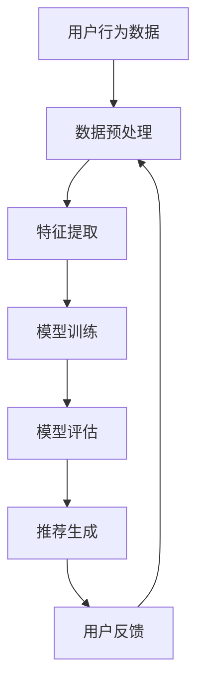

                 

# 平台经济下的个人创业机会

> 关键词：平台经济、个人创业、商业模式、技术驱动、数据分析、用户体验、市场趋势

> 摘要：本文旨在探讨平台经济背景下个人创业的机会与挑战。通过分析平台经济的核心概念、商业模式、技术驱动因素以及数据分析的重要性，本文将提供一系列实用的建议和案例，帮助个人创业者抓住平台经济带来的机遇。我们将从技术原理、算法实现、数学模型到实际代码案例，全面解析平台经济下的个人创业路径。

## 1. 背景介绍
### 1.1 目的和范围
本文旨在为个人创业者提供一个全面的视角，帮助他们理解平台经济的运作机制，并探索如何利用这一趋势进行创业。我们将从技术、商业模式、数据分析等多个维度进行深入探讨。

### 1.2 预期读者
本文面向对平台经济感兴趣的个人创业者、技术爱好者、初创企业创始人以及对新兴市场趋势感兴趣的读者。

### 1.3 文档结构概述
本文将分为以下几个部分：
1. 背景介绍
2. 核心概念与联系
3. 核心算法原理 & 具体操作步骤
4. 数学模型和公式 & 详细讲解 & 举例说明
5. 项目实战：代码实际案例和详细解释说明
6. 实际应用场景
7. 工具和资源推荐
8. 总结：未来发展趋势与挑战
9. 附录：常见问题与解答
10. 扩展阅读 & 参考资料

### 1.4 术语表
#### 1.4.1 核心术语定义
- **平台经济**：一种商业模式，通过提供一个在线平台连接供需双方，实现资源的高效配置。
- **供需双方**：平台上的用户和服务提供者。
- **双边市场**：平台同时服务于两个或多个不同的用户群体。
- **网络效应**：平台的价值随着用户数量的增加而增加。
- **数据驱动**：利用大数据和机器学习技术进行决策和优化。

#### 1.4.2 相关概念解释
- **双边市场**：平台同时服务于两个或多个不同的用户群体，如电商平台连接买家和卖家。
- **网络效应**：平台的价值随着用户数量的增加而增加，形成正反馈循环。
- **数据驱动**：利用大数据和机器学习技术进行决策和优化，提高平台效率和服务质量。

#### 1.4.3 缩略词列表
- API：应用程序编程接口
- SDK：软件开发工具包
- UI/UX：用户界面/用户体验
- ML：机器学习
- AI：人工智能

## 2. 核心概念与联系
### 2.1 平台经济的核心概念
平台经济的核心在于通过提供一个在线平台，连接供需双方，实现资源的高效配置。平台经济的关键在于网络效应和数据驱动。

### 2.2 商业模式
平台经济的商业模式主要包括：
- **双边市场**：连接两个或多个不同的用户群体，如电商平台连接买家和卖家。
- **网络效应**：平台的价值随着用户数量的增加而增加，形成正反馈循环。
- **数据驱动**：利用大数据和机器学习技术进行决策和优化，提高平台效率和服务质量。

### 2.3 技术驱动因素
平台经济的成功离不开技术驱动因素，主要包括：
- **API和SDK**：提供标准化接口，方便开发者接入和扩展。
- **UI/UX设计**：提供良好的用户体验，吸引和保留用户。
- **ML和AI**：利用机器学习和人工智能技术进行数据分析和优化。

### 2.4 数据分析的重要性
数据分析是平台经济的核心驱动力之一，通过分析用户行为和市场趋势，平台可以不断优化服务和产品，提高用户满意度和平台价值。

## 3. 核心算法原理 & 具体操作步骤
### 3.1 推荐算法
推荐算法是平台经济中常用的一种技术，通过分析用户行为和偏好，为用户提供个性化推荐。推荐算法的基本步骤如下：



### 3.2 伪代码实现
以下是一个简单的推荐算法伪代码实现：

```python
def recommend_items(user_id, user_history, item_data, model):
    # 数据预处理
    user_history = preprocess_data(user_history)
    
    # 特征提取
    features = extract_features(user_history, item_data)
    
    # 模型训练
    model.train(features)
    
    # 模型评估
    evaluation = model.evaluate(features)
    
    # 推荐生成
    recommendations = model.generate_recommendations(user_id)
    
    return recommendations
```

## 4. 数学模型和公式 & 详细讲解 & 举例说明
### 4.1 评分预测模型
评分预测模型是推荐系统中的一个重要组成部分，通过预测用户对未评分项目的评分，提高推荐的准确性。常用的评分预测模型包括协同过滤和矩阵分解。

#### 4.1.1 协同过滤
协同过滤是一种基于用户行为的推荐方法，通过分析用户之间的相似性进行推荐。其基本公式如下：

$$
\hat{r}_{ui} = \frac{\sum_{j \in N_i} \frac{r_{uj} - \mu_u}{|N_i|}}{\sum_{j \in N_i} \frac{1}{|N_i|}}
$$

其中，$\hat{r}_{ui}$ 是用户 $u$ 对项目 $i$ 的预测评分，$r_{uj}$ 是用户 $u$ 对项目 $j$ 的实际评分，$\mu_u$ 是用户 $u$ 的平均评分，$N_i$ 是与项目 $i$ 相关的用户集合。

#### 4.1.2 矩阵分解
矩阵分解是一种基于矩阵分解的推荐方法，通过将用户-项目评分矩阵分解为两个低秩矩阵，提高推荐的准确性。其基本公式如下：

$$
\min_{U, V} \sum_{(u, i) \in R} (r_{ui} - \hat{r}_{ui})^2 + \lambda (\|U\|_F^2 + \|V\|_F^2)
$$

其中，$U$ 和 $V$ 分别是用户和项目的低秩矩阵，$\lambda$ 是正则化参数，$R$ 是已知评分的集合。

### 4.2 举例说明
假设我们有一个用户-项目评分矩阵 $R$，其中 $R_{ui}$ 表示用户 $u$ 对项目 $i$ 的评分。我们使用矩阵分解方法进行推荐，具体步骤如下：

1. 初始化用户和项目的低秩矩阵 $U$ 和 $V$。
2. 通过梯度下降法优化目标函数，更新 $U$ 和 $V$。
3. 使用优化后的 $U$ 和 $V$ 预测用户对未评分项目的评分。

## 5. 项目实战：代码实际案例和详细解释说明
### 5.1 开发环境搭建
为了实现一个简单的推荐系统，我们需要搭建一个开发环境。具体步骤如下：

1. 安装Python和相关库，如NumPy、Pandas、Scikit-learn等。
2. 创建一个虚拟环境，安装所需的库。
3. 下载或生成用户-项目评分数据集。

### 5.2 源代码详细实现和代码解读
以下是一个简单的推荐系统实现代码：

```python
import numpy as np
from sklearn.decomposition import TruncatedSVD
from sklearn.metrics.pairwise import cosine_similarity

# 假设我们有一个用户-项目评分矩阵 R
R = np.array([
    [5, 3, 0, 1],
    [4, 0, 0, 1],
    [1, 1, 0, 5],
    [1, 0, 0, 4],
    [0, 1, 5, 4]
])

# 初始化用户和项目的低秩矩阵 U 和 V
U = np.random.rand(R.shape[0], 2)
V = np.random.rand(R.shape[1], 2)

# 使用TruncatedSVD进行矩阵分解
svd = TruncatedSVD(n_components=2)
U = svd.fit_transform(R)
V = svd.components_

# 计算用户对未评分项目的预测评分
def predict_ratings(U, V, R):
    ratings = np.dot(U, V.T)
    return ratings

# 计算预测评分
predicted_ratings = predict_ratings(U, V, R)

# 打印预测评分
print(predicted_ratings)
```

### 5.3 代码解读与分析
上述代码实现了一个简单的推荐系统，通过矩阵分解方法预测用户对未评分项目的评分。具体步骤如下：

1. 初始化用户和项目的低秩矩阵 $U$ 和 $V$。
2. 使用TruncatedSVD进行矩阵分解，得到用户和项目的低秩矩阵。
3. 计算用户对未评分项目的预测评分。

## 6. 实际应用场景
平台经济下的个人创业机会广泛存在于各个领域，如电商、社交、教育、医疗等。以下是一些实际应用场景：

### 6.1 电商平台
电商平台通过提供一个在线平台连接买家和卖家，实现商品的高效配置。平台可以通过推荐算法提高用户满意度，增加销售额。

### 6.2 社交平台
社交平台通过提供一个在线平台连接用户，实现社交网络的高效配置。平台可以通过推荐算法提高用户活跃度，增加用户粘性。

### 6.3 教育平台
教育平台通过提供一个在线平台连接学生和教师，实现教育资源的高效配置。平台可以通过推荐算法提高学生的学习效果，增加用户满意度。

### 6.4 医疗平台
医疗平台通过提供一个在线平台连接患者和医生，实现医疗服务的高效配置。平台可以通过推荐算法提高患者的就医体验，增加用户满意度。

## 7. 工具和资源推荐
### 7.1 学习资源推荐
#### 7.1.1 书籍推荐
- **《推荐系统工程》**：深入讲解推荐系统的原理和实践。
- **《机器学习实战》**：详细讲解机器学习算法和应用。

#### 7.1.2 在线课程
- **Coursera：机器学习**：由斯坦福大学教授Andrew Ng讲授，涵盖机器学习基础知识和实践。
- **edX：推荐系统**：由哈佛大学和麻省理工学院联合开设，深入讲解推荐系统的原理和实践。

#### 7.1.3 技术博客和网站
- **Towards Data Science**：提供大量的机器学习和数据科学相关文章。
- **Medium：推荐系统**：提供大量的推荐系统相关文章。

### 7.2 开发工具框架推荐
#### 7.2.1 IDE和编辑器
- **PyCharm**：功能强大的Python IDE，支持代码调试和版本控制。
- **VS Code**：轻量级的代码编辑器，支持多种编程语言和插件。

#### 7.2.2 调试和性能分析工具
- **PyCharm Debugger**：PyCharm内置的调试工具，支持断点、单步执行等功能。
- **Python Profiler**：用于分析Python代码的性能瓶颈。

#### 7.2.3 相关框架和库
- **Scikit-learn**：提供丰富的机器学习算法和工具。
- **TensorFlow**：Google开发的深度学习框架，支持多种深度学习模型。

### 7.3 相关论文著作推荐
#### 7.3.1 经典论文
- **"Collaborative Filtering for Implicit Feedback Datasets"**：介绍基于矩阵分解的推荐算法。
- **"Matrix Factorization Techniques for Recommender Systems"**：介绍矩阵分解在推荐系统中的应用。

#### 7.3.2 最新研究成果
- **"Deep Learning for Recommender Systems"**：介绍深度学习在推荐系统中的应用。
- **"Neural Collaborative Filtering"**：介绍基于神经网络的推荐算法。

#### 7.3.3 应用案例分析
- **"Netflix Prize"**：Netflix举办的推荐系统竞赛，展示了推荐系统在实际应用中的挑战和解决方案。
- **"Spotify Recommendations"**：Spotify的推荐系统案例，展示了推荐系统在音乐推荐中的应用。

## 8. 总结：未来发展趋势与挑战
平台经济下的个人创业机会广阔，但同时也面临着一些挑战。未来的发展趋势包括：

- **技术驱动**：技术的不断进步将为平台经济带来更多的创新机会。
- **用户体验**：提高用户体验是平台经济成功的关键。
- **数据安全**：保护用户数据安全是平台经济的重要任务。

## 9. 附录：常见问题与解答
### 9.1 问题：如何选择合适的推荐算法？
**解答**：选择合适的推荐算法需要考虑数据特点和业务需求。对于稀疏数据，可以考虑基于矩阵分解的方法；对于稠密数据，可以考虑基于协同过滤的方法。

### 9.2 问题：如何提高推荐系统的准确性和效率？
**解答**：提高推荐系统的准确性和效率可以通过以下方法实现：
- **特征工程**：提取更多的特征，提高模型的准确性。
- **模型优化**：使用更复杂的模型，提高推荐的准确性。
- **并行计算**：使用并行计算提高推荐系统的效率。

## 10. 扩展阅读 & 参考资料
- **《推荐系统工程》**：深入讲解推荐系统的原理和实践。
- **《机器学习实战》**：详细讲解机器学习算法和应用。
- **Coursera：机器学习**：由斯坦福大学教授Andrew Ng讲授，涵盖机器学习基础知识和实践。
- **edX：推荐系统**：由哈佛大学和麻省理工学院联合开设，深入讲解推荐系统的原理和实践。
- **Towards Data Science**：提供大量的机器学习和数据科学相关文章。
- **Medium：推荐系统**：提供大量的推荐系统相关文章。
- **PyCharm**：功能强大的Python IDE，支持代码调试和版本控制。
- **VS Code**：轻量级的代码编辑器，支持多种编程语言和插件。
- **PyCharm Debugger**：PyCharm内置的调试工具，支持断点、单步执行等功能。
- **Python Profiler**：用于分析Python代码的性能瓶颈。
- **Scikit-learn**：提供丰富的机器学习算法和工具。
- **TensorFlow**：Google开发的深度学习框架，支持多种深度学习模型。
- **"Collaborative Filtering for Implicit Feedback Datasets"**：介绍基于矩阵分解的推荐算法。
- **"Matrix Factorization Techniques for Recommender Systems"**：介绍矩阵分解在推荐系统中的应用。
- **"Deep Learning for Recommender Systems"**：介绍深度学习在推荐系统中的应用。
- **"Neural Collaborative Filtering"**：介绍基于神经网络的推荐算法。
- **"Netflix Prize"**：Netflix举办的推荐系统竞赛，展示了推荐系统在实际应用中的挑战和解决方案。
- **"Spotify Recommendations"**：Spotify的推荐系统案例，展示了推荐系统在音乐推荐中的应用。

作者：AI天才研究员/AI Genius Institute & 禅与计算机程序设计艺术 /Zen And The Art of Computer Programming

