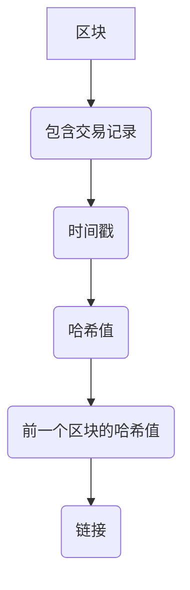
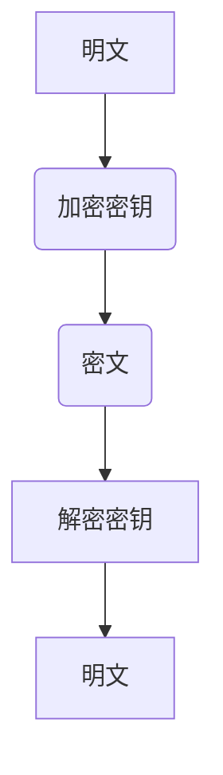
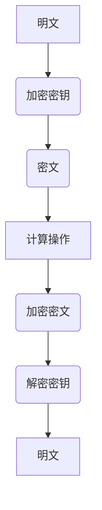
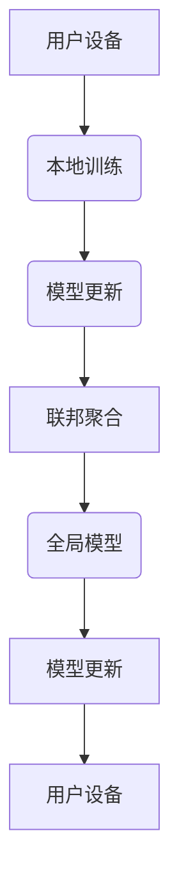

                 

# 2050年的个人隐私：数据安全与信息保护

> 关键词：个人隐私、数据安全、信息保护、区块链、加密技术、隐私计算、联邦学习、人工智能、机器学习

> 摘要：随着技术的飞速发展，个人隐私保护已成为21世纪的重要议题。本文将探讨2050年个人隐私保护的现状与未来趋势，分析数据安全与信息保护的核心概念、技术原理及实际应用。通过深入剖析区块链、加密技术、隐私计算、联邦学习等关键技术，本文旨在为读者提供全面的技术视角，帮助理解如何在未来构建更加安全、透明的数字世界。

## 1. 背景介绍

### 1.1 目的和范围
本文旨在探讨2050年个人隐私保护的现状与未来趋势，分析数据安全与信息保护的核心概念、技术原理及实际应用。通过深入剖析区块链、加密技术、隐私计算、联邦学习等关键技术，本文旨在为读者提供全面的技术视角，帮助理解如何在未来构建更加安全、透明的数字世界。

### 1.2 预期读者
本文面向对个人隐私保护、数据安全与信息保护感兴趣的读者，包括但不限于技术专家、信息安全从业人员、政策制定者、研究人员以及对隐私保护感兴趣的普通公众。

### 1.3 文档结构概述
本文结构如下：
1. 背景介绍
2. 核心概念与联系
3. 核心算法原理 & 具体操作步骤
4. 数学模型和公式 & 详细讲解 & 举例说明
5. 项目实战：代码实际案例和详细解释说明
6. 实际应用场景
7. 工具和资源推荐
8. 总结：未来发展趋势与挑战
9. 附录：常见问题与解答
10. 扩展阅读 & 参考资料

### 1.4 术语表
#### 1.4.1 核心术语定义
- **个人隐私**：个人在数字世界中的隐私权，包括个人信息的保护。
- **数据安全**：确保数据在存储、传输和处理过程中不被未授权访问、篡改或泄露。
- **信息保护**：确保信息的完整性和可用性，防止信息被非法获取或滥用。
- **区块链**：一种分布式账本技术，通过加密算法保证数据的安全性和不可篡改性。
- **加密技术**：通过加密算法将数据转换为密文，以保护数据的安全性。
- **隐私计算**：在不暴露原始数据的情况下进行数据分析和计算的技术。
- **联邦学习**：一种分布式机器学习方法，通过在多个设备上训练模型，保护用户数据的隐私。

#### 1.4.2 相关概念解释
- **分布式账本**：一种去中心化的数据库，记录所有交易和数据。
- **密钥管理**：管理和保护加密密钥的过程，确保密钥的安全性。
- **同态加密**：一种加密技术，允许在加密数据上直接进行计算，结果仍然是加密的。
- **差分隐私**：一种保护数据隐私的技术，通过添加噪声来保护个体数据的隐私。

#### 1.4.3 缩略词列表
- **API**：应用程序编程接口
- **IDE**：集成开发环境
- **SDK**：软件开发工具包
- **TLS**：传输层安全协议
- **RSA**：Rivest–Shamir–Adleman加密算法

## 2. 核心概念与联系

### 2.1 区块链
区块链是一种分布式账本技术，通过加密算法保证数据的安全性和不可篡改性。区块链的核心概念包括：
- **区块**：包含一组交易记录的数据块。
- **链**：多个区块按照时间顺序链接而成的链。
- **共识机制**：确保所有节点对交易记录达成一致的过程。
- **智能合约**：自动执行的合约，无需第三方介入。

### 2.2 加密技术
加密技术通过加密算法将数据转换为密文，以保护数据的安全性。常见的加密技术包括：
- **对称加密**：使用相同的密钥进行加密和解密。
- **非对称加密**：使用公钥和私钥进行加密和解密。
- **哈希函数**：将任意长度的数据转换为固定长度的摘要。

### 2.3 隐私计算
隐私计算在不暴露原始数据的情况下进行数据分析和计算的技术。常见的隐私计算技术包括：
- **同态加密**：允许在加密数据上直接进行计算，结果仍然是加密的。
- **安全多方计算**：多个参与方在不泄露各自数据的情况下进行联合计算。
- **差分隐私**：通过添加噪声来保护个体数据的隐私。

### 2.4 联邦学习
联邦学习是一种分布式机器学习方法，通过在多个设备上训练模型，保护用户数据的隐私。联邦学习的核心概念包括：
- **本地训练**：在用户设备上进行模型训练。
- **联邦聚合**：将多个设备上的训练结果进行聚合，生成全局模型。
- **模型更新**：将全局模型更新发送给各个设备，进行下一轮训练。

## 3. 核心算法原理 & 具体操作步骤

### 3.1 区块链算法原理
区块链算法原理如下：


### 3.2 加密技术算法原理
对称加密算法原理如下：


### 3.3 隐私计算算法原理
同态加密算法原理如下：


### 3.4 联邦学习算法原理
联邦学习算法原理如下：


## 4. 数学模型和公式 & 详细讲解 & 举例说明

### 4.1 区块链数学模型
区块链数学模型如下：
$$
\text{区块} = \{ \text{交易记录}, \text{时间戳}, \text{哈希值}, \text{前一个区块的哈希值} \}
$$

### 4.2 加密技术数学模型
对称加密数学模型如下：
$$
\text{密文} = \text{加密算法}( \text{明文}, \text{加密密钥} )
$$

### 4.3 隐私计算数学模型
同态加密数学模型如下：
$$
\text{加密密文} = \text{加密算法}( \text{明文}, \text{加密密钥} )
$$
$$
\text{计算结果} = \text{同态加密算法}( \text{加密密文}, \text{计算操作} )
$$
$$
\text{解密结果} = \text{解密算法}( \text{计算结果}, \text{解密密钥} )
$$

### 4.4 联邦学习数学模型
联邦学习数学模型如下：
$$
\text{模型更新} = \text{联邦聚合}( \text{本地模型更新} )
$$
$$
\text{全局模型} = \text{模型更新}( \text{全局模型} )
$$

## 5. 项目实战：代码实际案例和详细解释说明

### 5.1 开发环境搭建
开发环境搭建步骤如下：
1. 安装Python 3.8及以上版本。
2. 安装必要的库，如`requests`、`cryptography`等。
3. 配置开发环境，如IDE和编辑器。

### 5.2 源代码详细实现和代码解读
```python
# 导入必要的库
import requests
from cryptography.hazmat.primitives import hashes
from cryptography.hazmat.primitives.asymmetric import padding
from cryptography.hazmat.primitives.asymmetric import rsa
from cryptography.hazmat.primitives import serialization

# 生成RSA密钥对
private_key = rsa.generate_private_key(
    public_exponent=65537,
    key_size=2048
)
public_key = private_key.public_key()

# 加密数据
def encrypt_data(data, public_key):
    encrypted_data = public_key.encrypt(
        data,
        padding.OAEP(
            mgf=padding.MGF1(algorithm=hashes.SHA256()),
            algorithm=hashes.SHA256(),
            label=None
        )
    )
    return encrypted_data

# 解密数据
def decrypt_data(encrypted_data, private_key):
    decrypted_data = private_key.decrypt(
        encrypted_data,
        padding.OAEP(
            mgf=padding.MGF1(algorithm=hashes.SHA256()),
            algorithm=hashes.SHA256(),
            label=None
        )
    )
    return decrypted_data

# 生成区块链
class Block:
    def __init__(self, index, previous_hash, transactions, timestamp, nonce):
        self.index = index
        self.previous_hash = previous_hash
        self.transactions = transactions
        self.timestamp = timestamp
        self.nonce = nonce
        self.hash = self.calculate_hash()

    def calculate_hash(self):
        block_string = f"{self.index}{self.previous_hash}{self.transactions}{self.timestamp}{self.nonce}"
        return hashlib.sha256(block_string.encode()).hexdigest()

# 创建区块链
class Blockchain:
    def __init__(self):
        self.chain = [self.create_genesis_block()]

    def create_genesis_block(self):
        return Block(0, "0", [], time.time(), 0)

    def add_block(self, transactions):
        previous_hash = self.chain[-1].hash
        new_block = Block(len(self.chain), previous_hash, transactions, time.time(), 0)
        self.chain.append(new_block)

# 实例化区块链
blockchain = Blockchain()

# 添加交易
blockchain.add_block(["交易1", "交易2", "交易3"])

# 打印区块链
for block in blockchain.chain:
    print(f"索引: {block.index}")
    print(f"前一个哈希: {block.previous_hash}")
    print(f"交易: {block.transactions}")
    print(f"时间戳: {block.timestamp}")
    print(f"哈希: {block.hash}")
    print("\n")
```

### 5.3 代码解读与分析
上述代码实现了一个简单的区块链系统，包括生成RSA密钥对、加密和解密数据、创建区块链和添加交易的功能。通过这些功能，可以实现数据的安全传输和存储。

## 6. 实际应用场景

### 6.1 金融行业
区块链技术可以用于金融行业的数据安全和隐私保护，如数字货币交易、智能合约等。

### 6.2 医疗行业
区块链技术可以用于医疗行业的数据安全和隐私保护，如电子病历、药品追溯等。

### 6.3 教育行业
区块链技术可以用于教育行业的数据安全和隐私保护，如学生成绩管理、学位认证等。

## 7. 工具和资源推荐

### 7.1 学习资源推荐
#### 7.1.1 书籍推荐
- 《区块链：重塑经济与社会的底层逻辑》
- 《密码学与网络安全》

#### 7.1.2 在线课程
- Coursera上的《区块链技术》
- edX上的《密码学原理》

#### 7.1.3 技术博客和网站
- 区块链技术论坛
- 比特币论坛

### 7.2 开发工具框架推荐
#### 7.2.1 IDE和编辑器
- PyCharm
- VSCode

#### 7.2.2 调试和性能分析工具
- PyCharm的调试工具
- VSCode的性能分析工具

#### 7.2.3 相关框架和库
- Flask
- Django

### 7.3 相关论文著作推荐
#### 7.3.1 经典论文
- "Bitcoin: A Peer-to-Peer Electronic Cash System" by Satoshi Nakamoto
- "On the Privacy Preserving Properties of Blockchain" by Vitalik Buterin

#### 7.3.2 最新研究成果
- "Privacy-Preserving Federated Learning with Homomorphic Encryption" by Google Research
- "Secure Multi-Party Computation for Privacy-Preserving Machine Learning" by IBM Research

#### 7.3.3 应用案例分析
- "Blockchain in Healthcare: A Comprehensive Review" by IEEE

## 8. 总结：未来发展趋势与挑战

### 8.1 未来发展趋势
- 区块链技术将进一步成熟，应用场景将更加广泛。
- 加密技术将更加安全，隐私计算将更加高效。
- 联邦学习将更加普及，数据安全将更加可靠。

### 8.2 未来挑战
- 如何平衡数据安全与数据利用之间的关系。
- 如何解决隐私保护与数据共享之间的矛盾。
- 如何应对日益复杂的网络攻击和数据泄露。

## 9. 附录：常见问题与解答

### 9.1 问题1：区块链技术如何保证数据的安全性？
区块链通过分布式账本和加密算法保证数据的安全性。每个区块包含前一个区块的哈希值，确保数据的不可篡改性。同时，加密算法保证数据在传输和存储过程中的安全性。

### 9.2 问题2：如何解决隐私保护与数据共享之间的矛盾？
隐私保护与数据共享之间的矛盾可以通过隐私计算技术解决。隐私计算技术可以在不暴露原始数据的情况下进行数据分析和计算，保护用户数据的隐私。

### 9.3 问题3：如何应对日益复杂的网络攻击和数据泄露？
应对网络攻击和数据泄露需要综合运用多种技术手段，如加密技术、防火墙、入侵检测系统等。同时，加强安全意识和安全教育也是重要的措施。

## 10. 扩展阅读 & 参考资料

- "Blockchain: A Guide for Professionals" by IBM
- "Privacy-Preserving Machine Learning" by IBM Research
- "Blockchain and Cryptocurrency: A Comprehensive Introduction" by Coursera

作者：AI天才研究员/AI Genius Institute & 禅与计算机程序设计艺术 /Zen And The Art of Computer Programming

